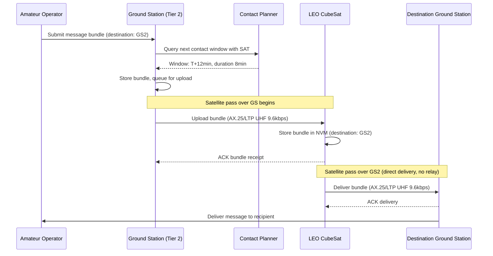
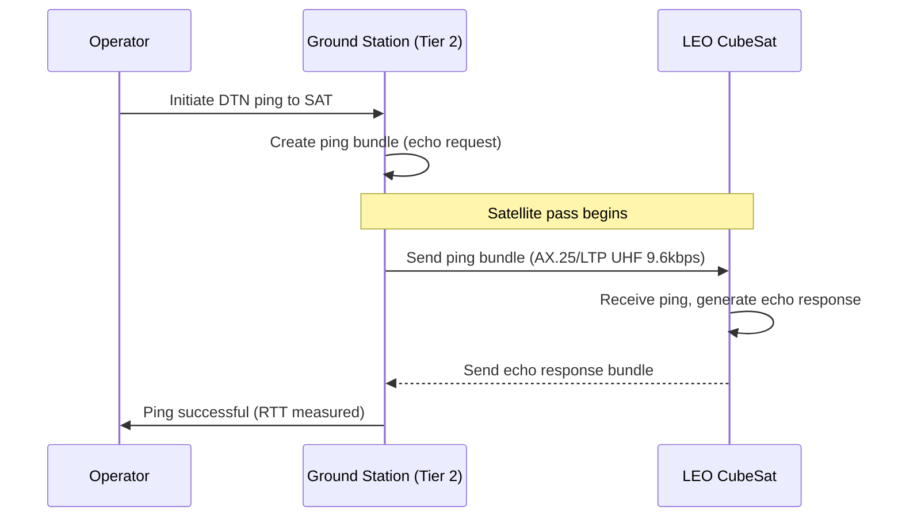
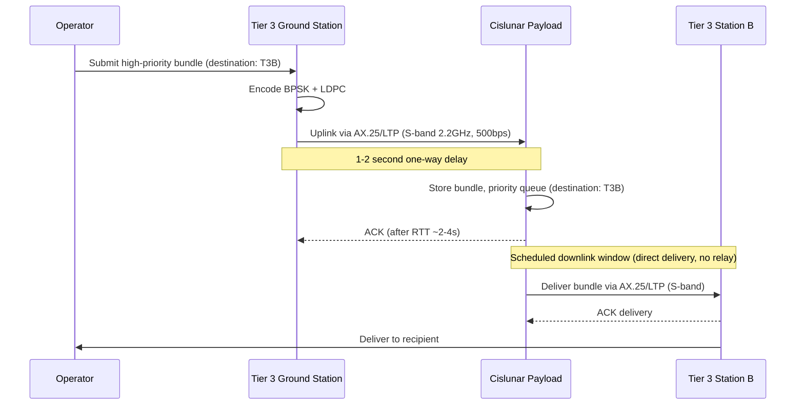
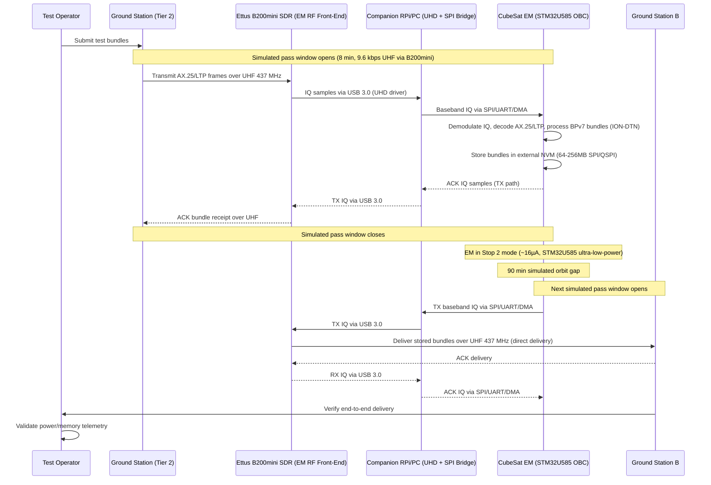

# Design Document: Cislunar Amateur DTN Payload

## Overview

This design describes a phased Delay/Disruption Tolerant Networking (DTN) system for amateur radio, progressing through four phases: terrestrial validation, CubeSat Engineering Model (EM) ground testing, LEO CubeSat flight demonstration, and cislunar deep-space communication. The system uses NASA JPL's ION (Interplanetary Overlay Network) as the DTN implementation, which provides BPv7, LTP, and related protocols out of the box. ION runs on top of AX.25 link-layer framing across all phases. The system supports two core operations: **ping** (DTN reachability test — send a bundle and receive an echo/response to validate end-to-end connectivity) and **store-and-forward** (a source node sends a bundle to a destination node, which stores it and delivers it when the destination becomes reachable during a contact window). There is **no relay functionality** — nodes do not forward bundles on behalf of other nodes. All bundle delivery is point-to-point (source → destination), possibly via a single store-and-forward hop through a space node, but the space node does not relay to other intermediate nodes.

The system uses ION-DTN's Contact Graph Routing (CGR) module for contact prediction — computing when space nodes (CubeSat, cislunar payload) will have line-of-sight communication windows with ground stations based on orbital parameters and ephemeris data. CGR is used exclusively for pass scheduling and contact window prediction, **not** for multi-hop relay routing. All bundle delivery remains direct (source → destination); CGR simply predicts *when* those direct contacts will occur.

The architecture is built around four node classes — ground stations (tiered by capability), a CubeSat Engineering Model (ground-based, flight-representative hardware), a LEO CubeSat, and a cislunar payload — connected through contact-plan-driven scheduling with direct communication windows. Each node autonomously stores, prioritizes, and delivers DTN bundles during available contact opportunities, tolerating delays from milliseconds (terrestrial) to minutes (cislunar). Terrestrial nodes use Raspberry Pi hosts connected via USB to Mobilinkd TNC4 terminal node controllers, which interface with Yaesu FT-817 radios over the 9600 baud data port for 9600 baud G3RUH-compatible packet operation on VHF/UHF. The Engineering Model and LEO CubeSat flight unit use an STM32U585 ultra-low-power ARM Cortex-M33 MCU (160 MHz, 2 MB flash, 786 KB SRAM, hardware crypto accelerator, TrustZone) as the onboard computer (OBC), running ION-DTN on top of AX.25 on bare metal or a lightweight RTOS. The same STM32U585 board is used for both EM and flight unit, ensuring full software/hardware parity. External NVM (64–256 MB SPI/QSPI flash) provides persistent bundle storage. Rather than interfacing with a TNC or pre-built radio modem, the STM32U585 generates and processes IQ (In-phase/Quadrature) baseband samples directly, feeding them to/from the RF transmitter and receiver front-end. For the EM phase, the RF front-end is an Ettus Research USRP B200mini — a compact USB 3.0 software-defined radio providing full-duplex IQ streaming with a 12-bit ADC/DAC, 70 MHz – 6 GHz frequency range (covering both UHF 437 MHz and S-band 2.2 GHz), and up to 56 MHz instantaneous bandwidth. Since the STM32U585 lacks USB 3.0 host capability, the EM uses a companion Raspberry Pi (or PC) as a USB host running the UHD (USRP Hardware Driver) library to control the B200mini and bridge IQ samples to/from the STM32U585 via SPI or UART/DMA. This architecture allows the STM32U585 to run the identical baseband DSP, AX.25/LTP framing, and ION-DTN stack that will fly, while the B200mini provides a lab-grade RF front-end for real over-the-air testing. For the flight unit, the B200mini is replaced by a dedicated flight-qualified IQ transceiver IC interfacing directly with the STM32U585 via DAC/ADC or SPI — no companion host required. This gives full software control over modulation/demodulation — GFSK/G3RUH for UHF, GMSK/BPSK for LEO, BPSK+LDPC for cislunar — with the STM32U585's DMA and DSP capabilities handling IQ sample streaming. The cislunar payload may also use an STM32U585 or a more capable processor depending on mission requirements; this remains flexible.

All links across every phase use ION-DTN's unified protocol stack: BPv7 bundles carried over LTP sessions, carried over AX.25 frames. AX.25 provides link-layer framing with amateur radio callsign addressing (source and destination callsigns in every frame), satisfying regulatory requirements for station identification on all amateur transmissions. LTP (Licklider Transmission Protocol) runs on top of AX.25, providing reliable transfer with deferred acknowledgment as the DTN convergence layer. ION provides all of these protocols as an integrated implementation. The phases differ in radio band, frequency, data rate, and modulation/coding — not in protocol stack.

The system emphasizes open-source software and hardware, broad community accessibility at the entry level (handheld radios for LEO reception), and progressively more capable infrastructure for deep-space links (3–5m dishes for cislunar S-band at 500 bps with LDPC/Turbo coding).

The four-phase progression is:
1. **Phase 1 — Terrestrial DTN Validation**: RPi + Mobilinkd TNC4 + FT-817 ground nodes validate ION-DTN (BPv7/LTP) over AX.25 amateur radio links. Core operations: ping (DTN reachability) and store-and-forward messaging.
2. **Phase 2 — CubeSat Engineering Model (EM)**: Ground-based flatsat with STM32U585 OBC, Ettus B200mini SDR as the IQ RF front-end (via companion RPi/PC USB host running UHD), external NVM, and identical flight software stack. Validates ping, store-and-forward, power budget, and thermal/vacuum readiness under constrained resources (786 KB SRAM, 64–256 MB external NVM) before flight commitment. The B200mini is EM-only — the flight unit replaces it with a dedicated flight-qualified IQ transceiver IC.
3. **Phase 3 — LEO CubeSat Flight**: Orbital deployment of the flight unit (STM32U585 OBC + IQ radio), demonstrating ground-to-space DTN ping and store-and-forward operations. No relay — the CubeSat delivers bundles directly to the destination ground station.
4. **Phase 4 — Cislunar Mission**: Deep-space DTN node (STM32U585 or more capable processor) enabling amateur participation in Earth–Moon delay-tolerant networking via ping and store-and-forward.

## Architecture

```mermaid
graph TD
    subgraph Ground Segment
        T1[Tier 1: Handheld/Small Yagi<br/>VHF/UHF - LEO RX]
        T2[Tier 2: Rotator Yagi/Small Dish<br/>UHF/S-band - LEO Full Duplex]
        T3[Tier 3: 3-5m Dish<br/>S/X-band - Cislunar]
        T4[Tier 4: University/Partner<br/>Large Dish - Backbone]
    end

    subgraph Terrestrial DTN Network
        TN1[Terrestrial Node A<br/>RPi + Mobilinkd TNC4 + FT-817]
        TN2[Terrestrial Node B<br/>RPi + Mobilinkd TNC4 + FT-817]
        TN3[Terrestrial Node C<br/>RPi + Mobilinkd TNC4 + FT-817]
    end

    subgraph Engineering Model - Ground Lab
        EM[CubeSat Engineering Model<br/>STM32U585 OBC - 160MHz Cortex-M33<br/>786KB SRAM + 64-256MB Ext NVM<br/>ION-DTN over AX.25]
        B200[Ettus B200mini SDR<br/>USB 3.0 Full-Duplex IQ<br/>12-bit ADC/DAC, 70MHz-6GHz<br/>EM RF Front-End Only]
        BRIDGE[Companion RPi/PC<br/>UHD Driver - USB Host<br/>SPI/UART Bridge to STM32]
        EM <-->|SPI/UART/DMA<br/>IQ Samples| BRIDGE
        BRIDGE <-->|USB 3.0<br/>IQ Stream| B200
    end

    subgraph LEO Segment
        SAT[LEO CubeSat Flight Unit<br/>STM32U585 OBC - 160MHz Cortex-M33<br/>IQ Baseband UHF 437MHz / 9.6kbps<br/>ION-DTN Ping + Store-and-Forward]
    end

    subgraph Cislunar Segment
        CIS[Cislunar Payload<br/>STM32U585 or Higher-Capability OBC<br/>IQ Baseband S-band 2.2GHz / 500bps<br/>BPSK + LDPC/Turbo]
    end

    TN1 <-->|AX.25/LTP/BPv7 9600bd VHF/UHF| TN2
    TN2 <-->|AX.25/LTP/BPv7 9600bd VHF/UHF| TN3
    TN2 <-->|AX.25/LTP/BPv7 UHF Ground Test| B200
    T2 <-->|AX.25/LTP UHF Simulated Pass| B200
    T1 -->|AX.25/LTP UHF RX| SAT
    T2 <-->|AX.25/LTP UHF TX/RX| SAT
    T3 <-->|AX.25/LTP S-band| CIS
    T4 <-->|AX.25/LTP S-band| CIS
    SAT -.->|Future: Direct Link (No Relay)| CIS
```

## Sequence Diagrams

### Ground-to-LEO Store-and-Forward



### Ground-to-LEO Ping (DTN Reachability Test)



### Cislunar Store-and-Forward



### Engineering Model Simulated Pass Test




## Components and Interfaces

### Component 1: Bundle Protocol Agent (BPA)

**Purpose**: Core DTN engine responsible for creating, receiving, storing, and delivering BPv7 bundles across all node types. Operates on top of ION-DTN. Supports two operations: ping (echo request/response for DTN reachability testing) and store-and-forward (point-to-point bundle delivery). Does not perform relay — bundles are not forwarded on behalf of other nodes.

**Interface**:
```lean
structure BundleId where
  sourceEid : EndpointId
  creationTimestamp : Nat
  sequenceNumber : Nat
  deriving BEq, Hashable

inductive Priority where
  | bulk : Priority
  | normal : Priority
  | expedited : Priority
  | critical : Priority
  deriving BEq, Ord

inductive BundleType where
  | data : BundleType        -- store-and-forward data bundle
  | pingRequest : BundleType  -- DTN ping echo request
  | pingResponse : BundleType -- DTN ping echo response
  deriving BEq

structure Bundle where
  id : BundleId
  destination : EndpointId
  payload : ByteArray
  priority : Priority
  lifetime : Nat  -- seconds
  createdAt : Nat -- epoch seconds
  bundleType : BundleType
  deriving BEq

class BundleProtocolAgent (α : Type) where
  createBundle : α → EndpointId → ByteArray → Priority → IO Bundle
  createPing : α → EndpointId → IO Bundle  -- create ping echo request bundle
  receiveBundle : α → Bundle → IO (Except String Unit)
  deliverBundle : α → Bundle → IO (Except String Unit)
  handlePing : α → Bundle → IO (Except String Bundle)  -- receive ping request, return echo response
  deleteBundle : α → BundleId → IO Unit
  queryBundles : α → (Bundle → Bool) → IO (List Bundle)
```

**Responsibilities**:
- Bundle creation with proper BPv7 headers and endpoint addressing
- Bundle integrity validation on receipt
- Lifetime expiry enforcement and garbage collection
- Priority-based queue management
- Ping echo request/response handling for DTN reachability testing
- Direct delivery to destination — no relay or forwarding on behalf of other nodes

### Component 2: Bundle Store

**Purpose**: Persistent storage for bundles awaiting forwarding or delivery. Must survive power cycles and handle constrained memory on space nodes.

**Interface**:
```lean
structure StoreCapacity where
  totalBytes : Nat
  usedBytes : Nat
  bundleCount : Nat

class BundleStore (σ : Type) where
  store : σ → Bundle → IO (Except String Unit)
  retrieve : σ → BundleId → IO (Option Bundle)
  delete : σ → BundleId → IO Unit
  listByPriority : σ → IO (List Bundle)
  listByDestination : σ → EndpointId → IO (List Bundle)
  capacity : σ → IO StoreCapacity
  evictLowestPriority : σ → IO (Option Bundle)
  flush : σ → IO Unit  -- persist to NVM
```

**Responsibilities**:
- Non-volatile persistence (flash/NVM on space hardware)
- Priority-ordered retrieval for transmission scheduling
- Capacity management with eviction policy (lowest priority first)
- Atomic store/delete to prevent corruption on power loss

### Component 3: Contact Plan Manager

**Purpose**: Manages scheduled communication windows between nodes. Uses ION-DTN's Contact Graph Routing (CGR) module to predict when space nodes will be over ground stations based on orbital parameters and ephemeris data. CGR is used **exclusively for contact prediction / pass scheduling** — computing line-of-sight windows between space nodes and ground stations. It is **not** used for multi-hop relay routing; all bundle delivery remains direct (source → destination). The predicted contact windows drive delivery decisions by determining when direct contacts with destination nodes are available.

**Interface**:
```lean
structure ContactWindow where
  contactId : Nat
  remoteNode : NodeId
  startTime : Nat   -- epoch seconds
  endTime : Nat      -- epoch seconds
  dataRate : Nat     -- bits per second
  linkType : LinkType
  deriving BEq

inductive LinkType where
  | vhf : LinkType           -- AX.25/LTP over VHF (terrestrial, 9600 baud via TNC4 + FT-817)
  | uhf_tnc : LinkType       -- AX.25/LTP over UHF (terrestrial, 9600 baud via TNC4 + FT-817)
  | uhf_iq_b200 : LinkType   -- AX.25/LTP over UHF via IQ baseband on STM32U585 + Ettus B200mini (EM only)
  | uhf_iq : LinkType        -- AX.25/LTP over UHF via IQ baseband on STM32U585 + flight IQ transceiver (LEO)
  | sband_iq : LinkType      -- AX.25/LTP over S-band via IQ baseband on STM32U585 (LEO/cislunar)
  | xband_iq : LinkType      -- AX.25/LTP over X-band via IQ baseband on STM32U585 (cislunar)
  deriving BEq

/-- Orbital parameters for CGR-based contact prediction.
    Used to compute when a space node has line-of-sight with a ground station. -/
structure OrbitalParameters where
  epoch : Nat                  -- reference epoch (seconds since J2000 or Unix epoch)
  semiMajorAxis_m : Float      -- semi-major axis in meters
  eccentricity : Float         -- orbital eccentricity (0 = circular, <1 = elliptical)
  inclination_deg : Float      -- orbital inclination in degrees
  raan_deg : Float             -- right ascension of ascending node in degrees
  argPeriapsis_deg : Float     -- argument of periapsis in degrees
  trueAnomaly_deg : Float      -- true anomaly at epoch in degrees
  deriving BEq

/-- Ground station location for contact prediction. -/
structure GroundStationLocation where
  stationId : NodeId
  latitude_deg : Float         -- geodetic latitude in degrees
  longitude_deg : Float        -- geodetic longitude in degrees
  altitude_m : Float           -- altitude above WGS84 ellipsoid in meters
  minElevation_deg : Float     -- minimum elevation angle for valid contact (typically 5-10°)
  deriving BEq

/-- A predicted contact window from CGR computation. -/
structure PredictedContact where
  window : ContactWindow
  maxElevation_deg : Float     -- peak elevation angle during pass
  dopplerShift_Hz : Float      -- max Doppler shift at carrier frequency
  confidence : Float           -- prediction confidence (0.0 to 1.0), decreases with propagation time
  deriving BEq

class ContactPlanManager (γ : Type) where
  loadPlan : γ → List ContactWindow → IO Unit
  getNextContact : γ → NodeId → Nat → IO (Option ContactWindow)
  getActiveContacts : γ → Nat → IO (List ContactWindow)
  updatePlan : γ → ContactWindow → IO Unit
  findDirectContact : γ → EndpointId → Nat → IO (Option ContactWindow)
    -- Look up the next direct contact window with the destination node.
    -- Leverages CGR-predicted contact windows for space nodes.
    -- No multi-hop routing — returns the single direct contact or None.

  -- CGR-based contact prediction methods (pass scheduling, NOT relay routing)
  predictContacts : γ → OrbitalParameters → List GroundStationLocation → Nat → Nat → IO (List PredictedContact)
    -- Compute predicted contact windows between a space node (described by orbital parameters)
    -- and a set of ground stations over a time horizon [fromTime, toTime].
    -- Uses ION-DTN's CGR engine for orbit propagation and line-of-sight computation.
    -- Output is used to populate the contact plan for scheduling store-and-forward delivery.
    -- This is contact PREDICTION, not multi-hop route computation.
  updateOrbitalParameters : γ → NodeId → OrbitalParameters → IO Unit
    -- Update the orbital parameters for a space node (e.g., after receiving fresh TLE/ephemeris data).
    -- Triggers re-prediction of future contact windows.
  getNextPredictedPass : γ → NodeId → NodeId → Nat → IO (Option PredictedContact)
    -- Get the next predicted pass of a specific space node over a specific ground station.
    -- Convenience wrapper around predictContacts for single-pair lookup.
```

**Responsibilities**:
- Use CGR to predict contact windows between space nodes and ground stations based on orbital parameters (pass scheduling)
- Maintain time-tagged contact schedule populated by CGR predictions (uploaded for space nodes, configured for ground)
- Provide direct contact lookup for destination nodes — leveraging CGR-predicted windows, but no multi-hop routing
- Re-compute contact predictions when orbital parameters are updated (fresh TLE/ephemeris data)
- Handle contact plan updates during ground passes
- Account for light-time delay in cislunar contact scheduling
- Track prediction confidence degradation over time (orbital perturbations reduce accuracy)

### Component 4: Convergence Layer Adapter (CLA)

**Purpose**: Abstracts the physical/link layer, providing a uniform interface for bundle transmission across all radio links. The CLA implements ION-DTN's unified AX.25/LTP protocol stack used across all phases (terrestrial, EM, LEO, and cislunar):
- **AX.25 layer**: Provides link-layer framing with amateur radio callsign addressing. Every frame carries source and destination callsigns, satisfying amateur radio regulatory requirements for station identification on all transmissions. Used across all bands (VHF, UHF, S-band, X-band).
- **LTP layer (Licklider Transmission Protocol)**: Runs on top of AX.25, providing reliable transfer with deferred acknowledgment as the DTN convergence layer. LTP sessions carry BPv7 bundles, with segmentation/reassembly for large bundles. The deferred-ACK model is beneficial across all link types — from short terrestrial links to long-delay cislunar links.

For terrestrial nodes, the AX.25/LTP stack (provided by ION-DTN) interfaces with the Mobilinkd TNC4 (connected to the host Raspberry Pi via USB), which drives the Yaesu FT-817 radio at 9600 baud through its 9600 baud data port using G3RUH-compatible GFSK modulation. For the EM node, the CLA interfaces with an Ettus Research USRP B200mini SDR as the RF front-end. The B200mini connects via USB 3.0 to a companion Raspberry Pi or PC running the UHD (USRP Hardware Driver) library, which bridges IQ samples to/from the STM32U585 OBC over SPI or UART/DMA. This architecture allows the STM32U585 to run the identical baseband DSP, AX.25/LTP framing, and ION-DTN stack that will fly, providing a lab-grade, wideband (70 MHz – 6 GHz), full-duplex RF front-end with 12-bit ADC/DAC resolution. This allows real over-the-air testing on UHF 437 MHz (and optionally S-band 2.2 GHz) without requiring flight-qualified RF hardware. For the LEO CubeSat and cislunar flight nodes, the CLA interfaces directly with a dedicated flight-qualified IQ transceiver IC connected to the STM32U585 via DAC/ADC or SPI — no companion host or B200mini required. The STM32U585 provides full software-defined control over modulation/demodulation across all space nodes: GFSK/G3RUH for UHF ground testing (EM), GMSK/BPSK for LEO UHF, and BPSK+LDPC/Turbo for cislunar S-band/X-band. The IQ baseband approach eliminates the need for external SDR hardware on flight nodes — the STM32U585 itself performs all baseband DSP.

**Interface**:
```lean
-- All links use ION-DTN's unified AX.25/LTP stack; CLAType differentiates by band/frequency and radio interface
inductive CLAType where
  | ax25ltp_vhf_tnc : CLAType    -- AX.25/LTP over VHF (terrestrial, via Mobilinkd TNC4 + FT-817 at 9600 baud)
  | ax25ltp_uhf_tnc : CLAType    -- AX.25/LTP over UHF (terrestrial, via Mobilinkd TNC4 + FT-817 at 9600 baud)
  | ax25ltp_uhf_iq_b200 : CLAType -- AX.25/LTP over UHF via IQ baseband on STM32U585 + Ettus B200mini SDR (EM only)
  | ax25ltp_uhf_iq : CLAType     -- AX.25/LTP over UHF via IQ baseband on STM32U585 + flight IQ transceiver IC (LEO flight)
  | ax25ltp_sband_iq : CLAType   -- AX.25/LTP over S-band via IQ baseband on STM32U585 (LEO/cislunar)
  | ax25ltp_xband_iq : CLAType   -- AX.25/LTP over X-band via IQ baseband on STM32U585 (cislunar)
  deriving BEq

inductive CLAStatus where
  | idle : CLAStatus
  | transmitting : CLAStatus
  | receiving : CLAStatus
  | error : String → CLAStatus
  deriving BEq

structure LinkMetrics where
  rssi : Int          -- dBm
  snr : Float         -- dB
  bitErrorRate : Float
  bytesTransferred : Nat

class ConvergenceLayerAdapter (λ : Type) where
  claType : λ → CLAType
  open : λ → ContactWindow → IO (Except String Unit)
  close : λ → IO Unit
  sendBundle : λ → Bundle → IO (Except String LinkMetrics)
  recvBundle : λ → IO (Except String (Bundle × LinkMetrics))
  status : λ → IO CLAStatus
  linkMetrics : λ → IO LinkMetrics
```

**Responsibilities**:
- AX.25 framing: callsign-based source/destination addressing in every frame, satisfying amateur radio regulatory requirements for station identification across all phases
- AX.25 UI frame encapsulation/decapsulation for all bands (VHF, UHF, S-band, X-band)
- LTP session management with deferred acknowledgment on top of AX.25 frames across all link types
- LTP segmentation/reassembly for large bundles
- Modulation/coding per band: 9600 baud GFSK/G3RUH for terrestrial VHF/UHF (via Mobilinkd TNC4 + FT-817 9600 baud data port), GFSK/GMSK/BPSK for EM UHF (via STM32U585 IQ baseband + Ettus B200mini SDR over companion RPi/PC UHD bridge), GMSK/BPSK for LEO UHF (via STM32U585 IQ baseband + flight IQ transceiver IC), BPSK+LDPC/Turbo for S-band/X-band (via STM32U585 IQ baseband + flight RF front-end)
- IQ sample streaming via STM32U585 DMA engine for EM/LEO/cislunar nodes — generates TX IQ samples and processes RX IQ samples in real-time. On EM, IQ samples are bridged through the companion RPi/PC (UHD) to/from the B200mini over USB 3.0; on flight nodes, IQ samples flow directly to/from the flight IQ transceiver IC
- Frame encapsulation and FEC encoding/decoding
- Link quality monitoring (RSSI, SNR, BER)
- Flow control matched to contact window data rate

### Component 5: Node Controller

**Purpose**: Top-level orchestrator that ties together the BPA, store, contact plan, and CLA. Manages the autonomous operation cycle of a DTN node.

**Interface**:
```lean
inductive NodeType where
  | terrestrial : NodeType
  | engineeringModel : NodeType  -- ground-based CubeSat EM with STM32U585 OBC + IQ baseband radio
  | leoCubesat : NodeType
  | cislunar : NodeType
  deriving BEq

structure NodeConfig where
  nodeId : NodeId
  nodeType : NodeType
  endpoints : List EndpointId
  maxStorageBytes : Nat       -- external NVM capacity (64-256 MB for STM32U585 nodes via SPI/QSPI flash)
  sramBytes : Nat             -- available SRAM (786 KB on STM32U585; constrains in-flight bundle queue and IQ buffers)
  defaultPriority : Priority

class NodeController (η : Type) where
  initialize : η → NodeConfig → IO (Except String Unit)
  runCycle : η → Nat → IO Unit  -- current epoch time
  shutdown : η → IO Unit
  healthCheck : η → IO NodeHealth
  getStatistics : η → IO NodeStatistics
```

**Responsibilities**:
- Orchestrate the store-check-deliver loop on each cycle (no relay — direct delivery only)
- Trigger bundle delivery when contact windows with destination nodes open
- Handle ping requests and generate echo responses
- Manage power states (sleep/wake for space nodes)
- Collect telemetry and health metrics
- Handle graceful degradation under fault conditions

## Data Models

### Bundle Data Model

```lean
structure EndpointId where
  scheme : String    -- "dtn" or "ipn"
  ssp : String       -- scheme-specific part
  deriving BEq, Hashable, Repr

structure PrimaryBlock where
  version : Nat            -- always 7 for BPv7
  bundleFlags : Nat
  crcType : Nat
  destination : EndpointId
  source : EndpointId
  reportTo : EndpointId
  creationTimestamp : Nat
  sequenceNumber : Nat
  lifetime : Nat
  deriving BEq

structure CanonicalBlock where
  blockType : Nat
  blockNumber : Nat
  blockFlags : Nat
  crcType : Nat
  data : ByteArray
  deriving BEq

structure BPv7Bundle where
  primary : PrimaryBlock
  extensions : List CanonicalBlock
  payload : CanonicalBlock
  deriving BEq
```

**Validation Rules**:
- `primary.version` must equal 7
- `primary.destination` must be a valid endpoint ID
- `primary.lifetime` must be > 0
- `primary.creationTimestamp` must be ≤ current time
- Bundle total size must not exceed node storage capacity
- CRC must validate if `crcType` ≠ 0

### Contact Plan Data Model

```lean
structure ContactPlan where
  planId : Nat
  generatedAt : Nat
  validFrom : Nat
  validTo : Nat
  contacts : List ContactWindow
  predictedContacts : List PredictedContact  -- CGR-predicted windows (pass scheduling)
  orbitalData : Option OrbitalParameters     -- orbital params used for CGR prediction (space nodes only)
  deriving BEq

structure DirectContactEntry where
  destination : EndpointId
  viaContact : ContactWindow
  estimatedDeliveryTime : Nat
  confidence : Float  -- 0.0 to 1.0 (from CGR prediction confidence)
  deriving BEq
```

**Validation Rules**:
- `validFrom` < `validTo`
- All contacts must fall within `validFrom..validTo` range
- No overlapping contacts on the same link for a given node
- `confidence` must be in range [0.0, 1.0]

### Node Health and Telemetry

```lean
structure NodeHealth where
  uptimeSeconds : Nat
  storageUsedPercent : Float
  bundlesStored : Nat
  bundlesForwarded : Nat
  bundlesDropped : Nat
  lastContactTime : Option Nat
  temperature : Option Float    -- Celsius, space nodes
  batteryPercent : Option Float  -- space nodes

structure NodeStatistics where
  totalBundlesReceived : Nat
  totalBundlesSent : Nat
  totalBytesReceived : Nat
  totalBytesSent : Nat
  averageLatency : Float  -- seconds
  contactsCompleted : Nat
  contactsMissed : Nat
```


## Key Functions with Formal Specifications

### Function 1: processIncomingBundle

```lean
def processIncomingBundle (store : BundleStore σ) (bpa : BundleProtocolAgent α)
    (bundle : Bundle) (currentTime : Nat) : IO (Except String Unit) := do
  -- Validate, store, and handle an incoming bundle.
  -- If ping request: generate echo response.
  -- If data bundle for local endpoint: deliver.
  -- If data bundle for remote endpoint: store for direct delivery during next contact.
  -- No relay — bundles are never forwarded on behalf of other nodes.
  sorry
```

**Preconditions:**
- `bundle` is well-formed BPv7 with valid CRC
- `bundle.createdAt + bundle.lifetime > currentTime` (bundle not expired)
- Store has available capacity or eviction is possible

**Postconditions:**
- If ping request: echo response bundle created and queued for delivery to sender
- If destination is local: bundle delivered to application agent
- If destination is remote: bundle stored and queued for direct delivery during next contact with destination
- If bundle is expired or invalid: bundle discarded, no state change
- Bundle store consistency maintained (no partial writes)
- `store.bundleCount` incremented by 1 on successful store

**Loop Invariants:** N/A

### Function 2: executeContactWindow

```lean
def executeContactWindow (store : BundleStore σ) (cla : ConvergenceLayerAdapter λ)
    (contact : ContactWindow) (currentTime : Nat) : IO (Nat × Nat) := do
  -- Transmit queued bundles during an active contact window
  -- Returns (bundlesSent, bytesSent)
  sorry
```

**Preconditions:**
- `contact.startTime ≤ currentTime ≤ contact.endTime`
- CLA is initialized and link is established
- Store contains ≥ 0 bundles destined for `contact.remoteNode`

**Postconditions:**
- All transmitted bundles acknowledged by remote node are deleted from store
- Unacknowledged bundles remain in store for retry
- `bundlesSent ≤ initial store count for destination`
- `bytesSent ≤ contact.dataRate × (contact.endTime - contact.startTime) / 8`
- Link metrics updated with actual RSSI/SNR/BER

**Loop Invariants:**
- At each iteration: `remainingTime = contact.endTime - currentTime > 0`
- At each iteration: all previously sent bundles have been acknowledged or marked for retry
- Total bytes sent does not exceed link capacity for elapsed time

### Function 3: findDirectContact

```lean
def findDirectContact (plan : ContactPlan) (destination : EndpointId)
    (currentTime : Nat) : Option ContactWindow := do
  -- Find the next direct contact window with the destination node.
  -- Contact windows are populated by CGR-based pass predictions (orbital mechanics),
  -- but this function performs a simple lookup — no multi-hop route computation.
  -- CGR predicts WHEN contacts occur; this function finds the next one.
  sorry
```

**Preconditions:**
- `plan.validFrom ≤ currentTime ≤ plan.validTo`
- `destination` is a valid endpoint in the contact plan
- Contact plan has been populated with CGR-predicted windows (for space nodes)

**Postconditions:**
- If `Some contact`: contact is the earliest future contact where `contact.remoteNode` matches `destination` and `contact.startTime ≥ currentTime`
- If `None`: no direct contact with destination exists in the current plan
- Result is a single contact window (not a path — no multi-hop routing)

**Loop Invariants:**
- Linear scan: all previously visited contacts have `startTime < currentTime` or `remoteNode ≠ destination`

### Function 5: predictContacts (CGR-based pass scheduling)

```lean
def predictContacts (orbitalParams : OrbitalParameters)
    (groundStations : List GroundStationLocation)
    (fromTime : Nat) (toTime : Nat) : IO (List PredictedContact) := do
  -- Use ION-DTN's CGR engine to compute predicted contact windows between
  -- a space node and ground stations over the given time horizon.
  -- Propagates the orbit forward from the orbital parameters, computes
  -- line-of-sight geometry with each ground station, and returns windows
  -- where elevation angle exceeds the station's minimum threshold.
  --
  -- This is CONTACT PREDICTION (pass scheduling), NOT multi-hop relay routing.
  -- The output populates the contact plan used by findDirectContact for
  -- scheduling direct store-and-forward delivery.
  sorry
```

**Preconditions:**
- `fromTime < toTime` (valid time horizon)
- `orbitalParams.eccentricity ∈ [0.0, 1.0)` (bound orbit)
- `orbitalParams.semiMajorAxis_m > earthRadius_m` (orbit above Earth surface)
- `groundStations` is non-empty
- All ground station coordinates are valid (latitude ∈ [-90, 90], longitude ∈ [-180, 180])

**Postconditions:**
- All returned `PredictedContact` windows fall within `[fromTime, toTime]`
- Each window has `maxElevation_deg ≥ station.minElevation_deg`
- Windows are sorted by `startTime` ascending
- No overlapping windows for the same ground station
- `confidence` decreases for windows further from the orbital parameter epoch (propagation error accumulates)
- For LEO orbits (~500 km): typical pass duration 5–10 min, 4–6 passes/day per station
- For cislunar orbits: contact arcs may span hours with continuous visibility

**Loop Invariants:**
- Time step propagation: `currentPropTime` advances monotonically from `fromTime` to `toTime`
- All previously computed windows have been validated for minimum elevation

### Function 4: evictBundles

```lean
def evictBundles (store : BundleStore σ) (requiredBytes : Nat)
    (currentTime : Nat) : IO Nat := do
  -- Evict lowest-priority expired bundles to free space
  -- Returns bytes freed
  sorry
```

**Preconditions:**
- `requiredBytes > 0`
- Store capacity is known and `store.usedBytes + requiredBytes > store.totalBytes`

**Postconditions:**
- Expired bundles evicted first, then lowest-priority bundles
- `bytesFreed ≥ requiredBytes` if sufficient evictable bundles exist
- No `critical` priority bundles evicted unless all lower priorities exhausted
- Store consistency maintained throughout eviction

**Loop Invariants:**
- `bytesFreed` monotonically increases
- Remaining bundles in store are all higher priority than any evicted bundle (within same expiry class)

## Algorithmic Pseudocode (Lean)

### Main Node Operation Cycle

```lean
/-- Main autonomous operation cycle for a DTN node.
    Runs periodically (e.g., every second on ground, every 10s on space nodes).
    Supports ping and store-and-forward only — no relay. -/
def runNodeCycle (node : NodeController η) (bpa : BundleProtocolAgent α)
    (store : BundleStore σ) (planner : ContactPlanManager γ)
    (cla : ConvergenceLayerAdapter λ) (currentTime : Nat) : IO Unit := do

  -- Step 1: Check for active contact windows
  let activeContacts ← planner.getActiveContacts currentTime

  -- Step 2: For each active contact, deliver queued bundles directly to destination
  for contact in activeContacts do
    -- Open link if not already open
    let openResult ← cla.open contact
    match openResult with
    | .ok () =>
      -- Retrieve bundles destined for this contact's remote node (direct delivery only)
      let bundles ← store.listByDestination contact.remoteNode
      -- Transmit in priority order
      let sorted := bundles.mergeSort (fun a b => a.priority > b.priority)
      for bundle in sorted do
        if currentTime < contact.endTime then
          let sendResult ← cla.sendBundle bundle
          match sendResult with
          | .ok _metrics => store.delete bundle.id
          | .error _msg => break  -- link degraded, stop sending
      cla.close
    | .error _msg => pure ()  -- skip this contact

  -- Step 3: Receive any incoming bundles (data or ping)
  let recvResult ← cla.recvBundle
  match recvResult with
  | .ok (bundle, _metrics) =>
    match bundle.bundleType with
    | .pingRequest =>
      -- Handle ping: generate echo response and queue for delivery
      let _ ← bpa.handlePing bundle
      pure ()
    | _ =>
      -- Store-and-forward data bundle
      let _ ← processIncomingBundle store bpa bundle currentTime
      pure ()
  | .error _ => pure ()

  -- Step 4: Expire old bundles
  let allBundles ← store.listByPriority
  for bundle in allBundles do
    if bundle.createdAt + bundle.lifetime ≤ currentTime then
      store.delete bundle.id

  -- Step 5: Persist store state
  store.flush
```

**Preconditions:**
- Node is initialized with valid configuration
- Contact plan is loaded and current
- CLA hardware is operational

**Postconditions:**
- All deliverable bundles sent during active contacts (direct delivery only, no relay)
- Incoming bundles processed: data bundles stored/delivered, ping requests answered with echo response
- Expired bundles removed
- Store persisted to non-volatile memory

**Loop Invariants:**
- Step 2 inner loop: `currentTime < contact.endTime` (transmission stops when window closes)
- Step 4 loop: all previously visited bundles have been checked for expiry

### Direct Contact Lookup Algorithm

```lean
/-- Direct contact lookup: find the next scheduled contact with a destination node.
    Contact windows are populated by CGR-based pass predictions (orbital mechanics).
    No multi-hop routing — simply scans the CGR-predicted contact plan for the earliest
    future direct contact with the destination. -/
def findDirectContactAlgorithm (contacts : List ContactWindow) (destination : NodeId)
    (currentTime : Nat) : Option ContactWindow :=
  -- Filter contacts to those matching the destination node
  -- and starting at or after currentTime
  let candidates := contacts.filter (fun c =>
    c.remoteNode == destination ∧ c.startTime ≥ currentTime)
  -- Return the earliest contact (contacts assumed sorted by startTime)
  candidates.head?
```

**Preconditions:**
- `contacts` is sorted by `startTime` (populated by CGR contact prediction)
- `destination` is a valid node ID
- All contacts have `startTime < endTime` and `dataRate > 0`

**Postconditions:**
- Returns `Some contact` where contact is the earliest future direct contact with destination
- Returns `None` if no future direct contact with destination exists
- Result is a single contact window (no multi-hop path — CGR is used for prediction only)

**Loop Invariants:**
- Linear scan: all previously visited contacts either don't match destination or have `startTime < currentTime`

### CGR Contact Prediction Algorithm

```lean
/-- CGR-based contact prediction: compute future communication windows between
    a space node and ground stations using orbital mechanics.
    This is PASS SCHEDULING, not multi-hop relay routing.
    Uses ION-DTN's CGR engine for orbit propagation. -/
def predictContactsAlgorithm (orbitalParams : OrbitalParameters)
    (stations : List GroundStationLocation)
    (fromTime : Nat) (toTime : Nat) (timeStep : Nat := 30) : List PredictedContact :=
  let mut results : List PredictedContact := []
  let mut t := fromTime

  -- Propagate orbit forward in time steps
  while t < toTime do
    let spacePos := propagateOrbit orbitalParams t  -- SGP4/SDP4 propagation

    for station in stations do
      let elevation := computeElevation spacePos station
      let wasVisible := isInContact results.last? station.stationId

      -- Rising edge: space node comes above minimum elevation
      if elevation ≥ station.minElevation_deg ∧ ¬wasVisible then
        -- Start new contact window
        let newContact := startContactWindow t station orbitalParams
        results := results ++ [newContact]

      -- Falling edge: space node drops below minimum elevation
      if elevation < station.minElevation_deg ∧ wasVisible then
        -- Close current contact window
        results := closeContactWindow results station.stationId t

    t := t + timeStep

  -- Sort by start time and assign confidence values
  -- Confidence decreases with propagation distance from epoch
  results.map (fun pc => { pc with
    confidence := computeConfidence orbitalParams.epoch pc.window.startTime
  }) |>.mergeSort (fun a b => a.window.startTime < b.window.startTime)
```

**Preconditions:**
- `fromTime < toTime` (valid prediction horizon)
- `orbitalParams` describes a bound orbit (eccentricity < 1.0)
- `timeStep > 0` (propagation step size in seconds; 30s default balances accuracy vs. computation)
- All ground stations have valid coordinates and `minElevation_deg ≥ 0`

**Postconditions:**
- All returned windows fall within `[fromTime, toTime]`
- Each window has peak elevation ≥ station's minimum elevation threshold
- Windows are sorted by `startTime` ascending
- No overlapping windows for the same ground station
- Confidence values reflect propagation uncertainty (higher for near-term, lower for far-future)

**Loop Invariants:**
- `t` advances monotonically from `fromTime` to `toTime`
- All previously computed windows have been validated for minimum elevation
- Contact state (in-contact vs. not-in-contact) is tracked per ground station

### Link Budget Validation

```lean
/-- Validate that a link closes (sufficient margin) for a given configuration. -/
structure LinkBudgetParams where
  txPower_dBm : Float        -- transmit power
  txAntennaGain_dBi : Float  -- transmit antenna gain
  rxAntennaGain_dBi : Float  -- receive antenna gain
  frequency_Hz : Float       -- carrier frequency
  distance_m : Float         -- link distance
  systemLoss_dB : Float      -- cable, pointing, atmospheric losses
  dataRate_bps : Float       -- data rate
  requiredEbN0_dB : Float    -- required Eb/N0 for target BER
  noiseDensity_dBmHz : Float -- typically -174 dBm/Hz

def computeLinkMargin (p : LinkBudgetParams) : Float :=
  let fspl := 20 * Float.log10 (p.distance_m) +
              20 * Float.log10 (p.frequency_Hz) - 147.55
  let receivedPower := p.txPower_dBm + p.txAntennaGain_dBi - fspl +
                       p.rxAntennaGain_dBi - p.systemLoss_dB
  let noisePower := p.noiseDensity_dBmHz + 10 * Float.log10 (p.dataRate_bps)
  let ebN0 := receivedPower - noisePower
  ebN0 - p.requiredEbN0_dB  -- positive = link closes

theorem leoLinkCloses : computeLinkMargin {
  txPower_dBm := 33.0,       -- 2W
  txAntennaGain_dBi := 0.0,  -- omni
  rxAntennaGain_dBi := 12.0, -- Yagi
  frequency_Hz := 437e6,     -- UHF
  distance_m := 500e3,       -- 500 km
  systemLoss_dB := 2.0,
  dataRate_bps := 9600.0,
  requiredEbN0_dB := 10.0,
  noiseDensity_dBmHz := -174.0
} > 0 := by sorry  -- margin ≈ 31 dB

theorem cislunarLinkCloses : computeLinkMargin {
  txPower_dBm := 37.0,       -- 5W
  txAntennaGain_dBi := 10.0, -- directional patch
  rxAntennaGain_dBi := 35.0, -- 3-5m dish
  frequency_Hz := 2.2e9,     -- S-band
  distance_m := 384e6,       -- Earth-Moon
  systemLoss_dB := 3.0,
  dataRate_bps := 500.0,
  requiredEbN0_dB := 2.0,    -- BPSK + strong LDPC
  noiseDensity_dBmHz := -174.0
} > 0 := by sorry  -- margin ≈ 5-7 dB
```


## Example Usage

### Example 1: Terrestrial Node Sending a Message (RPi + TNC4 + FT-817)

```lean
def terrestrialExample : IO Unit := do
  -- Initialize a terrestrial DTN node (RPi host, Mobilinkd TNC4, FT-817 at 9600 baud)
  let config : NodeConfig := {
    nodeId := ⟨"ground-station-alpha"⟩,
    nodeType := .terrestrial,
    endpoints := [⟨"dtn", "//gs-alpha/mail"⟩],
    maxStorageBytes := 1024 * 1024 * 512,  -- 512 MB
    sramBytes := 0,                         -- N/A for RPi terrestrial nodes
    defaultPriority := .normal
  }

  -- Create a message bundle
  let payload := "Hello from ground station Alpha".toUTF8
  let dest : EndpointId := ⟨"dtn", "//gs-bravo/mail"⟩
  let bundle ← bpa.createBundle agent dest payload .normal

  -- Bundle is stored and will be forwarded during next contact
  let _ ← store.store bundleStore bundle
  IO.println s!"Bundle {bundle.id} queued for delivery to {dest}"
```

### Example 2: LEO CubeSat Store-and-Forward Operation

```lean
def leoStoreAndForwardExample (currentTime : Nat) : IO Unit := do
  -- CubeSat wakes up, checks for active contacts
  let contacts ← planner.getActiveContacts currentTime

  for contact in contacts do
    IO.println s!"Active contact with {contact.remoteNode} until {contact.endTime}"

    -- Deliver all queued bundles destined for this ground station (direct delivery, no relay)
    let bundles ← store.listByDestination contact.remoteNode
    let sorted := bundles.mergeSort (fun a b => a.priority > b.priority)

    let mut sent := 0
    for bundle in sorted do
      if currentTime < contact.endTime then
        match ← cla.sendBundle bundle with
        | .ok metrics =>
          IO.println s!"Delivered bundle, RSSI={metrics.rssi}dBm SNR={metrics.snr}dB"
          store.delete bundle.id
          sent := sent + 1
        | .error msg =>
          IO.println s!"Send failed: {msg}, retaining bundle"
          break

    IO.println s!"Contact complete: {sent}/{bundles.length} bundles delivered"
```

### Example 3: Cislunar Store-and-Forward with Ping

```lean
def cislunarExample : IO Unit := do
  -- First, ping the cislunar payload to verify DTN reachability
  let cislunarDest : EndpointId := ⟨"dtn", "//cislunar-01/ping"⟩
  let pingBundle ← bpa.createPing agent cislunarDest
  IO.println s!"Ping sent to {cislunarDest}, awaiting echo response..."

  -- High-priority science data from cislunar payload
  let scienceData := ByteArray.mk #[0x01, 0x02, 0x03]  -- placeholder
  let dest : EndpointId := ⟨"dtn", "//mission-control/science"⟩

  -- Create critical-priority bundle
  let bundle ← bpa.createBundle agent dest scienceData .critical

  -- Look up direct contact with destination (no multi-hop routing)
  let contact ← planner.findDirectContact dest currentTime
  match contact with
  | some window =>
    IO.println s!"Direct contact found at {window.startTime}, delivering at {window.dataRate} bps"
    let _ ← store.store bundleStore bundle
  | none =>
    IO.println "No direct contact available, storing for future delivery"
    let _ ← store.store bundleStore bundle
```

### Example 4: Engineering Model Simulated Pass Test

```lean
def engineeringModelExample (currentTime : Nat) : IO Unit := do
  -- Initialize the Engineering Model node (STM32U585 OBC + Ettus B200mini SDR via companion RPi/PC UHD bridge, running ION-DTN)
  let config : NodeConfig := {
    nodeId := ⟨"cubesat-em-01"⟩,
    nodeType := .engineeringModel,
    endpoints := [⟨"dtn", "//em-01/store-forward"⟩, ⟨"dtn", "//em-01/ping"⟩],
    maxStorageBytes := 1024 * 1024 * 128,  -- 128 MB external SPI/QSPI NVM
    sramBytes := 786 * 1024,               -- 786 KB STM32U585 SRAM
    defaultPriority := .normal
  }

  -- Simulate a ground station uploading bundles during a simulated orbital pass
  -- Contact window mimics a real LEO pass: 8 minutes, 9.6 kbps UHF
  -- RF path: Ground Station → UHF 437 MHz over-the-air → Ettus B200mini (RX)
  --          → USB 3.0 IQ stream → Companion RPi/PC (UHD) → SPI/UART bridge → STM32U585 (baseband DSP)
  let simulatedPass : ContactWindow := {
    contactId := 1,
    remoteNode := ⟨"ground-station-alpha"⟩,
    startTime := currentTime,
    endTime := currentTime + 480,  -- 8-minute simulated pass
    dataRate := 9600,
    linkType := .uhf_iq_b200       -- EM uses B200mini as RF front-end
  }

  IO.println s!"EM simulated pass: {simulatedPass.dataRate} bps for 480s (STM32U585 IQ baseband via B200mini SDR)"

  -- Receive bundles from ground station during simulated pass window
  -- B200mini down-converts UHF 437 MHz to baseband IQ, streams to STM32U585 for demodulation (ION-DTN processes bundles)
  let mut received := 0
  while (← IO.getTime) < simulatedPass.endTime do
    match ← cla.recvBundle with
    | .ok (bundle, metrics) =>
      let _ ← processIncomingBundle store bpa bundle currentTime
      received := received + 1
      IO.println s!"EM received bundle #{received}, RSSI={metrics.rssi}dBm (via B200mini)"
    | .error _ => break

  IO.println s!"Simulated pass complete: {received} bundles received and stored"

  -- Verify store-and-forward: deliver stored bundles during next simulated pass (direct delivery, no relay)
  -- TX path: STM32U585 (baseband IQ) → SPI/UART → Companion RPi/PC (UHD) → USB 3.0 → B200mini (TX)
  --          → UHF 437 MHz over-the-air → Ground Station B
  let nextPass : ContactWindow := {
    contactId := 2,
    remoteNode := ⟨"ground-station-bravo"⟩,
    startTime := currentTime + 5400,  -- 90 minutes later (simulated next orbit)
    endTime := currentTime + 5400 + 480,
    dataRate := 9600,
    linkType := .uhf_iq_b200         -- EM uses B200mini
  }

  let bundles ← store.listByDestination nextPass.remoteNode
  IO.println s!"EM store holds {bundles.length} bundles for next pass delivery"

  -- Log power and memory metrics for flight budget validation
  let health ← node.healthCheck
  IO.println s!"EM storage: {health.storageUsedPercent}%, bundles stored: {health.bundlesStored}"
  -- Note: B200mini power draw (~3W USB) is EM-only; flight unit uses dedicated IQ transceiver IC
```

## Correctness Properties

*A property is a characteristic or behavior that should hold true across all valid executions of a system — essentially, a formal statement about what the system should do. Properties serve as the bridge between human-readable specifications and machine-verifiable correctness guarantees.*

### Property 1: Bundle Store/Retrieve Round-Trip

*For any* valid BPv7 bundle, storing it in the Bundle_Store and then retrieving it by its ID SHALL produce a bundle identical to the original.

**Validates: Requirement 2.2**

### Property 2: Bundle Validation Correctness

*For any* bundle, the BPA validation function SHALL accept the bundle if and only if its version equals 7, its destination is a valid endpoint ID, its lifetime is greater than zero, its creation timestamp does not exceed the current time, and its CRC is correct. All other bundles SHALL be rejected.

**Validates: Requirements 1.1, 1.2, 1.3**

### Property 3: Priority Ordering Invariant

*For any* set of bundles stored in the Bundle_Store, listing or transmitting them by priority SHALL produce a sequence where each bundle's priority is greater than or equal to the next (critical > expedited > normal > bulk).

**Validates: Requirements 2.3, 5.3**

### Property 4: Eviction Policy Ordering

*For any* Bundle_Store at capacity, when eviction is triggered, expired bundles SHALL be evicted first, then bundles in ascending priority order (bulk before normal before expedited), and critical-priority bundles SHALL be preserved until all lower-priority bundles have been evicted.

**Validates: Requirements 2.4, 2.5**

### Property 5: Store Capacity Bound

*For any* sequence of store and delete operations on the Bundle_Store, the total stored bytes SHALL never exceed the configured maximum storage capacity for the node.

**Validates: Requirement 2.6**

### Property 6: Bundle Lifetime Enforcement

*For any* set of bundles in the Bundle_Store after a cleanup cycle completes, zero bundles SHALL have a creation timestamp plus lifetime less than or equal to the current time.

**Validates: Requirements 3.1, 3.2**

### Property 7: Ping Echo Correctness

*For any* ping request bundle received by the BPA, exactly one ping response bundle SHALL be generated with its destination set to the original sender's endpoint, and the response SHALL be queued in the Bundle_Store for delivery.

**Validates: Requirements 4.1, 4.2**

### Property 8: Local vs Remote Delivery Routing

*For any* received data bundle, if the bundle's destination matches a local endpoint, the BPA SHALL deliver it to the local application agent; if the destination is a remote endpoint, the BPA SHALL store it in the Bundle_Store for direct delivery during the next contact window.

**Validates: Requirements 5.1, 5.2**

### Property 9: ACK Deletes, No-ACK Retains

*For any* bundle transmitted during a contact window, if the remote node acknowledges receipt, the bundle SHALL be deleted from the Bundle_Store; if the transmission is not acknowledged, the bundle SHALL remain in the Bundle_Store for retry.

**Validates: Requirements 5.4, 5.5**

### Property 10: No Relay — Direct Delivery Only

*For any* bundle transmitted during any contact window on any node, the contact's remote node SHALL match the bundle's final destination endpoint. No bundle SHALL be forwarded on behalf of other nodes, and all route lookups SHALL return single-hop direct contacts only.

**Validates: Requirements 6.1, 6.2, 13.5**

### Property 11: Active Contacts Query Correctness

*For any* contact plan and query time, the active contacts query SHALL return exactly those contact windows whose start time is at or before the query time and whose end time is after the query time — no more, no fewer.

**Validates: Requirement 7.2**

### Property 12: Next Contact Lookup Correctness

*For any* contact plan, destination node, and current time, the next-contact lookup SHALL return the earliest future contact window matching that destination, or None if no such contact exists.

**Validates: Requirement 7.3**

### Property 13: Contact Plan Validity Invariants

*For any* valid contact plan, all contact windows SHALL fall within the plan's valid-from and valid-to time range, and no two contacts on the same link for a given node SHALL overlap in time.

**Validates: Requirements 7.4, 7.5**

### Property 14: CGR Prediction Validity

*For any* valid orbital parameters, ground station list, and time horizon, all CGR-predicted contact windows SHALL fall within the requested time horizon boundaries, and no two predicted windows for the same ground station SHALL overlap in time.

**Validates: Requirements 8.1, 8.6, 8.7**

### Property 15: CGR Elevation Threshold

*For any* CGR-predicted contact, the maximum elevation angle SHALL meet or exceed the corresponding ground station's minimum elevation threshold.

**Validates: Requirement 8.2**

### Property 16: CGR Sorted Output

*For any* set of CGR-predicted contacts, the results SHALL be sorted by start time in ascending order.

**Validates: Requirement 8.3**

### Property 17: CGR Confidence Monotonicity

*For any* two CGR-predicted contacts from the same prediction run, the contact whose start time is further from the orbital parameter epoch SHALL have a confidence value less than or equal to the contact closer to the epoch.

**Validates: Requirement 8.4**

### Property 18: No Transmission After Window End

*For any* contact window and transmission attempt, no transmission SHALL occur after the contact window's end time has been reached.

**Validates: Requirement 9.2**

### Property 19: Missed Contact Retains Bundles

*For any* scheduled contact window where the CLA fails to establish a link, all bundles queued for that contact's destination SHALL remain in the Bundle_Store, and the contacts-missed counter SHALL be incremented.

**Validates: Requirement 9.4**

### Property 20: AX.25 Callsign Framing

*For any* bundle transmitted through the CLA on any phase (terrestrial, EM, LEO, cislunar), the output frame SHALL be encapsulated in AX.25 format carrying valid source and destination amateur radio callsigns.

**Validates: Requirement 10.1**

### Property 21: LTP Segmentation/Reassembly Round-Trip

*For any* bundle whose size exceeds a single AX.25 frame, LTP segmentation followed by reassembly SHALL produce a bundle identical to the original.

**Validates: Requirement 10.3**

### Property 22: Modulation/Demodulation Round-Trip

*For any* valid data payload, GMSK/BPSK modulation to IQ baseband followed by demodulation SHALL recover the original data.

**Validates: Requirement 13.2**

### Property 23: Statistics Consistency

*For any* sequence of node operations, the cumulative statistics (total bundles received, sent, bytes received, bytes sent) SHALL be monotonically non-decreasing and consistent with the individual operations performed.

**Validates: Requirement 15.3**

### Property 24: Rate Limiting

*For any* sequence of rapid bundle submissions exceeding the configured acceptance rate, the BPA SHALL reject bundles beyond the rate limit while accepting bundles within the limit.

**Validates: Requirement 16.4**

### Property 25: Bundles Retained When No Contact Available

*For any* bundle whose destination has no direct contact window in the current contact plan, the Bundle_Store SHALL retain the bundle until the contact plan is updated or the bundle's lifetime expires.

**Validates: Requirements 17.5, 5.5**

### Property 26: Link Margin Monotonically Decreasing with Distance

*For any* two distances d1 < d2 with identical transmit parameters, the computed link margin at d1 SHALL be strictly greater than the link margin at d2.

**Validates: Requirement 18.3**

## Error Handling

### Error Scenario 1: Store Full

**Condition**: Bundle store reaches capacity when a new bundle arrives
**Response**: Invoke eviction policy — remove expired bundles first, then lowest-priority bundles
**Recovery**: If eviction frees sufficient space, store the new bundle. If not, reject the bundle and return error to sender (if link still active). Log the event for telemetry.

### Error Scenario 2: Contact Window Missed

**Condition**: CLA fails to establish link during scheduled contact window (hardware fault, pointing error, interference)
**Response**: Mark contact as missed in statistics. Retain all queued bundles for next available contact.
**Recovery**: Contact plan manager reschedules bundles for next contact with same or alternate destination. Increment `contactsMissed` counter. If consecutive misses exceed threshold, trigger health alert.

### Error Scenario 3: Bundle Corruption

**Condition**: CRC validation fails on received bundle
**Response**: Discard corrupted bundle. Send negative acknowledgment if protocol supports it.
**Recovery**: Sender retains bundle and retransmits during next contact. Log corruption event with link metrics (RSSI, SNR, BER) for link quality analysis.

### Error Scenario 4: Power Loss (Space Nodes)

**Condition**: Unexpected power cycle on STM32U585-based CubeSat or cislunar payload
**Response**: On restart, STM32U585 reloads bundle store from external SPI/QSPI NVM. Validate store integrity via CRC checks.
**Recovery**: Resume normal operation cycle. Any bundle partially transmitted is retransmitted in full. Contact plan reloaded from last persisted state in external NVM. If store corruption detected, rebuild from intact bundles only. STM32U585 TrustZone secure world re-initializes crypto keys from secure flash.

### Error Scenario 5: No Direct Contact Available

**Condition**: No direct contact window exists in current contact plan for a bundle's destination
**Response**: Bundle remains in store. Marked as "undeliverable" in queue.
**Recovery**: Re-evaluate when contact plan is updated (new contacts may be added). If bundle lifetime expires before a direct contact becomes available, bundle is evicted normally.

## Testing Strategy

### Unit Testing Approach

- Test each component in isolation: BPA, BundleStore, ContactPlanManager, CLA
- Verify bundle creation, serialization, deserialization, and CRC validation
- Test priority ordering and eviction logic with various store fill levels
- Validate contact plan parsing and time-window boundary conditions
- Test ping echo request/response generation and handling
- Verify direct contact lookup returns correct next contact for a destination
- Target: all public interface methods covered with positive and negative cases

### Property-Based Testing Approach

**Property Test Library**: Lean's built-in testing or external QuickCheck-style library (e.g., Plausible for Lean, or fast-check if testing via TypeScript harness)

Key properties to test with random generation:
- Bundle store/retrieve roundtrip identity for arbitrary bundles
- Priority ordering holds for any permutation of bundle priorities
- Direct contact lookup returns the earliest valid contact for any destination (from CGR-predicted windows)
- CGR contact prediction: all predicted windows fall within the requested time horizon
- CGR contact prediction: predicted pass durations are physically plausible for the orbit type (5–10 min for LEO, hours for cislunar)
- CGR contact prediction: no overlapping windows for the same ground station
- No relay property: bundles are only ever transmitted to their final destination node (CGR predictions used for scheduling only)
- Ping echo correctness: every ping request generates exactly one echo response to the sender
- Eviction never removes higher-priority bundles before lower-priority ones
- Link budget computation is monotonically decreasing with distance
- Bundle lifetime enforcement: no expired bundle survives a cleanup cycle

### Integration Testing Approach

- End-to-end store-and-forward message delivery between two ground nodes via a space node (direct delivery, no relay)
- DTN ping reachability test: ground station pings space node and receives echo response
- Simulated LEO pass with realistic timing (5-10 minute windows, 9.6 kbps)
- Simulated cislunar link with 1-2 second delay injection and 500 bps rate
- Stress test: saturate store capacity and verify eviction + priority behavior
- Fault injection: simulate power loss mid-transfer, verify store recovery

### Engineering Model (EM) Validation Phase

The EM phase is a major integration and validation milestone bridging terrestrial testing and flight commitment. EM testing includes:

- **Flight software validation**: Run ION-DTN (BPv7/LTP) over AX.25 on the STM32U585 OBC (160 MHz Cortex-M33, 786 KB SRAM, 2 MB flash), verifying correct operation under constrained CPU, SRAM, and power. External NVM (64–256 MB SPI/QSPI flash) provides bundle store persistence.
- **End-to-end DTN store-and-forward through EM**: Ground stations send bundles to the EM over UHF (via STM32U585 IQ baseband + Ettus B200mini SDR RF front-end, bridged through companion RPi/PC running UHD), the EM stores and delivers them to the destination ground station during simulated contact windows, validating the complete store-and-forward pipeline on flight hardware (no relay)
- **DTN ping validation**: Ground station sends ping echo request to EM, EM generates and returns echo response, validating end-to-end DTN reachability on flight hardware
- **Simulated orbital pass testing**: Schedule contact windows matching realistic LEO pass profiles (5–10 min duration, 4–6 passes/day) to exercise contact plan-driven delivery and time-bounded transmission on the EM
- **Power budget validation**: Profile STM32U585 power consumption across idle (Stop 2 mode, ~16 µA), receive (IQ RX processing), transmit (IQ TX generation), and store-and-forward cycles to confirm the flight power budget (5–10 W average) is achievable
- **Store-and-forward under constrained resources**: Fill the EM bundle store to capacity (64–256 MB external NVM), verify eviction policy, priority ordering, and persistence across power cycles. Validate that 786 KB SRAM is sufficient for concurrent bundle processing and IQ buffer management.
- **IQ baseband radio integration**: Validate the STM32U585 IQ baseband interface with the Ettus B200mini SDR RF front-end (EM phase), confirming GFSK/G3RUH modulation/demodulation at 9.6 kbps UHF 437 MHz, DMA-driven IQ sample streaming through the companion RPi/PC UHD bridge, and end-to-end AX.25/LTP link operation (ION-DTN) over real RF. The B200mini's 12-bit ADC/DAC and 56 MHz bandwidth provide high-fidelity IQ capture for validating the STM32U585 baseband DSP before transitioning to the flight IQ transceiver IC. Optionally test S-band 2.2 GHz operation using the B200mini's wideband tuning range (70 MHz – 6 GHz) to validate cislunar modulation/coding paths.
- **B200mini-to-flight-transceiver transition plan**: Characterize the IQ sample interface (sample rate, bit depth, timing) between the STM32U585 and the B200mini bridge to ensure the flight IQ transceiver IC provides an equivalent interface. Document any adapter or level-shifting requirements for the flight configuration.
- **Thermal/vacuum preparation**: If applicable, run EM through thermal cycling and/or vacuum chamber tests to validate STM32U585 and RF front-end behavior under environmental stress. Note: the Ettus B200mini is a COTS lab instrument and is not expected to survive thermal/vacuum — these tests focus on the STM32U585 OBC and external NVM; the B200mini may be replaced by a cabled IQ signal generator/analyzer for environmental chamber testing
- **Fault injection on flight hardware**: Simulate power loss, watchdog resets, and memory corruption on the STM32U585 EM to verify store recovery and graceful degradation

## Performance Considerations

- Terrestrial nodes (Raspberry Pi + Mobilinkd TNC4 + FT-817): cycle time ≤ 100ms, store operations ≤ 10ms, 9600 baud link rate
- Engineering Model (STM32U585 OBC + Ettus B200mini SDR): 160 MHz Cortex-M33, 786 KB SRAM, 2 MB internal flash, 64–256 MB external SPI/QSPI NVM for bundle store. Cycle time ≤ 1s (matching LEO CubeSat constraints). Store operations ≤ 50ms on external NVM. IQ baseband processing via DMA — IQ sample buffers allocated from SRAM (budget ~128–256 KB for double-buffered IQ streaming at 9.6 kbps symbol rate). B200mini provides 12-bit ADC/DAC, 70 MHz – 6 GHz tuning range, up to 56 MHz instantaneous bandwidth, full-duplex IQ streaming over USB 3.0 to companion RPi/PC (UHD driver). IQ bridge latency (USB 3.0 → UHD → SPI/UART → STM32U585) adds ~1–5 ms per sample block — acceptable for 9.6 kbps operation but must be characterized. B200mini power draw ~3W (USB bus-powered) is EM-only overhead not present in flight configuration. STM32U585 power draw profiled to match flight power budget (5–10 W average). Ultra-low-power modes: ~16 µA in Stop 2 mode during idle/sleep between contact windows. UHF link rate matching flight configuration (9.6 kbps via IQ baseband).
- LEO CubeSat (STM32U585 OBC, identical to EM): cycle time ≤ 1s (power-constrained), maximize throughput during 5-10 min passes. 786 KB SRAM constrains concurrent bundle processing and IQ buffer depth. Ultra-low-power Stop 2 mode (~16 µA) between passes for power budget compliance.
- Cislunar payload (STM32U585 or more capable OBC): cycle time ≤ 10s, optimize for minimal power draw during idle periods. If STM32U585, same SRAM/NVM constraints apply; IQ baseband at 500 bps S-band requires less buffer than UHF.
- Bundle store: O(log n) insertion and retrieval by priority (heap-based)
- Direct contact lookup: O(n) where n = contacts in plan (simple linear scan over CGR-predicted windows)
- CGR contact prediction: O(T/Δt × S) where T = prediction horizon, Δt = time step (default 30s), S = number of ground stations. For LEO with 24-hour horizon and 10 stations: ~28,800 propagation steps × 10 stations = ~288,000 elevation computations. SGP4 propagation is lightweight (~microseconds per step on Cortex-M33). Full 24-hour prediction completes in <1s on STM32U585. For cislunar orbits, longer time steps (300s) are acceptable due to slower orbital dynamics, keeping computation tractable.
- CGR re-prediction triggered on orbital parameter updates (fresh TLE/ephemeris) — typically once per ground pass for LEO, less frequently for cislunar
- Memory budget: terrestrial 512MB, EM/LEO 786 KB SRAM + 64-256 MB external NVM (STM32U585), cislunar 786 KB SRAM + 256 MB–1 GB external NVM (STM32U585) or more if upgraded OBC
- Data throughput targets: terrestrial 9600 baud (via TNC4 + FT-817), EM 9.6 kbps (IQ baseband UHF, simulated pass windows), LEO 9.6 kbps sustained (IQ baseband UHF), cislunar 500 bps sustained (IQ baseband S-band)

## Security Considerations

- Bundle Protocol Security (BPSec) for integrity and confidentiality blocks
- STM32U585 hardware crypto accelerator (AES-256, SHA-256, PKA) used for BPSec operations on EM/LEO/cislunar nodes — offloads cryptographic computation from the Cortex-M33 core, reducing power consumption and latency for bundle integrity/authentication checks
- STM32U585 TrustZone (Cortex-M33 security extension) provides hardware isolation between secure and non-secure firmware partitions — cryptographic keys, BPSec credentials, and contact plan signing keys stored in the secure world, inaccessible to non-secure application code
- Node authentication via pre-shared keys or AX.25 callsign-based addressing (source/destination callsigns present in every AX.25 frame across all phases)
- Bundle origin authentication to prevent spoofing
- No encryption of amateur content (regulatory requirement in most jurisdictions), but integrity protection permitted
- Rate limiting on bundle acceptance to prevent store flooding attacks
- Contact plan integrity verification (signed plans for space nodes, verified via STM32U585 hardware crypto)
- Ground station software update authentication

## Dependencies

- **ION-DTN (NASA JPL)**: Interplanetary Overlay Network — the primary DTN implementation used across all phases. ION provides BPv7, LTP, and related protocols as an integrated, flight-proven software package. Replaces the need for a custom BPv7 stack. ION runs on top of AX.25 link-layer framing in this system. ION's **Contact Graph Routing (CGR) module** is used for contact prediction / pass scheduling — computing when space nodes will have line-of-sight communication windows with ground stations based on orbital parameters. CGR is used **only for contact prediction**, not for multi-hop relay routing.
- **Bundle Protocol v7 (RFC 9171)**: Core DTN protocol specification (implemented by ION-DTN)
- **BPSec (RFC 9172)**: Bundle Protocol Security (implemented by ION-DTN)
- **CBOR (RFC 8949)**: Serialization format for BPv7 bundles
- **AX.25**: Link-layer framing protocol providing callsign-based source/destination addressing across all phases (terrestrial, EM, LEO, cislunar) — ensures amateur radio regulatory compliance for station identification on every transmission
- **LTP (RFC 5326)**: Licklider Transmission Protocol — convergence layer running on top of AX.25 across all phases, providing reliable transfer with deferred acknowledgment for DTN bundle delivery (implemented by ION-DTN)
- **STM32U585 MCU (ST Microelectronics)**: Ultra-low-power ARM Cortex-M33 onboard computer for EM and LEO CubeSat flight unit (and optionally cislunar). 160 MHz, 2 MB flash, 786 KB SRAM, hardware crypto accelerator (AES/SHA/PKA), TrustZone, DMA for IQ sample streaming. Runs ION-DTN over AX.25 on bare metal or lightweight RTOS.
- **IQ transceiver IC / RF front-end (flight)**: Dedicated flight-qualified IQ baseband transceiver or DAC/ADC pair interfacing directly with the STM32U585 for transmit/receive IQ sample generation and processing on the LEO and cislunar flight units. Provides the analog RF interface for UHF (LEO) and S-band (cislunar) links. Replaces the B200mini used in the EM phase.
- **Ettus Research USRP B200mini (EM only)**: Compact USB 3.0 software-defined radio used as the RF front-end for the Engineering Model phase. Full-duplex IQ streaming, 12-bit ADC/DAC, 70 MHz – 6 GHz frequency range (covers UHF 437 MHz and S-band 2.2 GHz), up to 56 MHz instantaneous bandwidth. Connects to a companion Raspberry Pi or PC via USB 3.0. Not used in flight — replaced by a dedicated flight-qualified IQ transceiver IC.
- **UHD — USRP Hardware Driver (EM only)**: Open-source driver library from Ettus Research for controlling the B200mini SDR. Runs on the companion Raspberry Pi or PC that bridges IQ samples between the B200mini (USB 3.0) and the STM32U585 (SPI/UART/DMA). Provides frequency tuning, gain control, sample rate configuration, and IQ streaming APIs.
- **External SPI/QSPI NVM (64–256 MB)**: Non-volatile flash memory for persistent bundle store on STM32U585-based nodes (EM, LEO, cislunar)
- **Mobilinkd TNC4**: USB terminal node controller for terrestrial nodes — connects to host (Raspberry Pi) via USB and interfaces with the FT-817 9600 baud data port for AX.25 packet operation
- **Yaesu FT-817**: Portable all-mode HF/VHF/UHF transceiver used as the terrestrial node radio — provides 9600 baud data port for G3RUH-compatible GFSK packet operation
- **Lean 4**: Implementation language and formal verification framework
- **SGP4/SDP4 orbit propagator**: Simplified General Perturbations model for orbit propagation, used by CGR contact prediction to compute space node positions from TLE/orbital parameters. Lightweight enough to run on STM32U585 Cortex-M33 for onboard contact prediction. Standard implementation available in multiple languages.
- **LDPC/Turbo codec libraries**: Forward error correction for cislunar phase (implemented in software on STM32U585 or offloaded to FPGA if needed)
- **STM32 HAL/LL drivers**: ST Microelectronics hardware abstraction layer for STM32U585 peripheral access (DMA, SPI, ADC, DAC, crypto, GPIO)
