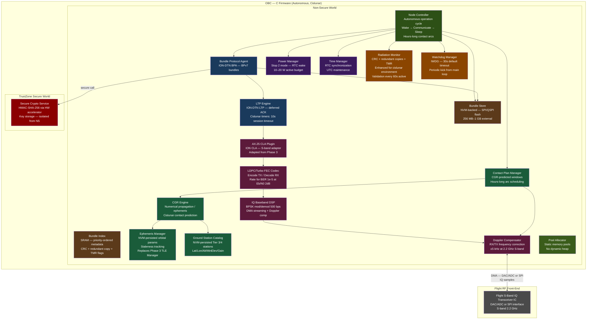
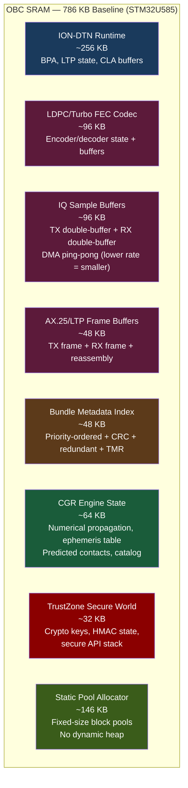
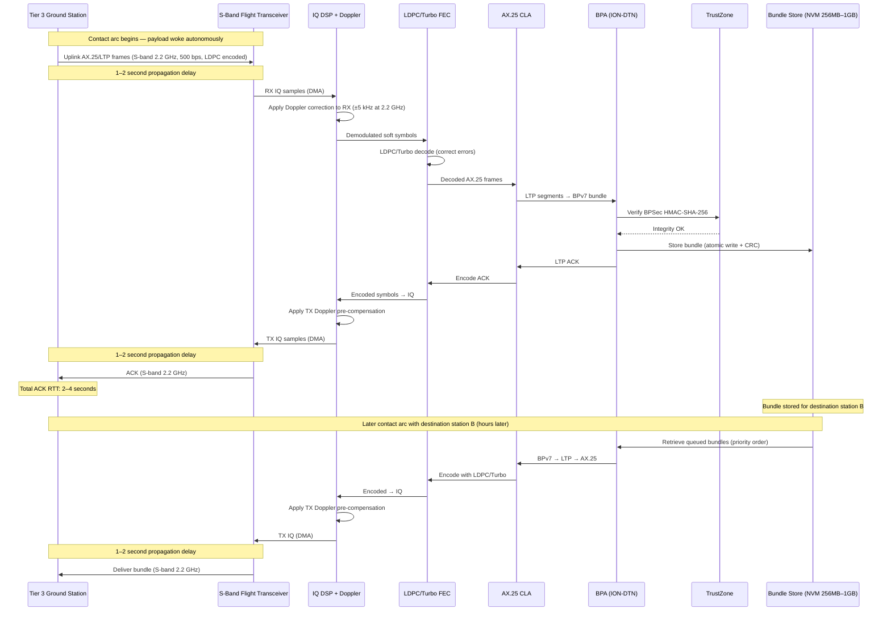
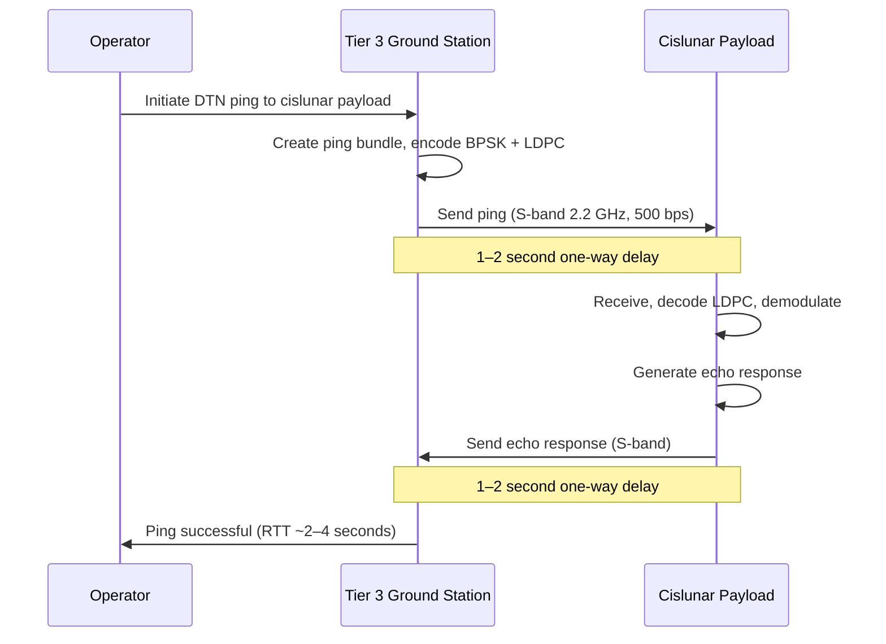
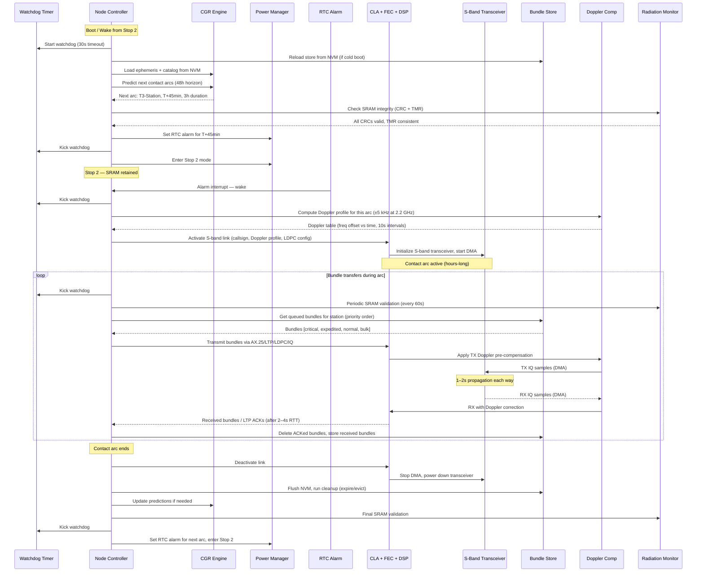
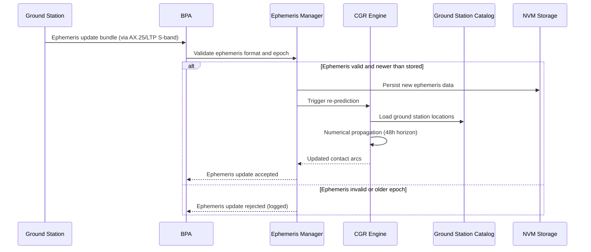
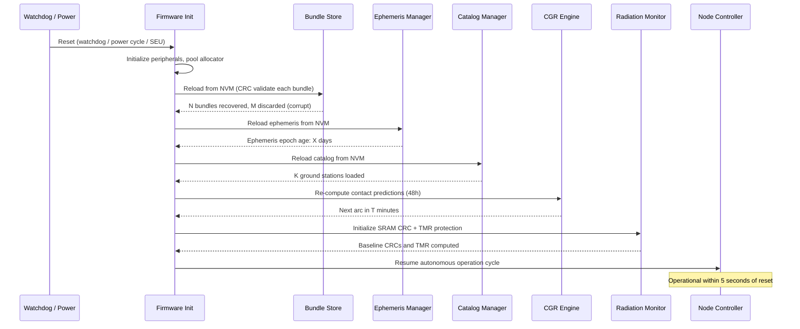

# Design Document: Cislunar Mission (Phase 4)

## Overview

This design describes the Phase 4 Cislunar Mission system — the final phase extending DTN operations from LEO (Phase 3) to cislunar distances (~384,000 km). The OBC runs the complete flight software stack autonomously: ION-DTN (BPv7/LTP over AX.25), IQ baseband DSP with BPSK modulation, LDPC/Turbo FEC encoding/decoding, NVM bundle store (256 MB–1 GB), CGR contact prediction adapted for cislunar orbits, Doppler compensation at S-band 2.2 GHz, power management (10–20 W), TrustZone secure crypto, and enhanced radiation tolerance for the cislunar environment.

The baseline OBC is the STM32U585 (same as Phase 3), with the option to upgrade to a more capable processor. All interfaces are designed to work on the STM32U585 while accommodating a higher-capability OBC. The design uses `obc_` prefixes instead of `stm32_` to maintain processor flexibility.

The key architectural changes from Phase 3 are:

1. **S-band 2.2 GHz replaces UHF 437 MHz**: The CLA and IQ DSP are adapted for S-band operation at 500 bps BPSK (replacing 9.6 kbps GMSK/BPSK at UHF).
2. **LDPC/Turbo FEC codec**: A new FEC codec component provides strong forward error correction required for the 7 dB link margin at cislunar distances. Phase 3 did not require strong FEC.
3. **LTP cislunar delay adaptation**: LTP retransmission timers and session timeouts are configured for 2–4 second round-trip times (vs. milliseconds in LEO).
4. **Cislunar CGR**: The CGR engine is adapted from SGP4/SDP4 (LEO) to numerical orbit propagation or pre-computed ephemeris tables suitable for cislunar orbital mechanics. Contact arcs are hours-long (vs. 5–10 minutes in LEO). Prediction horizon extended to 48 hours.
5. **Ephemeris management**: Replaces TLE management — cislunar orbits use ephemeris tables instead of TLE/SGP4.
6. **Expanded NVM**: 256 MB–1 GB (vs. 64–256 MB in Phase 3) for long-duration message storage.
7. **Enhanced radiation tolerance**: TMR for critical control variables, higher-frequency SRAM validation (once per minute vs. once per cycle), reflecting the elevated radiation flux beyond the Van Allen belts.
8. **Slower Doppler dynamics**: Doppler at S-band is ±5 kHz (vs. ±10 kHz at UHF in LEO), with slower rate of change. Update rate relaxed to once per 10 seconds.
9. **Power budget**: 10–20 W (vs. 5–10 W in Phase 3).

Phase 3 components carried forward unchanged: ION-DTN BPA (BPv7 creation/validation/serialization), NVM Bundle Store (atomic writes, priority index, eviction), AX.25 CLA plugin architecture, TrustZone secure crypto (HMAC-SHA-256), pool allocator, BPSec integrity, rate limiting, bundle size limits, priority ordering, watchdog manager, time manager, node health/telemetry framework.

### Scope Boundaries

**In scope**: S-band 2.2 GHz IQ transceiver interface, BPSK modulation at 500 bps, LDPC/Turbo FEC codec, LTP cislunar delay configuration, cislunar CGR (numerical propagation / ephemeris tables), ephemeris management (replacing TLE), expanded NVM (256 MB–1 GB), enhanced radiation tolerance (TMR, higher-frequency validation), cislunar Doppler compensation (±5 kHz at 2.2 GHz), 10–20 W power budget, hours-long contact arc management, all Phase 3 firmware components adapted for cislunar operation.

**Out of scope**: X-band, relay functionality, optical communication, Mars-relay simulations, companion host.

## Architecture



### SRAM Memory Layout (786 KB Baseline — STM32U585)



## Sequence Diagrams

### Cislunar Store-and-Forward (Full Stack)



### Cislunar Ping (DTN Reachability at Earth–Moon Distance)



### Autonomous Operation Cycle (Cislunar)



### Ephemeris Update and CGR Re-prediction



### Fault Recovery After Reset (Cislunar)



## Components and Interfaces

Components carried forward from Phase 3 with minimal changes are noted as such. New Phase 4 components and significantly adapted components are described in full.

### Component 1: Bundle Protocol Agent (BPA) — OBC C Firmware

**Carried from Phase 3.** Identical interface and behavior. Creates, validates, serializes/deserializes BPv7 bundles. Handles ping request/response. Delegates HMAC-SHA-256 to TrustZone. Pool-allocated. No relay.

The Phase 4 change: the BPA now also handles ephemeris update bundles (replacing TLE update bundles) as an administrative bundle type.

**Interface**: Same as Phase 3 `bpa_*` functions. Administrative bundle type updated:

```c
/* Administrative bundle types (Phase 4) */
typedef enum {
    ADMIN_BUNDLE_EPHEMERIS_UPDATE = 0x10,  /* replaces TLE_UPDATE */
    ADMIN_BUNDLE_CATALOG_UPDATE   = 0x11,
    ADMIN_BUNDLE_TIME_SYNC        = 0x12,
    ADMIN_BUNDLE_TELEMETRY_REQ    = 0x13,
    ADMIN_BUNDLE_KEY_UPDATE       = 0x14
} admin_bundle_type_t;

/* Dispatch an administrative bundle to the appropriate handler.
 * Returns BPA_OK if handled, error if unrecognized or invalid. */
bpa_error_t bpa_dispatch_admin(const bundle_t *b, uint64_t current_time);
```

### Component 2: NVM Bundle Store — OBC C Firmware

**Carried from Phase 3.** Identical interface: `store_init`, `store_put`, `store_get`, `store_delete`, `store_list_by_priority`, `store_list_by_destination`, `store_capacity`, `store_evict_expired`, `store_evict_lowest`, `store_reload`, `store_flush`.

Phase 4 change: configured for 256 MB–1 GB NVM capacity (vs. 64–256 MB in Phase 3). The NVM addressing and sector management are extended to handle the larger capacity. The SRAM bundle metadata index is protected with CRC, redundant copies, and TMR for critical flags.

### Component 3: LDPC/Turbo FEC Codec — OBC C Firmware (NEW)

**Purpose**: Provides strong forward error correction for the cislunar S-band link. Encodes transmitted data with LDPC or Turbo codes before BPSK modulation, and decodes received data after BPSK demodulation. Required to achieve BER ≤ 1e-5 at Eb/N0 ≤ 2 dB with the 7 dB link margin budget.

**Interface** (C — OBC firmware):
```c
#include <stdint.h>

/* --- FEC Configuration --- */
typedef enum {
    FEC_TYPE_LDPC  = 0,
    FEC_TYPE_TURBO = 1
} fec_type_t;

typedef struct {
    fec_type_t type;            /* LDPC or Turbo */
    uint16_t   code_rate_num;   /* numerator (e.g., 1 for rate 1/2) */
    uint16_t   code_rate_den;   /* denominator (e.g., 2 for rate 1/2) */
    uint16_t   block_size;      /* information bits per block */
    uint16_t   max_iterations;  /* decoder max iterations (default 50) */
} fec_config_t;

/* --- FEC Codec Statistics --- */
typedef struct {
    uint64_t blocks_encoded;
    uint64_t blocks_decoded;
    uint64_t decode_failures;       /* uncorrectable blocks */
    uint64_t total_bit_errors_corrected;
    float    avg_iterations;        /* average decoder iterations */
} fec_stats_t;

/* --- FEC Codec Interface --- */

/* Initialize FEC codec with configuration. Allocates state from pool. */
bpa_error_t fec_init(const fec_config_t *config);

/* Encode a data block. Writes encoded output to out buffer.
 * out_len receives the actual encoded length.
 * Returns BPA_OK or error. */
bpa_error_t fec_encode(const uint8_t *data, uint16_t data_len,
                       uint8_t *out, uint16_t *out_len);

/* Decode a received block (soft or hard decision input).
 * Writes decoded data to out buffer. out_len receives decoded length.
 * Returns BPA_OK if decoded successfully, BPA_ERR_FEC_DECODE if uncorrectable. */
bpa_error_t fec_decode(const uint8_t *received, uint16_t received_len,
                       uint8_t *out, uint16_t *out_len);

/* Decode with soft-decision input (log-likelihood ratios).
 * Each LLR is a signed 8-bit value. */
bpa_error_t fec_decode_soft(const int8_t *llr, uint16_t llr_count,
                            uint8_t *out, uint16_t *out_len);

/* Get current FEC statistics. */
fec_stats_t fec_get_stats(void);

/* Reset FEC statistics. */
void fec_reset_stats(void);

/* Get FEC codec memory usage (bytes). */
uint32_t fec_get_memory_usage(void);
```

**Responsibilities**:
- LDPC or Turbo encoding of all transmitted data blocks
- LDPC or Turbo decoding of all received data blocks (hard and soft decision)
- Achieve BER ≤ 1e-5 at Eb/N0 ≤ 2 dB
- Track decode statistics (corrected errors, uncorrectable blocks, average iterations)
- Operate within the OBC SRAM budget (~96 KB for codec state and buffers)
- Pool-allocated, no dynamic heap

### Component 4: CGR Engine — OBC C Firmware (ADAPTED from Phase 3)

**Purpose**: Computes predicted contact windows between the cislunar payload and ground stations using numerical orbit propagation or pre-computed ephemeris tables. Adapted from Phase 3's SGP4/SDP4-based engine to handle cislunar orbital mechanics (highly elliptical orbits, lunar gravity, longer arcs). Prediction horizon extended to 48 hours.

**Interface** (C — OBC firmware):
```c
#include <stdint.h>

/* --- Ephemeris Entry --- */
typedef struct {
    uint64_t epoch_unix;         /* time of this state vector */
    double   pos_eci_km[3];      /* position in ECI (km) */
    double   vel_eci_km_s[3];    /* velocity in ECI (km/s) */
} ephemeris_point_t;

/* --- Ephemeris Table --- */
typedef struct {
    ephemeris_point_t *points;   /* array of state vectors */
    uint32_t           count;    /* number of points */
    uint64_t           start_epoch;  /* first point epoch */
    uint64_t           end_epoch;    /* last point epoch */
    uint32_t           interval_sec; /* time between points */
    uint32_t           crc32;    /* CRC for NVM integrity */
} ephemeris_table_t;

/* --- Ground Station Entry (Phase 4 — adds antenna gain) --- */
typedef struct {
    char     callsign[10];       /* station callsign identifier */
    double   latitude_deg;       /* geodetic latitude */
    double   longitude_deg;      /* geodetic longitude */
    double   altitude_m;         /* altitude above WGS84 */
    double   min_elevation_deg;  /* minimum elevation for valid contact */
    double   antenna_gain_dbi;   /* antenna gain in dBi (Tier 3/4) */
    uint32_t crc32;              /* CRC for NVM integrity */
} ground_station_phase4_t;

/* --- Predicted Contact Window (Phase 4) --- */
typedef struct {
    uint8_t  station_index;      /* index into ground station catalog */
    uint64_t start_time;         /* epoch seconds (UTC) */
    uint64_t end_time;           /* epoch seconds (UTC) */
    double   max_elevation_deg;  /* peak elevation during arc */
    double   doppler_max_hz;     /* max Doppler shift at 2.2 GHz */
    double   doppler_rate_hz_s;  /* max Doppler rate (Hz/s) */
    double   light_time_sec;     /* estimated one-way light-time delay */
    double   range_km;           /* estimated range at closest approach */
} predicted_contact_phase4_t;

/* --- CGR Engine Interface (Phase 4) --- */

/* Initialize CGR engine for cislunar operation. */
bpa_error_t cgr_init(void);

/* Load ephemeris table. Validates format and epoch range.
 * Returns BPA_OK or error if format invalid. */
bpa_error_t cgr_load_ephemeris(const ephemeris_table_t *eph);

/* Get current ephemeris table. */
const ephemeris_table_t *cgr_get_ephemeris(void);

/* Get ephemeris age in seconds relative to current_time
 * (time since last ephemeris point). */
uint64_t cgr_ephemeris_age(uint64_t current_time);

/* Load ground station catalog (up to max_stations entries).
 * Returns number of stations loaded. */
uint32_t cgr_load_catalog(const ground_station_phase4_t *stations,
                          uint32_t count);

/* Add or update a single ground station entry.
 * Returns index in catalog, or -1 if catalog full. */
int32_t cgr_update_station(const ground_station_phase4_t *station);

/* Get ground station catalog size. */
uint32_t cgr_catalog_size(void);

/* Predict contact windows from from_time to to_time.
 * Writes up to max_contacts predicted contacts into out array.
 * Returns number of predicted contacts. */
uint32_t cgr_predict_contacts(uint64_t from_time, uint64_t to_time,
                              predicted_contact_phase4_t *out,
                              uint32_t max_contacts);

/* Get the next predicted contact with a specific station.
 * Returns 1 if found, 0 if no future contact predicted. */
int cgr_next_contact_for_station(uint8_t station_index,
                                 uint64_t after_time,
                                 predicted_contact_phase4_t *out);

/* Get the next predicted contact with any station.
 * Returns 1 if found, 0 if no future contacts. */
int cgr_next_contact_any(uint64_t after_time,
                         predicted_contact_phase4_t *out);

/* Interpolate satellite position/velocity at a given time
 * from the ephemeris table (Hermite or Lagrange interpolation).
 * Returns position (km) and velocity (km/s) in ECI frame. */
bpa_error_t cgr_interpolate(uint64_t time_unix,
                            double pos_eci_km[3],
                            double vel_eci_km_s[3]);

/* Get CGR engine memory usage (bytes). */
uint32_t cgr_get_memory_usage(void);
```

**Responsibilities**:
- Interpolate satellite position/velocity from ephemeris table at arbitrary times
- Compute line-of-sight windows between satellite and ground stations (elevation angle check)
- Predict contact arc start/end times, maximum elevation, Doppler shift, light-time delay, range for each arc
- Maintain 48-hour prediction horizon
- Filter contacts by minimum elevation angle (configurable, default 5°)
- Re-predict when ephemeris is updated or catalog changes
- All computation within pool-allocated SRAM (~64 KB budget)
- No multi-hop routing — contact prediction only

### Component 5: Ephemeris Manager — OBC C Firmware (NEW — replaces Phase 3 TLE Manager)

**Purpose**: Manages onboard ephemeris data lifecycle: validation, persistence to NVM, staleness tracking, and ground-uploadable updates. Provides ephemeris data to the CGR engine. Replaces Phase 3's TLE Manager because cislunar orbits require ephemeris tables rather than TLE/SGP4.

**Interface** (C — OBC firmware):
```c
/* --- Ephemeris Manager Interface --- */

/* Initialize ephemeris manager. Loads ephemeris from NVM if available. */
bpa_error_t eph_init(void);

/* Update ephemeris from a received bundle payload.
 * Validates format, checks epoch is newer than stored.
 * Persists to NVM and triggers CGR re-prediction on success. */
bpa_error_t eph_update(const uint8_t *eph_payload, uint32_t len);

/* Get current ephemeris table (NULL if none loaded). */
const ephemeris_table_t *eph_get_current(void);

/* Get ephemeris age in seconds (time since last point in table). */
uint64_t eph_get_age(uint64_t current_time);

/* Check if ephemeris is stale (age > threshold). */
int eph_is_stale(uint64_t current_time);

/* Get configured staleness threshold in seconds. */
uint64_t eph_get_stale_threshold(void);

/* Set staleness threshold (default 7 days = 604800 seconds). */
void eph_set_stale_threshold(uint64_t threshold_sec);

/* Get the contact window margin widening factor for stale ephemeris.
 * Returns 1.0 if ephemeris is fresh, >1.0 if stale. */
double eph_get_margin_factor(uint64_t current_time);

/* Persist current ephemeris to NVM. */
bpa_error_t eph_persist(void);

/* Reload ephemeris from NVM (after reset). */
bpa_error_t eph_reload(void);
```

**Responsibilities**:
- Validate ephemeris table format (point count, epoch range, interval, CRC)
- Reject ephemeris updates with epoch older than currently stored
- Persist ephemeris to NVM with CRC protection
- Track ephemeris age and flag staleness warnings (default threshold: 7 days)
- Widen contact window margins when ephemeris is stale (configurable factor)
- Include ephemeris epoch age in telemetry
- Reload from NVM after reset

### Component 6: Doppler Compensator — OBC C Firmware (ADAPTED from Phase 3)

**Purpose**: Computes and applies Doppler frequency correction at S-band 2.2 GHz. Adapted from Phase 3's UHF 437 MHz Doppler compensator. Cislunar Doppler dynamics are slower (±5 kHz vs. ±10 kHz) with longer duration. Update rate relaxed to once per 10 seconds.

**Interface** (C — OBC firmware):
```c
/* --- Doppler Profile Entry (same structure as Phase 3) --- */
typedef struct {
    uint64_t time;           /* epoch seconds */
    double   freq_offset_hz; /* Doppler offset at this time */
} doppler_point_t;

/* --- Doppler Compensator Interface (Phase 4) --- */

/* Initialize Doppler compensator for S-band 2.2 GHz. */
bpa_error_t doppler_init(void);

/* Load a Doppler profile for an upcoming contact arc.
 * Profile is a time-series of frequency offsets computed from CGR.
 * Points must be sorted by time. May contain hundreds of points
 * for hours-long arcs (10-second intervals). */
bpa_error_t doppler_load_profile(const doppler_point_t *profile,
                                 uint32_t point_count);

/* Get the interpolated Doppler offset at a given time. */
double doppler_get_offset(uint64_t current_time);

/* Apply Doppler correction to RX IQ samples in-place. */
bpa_error_t doppler_correct_rx(iq_sample_t *samples,
                               uint32_t sample_count,
                               uint64_t sample_time);

/* Apply Doppler pre-compensation to TX IQ samples in-place. */
bpa_error_t doppler_correct_tx(iq_sample_t *samples,
                               uint32_t sample_count,
                               uint64_t sample_time);

/* Clear the current Doppler profile (between arcs). */
void doppler_clear_profile(void);

/* Get current Doppler tracking status. */
typedef struct {
    double   current_offset_hz;
    double   current_rate_hz_s;
    uint32_t profile_points;
    uint8_t  profile_loaded;
} doppler_status_t;

doppler_status_t doppler_get_status(void);
```

**Responsibilities**:
- Compute Doppler profile from CGR-predicted satellite position/velocity relative to ground station at 2.2 GHz
- Linear interpolation between profile points (10-second intervals for hours-long arcs)
- Apply NCO frequency shift to RX IQ samples
- Apply inverse NCO shift to TX IQ samples (pre-compensation)
- Update at least once per 10 seconds (relaxed from Phase 3's 1-second rate)
- Support ±5 kHz Doppler range at 2.2 GHz
- Handle profiles with hundreds of points for hours-long arcs
- Stateless between arcs (profile cleared after each contact)

### Component 7: Convergence Layer Adapter (CLA) — OBC C Firmware (ADAPTED from Phase 3)

**Purpose**: Adapted from Phase 3 for S-band 2.2 GHz at 500 bps BPSK. The CLA now integrates with the LDPC/Turbo FEC codec in the data path: CLA → FEC encode → DSP → Doppler → transceiver (TX), and transceiver → Doppler → DSP → FEC decode → CLA (RX). LTP timers are configured for cislunar delay.

**Interface** (C — OBC firmware):
```c
/* --- CLA Configuration (Phase 4) --- */
typedef struct {
    callsign_t local_callsign;
    uint16_t   max_frame_size;
    uint32_t   iq_sample_rate;
    uint32_t   iq_center_freq_hz;  /* 2200000000 (2.2 GHz) */
    uint32_t   data_rate_bps;      /* 500 */
    uint8_t    use_doppler;        /* 1 = enable Doppler compensation */
    fec_config_t fec_config;       /* LDPC/Turbo FEC configuration */
    /* LTP cislunar delay parameters */
    uint32_t   ltp_retx_timer_ms;  /* default 10000 (10s for cislunar RTT) */
    uint32_t   ltp_session_timeout_ms; /* default 10000 */
    uint8_t    ltp_max_retries;    /* default 5 */
    uint8_t    ltp_concurrent_sessions; /* default 4 */
} cla_config_phase4_t;

/* Activate S-band link with Doppler profile and FEC for a contact arc. */
bpa_error_t cla_activate_link_cislunar(const callsign_t *remote_callsign,
                                       const doppler_point_t *profile,
                                       uint32_t profile_points,
                                       const cla_config_phase4_t *config);
```

**Responsibilities** (changes from Phase 3):
- S-band 2.2 GHz operation (replacing UHF 437 MHz)
- BPSK modulation at 500 bps (replacing GMSK/BPSK at 9.6 kbps)
- Integration with LDPC/Turbo FEC codec in TX and RX data paths
- LTP retransmission timers configured for 2–4 second RTT
- Concurrent LTP sessions for throughput during hours-long arcs
- Doppler-corrected IQ streaming at S-band (±5 kHz)
- Flight transceiver initialization for S-band

### Component 8: IQ Baseband DSP — OBC C Firmware (ADAPTED from Phase 3)

**Carried from Phase 3.** Same `dsp_*` interface. Phase 4 changes the modulation from GMSK/BPSK at 9.6 kbps (Phase 3) to BPSK at 500 bps for the cislunar S-band link. The lower data rate means smaller IQ buffers (~96 KB vs. ~128 KB). The DSP now integrates with the FEC codec: soft-decision demodulation output feeds the LDPC/Turbo decoder.

### Component 9: Radiation Monitor — OBC C Firmware (ENHANCED from Phase 3)

**Purpose**: Enhanced from Phase 3 for the cislunar radiation environment beyond the Van Allen belts. Adds TMR (triple modular redundancy) for the most critical control variables and increases SRAM validation frequency to once per minute during active operation.

**Interface** (C — OBC firmware):
```c
/* --- TMR Protected Variable --- */
typedef struct {
    uint32_t copy_a;
    uint32_t copy_b;
    uint32_t copy_c;
} tmr_var_t;

/* --- Enhanced Radiation Monitor Interface (Phase 4) --- */

/* Initialize radiation monitor (enhanced for cislunar). */
bpa_error_t rad_init(void);

/* Register a critical SRAM region for CRC + redundant copy protection.
 * Same as Phase 3. Returns region index or -1 if max exceeded. */
int32_t rad_register_region(void *data, void *redundant_buf,
                            uint32_t size, const char *name);

/* Update CRC and redundant copy after legitimate modification. */
bpa_error_t rad_update_region(int32_t region_index);

/* Validate all registered regions. Returns number of errors detected. */
uint32_t rad_validate_all(void);

/* --- TMR Functions (NEW in Phase 4) --- */

/* Write a TMR-protected variable (writes to all 3 copies). */
void tmr_write(tmr_var_t *var, uint32_t value);

/* Read a TMR-protected variable (majority vote). */
uint32_t tmr_read(const tmr_var_t *var);

/* Validate and repair a TMR variable.
 * Returns 1 if repair was needed, 0 if all copies consistent. */
int tmr_validate(tmr_var_t *var);

/* Get cumulative SEU count. */
uint32_t rad_get_seu_count(void);

/* Validate NVM data integrity (CRC check on read). */
bpa_error_t rad_validate_nvm_read(const uint8_t *data, uint32_t len,
                                  uint32_t expected_crc);

/* Get recommended validation interval (seconds).
 * Returns 60 for cislunar (vs. per-cycle for LEO). */
uint32_t rad_get_validation_interval(void);
```

**Responsibilities** (additions to Phase 3):
- TMR for critical control variables: contact plan active flag, current contact index, power state
- TMR majority vote on read, repair on validation
- SRAM validation every 60 seconds during active operation (vs. every cycle in Phase 3)
- SRAM validation on every wake from Stop 2
- Track TMR corrections separately from CRC-based corrections in SEU count
- All Phase 3 CRC + redundant copy protection carried forward

### Component 10: Node Controller — OBC C Firmware (ADAPTED from Phase 3)

**Purpose**: Adapted from Phase 3 for cislunar operation. Manages hours-long contact arcs (vs. 5–10 minute LEO passes). Operation cycle iteration time relaxed to 2 seconds (from 1 second) to accommodate FEC processing. Sleep threshold changed to 5 minutes (from 60 seconds) between arcs.

**Interface** (C — OBC firmware):
```c
/* --- Node Configuration (Phase 4) --- */
typedef struct {
    node_id_t     node_id;
    callsign_t    local_callsign;
    endpoint_id_t endpoints[4];
    uint8_t       endpoint_count;
    uint32_t      max_nvm_bytes;       /* 256 MB – 1 GB */
    priority_t    default_priority;
    uint32_t      max_bundle_size;
    float         max_bundle_rate;     /* bundles/sec per source */
    uint32_t      watchdog_timeout_ms; /* default 30000 */
    uint64_t      eph_stale_threshold; /* default 604800 (7 days) */
    uint64_t      time_stale_threshold;/* default 604800 (7 days) */
    double        min_elevation_deg;   /* default 5.0 */
    /* Phase 4 additions */
    fec_config_t  fec_config;          /* LDPC/Turbo FEC config */
    uint32_t      ltp_retx_timer_ms;   /* default 10000 */
    uint32_t      ltp_session_timeout_ms; /* default 10000 */
    uint8_t       ltp_max_retries;     /* default 5 */
    uint32_t      rad_validation_interval_sec; /* default 60 */
    uint32_t      sleep_threshold_sec; /* default 300 (5 min) */
} node_config_phase4_t;

/* --- Node Health (Phase 4) --- */
typedef struct {
    uint64_t uptime_seconds;
    float    nvm_used_percent;
    uint32_t bundles_stored;
    uint32_t bundles_delivered;
    uint32_t bundles_dropped;
    uint64_t last_contact_time;
    /* OBC-specific */
    uint32_t sram_used_bytes;
    uint32_t sram_peak_bytes;
    uint8_t  power_state;
    uint32_t active_time_ms;
    uint32_t stop2_time_ms;
    int16_t  mcu_temp_c10;
    /* Phase 4 additions */
    uint64_t eph_epoch_age_sec;
    uint32_t cgr_prediction_horizon_sec;
    uint32_t radiation_seu_count;
    uint32_t radiation_tmr_corrections;
    uint64_t last_time_sync;
    uint32_t contacts_completed;
    uint32_t contacts_missed;
    /* FEC statistics */
    uint64_t fec_blocks_decoded;
    uint64_t fec_decode_failures;
    uint64_t fec_errors_corrected;
    float    fec_avg_iterations;
    /* Link quality */
    int16_t  iq_snr_db10;
    uint32_t iq_ber_e6;
    double   doppler_current_hz;
    double   light_time_sec;
} node_health_phase4_t;

/* --- Node Controller Interface --- */

/* Initialize the autonomous node controller. */
bpa_error_t node_init(const node_config_phase4_t *config);

/* Run one complete operation cycle:
 * Must complete within 2 seconds (relaxed from Phase 3's 1s). */
bpa_error_t node_run_cycle(uint64_t current_time);

/* Get current node health. */
node_health_phase4_t node_get_health(void);

/* Generate a telemetry bundle for a requesting ground station. */
bpa_error_t node_generate_telemetry(const endpoint_id_t *requester,
                                    bundle_t *out);

/* Cold boot initialization: reload all state from NVM.
 * Must complete within 5 seconds. */
bpa_error_t node_cold_boot(void);

/* Main firmware entry point — runs the autonomous loop. */
void node_main_loop(void);  /* never returns */
```

**Responsibilities** (changes from Phase 3):
- Hours-long contact arc management (vs. 5–10 minute passes)
- 2-second operation cycle time (vs. 1 second) to accommodate FEC
- 5-minute sleep threshold between arcs (vs. 60 seconds)
- FEC statistics in telemetry
- Light-time delay tracking in health reports
- Ephemeris-based scheduling (replacing TLE-based)
- TMR-protected critical control variables
- Periodic radiation validation every 60 seconds during active operation

### Component 11: Ground Station Catalog Manager — OBC C Firmware (ADAPTED from Phase 3)

**Carried from Phase 3.** Same interface. Phase 4 adds antenna gain (dBi) to each station entry for link budget estimation. Uses `ground_station_phase4_t` instead of `ground_station_t`.

```c
/* --- Catalog Manager Interface (Phase 4 additions) --- */

/* Initialize catalog. Loads from NVM if available. */
bpa_error_t catalog_init(void);

/* Add or update a ground station entry (with antenna gain).
 * Validates fields, persists to NVM, triggers CGR re-prediction. */
int32_t catalog_add_station(const ground_station_phase4_t *station);

/* Get a station by index. */
const ground_station_phase4_t *catalog_get_station(uint8_t index);

/* Find a station by callsign. Returns index or -1. */
int32_t catalog_find_by_callsign(const char *callsign);

/* Get number of stations in catalog. */
uint32_t catalog_count(void);

/* Persist entire catalog to NVM. */
bpa_error_t catalog_persist(void);

/* Reload catalog from NVM (after reset). */
bpa_error_t catalog_reload(void);
```

### Component 12: LTP Engine — OBC C Firmware (ADAPTED from Phase 3)

**Carried from Phase 3.** Same ION-DTN LTP implementation. Phase 4 configures LTP for cislunar delay:
- Retransmission timer: 10 seconds (vs. ~1 second in LEO)
- Session timeout: 10 seconds
- Max retries: 5
- Concurrent sessions: 4 (to maximize throughput during hours-long arcs at 500 bps)

No interface changes — configuration via `cla_config_phase4_t`.

### Component 13: Time Manager — OBC C Firmware

**Carried from Phase 3.** Identical interface. No changes for Phase 4.

### Component 14: Watchdog Manager — OBC C Firmware

**Carried from Phase 3.** Identical interface. No changes for Phase 4.

### Component 15: TrustZone Secure Crypto Service — OBC C Firmware

**Carried from Phase 3.** Identical interface. No changes for Phase 4.

### Component 16: Power Manager — OBC C Firmware

**Carried from Phase 3.** Same interface. Phase 4 change: the power budget is 10–20 W active (vs. 5–10 W in Phase 3), and the sleep threshold is 5 minutes between arcs (vs. 60 seconds in Phase 3).

### Component 17: Static Memory Pool Allocator — OBC C Firmware

**Carried from Phase 3.** Same interface. Phase 4 adds a `POOL_FEC_STATE` pool ID for FEC codec allocations.

```c
/* Pool IDs for Phase 4 */
typedef enum {
    POOL_BUNDLE_PAYLOAD = 0,
    POOL_IQ_BUFFER      = 1,
    POOL_FRAME_BUFFER   = 2,
    POOL_INDEX_ENTRY    = 3,
    POOL_GENERAL        = 4,
    POOL_CGR_STATE      = 5,
    POOL_FEC_STATE      = 6,  /* LDPC/Turbo FEC codec state + buffers */
    POOL_COUNT          = 7
} pool_id_t;
```

## Data Models

### Phase 3 Data Models Carried Forward

The following data models from Phase 3 are carried forward unchanged:
- `endpoint_id_t`, `bundle_id_t`, `priority_t`, `bundle_type_t`, `bundle_t` — BPA bundle representation
- `primary_block_t`, `canonical_block_t` — BPv7 wire format structures
- `nvm_header_t`, `nvm_bundle_entry_t` — NVM storage layout (extended addressing for 256 MB–1 GB)
- `bpsec_bib_t` — BPSec integrity block
- `rate_limiter_entry_t`, `rate_limiter_config_t` — rate limiting state
- `iq_sample_t`, `dsp_config_t` — IQ DSP types
- `callsign_t` — AX.25 callsign
- `link_metrics_t` — CLA link metrics
- `power_state_t`, `power_metrics_t` — power management
- `pool_stats_t` — pool allocator

### Ephemeris NVM Layout (NEW — replaces Phase 3 TLE NVM Layout)

```c
/* Ephemeris stored in a dedicated NVM region for fast reload. */
typedef struct {
    uint32_t          magic;          /* 0x45504830 ("EPH0") */
    uint32_t          point_count;    /* number of ephemeris points */
    uint32_t          interval_sec;   /* time between points */
    uint64_t          start_epoch;    /* first point epoch */
    uint64_t          end_epoch;      /* last point epoch */
    uint64_t          received_at;    /* when this ephemeris was received */
    uint32_t          update_count;   /* number of ephemeris updates received */
    ephemeris_point_t points[512];    /* max 512 state vectors (~48h at 5min intervals) */
    uint32_t          crc32;          /* CRC of all preceding fields */
} nvm_ephemeris_sector_t;
```

**Validation Rules**:
- `magic` must equal `0x45504830`
- `point_count` must be > 0 and ≤ 512
- `start_epoch` < `end_epoch`
- `interval_sec` must be > 0
- `crc32` must match computed CRC of preceding fields
- On update: new ephemeris end_epoch must be newer than stored end_epoch

### Ground Station Catalog NVM Layout (Phase 4)

```c
/* Catalog stored in a dedicated NVM region (Phase 4 — with antenna gain). */
typedef struct {
    uint32_t                magic;           /* 0x47534334 ("GSC4") */
    uint32_t                station_count;
    ground_station_phase4_t stations[32];    /* max 32 stations */
    uint32_t                crc32;           /* CRC of all preceding fields */
} nvm_catalog_phase4_sector_t;
```

**Validation Rules**:
- `magic` must equal `0x47534334`
- `station_count` must be ≤ 32
- Each station: latitude ∈ [-90, 90], longitude ∈ [-180, 180], altitude ≥ 0, min_elevation ∈ [0, 90], antenna_gain ≥ 0
- Each station callsign must be non-empty
- `crc32` must match computed CRC

### Predicted Contact Plan (SRAM — Phase 4)

```c
/* In-SRAM contact plan populated by CGR engine.
 * Protected by radiation monitor (CRC + redundant copy).
 * TMR-protected active flag and current index. */
typedef struct {
    predicted_contact_phase4_t contacts[128]; /* max 128 predicted contacts */
    uint32_t                   contact_count;
    uint64_t                   computed_at;
    uint64_t                   horizon_end;
    tmr_var_t                  active_flag;    /* TMR: is a contact currently active? */
    tmr_var_t                  current_index;  /* TMR: index of current/next contact */
    uint32_t                   crc32;
} contact_plan_phase4_sram_t;
```

### Telemetry Response (Phase 4)

```c
/* Telemetry payload for Phase 4 (superset of Phase 3). */
typedef struct {
    /* Phase 3 fields */
    uint32_t sram_used_bytes;
    uint32_t sram_peak_bytes;
    uint32_t sram_ion_bytes;
    uint32_t sram_iq_bytes;
    uint32_t sram_idx_bytes;
    uint32_t sram_tz_bytes;
    uint8_t  power_state;
    uint32_t active_time_ms;
    uint32_t stop2_time_ms;
    int16_t  mcu_temp_c10;
    int16_t  iq_snr_db10;
    uint32_t iq_ber_e6;
    uint32_t wake_latency_us;
    uint32_t nvm_used_bytes;
    uint32_t nvm_bundle_count;
    uint32_t bundles_delivered;
    uint32_t bundles_dropped;
    uint32_t sram_cgr_bytes;
    uint64_t last_time_sync;
    uint32_t contacts_completed;
    uint32_t contacts_missed;
    uint32_t uptime_seconds;
    uint64_t total_bundles_received;
    uint64_t total_bundles_sent;
    uint64_t total_bytes_received;
    uint64_t total_bytes_sent;
    /* Phase 4 additions */
    uint32_t sram_fec_bytes;            /* FEC codec SRAM usage */
    uint64_t eph_epoch_age_sec;         /* age of current ephemeris */
    uint32_t cgr_horizon_sec;           /* prediction horizon remaining */
    uint32_t catalog_station_count;
    uint32_t radiation_seu_count;
    uint32_t radiation_tmr_corrections; /* TMR-specific corrections */
    double   doppler_current_hz;
    double   light_time_sec;            /* current one-way light-time */
    double   range_km;                  /* current range to ground */
    /* FEC statistics */
    uint64_t fec_blocks_decoded;
    uint64_t fec_decode_failures;
    uint64_t fec_errors_corrected;
    float    fec_avg_iterations;
} telemetry_phase4_t;
```

### Contact Execution Metrics (Phase 4)

```c
/* Per-contact metrics recorded after each arc. */
typedef struct {
    uint8_t  station_index;
    uint64_t start_time;
    uint64_t end_time;
    uint32_t bundles_sent;
    uint32_t bundles_received;
    uint64_t bytes_transferred;
    int16_t  avg_snr_db10;
    uint32_t avg_ber_e6;
    double   doppler_tracking_error_hz;
    double   avg_light_time_sec;
    double   avg_range_km;
    uint8_t  contact_successful;
    /* FEC metrics for this arc */
    uint32_t fec_blocks_decoded;
    uint32_t fec_decode_failures;
    uint32_t fec_errors_corrected;
} contact_metrics_phase4_t;
```

## Key Functions with Formal Specifications

### Function 1: processIncomingBundle (Cislunar)

```lean
def processIncomingBundle (store : BundleStore σ) (bpa : BundleProtocolAgent α)
    (bundle : Bundle) (currentTime : Nat) : IO (Except String Unit) := do
  -- Validate, store, and handle an incoming bundle at cislunar distances.
  -- If ping request: generate echo response (will be delivered after 2-4s RTT).
  -- If data bundle for local endpoint: deliver.
  -- If data bundle for remote endpoint: store for direct delivery during next contact arc.
  -- No relay — bundles are never forwarded on behalf of other nodes.
  sorry
```

**Preconditions:**
- `bundle` is well-formed BPv7 with valid CRC
- `bundle.createdAt + bundle.lifetime > currentTime` (bundle not expired)
- Store has available capacity or eviction is possible
- FEC decoding succeeded (bundle data is error-free)

**Postconditions:**
- If ping request: echo response bundle created and queued for delivery
- If local delivery: bundle delivered to application agent
- If remote destination: bundle stored in NVM for delivery during next contact arc with destination
- Bundle never forwarded to intermediate nodes (no relay)

### Function 2: fecEncodeDecode (Round-Trip)

```lean
def fecEncodeDecode (codec : FECCodec) (data : ByteArray) : IO (Except String ByteArray) := do
  -- Encode data with LDPC/Turbo FEC, then decode (without channel errors).
  -- Must produce output identical to input.
  sorry
```

**Preconditions:**
- `data.size` ≤ `codec.config.block_size / 8`
- Codec is initialized with valid configuration

**Postconditions:**
- Output is identical to input (round-trip property)
- Encoded length > input length (redundancy added)

### Function 3: cgr_interpolate (Ephemeris Interpolation)

```lean
def cgrInterpolate (eph : EphemerisTable) (time : Nat) : IO (Except String (Vector3 × Vector3)) := do
  -- Interpolate satellite position and velocity at arbitrary time
  -- from ephemeris table using Hermite or Lagrange interpolation.
  sorry
```

**Preconditions:**
- `eph.start_epoch ≤ time ≤ eph.end_epoch`
- Ephemeris table has at least 2 points
- Points are sorted by epoch and evenly spaced

**Postconditions:**
- Position is in ECI frame (km)
- Velocity is in ECI frame (km/s)
- Interpolation error bounded by ephemeris interval and orbit dynamics

## Correctness Properties

### Property 1: Bundle Serialization Round-Trip

*For any* valid BPv7 Bundle, serializing it to the CBOR wire format and then deserializing the wire format back SHALL produce a Bundle equivalent to the original.

**Validates: Requirement 7.5**

### Property 2: Bundle Creation and Validation Correctness

*For any* valid destination EndpointID, payload, priority level, and positive lifetime, the BPA SHALL create a BPv7 bundle with version equal to 7, the specified source and destination EndpointIDs, a valid CRC, the specified priority, and the specified lifetime. Conversely, for any bundle, the BPA validation function SHALL accept the bundle if and only if its version equals 7, its destination is a well-formed EndpointID, its lifetime is greater than zero, its creation timestamp does not exceed the current time, and its CRC is correct.

**Validates: Requirements 7.1, 7.2, 7.3**

### Property 3: Bundle Store/Retrieve Round-Trip

*For any* valid Bundle, storing it in the NVM-backed Bundle Store and then retrieving it by its BundleID SHALL produce a Bundle identical to the original.

**Validates: Requirements 8.1, 8.2**

### Property 4: Priority Ordering Invariant

*For any* set of bundles in the Bundle Store, listing them by priority or transmitting them during a contact arc SHALL produce a sequence where each bundle's priority is greater than or equal to the next bundle's priority (critical > expedited > normal > bulk).

**Validates: Requirements 8.3, 11.3, 14.2, 19.2**

### Property 5: Eviction Policy Ordering

*For any* Bundle Store at NVM capacity, when eviction is triggered, expired bundles SHALL be evicted first, then bundles in ascending priority order (bulk before normal before expedited), and critical-priority bundles SHALL be preserved until all lower-priority bundles have been evicted.

**Validates: Requirements 8.4, 8.5, 19.3**

### Property 6: Store Capacity Bound

*For any* sequence of store and delete operations on the NVM-backed Bundle Store, the total stored bytes SHALL never exceed the configured maximum NVM capacity (256 MB–1 GB). If the store is full of critical bundles and eviction cannot free space, the incoming bundle SHALL be rejected.

**Validates: Requirements 8.6, 22.1**

### Property 7: Store Reload with CRC Validation

*For any* set of bundles persisted to NVM, after a simulated reset and reload, the Bundle Store SHALL recover all bundles whose NVM CRC is valid and discard all bundles whose NVM CRC is invalid, with each discarded bundle ID logged.

**Validates: Requirements 8.7, 8.8, 22.3**

### Property 8: Bundle Lifetime Enforcement

*For any* set of bundles in the Bundle Store after a cleanup cycle completes, zero bundles SHALL have a creation timestamp plus lifetime less than or equal to the current time.

**Validates: Requirements 9.1, 9.2**

### Property 9: Ping Echo Correctness

*For any* ping request bundle received by the BPA addressed to a local endpoint, exactly one ping response bundle SHALL be generated with its destination set to the original sender's EndpointID and the original request's BundleID included in the response payload.

**Validates: Requirements 10.1, 10.4**

### Property 10: Local vs Remote Delivery Routing

*For any* received data bundle, if the bundle's destination matches a local EndpointID, the BPA SHALL deliver it to the local application agent. If the destination is a remote EndpointID, the BPA SHALL store it in the NVM-backed Bundle Store for direct delivery during the next contact arc with the destination node.

**Validates: Requirements 11.1, 11.2**

### Property 11: ACK Deletes, No-ACK Retains (Cislunar Delay)

*For any* bundle transmitted during a contact arc, if the remote node acknowledges receipt via LTP (after the 2–4 second cislunar RTT), the bundle SHALL be deleted from the NVM Bundle Store. If the transmission is not acknowledged within the LTP retransmission timeout (configured for cislunar delay), the bundle SHALL remain in the Bundle Store for retry.

**Validates: Requirements 11.4, 11.5**

### Property 12: Bundle Retention When No Contact Available

*For any* bundle whose destination has no direct contact arc in the current contact plan, the NVM Bundle Store SHALL retain the bundle until a contact arc with that destination is added to the plan or the bundle's lifetime expires.

**Validates: Requirements 11.6, 22.5**

### Property 13: No Relay — Direct Delivery Only

*For any* bundle transmitted during any contact arc, the contact's remote node SHALL match the bundle's final destination EndpointID. No bundle SHALL be forwarded on behalf of other nodes.

**Validates: Requirements 12.1, 12.2**

### Property 14: End-to-End S-Band Radio Path Round-Trip

*For any* valid Bundle, encapsulating it into AX.25/LTP frames, encoding with LDPC/Turbo FEC, modulating to IQ baseband samples (BPSK at 500 bps), demodulating the IQ samples, decoding FEC, and reassembling the frames into a bundle SHALL produce a Bundle equivalent to the original.

**Validates: Requirements 1.7, 13.5**

### Property 15: AX.25 Callsign Framing

*For any* bundle transmitted through the CLA, the output AX.25 frame SHALL carry a valid source amateur radio callsign and a valid destination amateur radio callsign.

**Validates: Requirement 13.1**

### Property 16: LTP Segmentation/Reassembly Round-Trip

*For any* valid bundle whose serialized size exceeds a single AX.25 frame, LTP segmentation into multiple AX.25 frames and subsequent reassembly SHALL produce a bundle equivalent to the original.

**Validates: Requirement 13.3**

### Property 17: No Transmission After Arc End

*For any* contact arc and transmission sequence, no bundle transmission SHALL occur after the contact arc's end time has been reached.

**Validates: Requirement 14.3**

### Property 18: Missed Contact Retains Bundles

*For any* scheduled contact arc where the CLA fails to establish the S-band IQ baseband link (including after 3 transceiver reinitialization attempts), all bundles queued for that contact's destination SHALL remain in the NVM Bundle Store, and the contacts-missed counter SHALL be incremented by exactly one.

**Validates: Requirements 14.6, 22.4**

### Property 19: BPSec Integrity Round-Trip

*For any* valid Bundle and HMAC-SHA-256 key provisioned in TrustZone, applying a BPSec Block Integrity Block via the hardware crypto accelerator and then verifying the integrity SHALL succeed. If any byte of the bundle is modified after integrity is applied, verification SHALL fail.

**Validates: Requirements 15.1, 15.4**

### Property 20: No Encryption Constraint

*For any* bundle processed by the BPA, no BPSec Block Confidentiality Block (BCB) or any form of payload encryption SHALL be present in the output.

**Validates: Requirement 15.2**

### Property 21: Sleep Decision Correctness (Cislunar)

*For any* system state, the firmware SHALL enter Stop 2 mode if and only if no contact arc is currently active, no bundle processing is pending, and no further contact arc is predicted within the next 5 minutes. Before entering Stop 2, the RTC alarm SHALL be set to the start time of the next predicted contact arc.

**Validates: Requirements 14.5, 17.1, 17.5**

### Property 22: Power State Transition Logging

*For any* power state transition (active → Stop 2 or Stop 2 → active), the firmware SHALL log the transition with a timestamp and the from/to states, and the cumulative time in each state SHALL be updated correctly.

**Validates: Requirement 17.4**

### Property 23: Pool Exhaustion Safety

*For any* memory pool on the OBC, when the pool is exhausted, `pool_alloc` SHALL return NULL and the requesting operation SHALL be rejected without corrupting any existing data or adjacent memory regions.

**Validates: Requirement 18.4**

### Property 24: Rate Limiting

*For any* sequence of bundle submissions from a single source EndpointID, if the submission rate exceeds the configured maximum bundles per second, the BPA SHALL reject bundles beyond the rate limit while accepting bundles within the limit.

**Validates: Requirements 20.1, 20.2**

### Property 25: Bundle Size Limit

*For any* bundle whose total serialized size exceeds the configured maximum bundle size, the BPA SHALL reject the bundle.

**Validates: Requirement 20.3**

### Property 26: Statistics Monotonicity

*For any* sequence of node operations, the cumulative statistics (total bundles received, total bundles sent, total bytes received, total bytes sent, contacts completed, contacts missed) SHALL be monotonically non-decreasing.

**Validates: Requirement 21.2**

### Property 27: FEC Codec Round-Trip

*For any* valid data block, encoding it with LDPC or Turbo FEC and then decoding the encoded block (without channel errors) SHALL produce a block identical to the original.

**Validates: Requirement 2.5**

### Property 28: FEC Decode Detects Uncorrectable Errors

*For any* encoded block with errors exceeding the FEC correction capability, the decoder SHALL return an error indication rather than silently producing incorrect output.

**Validates: Requirement 2.3 (implicit — FEC must not produce silent errors)**

### Property 29: LTP Cislunar Timer Correctness

*For any* LTP session at cislunar distance, the retransmission timer SHALL not expire before the minimum possible round-trip time (2 seconds). Concurrent sessions SHALL be maintained independently.

**Validates: Requirements 3.1, 3.3, 3.4**

### Property 30: CGR Cislunar Prediction Invariants

*For any* valid ephemeris table and ground station catalog, the CGR engine's predicted contact arcs SHALL satisfy: (a) each contact has start_time < end_time, (b) each contact's max_elevation_deg is ≥ the station's configured minimum elevation angle, (c) each contact's Doppler shift is within ±5 kHz at 2.2 GHz, (d) the prediction horizon extends at least 48 hours from the prediction start time, (e) each contact includes a valid light-time delay estimate, and (f) all contacts are direct satellite-to-ground-station arcs with no multi-hop paths.

**Validates: Requirements 4.1, 4.2, 4.3, 4.5, 4.6, 4.8**

### Property 31: Ephemeris Update Validation

*For any* ephemeris data received via a DTN bundle, the ephemeris manager SHALL accept the update if and only if the format is valid (correct point count, valid epoch range, valid CRC) and the end epoch is newer than the currently stored ephemeris end epoch. Accepted ephemeris SHALL be persisted to NVM and trigger CGR re-prediction.

**Validates: Requirements 5.1, 5.3**

### Property 32: Ephemeris NVM Round-Trip

*For any* valid ephemeris table, persisting it to NVM and then reloading it SHALL produce an ephemeris table identical to the original.

**Validates: Requirement 5.2**

### Property 33: Ephemeris Staleness Tracking

*For any* ephemeris data with a known end epoch and any current time, the reported ephemeris age SHALL equal current_time minus the end epoch. If the age exceeds the configured staleness threshold (default 7 days), the stale flag SHALL be set and the contact window margin factor SHALL be greater than 1.0.

**Validates: Requirements 5.4, 5.5**

### Property 34: Doppler Computation Bounds (S-Band)

*For any* satellite position/velocity (from ephemeris interpolation) and ground station location, the computed Doppler shift at 2.2 GHz SHALL be within ±5 kHz and SHALL be consistent with the relative radial velocity (Doppler_Hz ≈ -f_carrier × v_radial / c).

**Validates: Requirements 6.1, 6.4**

### Property 35: Doppler Correction Round-Trip (S-Band)

*For any* IQ sample sequence and any Doppler frequency offset within ±5 kHz, applying the Doppler offset to the samples and then applying Doppler correction with the same offset SHALL produce samples equivalent to the original (within numerical precision).

**Validates: Requirements 6.2, 6.3**

### Property 36: SRAM Radiation Protection (Enhanced)

*For any* critical SRAM data structure registered with the radiation monitor, if a single bit is flipped in the primary copy, the CRC check SHALL detect the corruption, the system SHALL recover the data from the redundant copy, and the SEU counter SHALL be incremented.

**Validates: Requirements 23.1, 23.2, 23.4**

### Property 37: TMR Correctness

*For any* TMR-protected variable, if one of the three copies is corrupted, `tmr_read` SHALL return the correct value via majority vote, and `tmr_validate` SHALL repair the corrupted copy.

**Validates: Requirement 23.6**

### Property 38: NVM Read CRC Validation

*For any* NVM data read operation, the radiation monitor SHALL validate the CRC. If the CRC does not match the data, the read SHALL be flagged as corrupted.

**Validates: Requirement 23.3**

### Property 39: Time Synchronization Threshold

*For any* time synchronization bundle received from a ground station, the RTC SHALL be updated if and only if the absolute correction exceeds the configured threshold (default 1 second). If the RTC has not been synchronized for more than the configured staleness period (default 7 days), the time-stale warning flag SHALL be set.

**Validates: Requirements 24.2, 24.4**

### Property 40: Reset Recovery Completeness

*For any* pre-reset system state (bundles in NVM, ephemeris data, ground station catalog, contact statistics), after a reset the firmware SHALL reload all persisted state from NVM, re-compute CGR contact predictions, and resume the autonomous operation cycle with the recovered state within 5 seconds.

**Validates: Requirements 22.3, 25.4**

### Property 41: Ground Station Catalog NVM Round-Trip (Phase 4)

*For any* set of valid ground station entries (up to 32, including antenna gain), persisting the catalog to NVM and then reloading it SHALL produce a catalog identical to the original.

**Validates: Requirements 26.1, 26.4**

## Error Handling

### Error Scenario 1: NVM Store Full

**Condition**: NVM Bundle Store reaches configured maximum capacity (256 MB–1 GB) when a new bundle arrives.
**Response**: Invoke eviction policy — remove expired bundles first, then lowest-priority bundles (bulk → normal → expedited). Critical bundles evicted only as last resort.
**Recovery**: If eviction frees sufficient space, store the new bundle. If not, reject the incoming bundle. If the LTP session is still active, signal the error to the sender. Log the event in telemetry.

### Error Scenario 2: Contact Arc Missed (Transceiver Failure)

**Condition**: S-band flight transceiver IC does not respond during a scheduled contact arc.
**Response**: Firmware attempts to reinitialize the transceiver up to 3 times at 1-second intervals. If all attempts fail: mark the contact as missed, retain all queued bundles in NVM, increment `contacts_missed` counter, enter Stop 2 mode until the next predicted contact arc.
**Recovery**: Bundles remain in NVM store for delivery during the next contact. Transceiver reinitialized on next wake cycle.

### Error Scenario 3: FEC Decode Failure

**Condition**: LDPC/Turbo decoder cannot correct errors in a received block (errors exceed correction capability).
**Response**: Discard the corrupted block. Increment `fec_decode_failures` counter. The AX.25/LTP frame is incomplete — LTP will not ACK the segment.
**Recovery**: The sender retains the data (LTP will not receive an ACK) and retransmits during the current arc (if time remains) or the next contact. FEC statistics reported in telemetry.

### Error Scenario 4: Bundle Corruption (CRC Failure)

**Condition**: CRC validation fails on a received bundle (from RF) or on a stored bundle (from NVM).
**Response**: Discard the corrupted bundle. Log the corruption event with source EndpointID and IQ link metrics.
**Recovery**: For RF-received bundles: the sender retains the bundle for retransmission. For NVM-stored bundles: the corrupted entry is discarded during store reload.

### Error Scenario 5: BPSec Integrity Failure

**Condition**: HMAC-SHA-256 verification fails on a received bundle's BPSec BIB.
**Response**: Discard the bundle. Log the integrity failure with source EndpointID.
**Recovery**: The sender retains the bundle for retransmission. Ground operators investigate potential key mismatch.

### Error Scenario 6: Power Cycle / Watchdog Reset / Radiation-Induced Reset

**Condition**: OBC experiences unexpected power loss, watchdog timeout, or radiation-induced reset.
**Response**: On restart, firmware re-initializes all subsystems. Bundle Store reloads from NVM. Ephemeris data and ground station catalog reload from NVM. CGR re-computes contact predictions (48h horizon). TrustZone re-initializes crypto keys. Radiation monitor re-establishes CRC baselines and TMR values.
**Recovery**: Corrupted NVM entries discarded. Intact state recovered. Autonomous operation resumes within 5 seconds.

### Error Scenario 7: SRAM Pool Exhaustion

**Condition**: A memory pool on the OBC is exhausted.
**Response**: `pool_alloc` returns NULL. The requesting operation is rejected. No memory corruption.
**Recovery**: Existing state unaffected. Pool blocks freed as bundles are delivered or evicted.

### Error Scenario 8: No Direct Contact Available

**Condition**: No direct contact arc exists in the CGR-predicted contact plan for a bundle's destination.
**Response**: Bundle remains in NVM store.
**Recovery**: Re-evaluate when CGR predictions are updated. If the bundle's lifetime expires before a contact becomes available, the bundle is evicted during cleanup.

### Error Scenario 9: LTP Session Timeout (Cislunar Delay)

**Condition**: LTP session times out after maximum retries at cislunar distance.
**Response**: Mark the LTP session as failed. Retain the undelivered bundle in NVM for retry during the next contact arc.
**Recovery**: Bundle retransmitted during the next contact arc with the destination station.

### Error Scenario 10: Radiation-Induced SRAM Corruption (Enhanced)

**Condition**: CRC mismatch or TMR inconsistency detected during periodic validation (every 60 seconds).
**Response**: CRC-protected regions: recover from redundant copy if primary corrupted (or vice versa). TMR variables: majority vote corrects single-copy corruption. Increment SEU counter. Log event.
**Recovery**: Single-copy corruption is transparent. Dual-copy CRC corruption: attempt NVM reload. TMR: single-copy corruption corrected by majority vote; dual-copy corruption logged as unrecoverable.

### Error Scenario 11: Ephemeris Data Stale

**Condition**: Ephemeris age exceeds configured staleness threshold (default 7 days).
**Response**: Flag ephemeris-stale warning in telemetry. Widen contact arc margins by configurable factor.
**Recovery**: Ground station uploads fresh ephemeris during next contact arc. CGR re-predicts with updated data.

### Error Scenario 12: Rate Limit Exceeded

**Condition**: A source EndpointID submits bundles faster than the configured maximum rate.
**Response**: Reject additional bundles. Log the rate-limit event.
**Recovery**: Bundles within the rate limit continue to be accepted.

### Error Scenario 13: TrustZone Security Violation

**Condition**: Non-secure code attempts to access TrustZone secure memory directly.
**Response**: Hardware fault generated. Firmware logs the access violation.
**Recovery**: Faulting operation terminated. Secure world uncompromised.

### Error Scenario 14: Invalid Ephemeris Update

**Condition**: Received ephemeris data fails format validation or has an end epoch older than the currently stored ephemeris.
**Response**: Reject the update. Log the rejection reason.
**Recovery**: Current ephemeris remains in use. Ground station can retry with corrected data.

### Error Scenario 15: Ground Station Catalog Full

**Condition**: Catalog update received when catalog already contains 32 stations and the update is for a new station.
**Response**: Reject the addition. Log the catalog-full event.
**Recovery**: Ground operator can update an existing entry to replace a less-used station.
