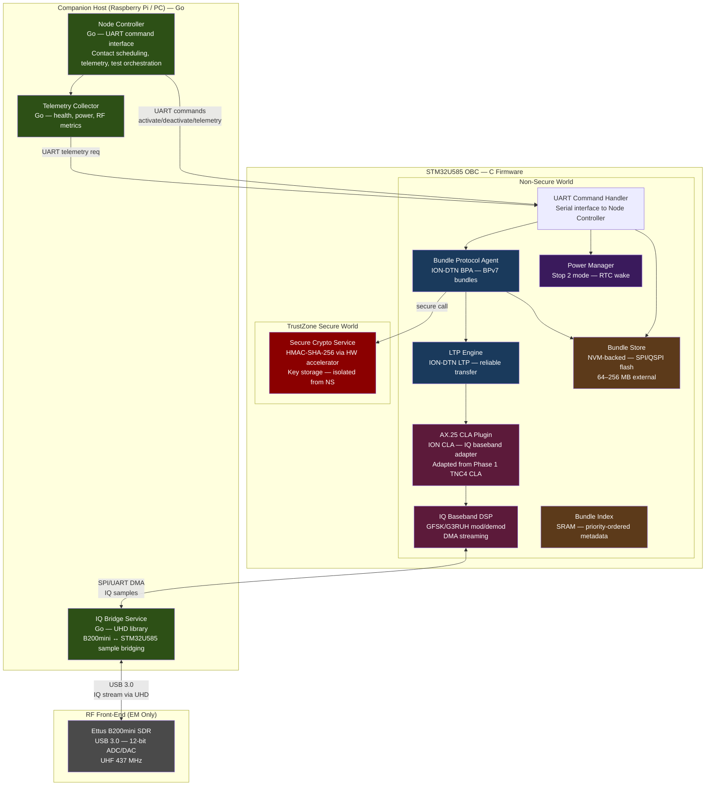
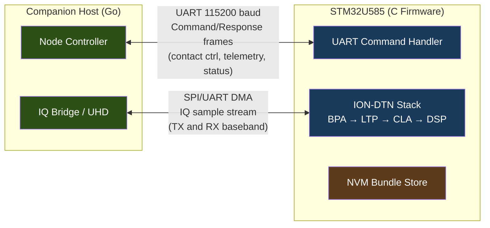
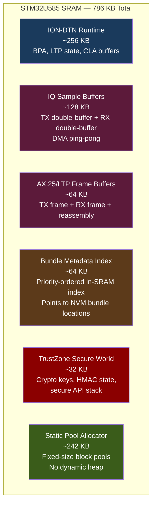
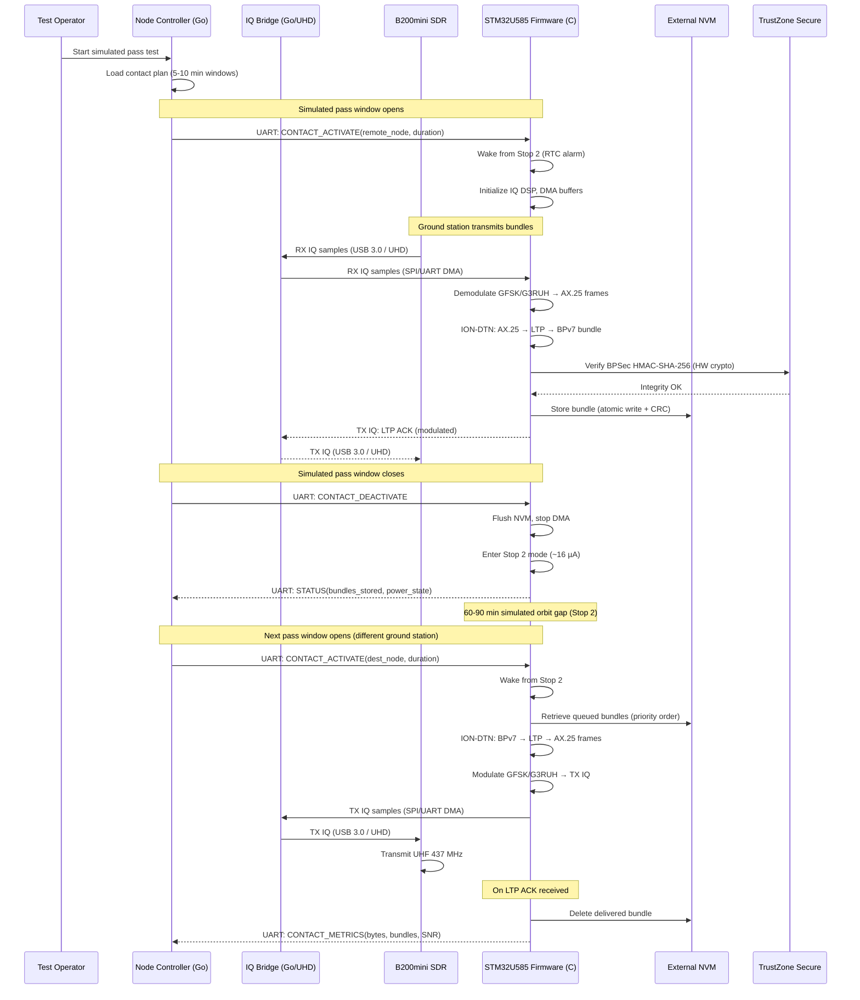
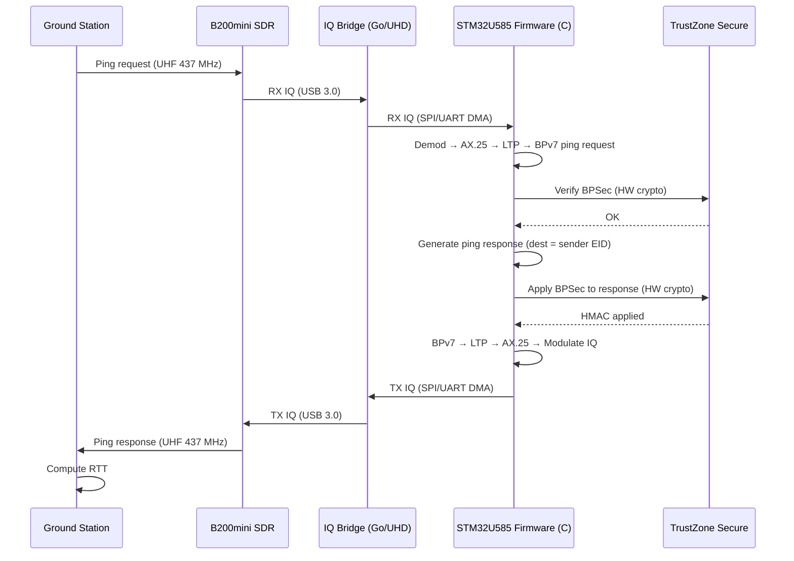
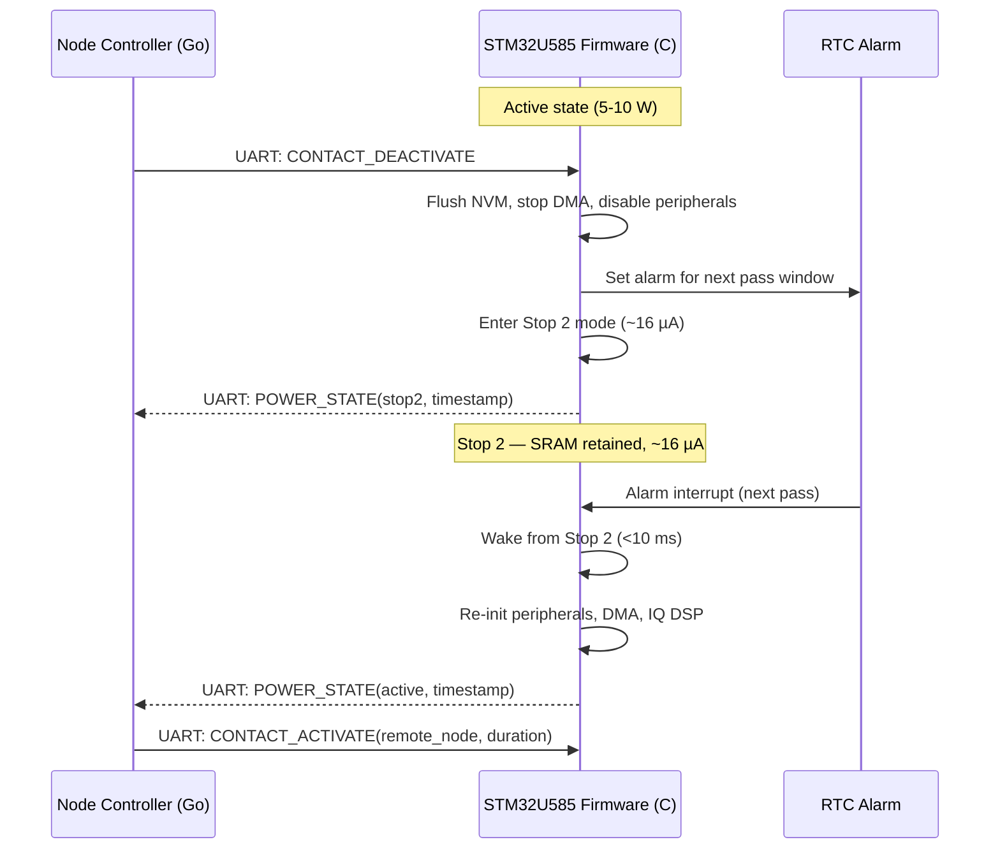

# Design Document: CubeSat Engineering Model (Phase 2)

## Overview

This design describes the Phase 2 CubeSat Engineering Model (EM) system — a ground-based flatsat that validates the flight DTN software stack on representative hardware before orbital deployment. The EM runs ION-DTN (BPv7/LTP over AX.25) on an STM32U585 ultra-low-power ARM Cortex-M33 MCU (160 MHz, 2 MB flash, 786 KB SRAM, hardware crypto, TrustZone), with C firmware implementing the DTN/radio stack and Go orchestration on a companion Raspberry Pi or PC.

The system uses a split architecture: the STM32U585 runs the complete flight software stack in C (ION-DTN BPA, LTP, AX.25 CLA, IQ baseband DSP, NVM bundle store, power management, TrustZone secure key storage), while a Go Node Controller on the Companion Host manages contact scheduling, telemetry collection, test orchestration, and bridges IQ samples between the STM32U585 and the Ettus B200mini SDR via UHD. The UART command interface between Go and C firmware carries control messages (contact activate/deactivate, telemetry requests, status queries) — not bundle data. Bundle data flows entirely through the ION-DTN stack on the STM32U585.

The RF path is: STM32U585 (IQ baseband via DMA) → SPI/UART bridge → Companion Host (UHD) → USB 3.0 → B200mini SDR → UHF 437 MHz over-the-air. The B200mini is EM-only; the flight unit replaces it with a dedicated IQ transceiver IC connected directly to the STM32U585.

The CLA is a native ION-DTN CLA plugin adapted from Phase 1's AX.25 CLA architecture. Phase 1's CLA interfaced with a TNC4 over USB serial; Phase 2's CLA interfaces with the IQ baseband radio path (STM32U585 DMA → IQ Bridge → Companion Host → B200mini). The plugin architecture is identical — it registers with ION-DTN's convergence layer framework as an LTP link service adapter — but the underlying transport is IQ samples instead of TNC4 serial bytes.

Key constraints: 786 KB SRAM shared across ION-DTN runtime, IQ sample buffers, AX.25/LTP frame buffers, bundle metadata index, and TrustZone secure world. Static/pool-based memory allocation only (no dynamic heap). External SPI/QSPI NVM (64–256 MB) for persistent bundle storage. Stop 2 ultra-low-power mode (~16 µA) between simulated passes. Hardware crypto accelerator for BPSec HMAC-SHA-256. TrustZone secure/non-secure partition for key isolation.

The system supports ping (DTN reachability test) and store-and-forward (point-to-point bundle delivery). No relay functionality. All bundle delivery is direct (source → destination). Simulated orbital passes (5–10 min windows, 60–90 min gaps, 4–6 passes/day) validate the complete store-and-forward cycle under flight-representative conditions.

### Scope Boundaries

**In scope**: STM32U585 C firmware (ION-DTN BPv7/LTP, AX.25 CLA for IQ baseband, GFSK/G3RUH modulation/demodulation, DMA IQ streaming, NVM bundle store, TrustZone key storage, hardware crypto BPSec, Stop 2 power management, static/pool memory allocation), Go Node Controller on Companion Host (UART command interface, contact scheduling, telemetry, test orchestration, UHD/B200mini IQ bridge), simulated orbital pass testing at UHF 437 MHz / 9.6 kbps.

**Out of scope**: Flight-qualified IQ transceiver IC (Phase 3), orbital deployment (Phase 3), CGR contact prediction / orbital mechanics (Phase 3), S-band / X-band / cislunar communications (Phase 4), relay functionality, Mobilinkd TNC4 (Phase 1 only).

### Development Hardware

Phase 2 EM development and testing uses an **ST NUCLEO-F753ZI** development board (STM32F753, ARM Cortex-M7, 216 MHz, 512 KB SRAM, 1 MB flash) as the initial test platform. The NUCLEO-F753ZI provides more headroom than the flight-target STM32U585 (Cortex-M33, 160 MHz, 786 KB SRAM), allowing firmware bring-up and debugging before constraining to the U585's tighter resource budget. The firmware is written to be portable between the F7 and U585 via STM32 HAL peripheral abstraction. TrustZone and hardware crypto features are validated on the U585 target once the core firmware is stable on the NUCLEO-F753ZI. The pool allocator enforces the 786 KB SRAM budget constraint even when running on the larger-SRAM F753.

## Architecture




### Split Architecture: Go ↔ C Communication



### SRAM Memory Layout (786 KB)



## Sequence Diagrams

### Simulated Pass: Ground Station → EM Store-and-Forward



### Ping Operation Through EM



### Power State Transitions



## Components and Interfaces

### Component 1: Bundle Protocol Agent (BPA) — STM32U585 C Firmware

**Purpose**: Core DTN engine running on the STM32U585, responsible for creating, receiving, validating, storing, and delivering BPv7 bundles. Wraps ION-DTN cross-compiled for Cortex-M33. Supports data bundles (store-and-forward), ping request, and ping response. No relay. Uses static/pool memory allocation. Delegates HMAC-SHA-256 to TrustZone secure world via the hardware crypto accelerator.

**Interface** (C — STM32U585 firmware):
```c
#include <stdint.h>
#include <stddef.h>

/* --- Endpoint ID --- */
typedef struct {
    char scheme[8];    /* "dtn" or "ipn" */
    char ssp[64];      /* scheme-specific part */
} endpoint_id_t;

/* --- Bundle ID --- */
typedef struct {
    endpoint_id_t source;
    uint64_t creation_timestamp;  /* DTN epoch seconds */
    uint64_t sequence_number;
} bundle_id_t;

/* --- Priority --- */
typedef enum {
    PRIORITY_BULK      = 0,
    PRIORITY_NORMAL    = 1,
    PRIORITY_EXPEDITED = 2,
    PRIORITY_CRITICAL  = 3
} priority_t;

/* --- Bundle Type --- */
typedef enum {
    BUNDLE_TYPE_DATA          = 0,
    BUNDLE_TYPE_PING_REQUEST  = 1,
    BUNDLE_TYPE_PING_RESPONSE = 2
} bundle_type_t;

/* --- Bundle (in-SRAM representation) --- */
typedef struct {
    bundle_id_t   id;
    endpoint_id_t destination;
    uint8_t      *payload;        /* pointer into pool-allocated buffer */
    uint32_t      payload_len;
    priority_t    priority;
    uint64_t      lifetime;       /* seconds */
    uint64_t      created_at;     /* DTN epoch seconds */
    bundle_type_t type;
    uint8_t      *raw_cbor;       /* serialized BPv7 wire format */
    uint32_t      raw_cbor_len;
    uint32_t      crc32;          /* CRC-32 of raw_cbor */
} bundle_t;

/* --- BPA Error Codes --- */
typedef enum {
    BPA_OK                  = 0,
    BPA_ERR_INVALID_VERSION = -1,
    BPA_ERR_INVALID_EID     = -2,
    BPA_ERR_ZERO_LIFETIME   = -3,
    BPA_ERR_FUTURE_TIMESTAMP= -4,
    BPA_ERR_CRC_MISMATCH    = -5,
    BPA_ERR_POOL_EXHAUSTED  = -6,
    BPA_ERR_OVERSIZED       = -7,
    BPA_ERR_RATE_LIMITED     = -8,
    BPA_ERR_INTEGRITY_FAIL  = -9,
    BPA_ERR_SERIALIZE       = -10
} bpa_error_t;

/* --- BPA Interface --- */

/* Create a data bundle for store-and-forward delivery.
 * Allocates from static pool. Returns BPA_OK or error. */
bpa_error_t bpa_create_bundle(const endpoint_id_t *dest,
                              const uint8_t *payload, uint32_t payload_len,
                              priority_t priority, uint64_t lifetime,
                              bundle_t *out);

/* Create a ping echo request bundle. */
bpa_error_t bpa_create_ping(const endpoint_id_t *dest, bundle_t *out);

/* Validate a received bundle: version==7, valid EID, lifetime>0,
 * timestamp<=now, CRC correct. Returns BPA_OK or specific error. */
bpa_error_t bpa_validate_bundle(const bundle_t *b, uint64_t current_time);

/* Serialize a bundle to BPv7 CBOR wire format.
 * Writes into caller-provided buffer. Returns bytes written or error. */
int32_t bpa_serialize(const bundle_t *b, uint8_t *buf, uint32_t buf_len);

/* Deserialize BPv7 CBOR wire format into a bundle.
 * Allocates payload from static pool. Returns BPA_OK or error. */
bpa_error_t bpa_deserialize(const uint8_t *data, uint32_t data_len,
                            bundle_t *out);

/* Generate a ping response from a ping request.
 * Sets destination to request's source, includes request bundle ID in payload. */
bpa_error_t bpa_generate_ping_response(const bundle_t *request,
                                       bundle_t *response);

/* Apply BPSec BIB (HMAC-SHA-256) via TrustZone secure call.
 * Modifies bundle in-place (appends integrity block to raw_cbor). */
bpa_error_t bpa_apply_integrity(bundle_t *b);

/* Verify BPSec BIB via TrustZone secure call.
 * Returns BPA_OK if integrity passes, BPA_ERR_INTEGRITY_FAIL otherwise. */
bpa_error_t bpa_verify_integrity(const bundle_t *b);

/* Release pool-allocated memory for a bundle. */
void bpa_release_bundle(bundle_t *b);
```


**Responsibilities**:
- Bundle creation with BPv7 headers, CBOR serialization, endpoint addressing — all within pool-allocated SRAM
- Bundle validation: version==7, valid destination EID, lifetime>0, timestamp<=now, CRC correct
- Serialization/deserialization round-trip (BPv7 CBOR wire format) using static buffers
- Ping echo request/response handling
- BPSec integrity (HMAC-SHA-256) via TrustZone secure API — no software crypto
- No encryption (amateur radio compliance)
- Pool-based memory: all bundle buffers allocated from fixed-size pools, no malloc/free
- Discard invalid bundles with logged reason and source EID

### Component 2: NVM Bundle Store — STM32U585 C Firmware

**Purpose**: Persistent storage for bundles on external SPI/QSPI flash (64–256 MB). Survives power cycles and watchdog resets. Maintains an in-SRAM priority-ordered metadata index pointing to NVM bundle locations. Atomic writes prevent corruption on power loss.

**Interface** (C — STM32U585 firmware):
```c
/* --- Store Capacity --- */
typedef struct {
    uint32_t total_bytes;
    uint32_t used_bytes;
    uint32_t bundle_count;
} store_capacity_t;

/* --- NVM Bundle Store Interface --- */

/* Initialize the bundle store. Reads NVM header, rebuilds SRAM index.
 * max_bytes: configured maximum NVM capacity. */
bpa_error_t store_init(uint32_t max_bytes);

/* Store a bundle atomically to NVM.
 * Writes to temp sector, validates CRC, then commits.
 * Updates SRAM priority index. Returns BPA_OK or error. */
bpa_error_t store_put(const bundle_t *b);

/* Retrieve a bundle by ID from NVM into caller-provided bundle_t.
 * Allocates payload from pool. Returns BPA_OK or BPA_ERR_NOT_FOUND. */
bpa_error_t store_get(const bundle_id_t *id, bundle_t *out);

/* Delete a bundle from NVM and remove from SRAM index. */
bpa_error_t store_delete(const bundle_id_t *id);

/* List bundle IDs sorted by priority (critical first).
 * Writes up to max_count IDs into caller-provided array.
 * Returns actual count. */
uint32_t store_list_by_priority(bundle_id_t *ids, uint32_t max_count);

/* List bundle IDs for a specific destination, sorted by priority.
 * Returns actual count. */
uint32_t store_list_by_destination(const endpoint_id_t *dest,
                                   bundle_id_t *ids, uint32_t max_count);

/* Get current store capacity. */
store_capacity_t store_capacity(void);

/* Evict all expired bundles. Returns count evicted. */
uint32_t store_evict_expired(uint64_t current_time);

/* Evict lowest-priority bundle (bulk first, then normal, then expedited).
 * Critical bundles evicted only when no lower-priority bundles remain.
 * Returns bytes freed, or 0 if store is empty. */
uint32_t store_evict_lowest(void);

/* Reload store state from NVM after power cycle / watchdog reset.
 * Validates CRC on each stored bundle, discards corrupted entries.
 * Rebuilds SRAM priority index. */
bpa_error_t store_reload(void);

/* Flush SRAM index metadata to NVM. */
bpa_error_t store_flush(void);
```

**Responsibilities**:
- Atomic NVM writes: write to temp sector → CRC validate → commit (prevents corruption on power loss)
- In-SRAM priority-ordered metadata index (~64 KB) pointing to NVM bundle locations
- Priority-ordered retrieval: critical > expedited > normal > bulk
- Capacity enforcement: total stored bytes never exceeds configured maximum
- Eviction policy: expired first, then lowest-priority with earliest timestamp; critical preserved last
- CRC-32 integrity check on each stored bundle during reload
- Corrupted entries discarded during reload with logged bundle ID
- Pool-based: index entries allocated from fixed-size pool, no dynamic allocation

### Component 3: Contact Plan Manager — Go on Companion Host

**Purpose**: Manages manually configured simulated orbital pass windows. No CGR or orbital prediction in Phase 2. Provides contact scheduling for the Node Controller. Persists plans to filesystem on the Companion Host.

**Interface** (Go — Companion Host):
```go
// LinkType for Phase 2 EM.
type LinkType int

const (
    LinkTypeUHF_IQ_B200 LinkType = 0 // AX.25/LTP over UHF via IQ baseband + B200mini (EM)
)

// ContactWindow represents a simulated pass window.
type ContactWindow struct {
    ContactID  uint64
    RemoteNode NodeID
    StartTime  uint64 // epoch seconds
    EndTime    uint64 // epoch seconds
    DataRate   uint64 // bits per second (9600 for UHF)
    Link       LinkType
}

// ContactPlan holds the simulated pass schedule.
type ContactPlan struct {
    PlanID    uint64
    ValidFrom uint64
    ValidTo   uint64
    Contacts  []ContactWindow
}

// ContactPlanManager defines the contact scheduling interface.
type ContactPlanManager interface {
    // LoadPlan loads a contact plan, replacing any existing plan.
    // Validates: all contacts within valid-from/valid-to, no overlaps on same link.
    LoadPlan(plan ContactPlan) error

    // LoadFromFile loads a contact plan from a JSON or ION-DTN format config file.
    LoadFromFile(path string) error

    // GetActiveContacts returns contacts active at the given time
    // (startTime <= t < endTime).
    GetActiveContacts(t uint64) ([]ContactWindow, error)

    // GetNextContact returns the earliest future contact with the given node.
    GetNextContact(node NodeID, afterTime uint64) (*ContactWindow, error)

    // FindDirectContact returns the next direct contact with the destination.
    // No multi-hop — returns a single contact or nil.
    FindDirectContact(dest EndpointID, afterTime uint64) (*ContactWindow, error)

    // UpdatePlan adds or updates a single contact window.
    // Rejects if it would create an overlap on the same link.
    UpdatePlan(contact ContactWindow) error

    // GenerateSimulatedPasses creates a series of pass windows with configurable
    // duration (5-10 min), inter-pass gap (60-90 min), and pass count.
    GenerateSimulatedPasses(remoteNode NodeID, startTime uint64,
        passDurationSec uint64, gapSec uint64, passCount int) (ContactPlan, error)

    // Persist saves the current plan to the filesystem.
    Persist() error

    // Reload restores the plan from the filesystem after restart.
    Reload() error
}
```

**Responsibilities**:
- Maintain time-tagged schedule of simulated pass windows (manually configured or auto-generated)
- Validate contact plan: all windows within valid-from/valid-to, no overlapping contacts on same link
- Direct contact lookup for destination nodes (no multi-hop routing)
- Generate simulated orbital pass schedules (5–10 min windows, 60–90 min gaps, 4–6 passes/day)
- Persist plan to Companion Host filesystem, reload on restart

### Component 4: Convergence Layer Adapter (CLA) — STM32U585 C Firmware

**Purpose**: Native ION-DTN CLA plugin running on the STM32U585, adapted from Phase 1's AX.25 CLA architecture. Phase 1's CLA interfaced with a TNC4 over USB serial; this CLA interfaces with the IQ baseband radio path. The plugin registers with ION-DTN's convergence layer framework as an LTP link service adapter — the same plugin architecture as Phase 1. ION-DTN's LTP engine calls the CLA's `sendSegment` callback to transmit LTP segments; the CLA modulates them into IQ samples and streams them via DMA to the IQ Bridge. The receive path demodulates incoming IQ samples into AX.25 frames and delivers LTP segments back to ION's LTP engine.

**Interface** (C — STM32U585 firmware):
```c
/* --- CLA Status --- */
typedef enum {
    CLA_STATUS_IDLE   = 0,
    CLA_STATUS_ACTIVE = 1,  /* link service registered and operational */
    CLA_STATUS_ERROR  = 2
} cla_status_t;

/* --- Link Metrics --- */
typedef struct {
    int16_t  rssi_dbm;
    float    snr_db;
    float    bit_error_rate;
    uint32_t bytes_transferred;
    uint32_t frames_sent;
    uint32_t frames_received;
} link_metrics_t;

/* --- AX.25 Callsign --- */
typedef struct {
    char call[7];   /* e.g., "W1AW\0\0" null-padded */
    uint8_t ssid;   /* 0-15 */
} callsign_t;

/* --- CLA Configuration --- */
typedef struct {
    callsign_t local_callsign;
    uint16_t   max_frame_size;     /* max AX.25 information field size */
    uint32_t   iq_sample_rate;     /* IQ sample rate in Hz */
    uint32_t   iq_center_freq_hz;  /* 437000000 for UHF */
    uint32_t   data_rate_bps;      /* 9600 */
} cla_config_t;

/* --- ION-DTN CLA Plugin Callbacks (called by ION's LTP engine) --- */

/* Called by ION's LTP engine to transmit an LTP segment.
 * The CLA wraps the segment in an AX.25 frame, modulates to IQ,
 * and streams via DMA to the IQ Bridge. */
int ax25iq_send_segment(unsigned char *segment, int segment_len, void *context);

/* Receive loop: demodulates IQ samples from DMA, extracts AX.25 frames,
 * delivers LTP segments to ION's LTP engine via ltpei receive interface. */
void ax25iq_recv_process(void *context);

/* --- CLA Lifecycle (called by firmware main / UART command handler) --- */

/* Initialize the CLA plugin and register with ION-DTN's CLA framework.
 * Configures DMA channels for IQ streaming. */
bpa_error_t cla_init(const cla_config_t *config);

/* Activate the IQ baseband link for a contact window.
 * Starts DMA streaming, enables modulator/demodulator. */
bpa_error_t cla_activate_link(const callsign_t *remote_callsign);

/* Deactivate the link. Stops DMA, flushes buffers. */
bpa_error_t cla_deactivate_link(void);

/* Shutdown the CLA plugin, unregister from ION-DTN. */
bpa_error_t cla_shutdown(void);

/* Get current CLA status. */
cla_status_t cla_status(void);

/* Get cumulative link metrics for current session. */
link_metrics_t cla_get_metrics(void);
```

**Responsibilities**:
- Register as native ION-DTN CLA plugin implementing LTP link service adapter (same architecture as Phase 1)
- `sendSegment` callback: wrap LTP segments in AX.25 frames with source/destination callsigns, modulate GFSK/G3RUH to IQ samples, stream via DMA
- Receive path: demodulate IQ samples from DMA, extract AX.25 frames, deliver LTP segments to ION's LTP engine
- AX.25 framing with amateur radio callsigns in every frame (regulatory compliance)
- GFSK/G3RUH modulation/demodulation at 9.6 kbps on UHF 437 MHz
- DMA-based IQ sample streaming (double-buffered ping-pong) — no CPU-bound sample transfers
- Link quality monitoring (RSSI, SNR, BER, frame counts)
- No LTP segmentation/reassembly logic — ION-DTN's LTP engine handles that natively


### Component 5: IQ Baseband DSP — STM32U585 C Firmware

**Purpose**: Software-defined GFSK/G3RUH modulation and demodulation running on the STM32U585 Cortex-M33. Generates TX IQ samples and processes RX IQ samples via DMA double-buffering. This is the same baseband DSP code that will fly — the B200mini is just the EM RF front-end.

**Interface** (C — STM32U585 firmware):
```c
/* --- IQ Sample Format --- */
typedef struct {
    int16_t i;  /* in-phase, 12-bit range */
    int16_t q;  /* quadrature, 12-bit range */
} iq_sample_t;

/* --- DSP Configuration --- */
typedef struct {
    uint32_t sample_rate_hz;    /* IQ sample rate */
    uint32_t symbol_rate_bps;   /* 9600 for G3RUH */
    uint32_t center_freq_hz;    /* 437000000 */
    uint16_t tx_buf_samples;    /* TX DMA buffer size (samples per half) */
    uint16_t rx_buf_samples;    /* RX DMA buffer size (samples per half) */
} dsp_config_t;

/* Initialize DSP engine. Configures DMA channels, allocates
 * double-buffers from static pool. */
bpa_error_t dsp_init(const dsp_config_t *config);

/* Modulate an AX.25 frame into IQ samples.
 * Writes into caller-provided IQ buffer. Returns sample count. */
int32_t dsp_modulate_frame(const uint8_t *frame, uint32_t frame_len,
                           iq_sample_t *iq_buf, uint32_t buf_capacity);

/* Demodulate IQ samples into an AX.25 frame.
 * Returns frame length in bytes, or 0 if no complete frame detected. */
int32_t dsp_demodulate(const iq_sample_t *iq_buf, uint32_t sample_count,
                       uint8_t *frame_buf, uint32_t frame_buf_len);

/* Start DMA streaming (TX and RX). Called when CLA activates link. */
bpa_error_t dsp_start_streaming(void);

/* Stop DMA streaming. Called when CLA deactivates link. */
bpa_error_t dsp_stop_streaming(void);

/* DMA half-transfer and transfer-complete callbacks.
 * Called from DMA ISR — processes IQ samples in ping-pong fashion. */
void dsp_tx_half_complete_callback(void);
void dsp_tx_complete_callback(void);
void dsp_rx_half_complete_callback(void);
void dsp_rx_complete_callback(void);

/* Get DSP memory usage (IQ buffer bytes allocated). */
uint32_t dsp_get_memory_usage(void);
```

**Responsibilities**:
- GFSK/G3RUH modulation: AX.25 frame bytes → IQ baseband samples at 9.6 kbps
- GFSK/G3RUH demodulation: IQ baseband samples → AX.25 frame bytes
- DMA double-buffered ping-pong streaming (TX and RX) — ISR-driven, no CPU polling
- IQ sample buffers allocated from static pool within the 786 KB SRAM budget
- Carrier/clock recovery, bit synchronization in the demodulator
- Signal quality measurement (SNR, BER estimation)

### Component 6: TrustZone Secure Crypto Service — STM32U585 C Firmware

**Purpose**: Runs in the STM32U585 TrustZone secure world. Provides HMAC-SHA-256 signing and verification using the hardware crypto accelerator. Stores BPSec shared keys isolated from non-secure application code. Exposes a secure API callable from the non-secure BPA.

**Interface** (C — TrustZone secure world):
```c
/* --- Secure API (Non-Secure Callable functions) --- */

/* Sign data with HMAC-SHA-256 using the key identified by key_id.
 * Writes 32-byte HMAC into caller-provided buffer.
 * Returns 0 on success, -1 if key_id not found. */
int __attribute__((cmse_nonsecure_entry))
secure_hmac_sign(uint8_t key_id, const uint8_t *data, uint32_t data_len,
                 uint8_t *hmac_out);

/* Verify HMAC-SHA-256 on data using the key identified by key_id.
 * Returns 0 if HMAC matches, -1 if mismatch, -2 if key_id not found. */
int __attribute__((cmse_nonsecure_entry))
secure_hmac_verify(uint8_t key_id, const uint8_t *data, uint32_t data_len,
                   const uint8_t *expected_hmac);

/* Provision a BPSec key into secure storage.
 * Called during firmware flashing or via secure debug interface.
 * Returns 0 on success, -1 if key slots full. */
int __attribute__((cmse_nonsecure_entry))
secure_provision_key(uint8_t key_id, const uint8_t *key, uint32_t key_len);

/* Get number of provisioned keys. */
int __attribute__((cmse_nonsecure_entry))
secure_get_key_count(void);
```

**Responsibilities**:
- Store BPSec HMAC-SHA-256 keys in TrustZone secure flash — never exposed to non-secure world
- HMAC-SHA-256 computation via STM32U585 hardware crypto accelerator (HASH peripheral)
- Non-Secure Callable (NSC) API: sign, verify, provision — no raw key access
- Hardware fault on unauthorized secure memory access (SAU/IDAU enforcement)
- Key provisioning during initial firmware flash or via secure debug interface

### Component 7: Power Manager — STM32U585 C Firmware

**Purpose**: Manages STM32U585 power state transitions between active mode and Stop 2 ultra-low-power mode. Uses RTC alarm for timed wake-up at contact window boundaries. Logs power state transitions for budget analysis.

**Interface** (C — STM32U585 firmware):
```c
/* --- Power State --- */
typedef enum {
    POWER_STATE_ACTIVE = 0,
    POWER_STATE_STOP2  = 1
} power_state_t;

/* --- Power Metrics --- */
typedef struct {
    power_state_t current_state;
    uint32_t      active_time_ms;     /* cumulative active time */
    uint32_t      stop2_time_ms;      /* cumulative Stop 2 time */
    uint32_t      transition_count;   /* total state transitions */
    uint32_t      last_wake_latency_us; /* last Stop 2 → active latency */
} power_metrics_t;

/* Initialize power manager. Configures RTC, backup domain. */
bpa_error_t power_init(void);

/* Enter Stop 2 mode. Sets RTC alarm for wake_time.
 * Disables peripherals, retains SRAM. Returns on wake. */
bpa_error_t power_enter_stop2(uint64_t wake_time_epoch);

/* Check if system should enter Stop 2 (no active contact, no pending work). */
int power_should_sleep(void);

/* Get current power metrics. */
power_metrics_t power_get_metrics(void);

/* Log a power state transition (called internally). */
void power_log_transition(power_state_t from, power_state_t to);
```

**Responsibilities**:
- Stop 2 entry: disable peripherals (DMA, SPI, UART data), retain SRAM, set RTC alarm
- Wake from Stop 2 via RTC alarm or external interrupt — resume within 10 ms
- Track cumulative time in each power state for budget analysis
- Measure wake-up latency (Stop 2 → active)
- Coordinate with CLA (stop DMA before sleep) and store (flush NVM before sleep)

### Component 8: UART Command Interface — STM32U585 C Firmware

**Purpose**: Serial command handler on the STM32U585 that receives control messages from the Go Node Controller on the Companion Host. Carries contact activation/deactivation commands, telemetry requests, and status queries. Not used for bundle data — bundles flow through the ION-DTN stack.

**Interface** (C — STM32U585 firmware):
```c
/* --- UART Command Types --- */
typedef enum {
    CMD_CONTACT_ACTIVATE   = 0x01,
    CMD_CONTACT_DEACTIVATE = 0x02,
    CMD_TELEMETRY_REQUEST  = 0x03,
    CMD_STATUS_QUERY       = 0x04,
    CMD_POWER_SLEEP        = 0x05,
    CMD_POWER_WAKE         = 0x06,
    CMD_SET_DEFAULT_PRIORITY = 0x07,
    CMD_SET_RATE_LIMIT     = 0x08,
    CMD_SET_MAX_BUNDLE_SIZE = 0x09
} uart_cmd_type_t;

/* --- UART Command Frame --- */
typedef struct {
    uint8_t        sync;       /* 0xAA */
    uart_cmd_type_t cmd;
    uint16_t       payload_len;
    uint8_t        payload[256];
    uint16_t       crc16;      /* CRC-16 of cmd + payload */
} uart_cmd_frame_t;

/* --- UART Response Frame --- */
typedef struct {
    uint8_t  sync;       /* 0x55 */
    uint8_t  status;     /* 0=OK, nonzero=error code */
    uint16_t payload_len;
    uint8_t  payload[512];
    uint16_t crc16;
} uart_resp_frame_t;

/* Initialize UART command interface. */
bpa_error_t uart_cmd_init(uint32_t baud_rate);

/* Process one pending UART command (non-blocking).
 * Returns 1 if a command was processed, 0 if none pending. */
int uart_cmd_process(void);

/* Send a telemetry response to the Node Controller. */
bpa_error_t uart_cmd_send_telemetry(const uint8_t *data, uint16_t len);

/* Send a status notification (unsolicited). */
bpa_error_t uart_cmd_send_status(uint8_t status_code,
                                 const uint8_t *data, uint16_t len);
```

**Responsibilities**:
- Parse incoming UART command frames from the Go Node Controller
- Dispatch commands to appropriate firmware subsystems (CLA, power manager, store, BPA)
- Send telemetry and status responses back to the Node Controller
- CRC-16 integrity check on all command/response frames
- Respond to telemetry requests within 500 ms
- Non-blocking: integrates into the firmware main loop without stalling ION-DTN

### Component 9: Node Controller — Go on Companion Host

**Purpose**: Top-level orchestrator running as a Go process on the Companion Host. Manages the STM32U585 firmware lifecycle via UART commands, schedules simulated passes, collects telemetry, orchestrates test sequences, and bridges IQ samples between the B200mini (UHD) and the STM32U585 (SPI/UART DMA).

**Interface** (Go — Companion Host):
```go
// NodeConfig holds the configuration for the EM node.
type NodeConfig struct {
    NodeID            NodeID
    Callsign          Callsign
    Endpoints         []EndpointID
    MaxNVMBytes       uint64        // NVM capacity (64-256 MB)
    DefaultPriority   Priority
    MaxBundleSize     uint64        // max accepted bundle size in bytes
    MaxBundleRate     float64       // max bundles/sec per source EID
    BPSecKeyIDs       []uint8       // key IDs provisioned in TrustZone
    FirmwareUART      string        // UART device path, e.g. "/dev/ttyUSB0"
    FirmwareBaudRate  int           // 115200
    B200miniSerial    string        // B200mini serial number (for UHD)
    IQBridgeDevice    string        // SPI/UART device for IQ bridge
    ContactPlanFile   string        // path to contact plan file
    TelemetryPath     string        // path for telemetry output
    RetryInterval     time.Duration // reconnection retry interval
}

// FirmwareTelemetry holds STM32U585-specific telemetry.
type FirmwareTelemetry struct {
    SRAMUsedBytes     uint32
    SRAMPeakBytes     uint32
    SRAMBySubsystem   map[string]uint32 // "ion", "iq_buf", "bundle_idx", "trustzone"
    PowerState        string            // "active" or "stop2"
    ActiveTimeMs      uint32
    Stop2TimeMs       uint32
    MCUTempCelsius    float32
    IQSignalSNR       float64
    IQBitErrorRate    float64
    LastWakeLatencyUs uint32
}

// NodeHealth reports current node health.
type NodeHealth struct {
    UptimeSeconds      uint64
    NVMUsedPercent     float64
    BundlesStored      uint64
    BundlesDelivered   uint64
    BundlesDropped     uint64
    LastContactTime    *uint64
    FirmwareTelemetry  FirmwareTelemetry
}

// NodeStatistics reports cumulative statistics.
type NodeStatistics struct {
    TotalBundlesReceived  uint64
    TotalBundlesSent      uint64
    TotalBytesReceived    uint64
    TotalBytesSent        uint64
    AverageLatencySeconds float64
    ContactsCompleted     uint64
    ContactsMissed        uint64
}

// PassMetrics records per-pass performance data.
type PassMetrics struct {
    PassID           uint64
    BundlesUploaded  uint64
    BundlesDownloaded uint64
    BytesTransferred uint64
    DurationSeconds  float64
    WakeLatencyMs    float64
    PowerWatts       float64
    LinkSNR          float64
    LinkBER          float64
}

// TestReport summarizes a simulated pass test sequence.
type TestReport struct {
    Passes           []PassMetrics
    AggregateThroughputBps float64
    DeliverySuccessRate    float64
    PowerBudgetCompliant   bool
    AvgPowerWatts          float64
}

// NodeController defines the EM node orchestrator interface.
type NodeController interface {
    // Initialize sets up the node: open UART, connect B200mini, load contact plan.
    Initialize(config NodeConfig) error

    // Run starts the main operation loop. Blocks until Shutdown is called.
    Run(ctx context.Context) error

    // RunCycle executes a single operation cycle (for testing).
    RunCycle(currentTime uint64) error

    // Shutdown gracefully stops the node.
    Shutdown() error

    // Health returns current node health including firmware telemetry.
    Health() (NodeHealth, error)

    // Statistics returns cumulative node statistics.
    Statistics() NodeStatistics

    // RunSimulatedPassTest executes an automated test sequence.
    RunSimulatedPassTest(passDuration, gapDuration time.Duration,
        passCount int) (*TestReport, error)

    // RequestFirmwareTelemetry queries the STM32U585 for current telemetry.
    RequestFirmwareTelemetry() (*FirmwareTelemetry, error)
}
```

**Responsibilities**:
- Orchestrate the contact schedule: send CONTACT_ACTIVATE/DEACTIVATE commands to firmware at window boundaries
- Bridge IQ samples between B200mini (UHD over USB 3.0) and STM32U585 (SPI/UART DMA) — transparent, no modification
- Collect telemetry from firmware via UART TELEMETRY_REQUEST commands
- Detect loss of UART communication with STM32U585 within 5 seconds, attempt reconnection
- Run automated simulated pass test sequences with configurable parameters
- Generate test reports with per-pass metrics and aggregate statistics
- Expose telemetry through a local interface on the Companion Host
- Manage B200mini lifecycle via UHD (initialize, configure frequency/gain, handle errors)
- No bundle processing — all DTN logic runs on the STM32U585

### Component 10: Static Memory Pool Allocator — STM32U585 C Firmware

**Purpose**: Fixed-size block pool allocator for all runtime memory on the STM32U585. Replaces malloc/free to prevent heap fragmentation on the constrained MCU. Provides separate pools for different subsystems (bundles, IQ buffers, frames, index entries).

**Interface** (C — STM32U585 firmware):
```c
/* --- Pool IDs --- */
typedef enum {
    POOL_BUNDLE_PAYLOAD = 0,  /* bundle payload buffers */
    POOL_IQ_BUFFER      = 1,  /* IQ sample DMA buffers */
    POOL_FRAME_BUFFER   = 2,  /* AX.25/LTP frame buffers */
    POOL_INDEX_ENTRY    = 3,  /* bundle metadata index entries */
    POOL_GENERAL        = 4,  /* general-purpose small blocks */
    POOL_COUNT          = 5
} pool_id_t;

/* --- Pool Statistics --- */
typedef struct {
    uint32_t block_size;
    uint32_t total_blocks;
    uint32_t used_blocks;
    uint32_t peak_used;
} pool_stats_t;

/* Initialize all memory pools from the static SRAM region. */
bpa_error_t pool_init(void);

/* Allocate a block from the specified pool.
 * Returns NULL if pool is exhausted. */
void *pool_alloc(pool_id_t pool);

/* Free a block back to its pool. */
void pool_free(pool_id_t pool, void *ptr);

/* Get statistics for a specific pool. */
pool_stats_t pool_stats(pool_id_t pool);

/* Get total SRAM usage across all pools. */
uint32_t pool_total_used_bytes(void);

/* Get peak SRAM usage across all pools. */
uint32_t pool_peak_used_bytes(void);
```

**Responsibilities**:
- Pre-allocate fixed-size block pools at firmware startup from static SRAM
- Zero fragmentation: all blocks in a pool are the same size
- O(1) alloc/free via free-list per pool
- Track peak and current usage per pool for telemetry
- Return NULL on exhaustion (caller handles gracefully) — no undefined behavior


## Data Models

### EndpointID and NodeID (C — Firmware)

```c
/* endpoint_id_t and bundle_id_t defined in BPA interface above. */

/* NodeID is a fixed-length string identifier. */
typedef struct {
    char id[32];  /* null-terminated, e.g., "cubesat-em-01" */
} node_id_t;
```

### EndpointID and NodeID (Go — Companion Host)

```go
// EndpointID is a DTN endpoint identifier.
type EndpointID struct {
    Scheme string // "dtn" or "ipn"
    SSP    string // scheme-specific part
}

// NodeID identifies a DTN node.
type NodeID string

// Callsign represents an amateur radio callsign.
type Callsign struct {
    Call string
    SSID uint8
}
```

### BPv7 Bundle Wire Format (C — Firmware)

```c
/* BPv7 Primary Block — CBOR-encoded on the wire. */
typedef struct {
    uint8_t       version;           /* always 7 */
    uint64_t      bundle_flags;
    uint8_t       crc_type;          /* 0=none, 1=CRC-16, 2=CRC-32 */
    endpoint_id_t destination;
    endpoint_id_t source;
    endpoint_id_t report_to;
    uint64_t      creation_timestamp;
    uint64_t      sequence_number;
    uint64_t      lifetime;          /* seconds */
    uint32_t      crc;
} primary_block_t;

/* BPv7 Canonical Block (extension or payload). */
typedef struct {
    uint64_t block_type;
    uint64_t block_number;
    uint64_t block_flags;
    uint8_t  crc_type;
    uint8_t *data;          /* pool-allocated */
    uint32_t data_len;
    uint32_t crc;
} canonical_block_t;
```

**Validation Rules** (enforced by `bpa_validate_bundle`):
- `version` must equal 7
- `destination` must be a well-formed EndpointID (non-empty scheme and ssp)
- `lifetime` must be > 0
- `creation_timestamp` must be ≤ current time
- CRC must validate if `crc_type` ≠ 0
- Total serialized bundle size must not exceed configured `max_bundle_size`

### NVM Storage Layout

```c
/* NVM is organized as fixed-size sectors for atomic writes. */

/* NVM Header — first sector of external flash. */
typedef struct {
    uint32_t magic;          /* 0x44544E42 ("DTNB") */
    uint32_t version;        /* storage format version */
    uint32_t bundle_count;
    uint32_t used_bytes;
    uint32_t max_bytes;
    uint32_t crc32;          /* CRC of header fields */
} nvm_header_t;

/* NVM Bundle Entry — per-bundle metadata stored in NVM index region. */
typedef struct {
    bundle_id_t id;
    endpoint_id_t destination;
    priority_t  priority;
    uint64_t    created_at;
    uint64_t    lifetime;
    bundle_type_t type;
    uint32_t    nvm_offset;    /* offset into NVM data region */
    uint32_t    data_len;      /* serialized bundle size */
    uint32_t    crc32;         /* CRC of the serialized bundle data */
} nvm_bundle_entry_t;
```

### UART Command Payloads

```c
/* CONTACT_ACTIVATE payload */
typedef struct {
    node_id_t    remote_node;
    uint64_t     start_time;
    uint64_t     end_time;
    uint32_t     data_rate_bps;
    callsign_t   remote_callsign;
} cmd_contact_activate_t;

/* TELEMETRY_RESPONSE payload */
typedef struct {
    uint32_t sram_used_bytes;
    uint32_t sram_peak_bytes;
    uint32_t sram_ion_bytes;
    uint32_t sram_iq_bytes;
    uint32_t sram_idx_bytes;
    uint32_t sram_tz_bytes;
    uint8_t  power_state;       /* 0=active, 1=stop2 */
    uint32_t active_time_ms;
    uint32_t stop2_time_ms;
    int16_t  mcu_temp_c10;      /* temperature × 10 */
    int16_t  iq_snr_db10;       /* SNR × 10 */
    uint32_t iq_ber_e6;         /* BER × 1e6 */
    uint32_t wake_latency_us;
    uint32_t nvm_used_bytes;
    uint32_t nvm_bundle_count;
    uint32_t bundles_delivered;
    uint32_t bundles_dropped;
} telemetry_response_t;
```

### Contact Plan Data Model (Go — Companion Host)

```go
// ContactPlan validation rules:
// - ValidFrom < ValidTo
// - All contacts fall within [ValidFrom, ValidTo]
// - No overlapping contacts on the same link for a given node
// - DataRate must be > 0
// - StartTime < EndTime for each contact
```

### BPSec Integrity Block (C — Firmware)

```c
/* BPSec Block Integrity Block (BIB). */
typedef struct {
    uint64_t security_target;   /* block number protected */
    uint64_t security_context;  /* HMAC-SHA-256 context ID */
    uint8_t  key_id;            /* TrustZone key slot ID */
    uint8_t  hmac[32];          /* HMAC-SHA-256 digest */
} bpsec_bib_t;
```

**Constraints**:
- Only BIB (integrity) blocks — no BCB (confidentiality) blocks
- HMAC-SHA-256 via hardware crypto accelerator through TrustZone secure API
- No payload encryption (amateur radio regulatory compliance)
- Keys stored in TrustZone secure world, never exposed to non-secure code

### Rate Limiter State (C — Firmware)

```c
/* Rate limiter per source EID — sliding window. */
typedef struct {
    endpoint_id_t source;
    uint32_t      timestamps[64];  /* circular buffer of acceptance times */
    uint8_t       head;
    uint8_t       count;
} rate_limiter_entry_t;

/* Rate limiter configuration. */
typedef struct {
    float    max_rate;        /* bundles per second */
    uint32_t window_ms;       /* sliding window in milliseconds */
    uint32_t max_bundle_size; /* maximum bundle size in bytes */
} rate_limiter_config_t;
```


## Correctness Properties

*A property is a characteristic or behavior that should hold true across all valid executions of a system — essentially, a formal statement about what the system should do. Properties serve as the bridge between human-readable specifications and machine-verifiable correctness guarantees.*

### Property 1: Bundle Creation Correctness

*For any* valid destination EndpointID, payload, priority level, and positive lifetime, the BPA SHALL create a BPv7 bundle with version equal to 7, the specified source and destination EndpointIDs, a valid CRC, the specified priority, and the specified lifetime.

**Validates: Requirements 1.1**

### Property 2: Bundle Validation Correctness

*For any* bundle, the BPA validation function SHALL accept the bundle if and only if its version equals 7, its destination is a well-formed EndpointID, its lifetime is greater than zero, its creation timestamp does not exceed the current time, and its CRC is correct. All other bundles SHALL be rejected with a specific error code.

**Validates: Requirements 1.2, 1.3, 19.2**

### Property 3: Bundle Serialization Round-Trip

*For any* valid BPv7 Bundle, serializing it to the CBOR wire format and then deserializing the wire format back SHALL produce a Bundle equivalent to the original.

**Validates: Requirements 1.5**

### Property 4: Bundle Store/Retrieve Round-Trip

*For any* valid Bundle, storing it in the NVM-backed Bundle Store and then retrieving it by its BundleID (source EndpointID, creation timestamp, sequence number) SHALL produce a Bundle identical to the original.

**Validates: Requirements 2.2**

### Property 5: Priority Ordering Invariant

*For any* set of bundles in the Bundle Store, listing them by priority or transmitting them during a contact window SHALL produce a sequence where each bundle's priority is greater than or equal to the next bundle's priority (critical > expedited > normal > bulk).

**Validates: Requirements 2.3, 5.3, 16.2**

### Property 6: Eviction Policy Ordering

*For any* Bundle Store at NVM capacity, when eviction is triggered, expired bundles SHALL be evicted first, then bundles in ascending priority order (bulk before normal before expedited), and critical-priority bundles SHALL be preserved until all lower-priority bundles have been evicted. Within the same priority level, bundles with the earliest creation timestamp SHALL be evicted first.

**Validates: Requirements 2.4, 2.5, 16.3**

### Property 7: Store Capacity Bound

*For any* sequence of store and delete operations on the NVM-backed Bundle Store, the total stored bytes SHALL never exceed the configured maximum NVM capacity.

**Validates: Requirements 2.6**

### Property 8: Bundle Lifetime Enforcement

*For any* set of bundles in the Bundle Store after a cleanup cycle completes, zero bundles SHALL have a creation timestamp plus lifetime less than or equal to the current time.

**Validates: Requirements 3.1, 3.2**

### Property 9: Ping Echo Correctness

*For any* ping request bundle received by the BPA addressed to a local endpoint, exactly one ping response bundle SHALL be generated with its destination set to the original sender's EndpointID, the original request's BundleID included in the response payload, and the response queued in the Bundle Store for delivery.

**Validates: Requirements 4.1, 4.2, 4.4**

### Property 10: Local vs Remote Delivery Routing

*For any* received data bundle, if the bundle's destination matches a local EndpointID, the BPA SHALL deliver it to the local application agent. If the destination is a remote EndpointID, the BPA SHALL store it in the NVM-backed Bundle Store for direct delivery during the next contact window with the destination node.

**Validates: Requirements 5.1, 5.2**

### Property 11: ACK Deletes, No-ACK Retains

*For any* bundle transmitted during a contact window, if the remote node acknowledges receipt via LTP, the bundle SHALL be deleted from the NVM Bundle Store. If the transmission is not acknowledged within the LTP retransmission timeout, the bundle SHALL remain in the Bundle Store for retry during the next contact window.

**Validates: Requirements 5.4, 5.5**

### Property 12: No Relay — Direct Delivery Only

*For any* bundle transmitted during any contact window, the contact's remote node SHALL match the bundle's final destination EndpointID. No bundle SHALL be forwarded on behalf of other nodes, and all contact lookups SHALL return single-hop direct contacts only.

**Validates: Requirements 6.1, 6.2**

### Property 13: End-to-End Radio Path Round-Trip

*For any* valid Bundle, encapsulating it into AX.25/LTP frames, modulating to IQ baseband samples (GFSK/G3RUH), demodulating the IQ samples back, and reassembling the frames into a bundle SHALL produce a Bundle equivalent to the original.

**Validates: Requirements 7.7, 8.5**

### Property 14: AX.25 Callsign Framing

*For any* bundle transmitted through the CLA, the output AX.25 frame SHALL carry a valid source amateur radio callsign and a valid destination amateur radio callsign.

**Validates: Requirements 8.1**

### Property 15: Active Contacts Query Correctness

*For any* contact plan and query time t, the active contacts query SHALL return exactly those contact windows whose start time is at or before t and whose end time is after t — no more, no fewer.

**Validates: Requirements 9.2**

### Property 16: Next Contact Lookup Correctness

*For any* contact plan, destination node, and current time, the next-contact lookup SHALL return the earliest future contact window matching that destination, or nil if no such contact exists.

**Validates: Requirements 9.3**

### Property 17: Contact Plan Validity Invariants

*For any* valid contact plan, all contact windows SHALL fall within the plan's valid-from and valid-to time range, and no two contacts on the same link for a given node SHALL overlap in time.

**Validates: Requirements 9.4, 9.5**

### Property 18: No Transmission After Window End

*For any* contact window and transmission sequence, no bundle transmission SHALL occur after the contact window's end time has been reached.

**Validates: Requirements 10.2**

### Property 19: Missed Contact Retains Bundles

*For any* scheduled contact window where the CLA fails to establish the IQ baseband link, all bundles queued for that contact's destination SHALL remain in the NVM Bundle Store, and the contacts-missed counter SHALL be incremented by exactly one.

**Validates: Requirements 10.4**

### Property 20: BPSec Integrity Round-Trip

*For any* valid Bundle and HMAC-SHA-256 key provisioned in TrustZone, applying a BPSec Block Integrity Block via the hardware crypto accelerator and then verifying the integrity SHALL succeed. If any byte of the bundle is modified after integrity is applied, verification SHALL fail.

**Validates: Requirements 11.1, 11.4**

### Property 21: No Encryption Constraint

*For any* bundle processed by the BPA, no BPSec Block Confidentiality Block (BCB) or any form of payload encryption SHALL be present in the output.

**Validates: Requirements 11.2**

### Property 22: Rate Limiting

*For any* sequence of bundle submissions from a single source EndpointID, if the submission rate exceeds the configured maximum bundles per second, the BPA SHALL reject bundles beyond the rate limit while accepting bundles within the limit.

**Validates: Requirements 17.1, 17.2**

### Property 23: Bundle Size Limit

*For any* bundle whose total serialized size exceeds the configured maximum bundle size, the BPA SHALL reject the bundle.

**Validates: Requirements 17.3**

### Property 24: Statistics Monotonicity and Consistency

*For any* sequence of node operations, the cumulative statistics (total bundles received, total bundles sent, total bytes received, total bytes sent, contacts completed, contacts missed) SHALL be monotonically non-decreasing.

**Validates: Requirements 18.2**

### Property 25: Bundle Retention When No Contact Available

*For any* bundle whose destination has no direct contact window in the current contact plan, the NVM Bundle Store SHALL retain the bundle until a contact window with that destination is added to the plan or the bundle's lifetime expires.

**Validates: Requirements 19.6**


## Error Handling

### Error Scenario 1: NVM Store Full

**Condition**: NVM Bundle Store reaches configured maximum capacity when a new bundle arrives.
**Response**: Invoke eviction policy — remove expired bundles first, then lowest-priority bundles (bulk → normal → expedited). Critical bundles evicted only as last resort.
**Recovery**: If eviction frees sufficient space, store the new bundle. If not (e.g., store is full of critical bundles), reject the incoming bundle and return `BPA_ERR_POOL_EXHAUSTED`. If the LTP session is still active, signal the error to the sender. Log the event via UART telemetry.

### Error Scenario 2: Contact Window Missed (IQ Link Failure)

**Condition**: CLA fails to establish the IQ baseband link during a scheduled contact window (B200mini not responding, IQ Bridge failure, DMA error, no AX.25 connection established).
**Response**: Mark the contact as missed in statistics. Retain all queued bundles for the next available contact window. Increment `ContactsMissed` counter. Send `CONTACT_METRICS` with failure status to Node Controller via UART.
**Recovery**: Bundles remain in NVM store for delivery during the next contact. Node Controller logs the failure and may attempt to reinitialize the B200mini via UHD.

### Error Scenario 3: Bundle Corruption (CRC Failure)

**Condition**: CRC validation fails on a received bundle (either from RF or from NVM).
**Response**: Discard the corrupted bundle. Log the corruption event with source EndpointID and IQ link metrics (RSSI, SNR, BER) via UART telemetry.
**Recovery**: For RF-received bundles: the sender retains the bundle (LTP will not receive an ACK) and retransmits during the next contact. For NVM-stored bundles: the corrupted entry is discarded during store reload.

### Error Scenario 4: BPSec Integrity Failure

**Condition**: HMAC-SHA-256 verification fails on a received bundle's BPSec BIB (via TrustZone secure API).
**Response**: Discard the bundle. Return `BPA_ERR_INTEGRITY_FAIL`. Log the integrity failure with source EndpointID.
**Recovery**: The sender retains the bundle for retransmission. The operator should investigate potential key mismatch or tampering.

### Error Scenario 5: Power Cycle / Watchdog Reset

**Condition**: STM32U585 experiences unexpected power loss or watchdog reset.
**Response**: On restart, firmware re-initializes all subsystems. Bundle Store reloads from external NVM, validates CRC on each stored bundle. TrustZone secure world re-initializes crypto keys from secure flash.
**Recovery**: Corrupted NVM entries discarded (logged). Intact bundles recovered. SRAM priority index rebuilt from NVM. Normal operation resumes without manual intervention. Node Controller detects UART reconnection and re-sends current contact plan.

### Error Scenario 6: IQ Bridge Disconnection

**Condition**: SPI/UART DMA connection between Companion Host and STM32U585 is lost during operation.
**Response**: Firmware detects DMA error/timeout. CLA marks link as failed. Current contact marked as interrupted. All queued bundles retained in NVM.
**Recovery**: Node Controller detects loss of communication within 5 seconds via UART heartbeat timeout. Attempts to re-establish IQ Bridge connection at configurable retry interval. Once reconnected, normal operation resumes.

### Error Scenario 7: B200mini Failure

**Condition**: B200mini becomes unresponsive or UHD driver reports an error on the Companion Host.
**Response**: IQ Bridge service logs the failure. Node Controller notified. Current contact marked as missed if active.
**Recovery**: Node Controller attempts to reinitialize the B200mini via UHD at configurable retry interval. Bundles retained in NVM for delivery during next successful contact.

### Error Scenario 8: SRAM Pool Exhaustion

**Condition**: A memory pool on the STM32U585 is exhausted (e.g., too many concurrent bundles in flight).
**Response**: `pool_alloc` returns NULL. The requesting operation (bundle creation, deserialization, etc.) returns `BPA_ERR_POOL_EXHAUSTED`. No memory corruption — the pool allocator is safe.
**Recovery**: The operation is rejected gracefully. Existing bundles and state are unaffected. Pool blocks are freed as bundles are delivered or evicted. Telemetry reports pool utilization for diagnosis.

### Error Scenario 9: No Direct Contact Available

**Condition**: No direct contact window exists in the current contact plan for a bundle's destination.
**Response**: Bundle remains in NVM store.
**Recovery**: Re-evaluate when the contact plan is updated (operator adds new contacts via Node Controller). If the bundle's lifetime expires before a contact becomes available, the bundle is evicted during the next cleanup cycle.

### Error Scenario 10: Rate Limit Exceeded

**Condition**: A source EndpointID submits bundles faster than the configured maximum rate.
**Response**: Reject additional bundles from that source with `BPA_ERR_RATE_LIMITED`. Log the rate-limit event with source EID and current rate.
**Recovery**: Bundles within the rate limit continue to be accepted. The rate limiter resets as the sliding window advances.

### Error Scenario 11: Oversized Bundle

**Condition**: A received bundle's total serialized size exceeds the configured maximum.
**Response**: Reject the bundle with `BPA_ERR_OVERSIZED` before storing. Log the rejection with source EID and bundle size.
**Recovery**: No state change. The sender may re-send with a smaller payload.

### Error Scenario 12: TrustZone Security Violation

**Condition**: Non-secure code attempts to access TrustZone secure memory directly.
**Response**: STM32U585 SAU/IDAU generates a SecureFault hardware exception. Firmware logs the access violation with the faulting address.
**Recovery**: The faulting operation is terminated. System continues operating — the secure world is uncompromised. The event is reported via UART telemetry for investigation.

## Testing Strategy

### Unit Testing

Test each component in isolation with example-based tests:

- **BPA (C)**: Bundle creation with all three types (data, ping request, ping response). Validation with valid and invalid bundles (wrong version, empty EID, zero lifetime, future timestamp, bad CRC). BPSec integrity application and verification via TrustZone mock. Default priority assignment. Pool allocation and release.
- **NVM Bundle Store (C)**: Store/retrieve/delete operations on mock NVM. Priority-ordered listing. Capacity enforcement. Eviction with mixed priorities. Reload after simulated restart with CRC validation. Corrupted entry handling.
- **IQ Baseband DSP (C)**: Modulation of known AX.25 frames. Demodulation of known IQ samples. DMA buffer management. Signal quality measurement.
- **UART Command Handler (C)**: Command frame parsing with valid/invalid CRC. Response frame construction. Command dispatch to subsystems.
- **TrustZone Secure API (C)**: HMAC sign/verify with known test vectors. Key provisioning. Rejection of invalid key IDs.
- **Pool Allocator (C)**: Allocation until exhaustion. Free and re-allocate. Peak tracking. Multi-pool isolation.
- **Power Manager (C)**: State transition logging. RTC alarm configuration.
- **Contact Plan Manager (Go)**: Load plan with valid/invalid contacts. Active contact queries at boundary times. Next contact lookup. Overlap rejection. Simulated pass generation.
- **Node Controller (Go)**: Single cycle execution. UART command construction and response parsing. Telemetry collection. Communication loss detection. Test report generation.

### Property-Based Testing

**Libraries**:
- C firmware: [theft](https://github.com/silentbicycle/theft) — a C property-based testing library
- Go Companion Host: [rapid](https://github.com/flyingmutant/rapid) — a Go property-based testing library

**Configuration**: Minimum 100 iterations per property test.

**Tag format**: Each test is tagged with a comment referencing the design property:
```c
/* Feature: cubesat-em-phase2, Property 1: Bundle Creation Correctness */
```
```go
// Feature: cubesat-em-phase2, Property 15: Active Contacts Query Correctness
```

Key property tests:

**C Firmware Properties (theft)**:

1. **Bundle creation correctness** (Property 1): Generate random valid endpoints, payloads, priorities, lifetimes. Create bundle. Verify version==7, EIDs set, CRC valid, priority matches, lifetime matches.
2. **Validation correctness** (Property 2): Generate random bundles with random field mutations. Verify validator accepts iff all fields valid.
3. **Serialization round-trip** (Property 3): Generate random valid bundles. Serialize to CBOR. Deserialize. Assert equality.
4. **Store/retrieve round-trip** (Property 4): Generate random valid bundles. Store to mock NVM. Retrieve by ID. Assert equality.
5. **Priority ordering** (Property 5): Generate random bundle sets with random priorities. Store. List by priority. Verify non-increasing priority sequence.
6. **Eviction ordering** (Property 6): Generate random stores at capacity with mixed priorities and lifetimes. Trigger eviction. Verify expired first, then ascending priority, oldest first within same priority, critical last.
7. **Capacity bound** (Property 7): Generate random store/delete operation sequences. Verify total bytes never exceeds max after each operation.
8. **Lifetime enforcement** (Property 8): Generate random bundles with random lifetimes. Advance time. Run cleanup. Verify zero expired bundles remain.
9. **Ping echo correctness** (Property 9): Generate random ping requests with random source EIDs. Process. Verify exactly one response with correct dest and request ID in payload.
10. **Local vs remote routing** (Property 10): Generate random bundles with destinations matching and not matching local EIDs. Verify correct routing.
11. **ACK/no-ACK behavior** (Property 11): Generate random transmission scenarios with random ACK outcomes. Verify ACKed bundles deleted, unACKed retained.
12. **No relay** (Property 12): Generate random bundles and contacts. Verify bundles only transmitted to contacts matching their destination.
13. **End-to-end radio path round-trip** (Property 13): Generate random valid bundles of varying sizes. Push through full stack: BPv7 → LTP → AX.25 → IQ mod → IQ demod → AX.25 → LTP → BPv7. Assert bundle equality.
14. **AX.25 callsign framing** (Property 14): Generate random bundles. Transmit through CLA. Verify output AX.25 frames carry valid source/dest callsigns.
15. **BPSec integrity round-trip** (Property 20): Generate random bundles and keys. Apply integrity via TrustZone mock. Verify passes. Mutate bundle. Verify fails.
16. **No encryption** (Property 21): Generate random bundles. Process through BPA. Verify no BCB blocks present.
17. **Rate limiting** (Property 22): Generate random submission sequences at various rates from random source EIDs. Verify correct acceptance/rejection.
18. **Bundle size limit** (Property 23): Generate random bundles of varying sizes. Verify oversized rejected, within-limit accepted.

**Go Companion Host Properties (rapid)**:

19. **Active contacts query** (Property 15): Generate random contact plans and query times. Verify returned set is exactly the active contacts.
20. **Next contact lookup** (Property 16): Generate random plans, destinations, times. Verify result is earliest future matching contact.
21. **Contact plan validity** (Property 17): Generate random contact plans. Verify all contacts within valid range and no overlaps on same link.
22. **No transmission after window end** (Property 18): Generate random contact windows and time sequences. Verify no transmission command sent after end time.
23. **Missed contact retains bundles** (Property 19): Generate random failed contacts. Verify bundles retained and missed counter incremented.
24. **Statistics monotonicity** (Property 24): Generate random operation sequences. Verify cumulative stats are non-decreasing.
25. **Bundle retention without contact** (Property 25): Generate bundles with no matching contacts. Verify retention until contact added or lifetime expires.

### Integration Testing

- **End-to-end store-and-forward**: Ground station → B200mini → IQ Bridge → STM32U585 (store) → (next pass) → STM32U585 (retrieve) → IQ Bridge → B200mini → destination ground station. Verify bundle delivered intact.
- **End-to-end ping**: Ground station pings EM node through full RF path. Verify echo response received with correct RTT.
- **Simulated orbital pass sequence**: Run 4–6 passes with 60–90 min gaps. Verify all bundles delivered, power state transitions correct, metrics recorded.
- **Power cycle recovery**: Populate NVM store, power cycle STM32U585, verify store reloaded and operation resumes.
- **IQ Bridge disconnection**: Disconnect SPI/UART during active contact. Verify detection within 5 seconds, bundles retained, reconnection.
- **B200mini failure**: Simulate UHD error. Verify Node Controller handles gracefully, bundles retained.
- **UART command interface**: Verify all command types (activate, deactivate, telemetry, status) work correctly between Go and C.
- **TrustZone isolation**: Attempt secure memory access from non-secure code. Verify hardware fault generated.
- **SRAM budget validation**: Run all subsystems concurrently during a simulated pass. Verify total SRAM usage stays within 786 KB via pool stats telemetry.
- **NVM performance**: Measure store/retrieve times on actual SPI/QSPI flash. Verify within 50 ms target.

### Performance Benchmarks

- Firmware operation cycle time: target ≤ 1 second (STM32U585)
- NVM single store/retrieve: target ≤ 50 ms
- BPA validation per bundle: target ≤ 10 ms (STM32U585)
- UART telemetry response: target ≤ 500 ms
- Node Controller telemetry query: target ≤ 1 second
- Stop 2 wake-up latency: target ≤ 10 ms
- Stop 2 current draw: target ≤ 20 µA
