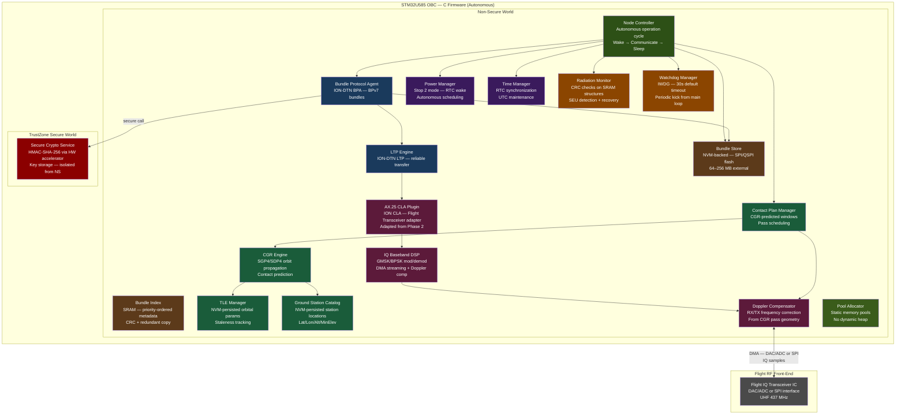
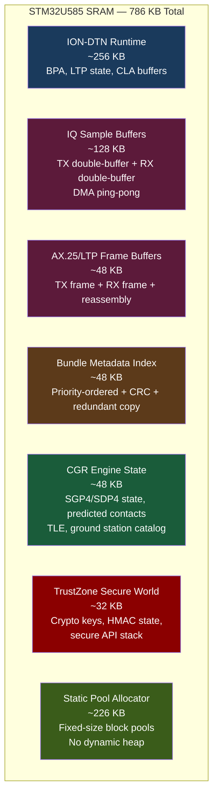
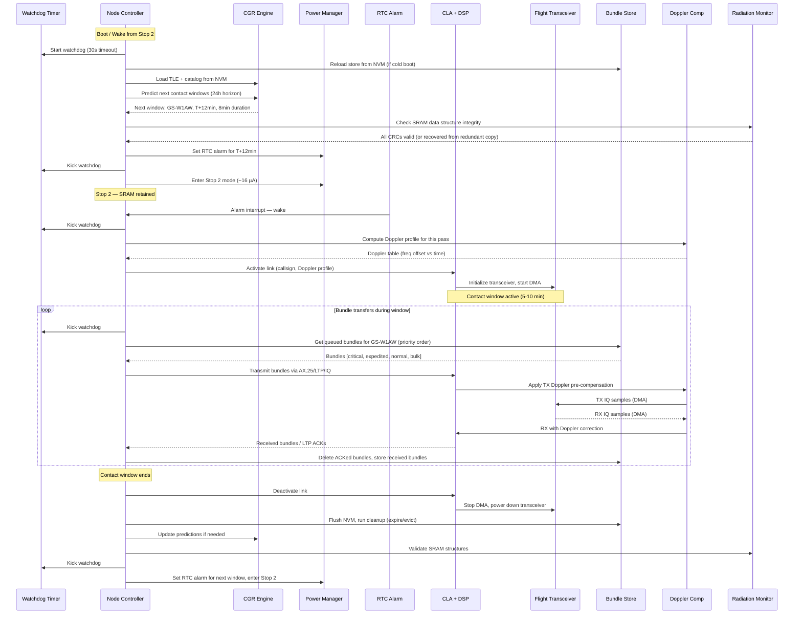
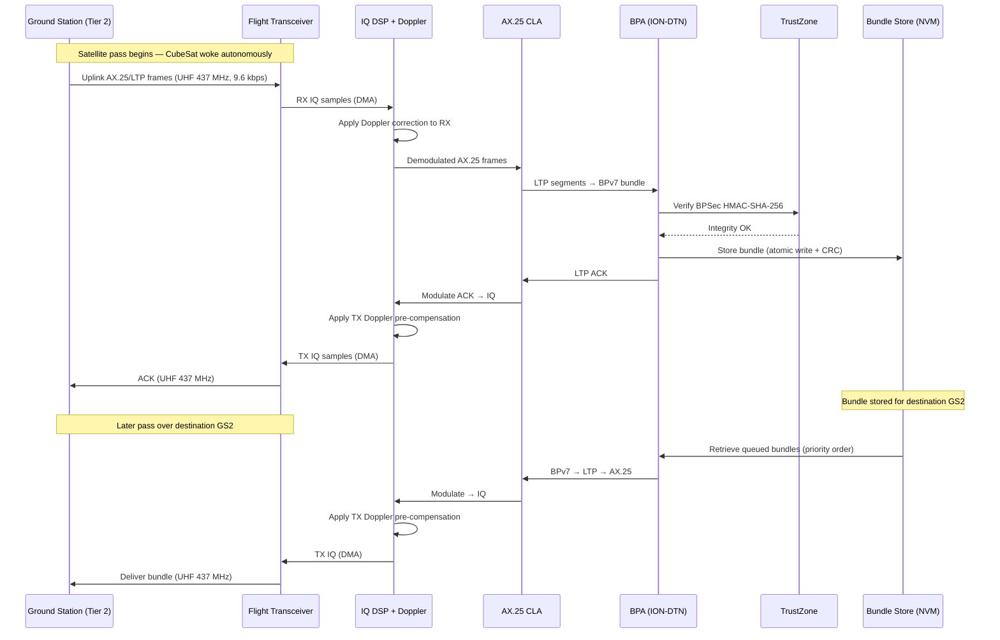
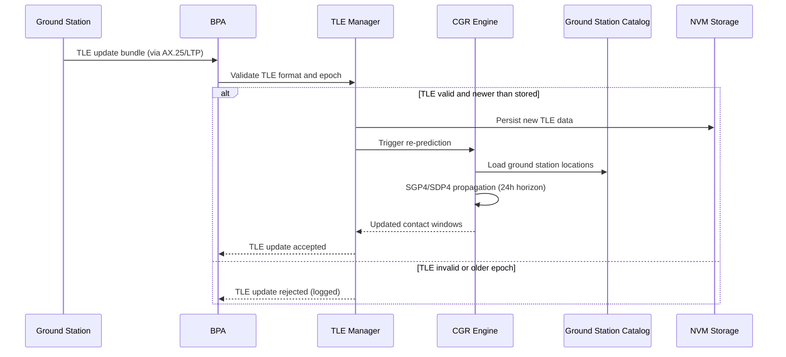
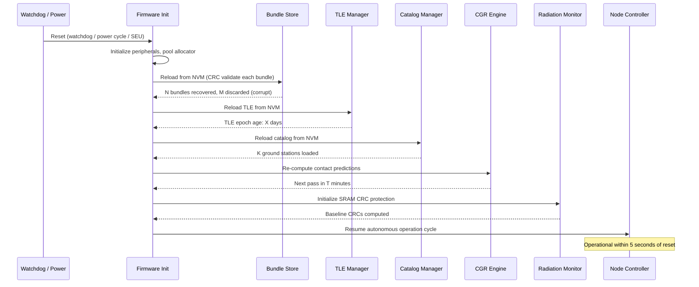

# Design Document: LEO CubeSat Flight (Phase 3)

## Overview

This design describes the Phase 3 LEO CubeSat Flight system — the orbital deployment of the DTN flight unit validated in Phase 2. The STM32U585 OBC runs the complete flight software stack autonomously: ION-DTN (BPv7/LTP over AX.25), IQ baseband DSP, NVM bundle store, CGR contact prediction, Doppler compensation, power management, and TrustZone secure crypto. There is no companion host — everything runs on the STM32U585 Cortex-M33 at 160 MHz with 786 KB SRAM and 64–256 MB external SPI/QSPI NVM.

The key architectural changes from Phase 2 are:

1. **No companion host**: The Go Node Controller, IQ Bridge, and B200mini SDR are eliminated. The STM32U585 runs the Node Controller in C firmware, and the CLA interfaces directly with the flight-qualified IQ transceiver IC via DAC/ADC or SPI.
2. **CGR contact prediction**: The CubeSat autonomously predicts ground station passes using ION-DTN's CGR module with SGP4/SDP4 orbit propagation from onboard TLE data. Phase 2 used manually configured simulated passes from the Go Node Controller.
3. **Doppler compensation**: The firmware computes and applies Doppler frequency correction based on predicted pass geometry. Phase 2 operated at fixed frequency in a lab environment.
4. **Ground station catalog**: An onboard NVM-persisted catalog of ground station locations (lat/lon/alt/min-elevation) feeds the CGR engine for pass prediction.
5. **TLE management**: Onboard TLE persistence, validation, staleness tracking, and ground-uploadable updates.
6. **Radiation mitigation**: CRC protection and redundant copies for critical SRAM data structures, radiation event counting.
7. **Onboard time management**: RTC synchronization from ground station time bundles.
8. **Hardware watchdog**: Configurable watchdog timer for firmware hang detection and automatic reset.

The system operates at UHF 437 MHz / 9.6 kbps (GMSK/BPSK). Contact windows are 5–10 minutes per pass, 4–6 passes per day per ground station. Power budget is 5–10 W active, ~16 µA in Stop 2 mode between passes. The system supports ping and store-and-forward. No relay.

Phase 2 components carried forward unchanged: ION-DTN BPA (BPv7 creation/validation/serialization), NVM Bundle Store (atomic writes, priority index, eviction), AX.25 CLA plugin architecture, IQ baseband DSP (GFSK/G3RUH modulation/demodulation core), TrustZone secure crypto (HMAC-SHA-256), pool allocator, BPSec integrity, rate limiting, bundle size limits, priority ordering.

### Scope Boundaries

**In scope**: Flight transceiver direct IQ interface (replacing B200mini + companion host), autonomous CGR contact prediction (SGP4/SDP4), Doppler compensation, ground station catalog management, TLE persistence and updates, radiation mitigation (CRC + redundant copies on SRAM structures), onboard time management (RTC sync), hardware watchdog, autonomous operation cycle (wake/communicate/sleep), all Phase 2 firmware components adapted for standalone operation.

**Out of scope**: S-band / X-band (Phase 4), cislunar distances (Phase 4), LDPC/Turbo FEC (Phase 4), relay functionality, companion host, B200mini SDR.

## Architecture



### SRAM Memory Layout (786 KB)



## Sequence Diagrams

### Autonomous Operation Cycle



### Ground-to-LEO Store-and-Forward



### TLE Update and CGR Re-prediction



### Fault Recovery After Reset



## Components and Interfaces

Components carried forward from Phase 2 with minimal changes are noted as such. New Phase 3 components are described in full.

### Component 1: Bundle Protocol Agent (BPA) — STM32U585 C Firmware

**Carried from Phase 2.** Identical interface and behavior. Creates, validates, serializes/deserializes BPv7 bundles. Handles ping request/response. Delegates HMAC-SHA-256 to TrustZone. Pool-allocated. No relay.

The only Phase 3 change: the BPA now also handles TLE update bundles, time synchronization bundles, catalog update bundles, and telemetry request bundles as administrative bundle types routed to the appropriate subsystem handler.

**Interface**: Same as Phase 2 `bpa_*` functions (see Phase 2 design). Additional administrative bundle dispatch:

```c
/* Administrative bundle types (Phase 3) */
typedef enum {
    ADMIN_BUNDLE_TLE_UPDATE       = 0x10,
    ADMIN_BUNDLE_CATALOG_UPDATE   = 0x11,
    ADMIN_BUNDLE_TIME_SYNC        = 0x12,
    ADMIN_BUNDLE_TELEMETRY_REQ    = 0x13,
    ADMIN_BUNDLE_KEY_UPDATE       = 0x14
} admin_bundle_type_t;

/* Dispatch an administrative bundle to the appropriate handler.
 * Returns BPA_OK if handled, error if unrecognized or invalid. */
bpa_error_t bpa_dispatch_admin(const bundle_t *b, uint64_t current_time);
```

### Component 2: NVM Bundle Store — STM32U585 C Firmware

**Carried from Phase 2.** Identical interface: `store_init`, `store_put`, `store_get`, `store_delete`, `store_list_by_priority`, `store_list_by_destination`, `store_capacity`, `store_evict_expired`, `store_evict_lowest`, `store_reload`, `store_flush`.

Phase 3 addition: the SRAM bundle metadata index is now protected with CRC and a redundant copy for radiation mitigation (see Radiation Monitor component).

### Component 3: CGR Engine — STM32U585 C Firmware (NEW)

**Purpose**: Computes predicted contact windows between the CubeSat and ground stations using SGP4/SDP4 orbit propagation from onboard TLE data. Runs entirely on the STM32U585 within the 786 KB SRAM budget. Used exclusively for contact prediction / pass scheduling — not for multi-hop relay routing.

**Interface** (C — STM32U585 firmware):
```c
#include <stdint.h>

/* --- Two-Line Element Set --- */
typedef struct {
    char     line1[70];          /* TLE line 1 (69 chars + null) */
    char     line2[70];          /* TLE line 2 (69 chars + null) */
    uint64_t epoch_unix;         /* TLE epoch as Unix timestamp */
    double   inclination_deg;    /* parsed: orbital inclination */
    double   raan_deg;           /* parsed: right ascension ascending node */
    double   eccentricity;       /* parsed: eccentricity */
    double   arg_perigee_deg;    /* parsed: argument of perigee */
    double   mean_anomaly_deg;   /* parsed: mean anomaly */
    double   mean_motion_rev_day;/* parsed: mean motion (revs/day) */
    uint32_t crc32;              /* CRC of TLE data for NVM integrity */
} tle_data_t;

/* --- Ground Station Entry --- */
typedef struct {
    char     callsign[10];       /* station callsign identifier */
    double   latitude_deg;       /* geodetic latitude */
    double   longitude_deg;      /* geodetic longitude */
    double   altitude_m;         /* altitude above WGS84 */
    double   min_elevation_deg;  /* minimum elevation for valid contact */
    uint32_t crc32;              /* CRC for NVM integrity */
} ground_station_t;

/* --- Predicted Contact Window --- */
typedef struct {
    uint8_t  station_index;      /* index into ground station catalog */
    uint64_t start_time;         /* epoch seconds (UTC) */
    uint64_t end_time;           /* epoch seconds (UTC) */
    double   max_elevation_deg;  /* peak elevation during pass */
    double   doppler_max_hz;     /* max Doppler shift at 437 MHz */
    double   doppler_rate_hz_s;  /* max Doppler rate (Hz/s) */
} predicted_contact_t;

/* --- CGR Engine Interface --- */

/* Initialize CGR engine. Allocates state from pool. */
bpa_error_t cgr_init(void);

/* Load TLE data. Parses and validates TLE lines.
 * Returns BPA_OK or error if format invalid. */
bpa_error_t cgr_load_tle(const tle_data_t *tle);

/* Get current TLE data. */
const tle_data_t *cgr_get_tle(void);

/* Get TLE age in seconds relative to current_time. */
uint64_t cgr_tle_age(uint64_t current_time);

/* Load ground station catalog (up to max_stations entries).
 * Returns number of stations loaded. */
uint32_t cgr_load_catalog(const ground_station_t *stations,
                          uint32_t count);

/* Add or update a single ground station entry.
 * Returns index in catalog, or -1 if catalog full. */
int32_t cgr_update_station(const ground_station_t *station);

/* Get ground station catalog size. */
uint32_t cgr_catalog_size(void);

/* Predict contact windows from from_time to to_time.
 * Writes up to max_contacts predicted contacts into out array.
 * Returns number of predicted contacts. */
uint32_t cgr_predict_contacts(uint64_t from_time, uint64_t to_time,
                              predicted_contact_t *out,
                              uint32_t max_contacts);

/* Get the next predicted contact with a specific station.
 * Returns 1 if found, 0 if no future contact predicted. */
int cgr_next_contact_for_station(uint8_t station_index,
                                 uint64_t after_time,
                                 predicted_contact_t *out);

/* Get the next predicted contact with any station.
 * Returns 1 if found, 0 if no future contacts. */
int cgr_next_contact_any(uint64_t after_time,
                         predicted_contact_t *out);

/* Compute satellite position (ECI) at a given time using SGP4/SDP4.
 * Returns position (km) and velocity (km/s) in ECI frame. */
bpa_error_t cgr_propagate(uint64_t time_unix,
                          double pos_eci_km[3],
                          double vel_eci_km_s[3]);

/* Get CGR engine memory usage (bytes). */
uint32_t cgr_get_memory_usage(void);
```

**Responsibilities**:
- Parse and validate TLE two-line element sets
- SGP4/SDP4 orbit propagation to compute satellite position/velocity at arbitrary times
- Compute line-of-sight windows between satellite and ground stations (elevation angle check)
- Predict pass start/end times, maximum elevation, Doppler shift for each pass
- Maintain 24-hour prediction horizon
- Filter passes by minimum elevation angle (configurable, default 5°)
- Re-predict when TLE is updated or catalog changes
- All computation within pool-allocated SRAM (~48 KB budget)
- No multi-hop routing — contact prediction only

### Component 4: Doppler Compensator — STM32U585 C Firmware (NEW)

**Purpose**: Computes and applies Doppler frequency correction to RX and TX IQ baseband processing based on predicted pass geometry from the CGR engine. Tracks the Doppler profile throughout each pass.

**Interface** (C — STM32U585 firmware):
```c
/* --- Doppler Profile Entry --- */
typedef struct {
    uint64_t time;           /* epoch seconds */
    double   freq_offset_hz; /* Doppler offset at this time */
} doppler_point_t;

/* --- Doppler Compensator Interface --- */

/* Initialize Doppler compensator. */
bpa_error_t doppler_init(void);

/* Load a Doppler profile for an upcoming pass.
 * Profile is a time-series of frequency offsets computed from CGR.
 * Points must be sorted by time. */
bpa_error_t doppler_load_profile(const doppler_point_t *profile,
                                 uint32_t point_count);

/* Get the interpolated Doppler offset at a given time.
 * Linearly interpolates between profile points. */
double doppler_get_offset(uint64_t current_time);

/* Apply Doppler correction to RX IQ samples in-place.
 * Shifts the baseband frequency by the current Doppler offset. */
bpa_error_t doppler_correct_rx(iq_sample_t *samples,
                               uint32_t sample_count,
                               uint64_t sample_time);

/* Apply Doppler pre-compensation to TX IQ samples in-place.
 * Pre-shifts TX frequency so ground station receives at nominal. */
bpa_error_t doppler_correct_tx(iq_sample_t *samples,
                               uint32_t sample_count,
                               uint64_t sample_time);

/* Clear the current Doppler profile (between passes). */
void doppler_clear_profile(void);

/* Get current Doppler tracking status. */
typedef struct {
    double   current_offset_hz;
    double   current_rate_hz_s;
    uint32_t profile_points;
    uint8_t  profile_loaded;
} doppler_status_t;

doppler_status_t doppler_get_status(void);
```

**Responsibilities**:
- Compute Doppler profile from CGR-predicted satellite position/velocity relative to ground station
- Linear interpolation between profile points for smooth frequency tracking
- Apply NCO (numerically controlled oscillator) frequency shift to RX IQ samples
- Apply inverse NCO shift to TX IQ samples (pre-compensation)
- Update at least once per second (requirement 5.5)
- Support ±10 kHz Doppler range at 437 MHz
- Stateless between passes (profile cleared after each contact)

### Component 5: Convergence Layer Adapter (CLA) — STM32U585 C Firmware

**Adapted from Phase 2.** Same ION-DTN CLA plugin architecture. The key change: the CLA now interfaces directly with the flight IQ transceiver IC via STM32U585 DMA → DAC/ADC or SPI, instead of the Phase 2 path through the companion host IQ bridge to the B200mini.

**Interface**: Same as Phase 2 `cla_*` and `ax25iq_*` functions. The `cla_config_t` gains a Doppler profile field:

```c
/* --- CLA Configuration (Phase 3 additions) --- */
typedef struct {
    callsign_t local_callsign;
    uint16_t   max_frame_size;
    uint32_t   iq_sample_rate;
    uint32_t   iq_center_freq_hz;  /* 437000000 */
    uint32_t   data_rate_bps;      /* 9600 */
    uint8_t    use_doppler;        /* 1 = enable Doppler compensation */
} cla_config_phase3_t;

/* Activate link with Doppler profile for the pass. */
bpa_error_t cla_activate_link_doppler(const callsign_t *remote_callsign,
                                      const doppler_point_t *profile,
                                      uint32_t profile_points);
```

**Responsibilities** (additions to Phase 2):
- Direct DMA interface to flight transceiver IC (no companion host bridge)
- Doppler-corrected IQ streaming (delegates to Doppler Compensator)
- GMSK/BPSK modulation/demodulation (replacing Phase 2's GFSK/G3RUH for flight)
- Flight transceiver initialization and power control

### Component 6: IQ Baseband DSP — STM32U585 C Firmware

**Carried from Phase 2.** Same `dsp_*` interface. Phase 3 changes the modulation from GFSK/G3RUH (Phase 2 EM compatibility) to GMSK/BPSK for the flight link. The DMA double-buffered ping-pong architecture is identical. The DSP now integrates with the Doppler Compensator for frequency correction in the sample processing pipeline.

### Component 7: TLE Manager — STM32U585 C Firmware (NEW)

**Purpose**: Manages onboard TLE data lifecycle: validation, persistence to NVM, staleness tracking, and ground-uploadable updates. Provides TLE data to the CGR engine.

**Interface** (C — STM32U585 firmware):
```c
/* --- TLE Manager Interface --- */

/* Initialize TLE manager. Loads TLE from NVM if available. */
bpa_error_t tle_init(void);

/* Update TLE from a received bundle payload.
 * Validates format, checks epoch is newer than stored.
 * Persists to NVM and triggers CGR re-prediction on success. */
bpa_error_t tle_update(const uint8_t *tle_payload, uint32_t len);

/* Get current TLE data (NULL if none loaded). */
const tle_data_t *tle_get_current(void);

/* Get TLE epoch age in seconds. */
uint64_t tle_get_age(uint64_t current_time);

/* Check if TLE is stale (age > threshold). */
int tle_is_stale(uint64_t current_time);

/* Get configured staleness threshold in seconds. */
uint64_t tle_get_stale_threshold(void);

/* Set staleness threshold (default 14 days = 1209600 seconds). */
void tle_set_stale_threshold(uint64_t threshold_sec);

/* Get the contact window margin widening factor for stale TLE.
 * Returns 1.0 if TLE is fresh, >1.0 if stale. */
double tle_get_margin_factor(uint64_t current_time);

/* Persist current TLE to NVM. */
bpa_error_t tle_persist(void);

/* Reload TLE from NVM (after reset). */
bpa_error_t tle_reload(void);
```

**Responsibilities**:
- Validate TLE format (two-line element checksum, field ranges)
- Reject TLE updates with epoch older than currently stored
- Persist TLE to NVM with CRC protection
- Track TLE age and flag staleness warnings (default threshold: 14 days)
- Widen contact window margins when TLE is stale (configurable factor)
- Include TLE epoch age in telemetry
- Reload from NVM after reset

### Component 8: Ground Station Catalog Manager — STM32U585 C Firmware (NEW)

**Purpose**: Manages the onboard catalog of ground station locations used by the CGR engine for pass prediction. Persisted to NVM. Supports ground-uploadable updates.

**Interface** (C — STM32U585 firmware):
```c
/* --- Catalog Manager Interface --- */

/* Initialize catalog. Loads from NVM if available. */
bpa_error_t catalog_init(void);

/* Add or update a ground station entry.
 * Validates fields, persists to NVM, triggers CGR re-prediction
 * for the affected station. Returns station index or error. */
int32_t catalog_add_station(const ground_station_t *station);

/* Get a station by index. Returns NULL if index out of range. */
const ground_station_t *catalog_get_station(uint8_t index);

/* Find a station by callsign. Returns index or -1 if not found. */
int32_t catalog_find_by_callsign(const char *callsign);

/* Get number of stations in catalog. */
uint32_t catalog_count(void);

/* Get maximum catalog capacity. */
uint32_t catalog_max_capacity(void);  /* returns 32 */

/* Persist entire catalog to NVM. */
bpa_error_t catalog_persist(void);

/* Reload catalog from NVM (after reset). */
bpa_error_t catalog_reload(void);
```

**Responsibilities**:
- Store up to 32 ground station entries (callsign, lat, lon, alt, min elevation)
- Validate entry fields (lat ±90°, lon ±180°, altitude ≥ 0, elevation 0–90°)
- Persist to NVM with CRC protection per entry
- Trigger CGR re-prediction when entries change
- Reload from NVM after reset

### Component 9: Node Controller — STM32U585 C Firmware (NEW — replaces Phase 2 Go Node Controller)

**Purpose**: Top-level autonomous orchestrator running on the STM32U585. Manages the complete operation cycle: predict passes → set RTC alarm → sleep → wake → activate transceiver → execute bundle transfers → deactivate → cleanup → repeat. No external control.

**Interface** (C — STM32U585 firmware):
```c
/* --- Node Configuration (Phase 3) --- */
typedef struct {
    node_id_t     node_id;
    callsign_t    local_callsign;
    endpoint_id_t endpoints[4];
    uint8_t       endpoint_count;
    uint32_t      max_nvm_bytes;
    priority_t    default_priority;
    uint32_t      max_bundle_size;
    float         max_bundle_rate;     /* bundles/sec per source */
    uint32_t      watchdog_timeout_ms; /* default 30000 */
    uint64_t      tle_stale_threshold; /* default 1209600 (14 days) */
    uint64_t      time_stale_threshold;/* default 604800 (7 days) */
    double        min_elevation_deg;   /* default 5.0 */
} node_config_phase3_t;

/* --- Node Health (Phase 3) --- */
typedef struct {
    uint64_t uptime_seconds;
    float    nvm_used_percent;
    uint32_t bundles_stored;
    uint32_t bundles_delivered;
    uint32_t bundles_dropped;
    uint64_t last_contact_time;
    /* STM32U585-specific */
    uint32_t sram_used_bytes;
    uint32_t sram_peak_bytes;
    uint8_t  power_state;          /* 0=active, 1=stop2 */
    uint32_t active_time_ms;
    uint32_t stop2_time_ms;
    int16_t  mcu_temp_c10;         /* temperature × 10 */
    /* Phase 3 additions */
    uint64_t tle_epoch_age_sec;
    uint32_t cgr_prediction_horizon_sec;
    uint32_t radiation_seu_count;
    uint64_t last_time_sync;
    uint32_t contacts_completed;
    uint32_t contacts_missed;
} node_health_phase3_t;

/* --- Node Controller Interface --- */

/* Initialize the autonomous node controller. */
bpa_error_t node_init(const node_config_phase3_t *config);

/* Run one complete operation cycle:
 * 1. Check CGR for next contact
 * 2. If contact active: execute bundle transfers
 * 3. Run cleanup (expire, evict)
 * 4. Update CGR predictions if needed
 * 5. Validate SRAM integrity (radiation check)
 * 6. Kick watchdog
 * Returns BPA_OK. Must complete within 1 second. */
bpa_error_t node_run_cycle(uint64_t current_time);

/* Get current node health. */
node_health_phase3_t node_get_health(void);

/* Generate a telemetry bundle for a requesting ground station. */
bpa_error_t node_generate_telemetry(const endpoint_id_t *requester,
                                    bundle_t *out);

/* Cold boot initialization: reload all state from NVM.
 * Must complete within 5 seconds. */
bpa_error_t node_cold_boot(void);

/* Main firmware entry point — runs the autonomous loop. */
void node_main_loop(void);  /* never returns */
```

**Responsibilities**:
- Autonomous operation cycle without external control
- CGR-driven contact scheduling (predict → sleep → wake → communicate → sleep)
- Bundle transfer orchestration during contact windows (priority order)
- Telemetry generation and transmission
- Administrative bundle dispatch (TLE updates, catalog updates, time sync, key updates)
- Watchdog kick in main loop
- Cold boot state restoration from NVM within 5 seconds
- Operation cycle completion within 1 second

### Component 10: Time Manager — STM32U585 C Firmware (NEW)

**Purpose**: Maintains accurate onboard UTC time using the STM32U585 RTC. Supports synchronization from ground station time bundles. Tracks time since last sync and flags staleness.

**Interface** (C — STM32U585 firmware):
```c
/* --- Time Manager Interface --- */

/* Initialize time manager. Reads RTC. */
bpa_error_t time_init(void);

/* Get current UTC time (epoch seconds). */
uint64_t time_now(void);

/* Synchronize RTC to received UTC time.
 * Only applies if correction exceeds threshold (default 1 second).
 * Returns 1 if RTC was updated, 0 if within threshold. */
int time_sync(uint64_t utc_time);

/* Get seconds since last synchronization. */
uint64_t time_since_last_sync(void);

/* Check if time is stale (no sync for > threshold). */
int time_is_stale(void);

/* Get/set sync threshold in seconds (default 1). */
uint64_t time_get_sync_threshold(void);
void time_set_sync_threshold(uint64_t threshold_sec);

/* Get/set staleness threshold in seconds (default 7 days). */
uint64_t time_get_stale_threshold(void);
void time_set_stale_threshold(uint64_t threshold_sec);
```

### Component 11: Radiation Monitor — STM32U585 C Firmware (NEW)

**Purpose**: Protects critical SRAM data structures against radiation-induced single-event upsets (SEUs). Maintains CRC checksums and redundant copies of critical structures. Detects and recovers from bit flips.

**Interface** (C — STM32U585 firmware):
```c
/* --- Protected Region --- */
typedef struct {
    void    *primary;        /* pointer to primary copy */
    void    *redundant;      /* pointer to redundant copy */
    uint32_t size;           /* size in bytes */
    uint32_t crc_primary;    /* CRC of primary copy */
    uint32_t crc_redundant;  /* CRC of redundant copy */
    const char *name;        /* region name for logging */
} protected_region_t;

/* --- Radiation Monitor Interface --- */

/* Initialize radiation monitor. */
bpa_error_t rad_init(void);

/* Register a critical SRAM region for protection.
 * Computes initial CRC and creates redundant copy.
 * Returns region index or -1 if max regions exceeded. */
int32_t rad_register_region(void *data, void *redundant_buf,
                            uint32_t size, const char *name);

/* Update CRC and redundant copy after legitimate modification.
 * Must be called after any write to a protected region. */
bpa_error_t rad_update_region(int32_t region_index);

/* Validate all registered regions.
 * Returns number of errors detected and corrected.
 * Recovers from redundant copy if primary CRC fails.
 * Recovers from primary if redundant CRC fails.
 * Logs unrecoverable errors (both copies corrupted). */
uint32_t rad_validate_all(void);

/* Get cumulative SEU count. */
uint32_t rad_get_seu_count(void);

/* Validate NVM data integrity (CRC check on read). */
bpa_error_t rad_validate_nvm_read(const uint8_t *data, uint32_t len,
                                  uint32_t expected_crc);
```

**Responsibilities**:
- Register critical SRAM regions: bundle metadata index, CGR state, contact plan, TLE data
- Maintain CRC-32 and redundant copy for each registered region
- Periodic validation (called each operation cycle)
- Single-copy corruption: recover from the intact copy
- Both-copies corruption: reload from NVM if possible, log unrecoverable error
- Track SEU count for telemetry
- CRC validation on all NVM reads

### Component 12: Watchdog Manager — STM32U585 C Firmware (NEW)

**Purpose**: Manages the STM32U585 independent watchdog timer (IWDG) to detect firmware hangs and trigger automatic reset.

**Interface** (C — STM32U585 firmware):
```c
/* Initialize and start the hardware watchdog.
 * timeout_ms: watchdog timeout (default 30000 ms). */
bpa_error_t wdt_init(uint32_t timeout_ms);

/* Kick (refresh) the watchdog. Must be called periodically
 * from the main loop before timeout expires. */
void wdt_kick(void);

/* Check if last reset was caused by watchdog. */
int wdt_was_reset_cause(void);
```

### Component 13: TrustZone Secure Crypto Service — STM32U585 C Firmware

**Carried from Phase 2.** Identical interface: `secure_hmac_sign`, `secure_hmac_verify`, `secure_provision_key`, `secure_get_key_count`. Phase 3 adds support for receiving key update bundles during ground passes (dispatched via `bpa_dispatch_admin`).

### Component 14: Power Manager — STM32U585 C Firmware

**Carried from Phase 2.** Same `power_*` interface. Phase 3 change: the power manager now receives wake times from the CGR-predicted contact plan (autonomous) instead of from UART commands from the companion host.

### Component 15: Static Memory Pool Allocator — STM32U585 C Firmware

**Carried from Phase 2.** Identical interface: `pool_init`, `pool_alloc`, `pool_free`, `pool_stats`, `pool_total_used_bytes`, `pool_peak_used_bytes`. Phase 3 adds a `POOL_CGR_STATE` pool ID for CGR engine allocations.

```c
/* Additional pool ID for Phase 3 */
typedef enum {
    POOL_BUNDLE_PAYLOAD = 0,
    POOL_IQ_BUFFER      = 1,
    POOL_FRAME_BUFFER   = 2,
    POOL_INDEX_ENTRY    = 3,
    POOL_GENERAL        = 4,
    POOL_CGR_STATE      = 5,  /* CGR engine: TLE, catalog, predicted contacts */
    POOL_COUNT          = 6
} pool_id_t;
```

## Data Models

### Phase 2 Data Models Carried Forward

The following data models from Phase 2 are carried forward unchanged:
- `endpoint_id_t`, `bundle_id_t`, `priority_t`, `bundle_type_t`, `bundle_t` — BPA bundle representation
- `primary_block_t`, `canonical_block_t` — BPv7 wire format structures
- `nvm_header_t`, `nvm_bundle_entry_t` — NVM storage layout
- `bpsec_bib_t` — BPSec integrity block
- `rate_limiter_entry_t`, `rate_limiter_config_t` — rate limiting state
- `iq_sample_t`, `dsp_config_t` — IQ DSP types
- `callsign_t` — AX.25 callsign
- `link_metrics_t` — CLA link metrics
- `power_state_t`, `power_metrics_t` — power management
- `pool_id_t`, `pool_stats_t` — pool allocator

### TLE NVM Layout (NEW)

```c
/* TLE stored in a dedicated NVM sector for fast reload. */
typedef struct {
    uint32_t   magic;          /* 0x544C4530 ("TLE0") */
    tle_data_t tle;            /* current TLE data */
    uint64_t   received_at;    /* when this TLE was received */
    uint32_t   update_count;   /* number of TLE updates received */
    uint32_t   crc32;          /* CRC of all preceding fields */
} nvm_tle_sector_t;
```

**Validation Rules**:
- `magic` must equal `0x544C4530`
- `tle.epoch_unix` must be > 0 and ≤ current time
- TLE line checksums must validate (modulo-10 checksum per TLE spec)
- `crc32` must match computed CRC of preceding fields
- On update: new TLE epoch must be newer than stored epoch

### Ground Station Catalog NVM Layout (NEW)

```c
/* Catalog stored in a dedicated NVM region. */
typedef struct {
    uint32_t        magic;           /* 0x47534330 ("GSC0") */
    uint32_t        station_count;
    ground_station_t stations[32];   /* max 32 stations */
    uint32_t        crc32;           /* CRC of all preceding fields */
} nvm_catalog_sector_t;
```

**Validation Rules**:
- `magic` must equal `0x47534330`
- `station_count` must be ≤ 32
- Each station: latitude ∈ [-90, 90], longitude ∈ [-180, 180], altitude ≥ 0, min_elevation ∈ [0, 90]
- Each station callsign must be non-empty
- `crc32` must match computed CRC

### Predicted Contact Plan (SRAM — NEW)

```c
/* In-SRAM contact plan populated by CGR engine.
 * Protected by radiation monitor (CRC + redundant copy). */
typedef struct {
    predicted_contact_t contacts[128]; /* max 128 predicted contacts */
    uint32_t            contact_count;
    uint64_t            computed_at;   /* when predictions were computed */
    uint64_t            horizon_end;   /* end of prediction horizon */
    uint32_t            crc32;         /* CRC for radiation protection */
} contact_plan_sram_t;
```

### Telemetry Response (Phase 3 — NEW)

```c
/* Telemetry payload for Phase 3 (superset of Phase 2). */
typedef struct {
    /* Phase 2 fields */
    uint32_t sram_used_bytes;
    uint32_t sram_peak_bytes;
    uint32_t sram_ion_bytes;
    uint32_t sram_iq_bytes;
    uint32_t sram_idx_bytes;
    uint32_t sram_tz_bytes;
    uint8_t  power_state;
    uint32_t active_time_ms;
    uint32_t stop2_time_ms;
    int16_t  mcu_temp_c10;
    int16_t  iq_snr_db10;
    uint32_t iq_ber_e6;
    uint32_t wake_latency_us;
    uint32_t nvm_used_bytes;
    uint32_t nvm_bundle_count;
    uint32_t bundles_delivered;
    uint32_t bundles_dropped;
    /* Phase 3 additions */
    uint32_t sram_cgr_bytes;        /* CGR engine SRAM usage */
    uint64_t tle_epoch_age_sec;     /* age of current TLE */
    uint32_t cgr_horizon_sec;       /* prediction horizon remaining */
    uint32_t catalog_station_count; /* ground stations in catalog */
    uint32_t radiation_seu_count;   /* detected SEUs */
    uint64_t last_time_sync;        /* last RTC sync timestamp */
    uint32_t contacts_completed;
    uint32_t contacts_missed;
    double   doppler_current_hz;    /* current Doppler offset */
    uint32_t uptime_seconds;
    uint64_t total_bundles_received;
    uint64_t total_bundles_sent;
    uint64_t total_bytes_received;
    uint64_t total_bytes_sent;
} telemetry_phase3_t;
```

### Contact Execution Metrics (NEW)

```c
/* Per-contact metrics recorded after each pass. */
typedef struct {
    uint8_t  station_index;
    uint64_t start_time;
    uint64_t end_time;
    uint32_t bundles_sent;
    uint32_t bundles_received;
    uint64_t bytes_transferred;
    int16_t  avg_snr_db10;
    uint32_t avg_ber_e6;
    double   doppler_tracking_error_hz; /* max deviation from predicted */
    uint8_t  contact_successful;        /* 1=completed, 0=missed/failed */
} contact_metrics_t;
```

## Correctness Properties

*A property is a characteristic or behavior that should hold true across all valid executions of a system — essentially, a formal statement about what the system should do. Properties serve as the bridge between human-readable specifications and machine-verifiable correctness guarantees.*

The following properties cover both Phase 2 carry-forward properties (adapted for Phase 3's standalone architecture) and new Phase 3 properties for CGR, Doppler, TLE management, radiation mitigation, and autonomous operation.

### Property 1: Bundle Serialization Round-Trip

*For any* valid BPv7 Bundle, serializing it to the CBOR wire format and then deserializing the wire format back SHALL produce a Bundle equivalent to the original.

**Validates: Requirements 6.5**

### Property 2: Bundle Creation and Validation Correctness

*For any* valid destination EndpointID, payload, priority level, and positive lifetime, the BPA SHALL create a BPv7 bundle with version equal to 7, the specified source and destination EndpointIDs, a valid CRC, the specified priority, and the specified lifetime. Conversely, for any bundle, the BPA validation function SHALL accept the bundle if and only if its version equals 7, its destination is a well-formed EndpointID, its lifetime is greater than zero, its creation timestamp does not exceed the current time, and its CRC is correct — rejecting all others with a specific error code.

**Validates: Requirements 6.1, 6.2, 6.3**

### Property 3: Bundle Store/Retrieve Round-Trip

*For any* valid Bundle, storing it in the NVM-backed Bundle Store and then retrieving it by its BundleID (source EndpointID, creation timestamp, sequence number) SHALL produce a Bundle identical to the original.

**Validates: Requirements 7.1, 7.2**

### Property 4: Priority Ordering Invariant

*For any* set of bundles in the Bundle Store, listing them by priority or transmitting them during a contact window SHALL produce a sequence where each bundle's priority is greater than or equal to the next bundle's priority (critical > expedited > normal > bulk).

**Validates: Requirements 7.3, 10.3, 13.2, 18.2**

### Property 5: Eviction Policy Ordering

*For any* Bundle Store at NVM capacity, when eviction is triggered, expired bundles SHALL be evicted first, then bundles in ascending priority order (bulk before normal before expedited), and critical-priority bundles SHALL be preserved until all lower-priority bundles have been evicted. Within the same priority level, bundles with the earliest creation timestamp SHALL be evicted first.

**Validates: Requirements 7.4, 7.5, 18.3**

### Property 6: Store Capacity Bound

*For any* sequence of store and delete operations on the NVM-backed Bundle Store, the total stored bytes SHALL never exceed the configured maximum NVM capacity. If the store is full of critical bundles and eviction cannot free space, the incoming bundle SHALL be rejected.

**Validates: Requirements 7.6, 21.1**

### Property 7: Store Reload with CRC Validation

*For any* set of bundles persisted to NVM, after a simulated reset and reload, the Bundle Store SHALL recover all bundles whose NVM CRC is valid and discard all bundles whose NVM CRC is invalid, with each discarded bundle ID logged.

**Validates: Requirements 7.7, 7.8, 21.3**

### Property 8: Bundle Lifetime Enforcement

*For any* set of bundles in the Bundle Store after a cleanup cycle completes, zero bundles SHALL have a creation timestamp plus lifetime less than or equal to the current time.

**Validates: Requirements 8.1, 8.2**

### Property 9: Ping Echo Correctness

*For any* ping request bundle received by the BPA addressed to a local endpoint, exactly one ping response bundle SHALL be generated with its destination set to the original sender's EndpointID and the original request's BundleID included in the response payload.

**Validates: Requirements 9.1, 9.4**

### Property 10: Local vs Remote Delivery Routing

*For any* received data bundle, if the bundle's destination matches a local EndpointID, the BPA SHALL deliver it to the local application agent. If the destination is a remote EndpointID, the BPA SHALL store it in the NVM-backed Bundle Store for direct delivery during the next contact window with the destination node.

**Validates: Requirements 10.1, 10.2**

### Property 11: ACK Deletes, No-ACK Retains

*For any* bundle transmitted during a contact window, if the remote node acknowledges receipt via LTP, the bundle SHALL be deleted from the NVM Bundle Store. If the transmission is not acknowledged within the LTP retransmission timeout, the bundle SHALL remain in the Bundle Store for retry during the next contact window.

**Validates: Requirements 10.4, 10.5**

### Property 12: Bundle Retention When No Contact Available

*For any* bundle whose destination has no direct contact window in the current contact plan, the NVM Bundle Store SHALL retain the bundle until a contact window with that destination is added to the plan or the bundle's lifetime expires.

**Validates: Requirements 10.6, 21.5**

### Property 13: No Relay — Direct Delivery Only

*For any* bundle transmitted during any contact window, the contact's remote node SHALL match the bundle's final destination EndpointID. No bundle SHALL be forwarded on behalf of other nodes, and all contact lookups SHALL return single-hop direct contacts only.

**Validates: Requirements 11.1, 11.2**

### Property 14: End-to-End Radio Path Round-Trip

*For any* valid Bundle, encapsulating it into AX.25/LTP frames, modulating to IQ baseband samples (GMSK/BPSK), demodulating the IQ samples back, and reassembling the frames into a bundle SHALL produce a Bundle equivalent to the original. This validates the complete flight transceiver DSP path.

**Validates: Requirements 1.7, 12.5**

### Property 15: AX.25 Callsign Framing

*For any* bundle transmitted through the CLA, the output AX.25 frame SHALL carry a valid source amateur radio callsign and a valid destination amateur radio callsign.

**Validates: Requirements 12.1**

### Property 16: LTP Segmentation/Reassembly Round-Trip

*For any* valid bundle whose serialized size exceeds a single AX.25 frame, LTP segmentation into multiple AX.25 frames and subsequent reassembly SHALL produce a bundle equivalent to the original.

**Validates: Requirements 12.3**

### Property 17: No Transmission After Window End

*For any* contact window and transmission sequence, no bundle transmission SHALL occur after the contact window's end time has been reached.

**Validates: Requirements 13.3**

### Property 18: Missed Contact Retains Bundles

*For any* scheduled contact window where the CLA fails to establish the IQ baseband link (including after 3 transceiver reinitialization attempts), all bundles queued for that contact's destination SHALL remain in the NVM Bundle Store, and the contacts-missed counter SHALL be incremented by exactly one.

**Validates: Requirements 13.6, 21.4**

### Property 19: BPSec Integrity Round-Trip

*For any* valid Bundle and HMAC-SHA-256 key provisioned in TrustZone, applying a BPSec Block Integrity Block via the hardware crypto accelerator and then verifying the integrity SHALL succeed. If any byte of the bundle is modified after integrity is applied, verification SHALL fail.

**Validates: Requirements 14.1, 14.4**

### Property 20: No Encryption Constraint

*For any* bundle processed by the BPA, no BPSec Block Confidentiality Block (BCB) or any form of payload encryption SHALL be present in the output.

**Validates: Requirements 14.2**

### Property 21: Sleep Decision Correctness

*For any* system state, the firmware SHALL enter Stop 2 mode if and only if no contact window is currently active, no bundle processing is pending, and no further contact window is predicted within the next 60 seconds. Before entering Stop 2, the RTC alarm SHALL be set to the start time of the next predicted contact window.

**Validates: Requirements 13.5, 16.1, 16.5**

### Property 22: Power State Transition Logging

*For any* power state transition (active → Stop 2 or Stop 2 → active), the firmware SHALL log the transition with a timestamp and the from/to states, and the cumulative time in each state SHALL be updated correctly.

**Validates: Requirements 16.4**

### Property 23: Pool Exhaustion Safety

*For any* memory pool on the STM32U585, when the pool is exhausted, `pool_alloc` SHALL return NULL and the requesting operation SHALL be rejected with `BPA_ERR_POOL_EXHAUSTED` without corrupting any existing data or adjacent memory regions.

**Validates: Requirements 17.4**

### Property 24: Rate Limiting

*For any* sequence of bundle submissions from a single source EndpointID, if the submission rate exceeds the configured maximum bundles per second, the BPA SHALL reject bundles beyond the rate limit while accepting bundles within the limit.

**Validates: Requirements 19.1, 19.2**

### Property 25: Bundle Size Limit

*For any* bundle whose total serialized size exceeds the configured maximum bundle size, the BPA SHALL reject the bundle.

**Validates: Requirements 19.3**

### Property 26: Statistics Monotonicity

*For any* sequence of node operations, the cumulative statistics (total bundles received, total bundles sent, total bytes received, total bytes sent, contacts completed, contacts missed) SHALL be monotonically non-decreasing.

**Validates: Requirements 20.2**

### Property 27: CGR Prediction Invariants

*For any* valid TLE data and ground station catalog, the CGR engine's predicted contact windows SHALL satisfy: (a) each contact has start_time < end_time, (b) each contact's max_elevation_deg is ≥ the station's configured minimum elevation angle, (c) each contact's Doppler shift is within ±10 kHz at 437 MHz, (d) the prediction horizon extends at least 24 hours from the prediction start time, and (e) all contacts are direct satellite-to-ground-station windows with no multi-hop paths.

**Validates: Requirements 2.1, 2.3, 2.5, 2.6, 2.8**

### Property 28: TLE Update Validation

*For any* TLE data received via a DTN bundle, the TLE manager SHALL accept the update if and only if the TLE format is valid (correct checksums, valid field ranges) and the TLE epoch is newer than the currently stored TLE epoch. Accepted TLEs SHALL be persisted to NVM and trigger CGR re-prediction. Rejected TLEs SHALL be logged with the rejection reason.

**Validates: Requirements 3.1, 3.3**

### Property 29: TLE NVM Round-Trip

*For any* valid TLE data, persisting it to NVM and then reloading it SHALL produce TLE data identical to the original.

**Validates: Requirements 3.2**

### Property 30: TLE Staleness Tracking

*For any* TLE data with a known epoch and any current time, the reported TLE age SHALL equal current_time minus the TLE epoch. If the TLE age exceeds the configured staleness threshold (default 14 days), the stale flag SHALL be set and the contact window margin factor SHALL be greater than 1.0.

**Validates: Requirements 3.4, 3.5**

### Property 31: Ground Station Catalog NVM Round-Trip

*For any* set of valid ground station entries (up to 32), persisting the catalog to NVM and then reloading it SHALL produce a catalog identical to the original, with all fields (callsign, latitude, longitude, altitude, minimum elevation) preserved.

**Validates: Requirements 4.1, 4.4**

### Property 32: Doppler Computation Bounds

*For any* satellite position/velocity (from SGP4/SDP4 propagation) and ground station location, the computed Doppler shift at 437 MHz SHALL be within ±10 kHz and SHALL be consistent with the relative radial velocity between the satellite and ground station (Doppler_Hz ≈ -f_carrier × v_radial / c).

**Validates: Requirements 5.1, 5.4**

### Property 33: Doppler Correction Round-Trip

*For any* IQ sample sequence and any Doppler frequency offset within ±10 kHz, applying the Doppler offset to the samples and then applying Doppler correction with the same offset SHALL produce samples equivalent to the original (within numerical precision). Similarly, applying TX pre-compensation and then simulating the inverse propagation Doppler SHALL produce samples at the nominal frequency.

**Validates: Requirements 5.2, 5.3**

### Property 34: SRAM Radiation Protection

*For any* critical SRAM data structure registered with the radiation monitor, if a single bit is flipped in the primary copy, the CRC check SHALL detect the corruption, the system SHALL recover the data from the redundant copy, and the SEU counter SHALL be incremented. If both copies are corrupted, the system SHALL attempt NVM reload and log an unrecoverable error.

**Validates: Requirements 22.1, 22.2, 22.4**

### Property 35: NVM Read CRC Validation

*For any* NVM data read operation, the radiation monitor SHALL validate the CRC. If the CRC does not match the data, the read SHALL be flagged as corrupted.

**Validates: Requirements 22.3**

### Property 36: Time Synchronization Threshold

*For any* time synchronization bundle received from a ground station, the RTC SHALL be updated if and only if the absolute correction exceeds the configured threshold (default 1 second). If the RTC has not been synchronized for more than the configured staleness period (default 7 days), the time-stale warning flag SHALL be set.

**Validates: Requirements 23.2, 23.4**

### Property 37: Reset Recovery Completeness

*For any* pre-reset system state (bundles in NVM, TLE data, ground station catalog, contact statistics), after a reset the firmware SHALL reload all persisted state from NVM, re-compute CGR contact predictions, and resume the autonomous operation cycle with the recovered state.

**Validates: Requirements 21.3, 24.4**

## Error Handling

### Error Scenario 1: NVM Store Full

**Condition**: NVM Bundle Store reaches configured maximum capacity when a new bundle arrives.
**Response**: Invoke eviction policy — remove expired bundles first, then lowest-priority bundles (bulk → normal → expedited). Critical bundles evicted only as last resort.
**Recovery**: If eviction frees sufficient space, store the new bundle. If not (e.g., store is full of critical bundles), reject the incoming bundle and return `BPA_ERR_POOL_EXHAUSTED`. If the LTP session is still active, signal the error to the sender. Log the event in telemetry.

### Error Scenario 2: Contact Window Missed (Transceiver Failure)

**Condition**: Flight transceiver IC does not respond during a scheduled contact window.
**Response**: Firmware attempts to reinitialize the transceiver up to 3 times at 1-second intervals. If all attempts fail: mark the contact as missed, retain all queued bundles in NVM, increment `contacts_missed` counter, enter Stop 2 mode until the next predicted contact window.
**Recovery**: Bundles remain in NVM store for delivery during the next contact. Transceiver reinitialized on next wake cycle.

### Error Scenario 3: Bundle Corruption (CRC Failure)

**Condition**: CRC validation fails on a received bundle (from RF) or on a stored bundle (from NVM).
**Response**: Discard the corrupted bundle. Log the corruption event with source EndpointID and IQ link metrics (RSSI, SNR, BER).
**Recovery**: For RF-received bundles: the sender retains the bundle (LTP will not receive an ACK) and retransmits during the next contact. For NVM-stored bundles: the corrupted entry is discarded during store reload.

### Error Scenario 4: BPSec Integrity Failure

**Condition**: HMAC-SHA-256 verification fails on a received bundle's BPSec BIB.
**Response**: Discard the bundle. Return `BPA_ERR_INTEGRITY_FAIL`. Log the integrity failure with source EndpointID.
**Recovery**: The sender retains the bundle for retransmission. Ground operators investigate potential key mismatch.

### Error Scenario 5: Power Cycle / Watchdog Reset / Radiation-Induced Reset

**Condition**: STM32U585 experiences unexpected power loss, watchdog timeout, or radiation-induced reset.
**Response**: On restart, firmware re-initializes all subsystems. Bundle Store reloads from NVM (CRC validates each bundle). TLE data and ground station catalog reload from NVM. CGR re-computes contact predictions. TrustZone secure world re-initializes crypto keys from secure flash. Radiation monitor re-establishes CRC baselines.
**Recovery**: Corrupted NVM entries discarded (logged). Intact state recovered. Autonomous operation resumes within 5 seconds without ground intervention.

### Error Scenario 6: SRAM Pool Exhaustion

**Condition**: A memory pool on the STM32U585 is exhausted.
**Response**: `pool_alloc` returns NULL. The requesting operation returns `BPA_ERR_POOL_EXHAUSTED`. No memory corruption.
**Recovery**: The operation is rejected gracefully. Existing state is unaffected. Pool blocks freed as bundles are delivered or evicted.

### Error Scenario 7: No Direct Contact Available

**Condition**: No direct contact window exists in the CGR-predicted contact plan for a bundle's destination.
**Response**: Bundle remains in NVM store.
**Recovery**: Re-evaluate when CGR predictions are updated (new TLE, catalog change). If the bundle's lifetime expires before a contact becomes available, the bundle is evicted during cleanup.

### Error Scenario 8: Rate Limit Exceeded

**Condition**: A source EndpointID submits bundles faster than the configured maximum rate.
**Response**: Reject additional bundles with `BPA_ERR_RATE_LIMITED`. Log the rate-limit event with source EID.
**Recovery**: Bundles within the rate limit continue to be accepted. Rate limiter resets as the sliding window advances.

### Error Scenario 9: Oversized Bundle

**Condition**: A received bundle's total serialized size exceeds the configured maximum.
**Response**: Reject with `BPA_ERR_OVERSIZED` before storing. Log with source EID and bundle size.
**Recovery**: No state change. Sender may re-send with smaller payload.

### Error Scenario 10: TrustZone Security Violation

**Condition**: Non-secure code attempts to access TrustZone secure memory directly.
**Response**: STM32U585 SAU/IDAU generates a SecureFault hardware exception. Firmware logs the access violation.
**Recovery**: Faulting operation terminated. Secure world uncompromised. Event reported in telemetry.

### Error Scenario 11: TLE Data Stale

**Condition**: TLE age exceeds configured staleness threshold (default 14 days).
**Response**: Flag TLE-stale warning in telemetry. Widen contact window margins by configurable factor to compensate for reduced prediction accuracy.
**Recovery**: Ground station uploads fresh TLE during next pass. CGR re-predicts with updated TLE.

### Error Scenario 12: Radiation-Induced SRAM Corruption

**Condition**: CRC mismatch detected on a critical SRAM data structure during periodic validation.
**Response**: If primary copy corrupted but redundant copy intact: recover from redundant copy, increment SEU counter, log event. If redundant copy corrupted but primary intact: refresh redundant copy from primary. If both corrupted: attempt reload from NVM, log unrecoverable error.
**Recovery**: Single-copy corruption is transparent — recovered automatically. Dual-copy corruption may require NVM reload, which resets the affected structure to its last persisted state.

### Error Scenario 13: RTC Time Drift / Stale Time

**Condition**: RTC has not been synchronized for more than the configured period (default 7 days).
**Response**: Flag time-stale warning in telemetry. CGR predictions may have reduced accuracy due to time drift.
**Recovery**: Ground station sends time synchronization bundle during next pass. RTC updated if correction exceeds threshold.

### Error Scenario 14: Invalid TLE Update

**Condition**: Received TLE data fails format validation or has an epoch older than the currently stored TLE.
**Response**: Reject the update. Log the rejection reason (format error or stale epoch).
**Recovery**: Current TLE remains in use. Ground station can retry with corrected TLE data.

### Error Scenario 15: Ground Station Catalog Full

**Condition**: Catalog update received when catalog already contains 32 stations and the update is for a new station (not an update to an existing entry).
**Response**: Reject the addition. Log the catalog-full event.
**Recovery**: Ground operator can update an existing entry to replace a less-used station, or the firmware can be reconfigured with a larger catalog capacity in a future update.

## Testing Strategy

### Unit Testing

Test each component in isolation with example-based tests:

- **BPA (C)**: Bundle creation with valid/invalid inputs. Validation with each failure mode (bad version, bad EID, zero lifetime, future timestamp, bad CRC). Serialization/deserialization with known test vectors. Ping request/response generation. Administrative bundle dispatch (TLE update, catalog update, time sync, telemetry request).
- **NVM Bundle Store (C)**: Store/retrieve/delete operations on mock NVM. Priority-ordered listing. Capacity enforcement. Eviction with mixed priorities. Reload after simulated restart with CRC validation. Corrupted entry handling.
- **CGR Engine (C)**: TLE parsing with valid/invalid TLE lines. SGP4/SDP4 propagation against known reference positions (e.g., ISS TLE with known pass times). Contact prediction with known ground station locations. Minimum elevation filtering. 24-hour horizon enforcement. Catalog add/update/lookup.
- **Doppler Compensator (C)**: Doppler profile loading and interpolation. RX correction with known frequency offsets. TX pre-compensation. Boundary values (±10 kHz, 0 Hz). Profile clearing between passes.
- **TLE Manager (C)**: TLE validation (checksums, field ranges). Epoch comparison for update acceptance/rejection. NVM persistence and reload. Staleness threshold and margin factor computation.
- **Ground Station Catalog (C)**: Entry validation (lat/lon/alt/elevation ranges). Add/update/find operations. NVM persistence and reload. Capacity limit (32 stations).
- **IQ Baseband DSP (C)**: Modulation of known AX.25 frames. Demodulation of known IQ samples. DMA buffer management. Signal quality measurement.
- **Radiation Monitor (C)**: Region registration. CRC computation and validation. Single-bit flip detection. Recovery from redundant copy. Dual-corruption detection. SEU counter.
- **Time Manager (C)**: Time sync with corrections above/below threshold. Staleness detection. Time-since-sync computation.
- **Watchdog Manager (C)**: Initialization with configurable timeout. Reset cause detection.
- **TrustZone Secure API (C)**: HMAC sign/verify with known test vectors. Key provisioning. Rejection of invalid key IDs.
- **Pool Allocator (C)**: Allocation until exhaustion. Free and re-allocate. Peak tracking. Multi-pool isolation. CGR pool.
- **Power Manager (C)**: State transition logging. RTC alarm configuration. Sleep decision logic.
- **Node Controller (C)**: Single cycle execution. Contact scheduling from CGR predictions. Bundle transfer orchestration. Telemetry generation. Cold boot state restoration.

### Property-Based Testing

**Library**: C firmware: [theft](https://github.com/silentbicycle/theft) — a C property-based testing library.

**Configuration**: Minimum 100 iterations per property test.

**Tag format**: Each test is tagged with a comment referencing the design property:
```c
/* Feature: leo-cubesat-phase3, Property 1: Bundle Serialization Round-Trip */
```

Key property tests (all C firmware, using theft):

1. **Bundle serialization round-trip** (Property 1): Generate random valid bundles. Serialize to CBOR. Deserialize. Assert equality.
2. **Bundle creation and validation** (Property 2): Generate random valid endpoints, payloads, priorities, lifetimes. Create bundle. Verify fields. Generate random bundles with field mutations. Verify validator accepts iff all fields valid, rejects with correct error code.
3. **Store/retrieve round-trip** (Property 3): Generate random valid bundles. Store to mock NVM. Retrieve by ID. Assert equality.
4. **Priority ordering** (Property 4): Generate random bundle sets with random priorities. Store. List by priority. Verify non-increasing priority sequence.
5. **Eviction ordering** (Property 5): Generate random stores at capacity with mixed priorities and lifetimes. Trigger eviction. Verify expired first, then ascending priority, oldest first within same priority, critical last.
6. **Capacity bound** (Property 6): Generate random store/delete operation sequences. Verify total bytes never exceeds max after each operation. Fill with critical bundles, verify incoming rejected.
7. **Store reload with CRC** (Property 7): Generate random bundles, store, corrupt random NVM entries, reload. Verify intact bundles recovered, corrupted discarded.
8. **Lifetime enforcement** (Property 8): Generate random bundles with random lifetimes. Advance time. Run cleanup. Verify zero expired bundles remain.
9. **Ping echo correctness** (Property 9): Generate random ping requests with random source EIDs. Process. Verify exactly one response with correct dest and request ID in payload.
10. **Local vs remote routing** (Property 10): Generate random bundles with destinations matching and not matching local EIDs. Verify correct routing.
11. **ACK/no-ACK behavior** (Property 11): Generate random transmission scenarios with random ACK outcomes. Verify ACKed bundles deleted, unACKed retained.
12. **Bundle retention without contact** (Property 12): Generate bundles with no matching contacts. Verify retention until contact added or lifetime expires.
13. **No relay** (Property 13): Generate random bundles and contacts. Verify bundles only transmitted to contacts matching their destination.
14. **End-to-end radio path round-trip** (Property 14): Generate random valid bundles. Push through full stack: BPv7 → LTP → AX.25 → IQ mod (GMSK/BPSK) → IQ demod → AX.25 → LTP → BPv7. Assert bundle equality.
15. **AX.25 callsign framing** (Property 15): Generate random bundles. Transmit through CLA. Verify output AX.25 frames carry valid source/dest callsigns.
16. **LTP segmentation/reassembly** (Property 16): Generate random bundles of varying sizes (some exceeding single AX.25 frame). Segment via LTP, reassemble. Assert bundle equality.
17. **No transmission after window end** (Property 17): Generate random contact windows and time sequences. Verify no transmission after end time.
18. **Missed contact retains bundles** (Property 18): Generate random failed contacts (mock transceiver failure after 3 retries). Verify bundles retained and missed counter incremented.
19. **BPSec integrity round-trip** (Property 19): Generate random bundles and keys. Apply integrity via TrustZone mock. Verify passes. Mutate bundle. Verify fails.
20. **No encryption** (Property 20): Generate random bundles. Process through BPA. Verify no BCB blocks present.
21. **Sleep decision** (Property 21): Generate random system states (contact active/inactive, pending work, next contact time). Verify sleep decision and RTC alarm correctness.
22. **Power state transition logging** (Property 22): Generate random state transitions. Verify each logged with correct from/to and timestamp.
23. **Pool exhaustion safety** (Property 23): Exhaust each pool. Verify NULL returned. Verify no corruption of existing allocations.
24. **Rate limiting** (Property 24): Generate random submission sequences at various rates from random source EIDs. Verify correct acceptance/rejection.
25. **Bundle size limit** (Property 25): Generate random bundles of varying sizes. Verify oversized rejected, within-limit accepted.
26. **Statistics monotonicity** (Property 26): Generate random operation sequences. Verify cumulative stats are non-decreasing.
27. **CGR prediction invariants** (Property 27): Generate random valid TLE data and ground station catalogs. Run prediction. Verify: start < end for each contact, max_elevation ≥ min_elevation, Doppler within ±10 kHz, horizon ≥ 24 hours, all contacts are direct.
28. **TLE update validation** (Property 28): Generate random TLEs with varying validity and epochs. Submit updates. Verify acceptance iff valid format and newer epoch. Verify NVM persistence and CGR re-prediction on acceptance.
29. **TLE NVM round-trip** (Property 29): Generate random valid TLE data. Persist to NVM. Reload. Assert equality.
30. **TLE staleness tracking** (Property 30): Generate random TLE epochs, current times, and thresholds. Verify age computation, stale flag, and margin factor.
31. **Catalog NVM round-trip** (Property 31): Generate random valid ground station entries (up to 32). Persist catalog. Reload. Assert equality.
32. **Doppler computation bounds** (Property 32): Generate random satellite positions/velocities and ground station locations. Compute Doppler. Verify within ±10 kHz and consistent with v_radial formula.
33. **Doppler correction round-trip** (Property 33): Generate random IQ samples and Doppler offsets within ±10 kHz. Apply offset, then correct. Verify samples restored within numerical precision.
34. **SRAM radiation protection** (Property 34): Generate random data for protected regions. Flip random single bits in primary copy. Run validation. Verify detection, recovery from redundant copy, SEU counter increment.
35. **NVM read CRC validation** (Property 35): Generate random NVM data. Corrupt random bytes. Read with CRC check. Verify corruption detected.
36. **Time sync threshold** (Property 36): Generate random current times, sync times, and thresholds. Verify RTC updated only when correction > threshold. Verify stale flag when time-since-sync > stale threshold.
37. **Reset recovery completeness** (Property 37): Generate random system state (bundles, TLE, catalog). Persist all to NVM. Simulate reset. Reload. Verify all state recovered and CGR predictions recomputed.

### Integration Testing

- **End-to-end store-and-forward**: Ground station → Flight transceiver → STM32U585 (store) → (simulated orbit gap) → STM32U585 (retrieve) → Flight transceiver → destination ground station. Verify bundle delivered intact.
- **End-to-end ping**: Ground station pings CubeSat through full RF path. Verify echo response received with correct RTT.
- **Autonomous pass sequence**: Run 4–6 simulated passes with CGR-predicted windows. Verify all bundles delivered, power state transitions correct, metrics recorded, Doppler compensation applied.
- **Power cycle recovery**: Populate NVM store + TLE + catalog, power cycle STM32U585, verify all state reloaded and autonomous operation resumes within 5 seconds.
- **Watchdog reset recovery**: Simulate firmware hang (stop kicking watchdog), verify watchdog triggers reset, verify state recovery.
- **Transceiver failure**: Mock transceiver unresponsive during contact. Verify 3 retries, contact marked missed, bundles retained.
- **TLE update flow**: Send TLE update bundle during simulated pass. Verify TLE accepted, persisted, CGR re-predicted.
- **Catalog update flow**: Send catalog update bundle. Verify station added, CGR re-predicted for new station.
- **Time sync flow**: Send time sync bundle. Verify RTC updated (or not, based on threshold).
- **Radiation simulation**: Inject bit flips into protected SRAM regions during operation. Verify detection, recovery, SEU counting.
- **TrustZone isolation**: Attempt secure memory access from non-secure code. Verify hardware fault.
- **SRAM budget validation**: Run all subsystems concurrently (ION-DTN + IQ DSP + CGR + bundle index + TrustZone). Verify total SRAM ≤ 786 KB via pool stats.
- **Doppler tracking**: Run simulated pass with realistic Doppler profile. Verify demodulator maintains lock throughout pass.
- **Stale TLE operation**: Operate with TLE aged > 14 days. Verify stale warning, widened margins, continued operation.

### Performance Benchmarks

- Firmware operation cycle time: target ≤ 1 second (STM32U585)
- Cold boot state restoration: target ≤ 5 seconds
- NVM single store/retrieve: target ≤ 50 ms
- BPA validation per bundle: target ≤ 10 ms
- CGR contact prediction (32 stations, 24h horizon): target ≤ 5 seconds
- SGP4 single propagation step: target ≤ 1 ms
- Doppler profile computation per pass: target ≤ 100 ms
- Telemetry response generation: target ≤ 1 second
- Stop 2 wake-up latency: target ≤ 10 ms
- Stop 2 current draw: target ≤ 20 µA
