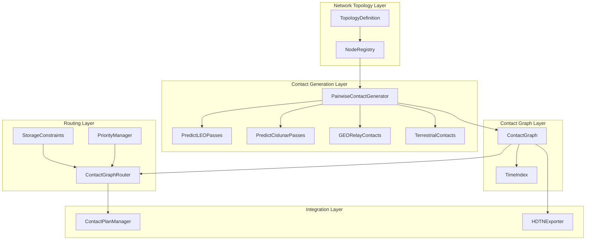
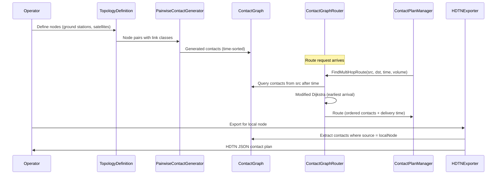
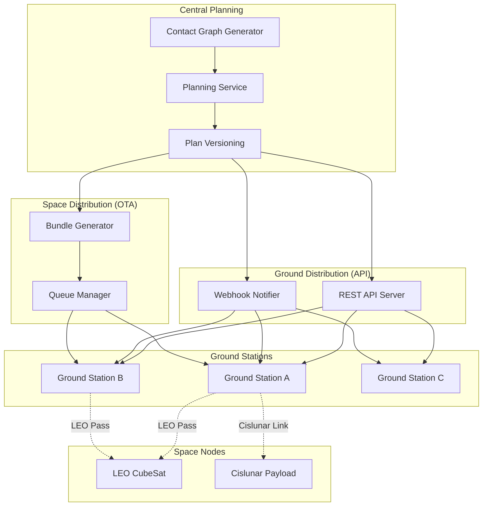
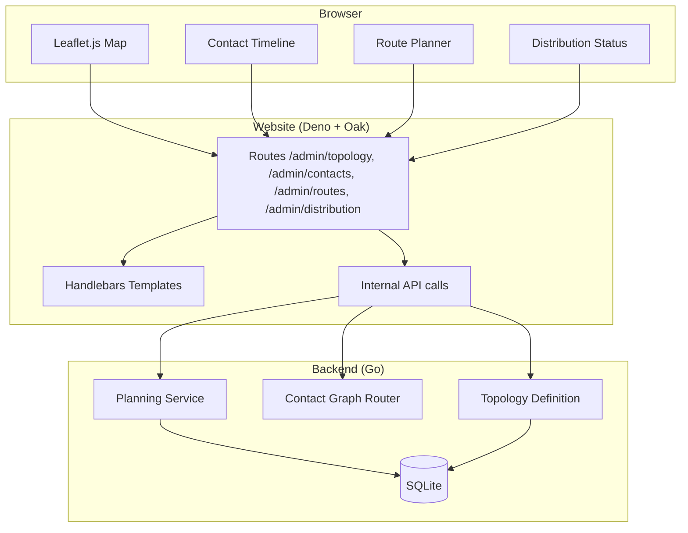

# Design Document: Multi-Node Contact Graph

## Overview

This design extends the RADIANT project's existing single-hop contact plan system to support multi-node contact graphs with time-dependent routing. The system models a distributed ground station network where bundles can be routed through multiple intermediate nodes using store-and-forward semantics, implementing Contact Graph Routing (CGR) as specified in RFC 9171 and the ION CGR documentation.

The core addition is a **Contact Graph Router** that computes optimal multi-hop paths minimizing end-to-end delivery time while respecting storage constraints, link capacities, and time-varying contact windows. This integrates with the existing `ContactPlanManager` to provide backward-compatible single-hop behavior alongside new multi-hop capabilities.

### Key Design Decisions

1. **Adjacency list with time-sorted edge lists** — The contact graph uses an adjacency list where each node maps to a time-sorted slice of outgoing contacts. This enables O(log n) lookup of the next available contact from any node after a given time via binary search.

2. **Modified Dijkstra with earliest arrival time** — Route computation uses a priority queue keyed on earliest arrival time (not hop count or distance). This naturally handles store-and-forward delays and time-dependent link availability.

3. **Capacity tracking via contact residual volume** — Each contact maintains a residual capacity (remaining bytes that can be transmitted). Storage constraints are tracked per-node with a simple counter that decrements on arrival and increments on departure.

4. **Priority preemption with reroute** — Higher-priority bundles can reclaim capacity reserved by lower-priority bundles. Preempted bundles are marked for reroute on the next routing cycle.

5. **Incremental updates via targeted recomputation** — Adding/removing nodes triggers pairwise contact generation only for affected pairs, merged into the existing sorted graph structure.

6. **HDTN export as local node view extraction** — Each node exports only contacts where it is the source, mapped to HDTN's integer node ID format.

## Architecture



### Data Flow



## Components and Interfaces

### TopologyDefinition

Manages the network topology — all nodes, their types, and parameters.

```go
// NodeType classifies DTN endpoints in the network
type NodeType int

const (
    NodeTypeGroundStation NodeType = iota
    NodeTypeLEOSatellite
    NodeTypeGEORelay
    NodeTypeCislunarPayload
)

// LinkClass categorizes communication links
type LinkClass int

const (
    LinkClassTerrestrial LinkClass = iota  // Ground-to-ground wired/RF
    LinkClassGEORelay                       // Via QO-100 or similar GEO relay
    LinkClassLEOPass                        // Ground-to-LEO satellite pass
    LinkClassCislunarLink                   // Ground/relay-to-cislunar
)

// NodeDefinition describes a node in the network topology
type NodeDefinition struct {
    ID         NodeID
    Type       NodeType
    HDTNNodeID uint64  // Integer ID for HDTN compatibility
    Params     NodeParams
}

// NodeParams is an interface for type-specific node parameters
type NodeParams interface {
    Validate() error
    GetNodeType() NodeType
}

// GroundStationParams holds ground station-specific parameters
type GroundStationParams struct {
    Location       GroundStationLocation
    SupportedLinks []LinkClass
}

// LEOSatelliteParams holds LEO satellite-specific parameters
type LEOSatelliteParams struct {
    Orbital         *OrbitalParameters
    TLE             *TLEParameters       // Alternative to Orbital
    StorageCapacity int64                // Bytes
    DataRates       map[LinkClass]int64  // Bits per second per link class
}

// GEORelayParams holds GEO relay-specific parameters
type GEORelayParams struct {
    LongitudeDeg    float64
    FootprintMinLat float64
    FootprintMaxLat float64
    FootprintMinLon float64
    FootprintMaxLon float64
    DataRate        int64   // Bits per second
}

// CislunarPayloadParams holds cislunar payload-specific parameters
type CislunarPayloadParams struct {
    Orbital         *OrbitalParameters
    StorageCapacity int64               // Bytes
    DataRates       map[LinkClass]int64 // Bits per second per link class
}

// TopologyDefinition manages the network topology
type TopologyDefinition struct {
    mu    sync.RWMutex
    nodes map[NodeID]*NodeDefinition
}

// NewTopologyDefinition creates a new empty topology
func NewTopologyDefinition() *TopologyDefinition

// AddNode adds a node to the topology, returns error if invalid
func (td *TopologyDefinition) AddNode(node *NodeDefinition) error

// RemoveNode removes a node from the topology
func (td *TopologyDefinition) RemoveNode(id NodeID) error

// GetNode retrieves a node definition
func (td *TopologyDefinition) GetNode(id NodeID) (*NodeDefinition, error)

// ListNodes returns all nodes, optionally filtered by type
func (td *TopologyDefinition) ListNodes(filter *NodeType) []*NodeDefinition

// GetNodePairs returns all valid communication pairs with their link classes
func (td *TopologyDefinition) GetNodePairs() []NodePair

// NodePair represents a directed communication pair
type NodePair struct {
    Source    NodeID
    Dest      NodeID
    LinkClass LinkClass
}
```

### PairwiseContactGenerator

Computes contact windows between all reachable node pairs based on their types and orbital parameters.

```go
// PairwiseContactGenerator computes contacts between node pairs
type PairwiseContactGenerator struct {
    topology *TopologyDefinition
}

// NewPairwiseContactGenerator creates a generator bound to a topology
func NewPairwiseContactGenerator(topology *TopologyDefinition) *PairwiseContactGenerator

// GenerateAllContacts computes contacts for all valid pairs in the time range
func (pcg *PairwiseContactGenerator) GenerateAllContacts(
    fromTime, toTime time.Time,
) ([]DirectedContact, error)

// GenerateForNode computes contacts for all pairs involving a specific node
func (pcg *PairwiseContactGenerator) GenerateForNode(
    nodeID NodeID,
    fromTime, toTime time.Time,
) ([]DirectedContact, error)

// GenerateForPair computes contacts for a specific node pair
func (pcg *PairwiseContactGenerator) GenerateForPair(
    source, dest NodeID,
    fromTime, toTime time.Time,
) ([]DirectedContact, error)

// DirectedContact represents a single directed communication opportunity
type DirectedContact struct {
    ID             uint64
    Source         NodeID
    Dest           NodeID
    StartTime      int64    // Unix epoch seconds
    EndTime        int64    // Unix epoch seconds
    DataRate       int64    // Bits per second
    OWLT           float64  // One-way light time in seconds
    Confidence     float64  // Prediction confidence [0, 1]
    LinkClass      LinkClass
    ResidualVolume int64    // Remaining transmittable bytes (initially dataRate * duration / 8)
}
```

### ContactGraph

The unified graph structure holding all contacts, with efficient time-based querying.

```go
// ContactGraph is the unified time-sorted contact graph
type ContactGraph struct {
    mu       sync.RWMutex
    // Adjacency list: node -> time-sorted outgoing contacts
    outgoing map[NodeID][]*DirectedContact
    // Reverse index: node -> time-sorted incoming contacts
    incoming map[NodeID][]*DirectedContact
    // All contacts sorted by start time (for iteration)
    allContacts []*DirectedContact
    // Node storage state
    storageUsed map[NodeID]int64
    storageMax  map[NodeID]int64
}

// NewContactGraph creates an empty contact graph
func NewContactGraph() *ContactGraph

// AddContacts adds contacts to the graph, maintaining sorted order
// Returns error if any contact overlaps an existing contact on the same directed link
func (cg *ContactGraph) AddContacts(contacts []DirectedContact) error

// RemoveContactsForNode removes all contacts involving a node
func (cg *ContactGraph) RemoveContactsForNode(nodeID NodeID) int

// GetOutgoingAfter returns contacts departing from node after the given time
// Uses binary search for O(log n) lookup
func (cg *ContactGraph) GetOutgoingAfter(nodeID NodeID, afterTime int64) []*DirectedContact

// GetIncomingInRange returns contacts arriving at node within [startTime, endTime]
func (cg *ContactGraph) GetIncomingInRange(nodeID NodeID, startTime, endTime int64) []*DirectedContact

// SetStorageCapacity sets the maximum storage for a relay node
func (cg *ContactGraph) SetStorageCapacity(nodeID NodeID, capacityBytes int64)

// GetAvailableStorage returns current available storage at a node
func (cg *ContactGraph) GetAvailableStorage(nodeID NodeID) int64

// ReserveStorage decrements available storage (bundle arrives at relay)
func (cg *ContactGraph) ReserveStorage(nodeID NodeID, bytes int64) error

// ReleaseStorage increments available storage (bundle departs relay)
func (cg *ContactGraph) ReleaseStorage(nodeID NodeID, bytes int64)
```

### ContactGraphRouter

Implements time-dependent Dijkstra for multi-hop route computation.

```go
// BundlePriority represents bundle priority levels
type BundlePriority int

const (
    PriorityBulk      BundlePriority = 0
    PriorityNormal    BundlePriority = 1
    PriorityExpedited BundlePriority = 2
)

// RouteRequest encapsulates a routing query
type RouteRequest struct {
    Source      NodeID
    Destination NodeID
    RequestTime int64          // Current time (Unix epoch seconds)
    BundleSize  int64          // Bundle volume in bytes
    Priority    BundlePriority
}

// Route represents a computed multi-hop path
type Route struct {
    Hops          []RouteHop
    DeliveryTime  int64   // Estimated total delivery time (Unix epoch seconds)
    TotalLatency  float64 // Total end-to-end delay in seconds
    Confidence    float64 // Minimum confidence across all hops
}

// RouteHop represents one hop in a multi-hop route
type RouteHop struct {
    Contact       *DirectedContact
    ArrivalTime   int64   // When the bundle arrives at this hop's destination
    DepartureTime int64   // When the bundle departs on this contact
    StoreDelay    float64 // Store-and-forward delay at this node (seconds)
}

// NoRouteError indicates no route was found
type NoRouteError struct {
    Source      NodeID
    Destination NodeID
    Reason      string // "no-path", "storage-exhausted", "capacity-exhausted"
}

func (e *NoRouteError) Error() string

// ContactGraphRouter computes time-dependent shortest paths
type ContactGraphRouter struct {
    graph    *ContactGraph
    topology *TopologyDefinition
}

// NewContactGraphRouter creates a router bound to a contact graph
func NewContactGraphRouter(graph *ContactGraph, topology *TopologyDefinition) *ContactGraphRouter

// FindRoute computes the earliest-arrival route from source to destination
func (cgr *ContactGraphRouter) FindRoute(req *RouteRequest) (*Route, error)

// FindRouteWithExclusions computes a route excluding specific contacts (for rerouting)
func (cgr *ContactGraphRouter) FindRouteWithExclusions(
    req *RouteRequest,
    excludeContacts map[uint64]bool,
) (*Route, error)

// PreemptAndReroute preempts lower-priority reservations for a high-priority bundle
func (cgr *ContactGraphRouter) PreemptAndReroute(
    highPriority *RouteRequest,
    existingRoutes map[NodeID]*Route,
) (*Route, []NodeID, error) // returns route, list of preempted bundle sources, error
```

### HDTNExporter

Exports the local node's view of the contact graph in HDTN-compatible format.

```go
// HDTNContactEntry represents a single contact in HDTN JSON format
type HDTNContactEntry struct {
    Contact       int     `json:"contact"`
    Source        uint64  `json:"source"`
    Dest          uint64  `json:"dest"`
    StartTime     int64   `json:"startTime"`
    EndTime       int64   `json:"endTime"`
    RateBitsPerSec int64  `json:"rateBitsPerSec"`
    OWLT          float64 `json:"owlt"`
}

// HDTNContactPlan represents the full HDTN contact plan JSON
type HDTNContactPlan struct {
    Contacts []HDTNContactEntry `json:"contacts"`
}

// HDTNExporter exports contact graph data in HDTN format
type HDTNExporter struct {
    graph    *ContactGraph
    topology *TopologyDefinition
}

// NewHDTNExporter creates an exporter
func NewHDTNExporter(graph *ContactGraph, topology *TopologyDefinition) *HDTNExporter

// ExportForNode exports all outgoing contacts for a node in HDTN format
func (exp *HDTNExporter) ExportForNode(nodeID NodeID) (*HDTNContactPlan, error)

// ExportForNodeJSON exports as JSON bytes
func (exp *HDTNExporter) ExportForNodeJSON(nodeID NodeID) ([]byte, error)
```

### Integration with ContactPlanManager

```go
// MultiHopContactPlanManager extends ContactPlanManager with multi-hop routing
type MultiHopContactPlanManager struct {
    *ContactPlanManager
    router   *ContactGraphRouter
    graph    *ContactGraph
    topology *TopologyDefinition
}

// NewMultiHopContactPlanManager creates the extended manager
func NewMultiHopContactPlanManager(
    topology *TopologyDefinition,
    graph *ContactGraph,
    router *ContactGraphRouter,
) *MultiHopContactPlanManager

// FindMultiHopRoute finds the optimal multi-hop route
func (m *MultiHopContactPlanManager) FindMultiHopRoute(req *RouteRequest) (*Route, error)

// FindDirectContact overrides to fall back to multi-hop when no direct contact exists
func (m *MultiHopContactPlanManager) FindDirectContact(
    destination bpa.EndpointID,
    currentTime int64,
) (*ContactWindow, error)
```

## Data Models

### Core Graph Structures

```go
// DirectedContact is the fundamental edge in the contact graph.
// It represents a time-bounded, directed communication opportunity.
type DirectedContact struct {
    ID             uint64      // Unique contact identifier
    Source         NodeID      // Transmitting node
    Dest           NodeID      // Receiving node
    StartTime      int64       // Contact start (Unix epoch seconds)
    EndTime        int64       // Contact end (Unix epoch seconds)
    DataRate       int64       // Link data rate (bits/second)
    OWLT           float64     // One-way light time (seconds)
    Confidence     float64     // Prediction confidence [0.0, 1.0]
    LinkClass      LinkClass   // Type of link
    ResidualVolume int64       // Remaining capacity (bytes)
}

// TransmissionTime returns time to transmit bundleBytes over this contact
func (dc *DirectedContact) TransmissionTime(bundleBytes int64) float64 {
    return float64(bundleBytes*8) / float64(dc.DataRate)
}

// RemainingTime returns seconds remaining in this contact from the given time
func (dc *DirectedContact) RemainingTime(fromTime int64) int64 {
    if fromTime >= dc.EndTime {
        return 0
    }
    return dc.EndTime - fromTime
}

// CanTransmit checks if the contact has enough residual capacity and time
func (dc *DirectedContact) CanTransmit(bundleBytes int64, departureTime int64) bool {
    if bundleBytes > dc.ResidualVolume {
        return false
    }
    txTime := dc.TransmissionTime(bundleBytes)
    return float64(dc.EndTime-departureTime) >= txTime
}
```

### Topology Configuration (YAML)

```yaml
# Example multi-node topology definition
topology:
  nodes:
    - id: "gs-boston"
      type: ground_station
      hdtn_node_id: 1
      params:
        latitude: 42.36
        longitude: -71.06
        altitude_m: 50
        min_elevation_deg: 10
        supported_links: [terrestrial, leo_pass]

    - id: "gs-houston"
      type: ground_station
      hdtn_node_id: 2
      params:
        latitude: 29.76
        longitude: -95.37
        altitude_m: 30
        min_elevation_deg: 10
        supported_links: [terrestrial, leo_pass, geo_relay]

    - id: "leo-sat-01"
      type: leo_satellite
      hdtn_node_id: 10
      params:
        orbital:
          semi_major_axis_m: 6771000
          eccentricity: 0.001
          inclination_deg: 51.6
          raan_deg: 100.0
          arg_periapsis_deg: 90.0
          true_anomaly_deg: 0.0
        storage_capacity_bytes: 1073741824  # 1 GB
        data_rates:
          leo_pass: 9600

    - id: "qo-100"
      type: geo_relay
      hdtn_node_id: 20
      params:
        longitude_deg: 25.9
        footprint_min_lat: -35.0
        footprint_max_lat: 75.0
        footprint_min_lon: -30.0
        footprint_max_lon: 90.0
        data_rate: 2400

    - id: "cislunar-01"
      type: cislunar_payload
      hdtn_node_id: 30
      params:
        orbital:
          semi_major_axis_m: 384400000
          eccentricity: 0.05
          inclination_deg: 5.1
          raan_deg: 0.0
          arg_periapsis_deg: 0.0
          true_anomaly_deg: 0.0
        storage_capacity_bytes: 536870912  # 512 MB
        data_rates:
          cislunar_link: 500
```

### Algorithm: Time-Dependent Dijkstra (Earliest Arrival)

The routing algorithm is a modified Dijkstra that operates on time rather than distance:

```
FUNCTION FindEarliestArrival(graph, source, destination, startTime, bundleSize, priority):
    // Priority queue keyed on arrival time (min-heap)
    pq = MinHeap<(arrivalTime, nodeID)>
    
    // Best known arrival time at each node
    bestArrival = map[NodeID]int64, initialized to +∞
    
    // Predecessor map for path reconstruction
    predecessor = map[NodeID](contact, departureTime)
    
    bestArrival[source] = startTime
    pq.Push((startTime, source))
    
    WHILE pq is not empty:
        (currentArrival, currentNode) = pq.Pop()
        
        IF currentNode == destination:
            RETURN reconstructPath(predecessor, source, destination)
        
        IF currentArrival > bestArrival[currentNode]:
            CONTINUE  // Stale entry
        
        // Get all outgoing contacts from currentNode after currentArrival
        contacts = graph.GetOutgoingAfter(currentNode, currentArrival)
        
        FOR EACH contact IN contacts:
            // Departure time is max(currentArrival, contact.StartTime)
            departureTime = max(currentArrival, contact.StartTime)
            
            // Check contact has enough time and capacity
            IF NOT contact.CanTransmit(bundleSize, departureTime):
                CONTINUE
            
            // Check storage at intermediate node (if not destination)
            IF contact.Dest != destination:
                IF graph.GetAvailableStorage(contact.Dest) < bundleSize:
                    CONTINUE
            
            // Compute arrival time at next node
            txTime = contact.TransmissionTime(bundleSize)
            arrivalAtDest = departureTime + ceil(txTime) + ceil(contact.OWLT)
            
            IF arrivalAtDest < bestArrival[contact.Dest]:
                bestArrival[contact.Dest] = arrivalAtDest
                predecessor[contact.Dest] = (contact, departureTime)
                pq.Push((arrivalAtDest, contact.Dest))
    
    RETURN NoRouteError{Reason: "no-path"}
```

### Algorithm: Pairwise Contact Generation

```
FUNCTION GenerateContacts(topology, fromTime, toTime):
    contacts = []
    
    FOR EACH (source, dest, linkClass) IN topology.GetNodePairs():
        SWITCH linkClass:
        
        CASE Terrestrial:
            // Continuous contact for the entire time range
            contact = DirectedContact{
                Source: source, Dest: dest,
                StartTime: fromTime, EndTime: toTime,
                DataRate: configuredRate,
                OWLT: 0.001,  // Sub-millisecond
                Confidence: 1.0,
            }
            contacts.Append(contact)
            
        CASE GEORelay:
            // Continuous if both stations in footprint
            IF bothInFootprint(source, dest, geoRelay):
                contact = DirectedContact{
                    Source: source, Dest: dest,
                    StartTime: fromTime, EndTime: toTime,
                    DataRate: geoRelay.DataRate,
                    OWLT: 0.250,  // ~250ms for GEO round trip
                    Confidence: 1.0,
                }
                contacts.Append(contact)
                
        CASE LEOPass:
            // Use existing PredictLEOPasses
            passes = PredictLEOPasses(satellite.Orbital, []station, fromTime, toTime, 30)
            FOR EACH pass IN passes:
                contact = DirectedContact{
                    Source: source, Dest: dest,
                    StartTime: pass.Window.StartTime,
                    EndTime: pass.Window.EndTime,
                    DataRate: satellite.DataRates[LEOPass],
                    OWLT: computeOWLT(pass),
                    Confidence: pass.Confidence,
                }
                contacts.Append(contact)
                
        CASE CislunarLink:
            // Use existing PredictCislunarPasses
            passes = PredictCislunarPasses(payload.Orbital, []station, fromTime, toTime, 60)
            FOR EACH pass IN passes:
                contact = DirectedContact{
                    Source: source, Dest: dest,
                    StartTime: pass.Window.StartTime,
                    EndTime: pass.Window.EndTime,
                    DataRate: payload.DataRates[CislunarLink],
                    OWLT: computeCislunarOWLT(pass),
                    Confidence: pass.Confidence,
                }
                contacts.Append(contact)
    
    RETURN contacts
```


## Correctness Properties

*A property is a characteristic or behavior that should hold true across all valid executions of a system — essentially, a formal statement about what the system should do. Properties serve as the bridge between human-readable specifications and machine-verifiable correctness guarantees.*

### Property 1: Node Definition Round-Trip

*For any* valid NodeDefinition (with valid NodeID, NodeType, and type-specific parameters), adding it to the TopologyDefinition and then retrieving it by ID SHALL produce an equivalent NodeDefinition with all fields preserved.

**Validates: Requirements 1.1**

### Property 2: Node Validation Rejects Invalid Definitions

*For any* NodeDefinition where one or more required fields are missing or contain invalid values (e.g., latitude outside [-90, 90], negative storage capacity, eccentricity >= 1.0), the TopologyDefinition SHALL return a non-nil validation error whose message identifies the invalid field.

**Validates: Requirements 1.2, 1.3, 1.4, 1.5, 1.6**

### Property 3: Incremental Node Addition Preserves Existing Contacts

*For any* ContactGraph with existing contacts between nodes A and B, adding a new node C to the topology and generating contacts for C SHALL NOT modify or remove any existing contacts between A and B.

**Validates: Requirements 1.7, 8.1**

### Property 4: Terrestrial Contacts Are Continuous

*For any* pair of Ground_Station nodes that both support the Terrestrial LinkClass, the PairwiseContactGenerator SHALL produce exactly one DirectedContact per direction spanning the full requested time range [fromTime, toTime] with OWLT < 0.001 seconds.

**Validates: Requirements 2.1**

### Property 5: GEO Relay Contacts Have Correct Properties

*For any* pair of Ground_Station nodes both within a GEO_Relay's footprint, the PairwiseContactGenerator SHALL produce a continuous DirectedContact with OWLT equal to 0.250 seconds (±0.001) and data rate equal to the GEO relay's configured rate.

**Validates: Requirements 2.2**

### Property 6: Bidirectional Contact Generation

*For any* valid node pair (A, B) where communication is possible in both directions, the PairwiseContactGenerator SHALL produce contacts for both A→B and B→A directions, and the number of contacts in each direction SHALL be equal.

**Validates: Requirements 2.5**

### Property 7: Confidence Monotonically Decreases With Propagation Time

*For any* LEO satellite and ground station pair, predicted contacts at time T1 SHALL have confidence >= contacts at time T2 when T1 < T2 (both measured as elapsed time from the orbital epoch).

**Validates: Requirements 2.7**

### Property 8: Contact Graph Maintains Sorted Order

*For any* sequence of AddContacts operations (including interleaved additions), the ContactGraph's allContacts slice and each node's outgoing contact list SHALL remain sorted by start time in ascending order.

**Validates: Requirements 3.1, 3.6**

### Property 9: Contact Field Preservation

*For any* DirectedContact added to the ContactGraph, retrieving it via GetOutgoingAfter or GetIncomingInRange SHALL return a contact with identical Source, Dest, StartTime, EndTime, DataRate, OWLT, and Confidence values.

**Validates: Requirements 3.2**

### Property 10: Overlap Rejection

*For any* two DirectedContacts with the same Source and Dest where their time intervals overlap (c1.StartTime < c2.EndTime AND c2.StartTime < c1.EndTime), adding both to the ContactGraph SHALL result in the second addition returning a non-nil error.

**Validates: Requirements 3.3**

### Property 11: Outgoing Query Correctness

*For any* ContactGraph, node N, and time T, GetOutgoingAfter(N, T) SHALL return exactly those contacts where Source == N AND StartTime >= T, sorted by StartTime ascending.

**Validates: Requirements 3.4**

### Property 12: Incoming Query Correctness

*For any* ContactGraph, node N, and time range [T1, T2], GetIncomingInRange(N, T1, T2) SHALL return exactly those contacts where Dest == N AND StartTime >= T1 AND EndTime <= T2.

**Validates: Requirements 3.5**

### Property 13: Route Optimality (Earliest Arrival)

*For any* contact graph with at most 6 nodes and 20 contacts, and any valid RouteRequest, the route returned by FindRoute SHALL have a DeliveryTime <= the delivery time of every other temporally-feasible path from source to destination (verified by brute-force path enumeration).

**Validates: Requirements 4.1**

### Property 14: Delivery Time Correctness

*For any* computed Route with N hops, the DeliveryTime SHALL equal the arrival time at the final destination, computed as: for each hop i, departureTime_i + transmissionTime_i + OWLT_i, where departureTime_i = max(arrivalTime_{i-1}, contact_i.StartTime) and transmissionTime_i = ceil(bundleSize * 8 / contact_i.DataRate).

**Validates: Requirements 4.2, 4.3, 4.4**

### Property 15: No-Route for Disconnected Graphs

*For any* contact graph where no sequence of contacts connects source to destination (the destination node has no incoming contacts, or all paths are temporally infeasible), FindRoute SHALL return a NoRouteError.

**Validates: Requirements 4.5**

### Property 16: Capacity Constraint Respected

*For any* computed Route, every contact in the route's Hops SHALL have ResidualVolume >= the requested BundleSize at the time of route computation.

**Validates: Requirements 4.6**

### Property 17: Storage Constraint Respected

*For any* computed Route passing through intermediate nodes, every intermediate node SHALL have available StorageCapacity >= the requested BundleSize. When storage at all possible relay nodes is less than BundleSize, FindRoute SHALL return NoRouteError with reason "storage-exhausted".

**Validates: Requirements 5.1, 5.2, 5.5**

### Property 18: Storage Accounting Round-Trip

*For any* node with StorageCapacity S, after ReserveStorage(node, B) the available storage SHALL be S - B, and after subsequently calling ReleaseStorage(node, B) the available storage SHALL return to S.

**Validates: Requirements 5.3, 5.4**

### Property 19: Priority Preemption Correctness

*For any* contact with capacity reserved by a bundle of priority P1, a preemption request from a bundle of priority P2 SHALL succeed if and only if P2 > P1. Preemption SHALL NOT occur when P2 <= P1.

**Validates: Requirements 6.1, 6.3, 6.4**

### Property 20: HDTN Export Field Correctness

*For any* node in the topology with outgoing contacts, ExportForNode SHALL produce an HDTNContactPlan where each entry contains valid source (matching the node's HDTNNodeID), dest (matching the destination's HDTNNodeID), startTime, endTime, rateBitsPerSec, and owlt fields that correspond exactly to the DirectedContact's values.

**Validates: Requirements 7.1, 7.2, 7.4**

### Property 21: Node Removal Cleans All Contacts

*For any* ContactGraph and node N, after RemoveContactsForNode(N), there SHALL be zero contacts in the graph where Source == N OR Dest == N.

**Validates: Requirements 8.3**

### Property 22: Temporal Feasibility of All Routes

*For any* computed Route, for every consecutive pair of hops (hop_i, hop_{i+1}), the departure time of hop_{i+1} SHALL be >= the arrival time of hop_i at the intermediate node. That is: hop_{i+1}.DepartureTime >= hop_i.ArrivalTime.

**Validates: Requirements 9.5**

### Property 23: FindDirectContact Fallback Behavior

*For any* MultiHopContactPlanManager, when FindDirectContact is called: if a direct contact exists to the destination, the returned ContactWindow SHALL match that direct contact; if no direct contact exists but a multi-hop route exists, the returned ContactWindow SHALL correspond to the first hop of the multi-hop route.

**Validates: Requirements 10.3, 10.4**

## Error Handling

### Error Categories

| Category | Error Type | Handling Strategy |
|----------|-----------|-------------------|
| Validation | Invalid node parameters | Return descriptive error identifying the invalid field |
| Validation | Overlapping contacts | Reject the conflicting contact, return overlap details |
| Routing | No path exists | Return `NoRouteError` with reason "no-path" |
| Routing | Storage exhausted | Return `NoRouteError` with reason "storage-exhausted" |
| Routing | Capacity exhausted | Return `NoRouteError` with reason "capacity-exhausted" |
| Topology | Node not found | Return error with the missing NodeID |
| Export | Unknown HDTN node ID | Return error identifying the unmapped node |
| Concurrency | Read during write | RWMutex ensures readers don't see partial state |

### Error Propagation

```go
// NoRouteError provides structured routing failure information
type NoRouteError struct {
    Source      NodeID
    Destination NodeID
    Reason      string   // "no-path", "storage-exhausted", "capacity-exhausted"
    Details     string   // Human-readable explanation
}

func (e *NoRouteError) Error() string {
    return fmt.Sprintf("no route from %s to %s: %s (%s)",
        e.Source, e.Destination, e.Reason, e.Details)
}

// IsNoRoute checks if an error is a NoRouteError
func IsNoRoute(err error) bool {
    var nre *NoRouteError
    return errors.As(err, &nre)
}

// IsStorageExhausted checks if routing failed due to storage constraints
func IsStorageExhausted(err error) bool {
    var nre *NoRouteError
    if errors.As(err, &nre) {
        return nre.Reason == "storage-exhausted"
    }
    return false
}
```

### Concurrency Model

- `TopologyDefinition`: `sync.RWMutex` — writes are rare (topology changes), reads are frequent (route computation)
- `ContactGraph`: `sync.RWMutex` — route computation takes read lock, incremental updates take write lock
- `ContactGraphRouter`: Stateless — operates on graph's read lock, no internal state requiring synchronization
- Route computation does NOT hold exclusive locks, allowing concurrent routing queries

### Recovery Strategies

1. **Stale route detection**: If a contact in a computed route has been consumed (residual volume = 0) by the time forwarding occurs, the bundle is re-routed from the current node.
2. **TLE update invalidation**: When new TLE data arrives, all predicted contacts for that satellite are marked invalid and recomputed. In-flight routes using invalidated contacts trigger reroute at the next store-and-forward node.
3. **Node failure**: If a relay node becomes unreachable, its contacts are removed and affected routes are invalidated. Bundles at the failed node are considered lost (DTN custody transfer handles retransmission from source).

## Testing Strategy

### Property-Based Testing

This feature is well-suited for property-based testing because:
- The routing algorithm has clear universal properties (optimality, feasibility, constraint satisfaction)
- The contact graph has structural invariants (sorted order, no overlaps, field preservation)
- Input spaces are large (arbitrary topologies, time ranges, bundle sizes)
- Pure functions dominate (routing is a computation over immutable graph state)

**Library**: `github.com/leanovate/gopter` (consistent with existing project tests)
**Minimum iterations**: 100 per property test
**Tag format**: `// **Feature: multi-node-contact-graph, Property {N}: {title}**`

### Test Organization

```
pkg/contact/
├── graph_test.go                    # Unit tests for ContactGraph operations
├── graph_property_test.go           # Property tests for graph invariants (Properties 8-12, 21)
├── router_test.go                   # Unit tests for specific routing scenarios (Req 9)
├── router_property_test.go          # Property tests for routing (Properties 13-19, 22)
├── topology_test.go                 # Unit tests for TopologyDefinition
├── topology_property_test.go        # Property tests for topology (Properties 1-3)
├── generator_test.go                # Unit tests for PairwiseContactGenerator
├── generator_property_test.go       # Property tests for generation (Properties 4-7)
├── hdtn_export_test.go              # Unit tests for HDTN export
├── hdtn_export_property_test.go     # Property tests for export (Property 20)
└── integration_property_test.go     # Property tests for CPM integration (Property 23)
```

### Unit Test Coverage

Unit tests focus on:
- **Specific relay scenarios** (Requirement 9): Ground relay, satellite relay, multi-station, GEO relay
- **Edge cases**: Empty graph, single-node graph, single-contact graph
- **Error conditions**: Invalid parameters, overlapping contacts, storage overflow
- **HDTN format compliance**: JSON structure matches expected format
- **Integration**: Backward compatibility with existing `FindDirectContact` callers

### Integration Tests

- **Concurrent access**: Multiple goroutines computing routes simultaneously (with `-race` flag)
- **Incremental update performance**: Benchmark adding a station to a 50-node network (< 5 seconds)
- **End-to-end**: Load YAML topology → generate contacts → compute route → export HDTN JSON
- **TLE update cycle**: Update orbital parameters → verify contact regeneration → verify route changes

### Test Generators (for property-based tests)

Key generators needed:
- `genNodeID`: Random valid node IDs (alphanumeric strings, 3-20 chars)
- `genDirectedContact`: Random contacts with valid time ranges, data rates, OWLT
- `genSmallContactGraph`: Random graphs with 3-6 nodes and 5-20 contacts (for optimality verification)
- `genTopology`: Random topologies with mixed node types
- `genRouteRequest`: Random route requests with valid source/dest/time/size
- `genBundlePriority`: Random priority levels

## Contact Plan Distribution

### Distribution Architecture



### Planning Service

The central planning service generates the full contact graph and distributes per-node views:

```go
// PlanningService manages contact graph generation and distribution
type PlanningService struct {
    topology  *TopologyDefinition
    generator *PairwiseContactGenerator
    graph     *ContactGraph
    exporter  *HDTNExporter
    version   *PlanVersionManager
    mu        sync.RWMutex
}

// NewPlanningService creates the central planning service
func NewPlanningService(topology *TopologyDefinition) *PlanningService

// Regenerate recomputes the full contact graph and increments the plan version
func (ps *PlanningService) Regenerate(fromTime, toTime time.Time) error

// GetPlanForNode returns the HDTN-format plan for a specific node with version metadata
func (ps *PlanningService) GetPlanForNode(nodeID NodeID) (*VersionedPlan, error)

// GetCurrentVersion returns the current plan version number
func (ps *PlanningService) GetCurrentVersion() uint64

// VersionedPlan wraps an HDTN contact plan with version and validity metadata
type VersionedPlan struct {
    Version       uint64           `json:"version"`
    GeneratedAt   int64            `json:"generatedAt"`
    ValidFrom     int64            `json:"validFrom"`
    ValidTo       int64            `json:"validTo"`
    Plan          *HDTNContactPlan `json:"plan"`
}
```

### REST API for Ground Stations

```go
// PlanDistributionAPI serves contact plans to ground stations
type PlanDistributionAPI struct {
    service  *PlanningService
    webhooks *WebhookRegistry
}

// Routes:
// GET  /api/contact-plan/{nodeID}         → Returns VersionedPlan JSON
// GET  /api/contact-plan/{nodeID}/version  → Returns current version number only
// POST /api/webhooks/register             → Register for plan change notifications
// DELETE /api/webhooks/{webhookID}         → Unregister webhook

// GetContactPlan handles GET /api/contact-plan/{nodeID}
// Returns HTTP 200 with VersionedPlan, or HTTP 304 if client's If-None-Match matches current version
func (api *PlanDistributionAPI) GetContactPlan(w http.ResponseWriter, r *http.Request)

// WebhookRegistry manages push notification subscriptions
type WebhookRegistry struct {
    mu        sync.RWMutex
    callbacks map[NodeID][]WebhookEndpoint
}

type WebhookEndpoint struct {
    ID       string
    NodeID   NodeID
    URL      string
    Secret   string // HMAC signing key for payload verification
}
```

### OTA Distribution via DTN Bundles

```go
// PlanUpdateBundleGenerator creates administrative bundles carrying contact plan updates
type PlanUpdateBundleGenerator struct {
    service  *PlanningService
    bpa      *bpa.BundleProtocolAgent
}

// AdminServicePath is the reserved BPv7 service demux path for plan updates
const AdminServicePath = "admin/contactplan"

// GeneratePlanUpdateBundle creates a Plan_Update_Bundle for a space node
func (gen *PlanUpdateBundleGenerator) GeneratePlanUpdateBundle(
    targetNodeID NodeID,
    plan *VersionedPlan,
) (*bpa.Bundle, error)

// PlanUpdatePayload is the serialized payload within a Plan_Update_Bundle
type PlanUpdatePayload struct {
    Version     uint64           `json:"version"`
    GeneratedAt int64            `json:"generatedAt"`
    ValidFrom   int64            `json:"validFrom"`
    ValidTo     int64            `json:"validTo"`
    Contacts    []HDTNContactEntry `json:"contacts"`
}

// MaxPlanUpdatePayloadBytes is the maximum payload size (5000 bytes)
// ensuring transmission within a single LEO pass at 9600 bps (~4 seconds)
const MaxPlanUpdatePayloadBytes = 5000

// PlanUpdateReceiver handles incoming Plan_Update_Bundles on space nodes
type PlanUpdateReceiver struct {
    currentVersion uint64
    planLoader     func(*HDTNContactPlan) error // callback to reload HDTN contact plan
    mu             sync.Mutex
}

// HandlePlanUpdate processes a received Plan_Update_Bundle
// Returns nil if plan was accepted, error if rejected (stale version, invalid payload)
func (r *PlanUpdateReceiver) HandlePlanUpdate(bundle *bpa.Bundle) error
```

### Bootstrap Plan Generation

```go
// BootstrapPlanGenerator creates minimal seed plans for spacecraft pre-launch
type BootstrapPlanGenerator struct {
    topology *TopologyDefinition
}

// GenerateBootstrapPlan creates a 7-day seed plan from initial TLE and ground station list
func (gen *BootstrapPlanGenerator) GenerateBootstrapPlan(
    spacecraftID NodeID,
    initialTLE *TLEParameters,
    stations []NodeID,
) (*VersionedPlan, error)

// Bootstrap plan uses conservative parameters:
// - Minimum elevation: 15° (vs operational 10°)
// - Confidence: 0.5 (accounts for TLE drift before first update)
// - Duration: 7 days from epoch
```

### Plan Version Manager

```go
// PlanVersionManager tracks plan versions with monotonic incrementing
type PlanVersionManager struct {
    currentVersion uint64
    maxKnownVersion uint64 // highest version ever generated (for corruption detection)
    mu             sync.Mutex
}

// Increment atomically increments the version and returns the new value
func (pvm *PlanVersionManager) Increment() uint64

// IsAcceptable checks if a received version should be accepted
// Returns true if version > currentVersion AND version <= maxKnownVersion
func (pvm *PlanVersionManager) IsAcceptable(version uint64) bool

// GetCurrent returns the current version
func (pvm *PlanVersionManager) GetCurrent() uint64
```

### Distribution Correctness Properties

### Property 24: Plan Version Monotonicity

*For any* sequence of Regenerate calls on the PlanningService, the Plan_Version SHALL strictly increase with each call, and no two generated plans SHALL share the same version number.

**Validates: Requirements 14.1**

### Property 25: Version Acceptance Correctness

*For any* PlanUpdateReceiver with current version V_current, HandlePlanUpdate SHALL accept a bundle with version V_new if and only if V_new > V_current. Bundles with V_new <= V_current SHALL be rejected with a stale-plan error.

**Validates: Requirements 14.2, 14.3**

### Property 26: Plan Update Payload Size Constraint

*For any* VersionedPlan generated by the PlanningService for a space node, the serialized PlanUpdatePayload SHALL not exceed MaxPlanUpdatePayloadBytes (5000 bytes).

**Validates: Requirements 12.6**

### Property 27: Bootstrap Plan Coverage

*For any* valid spacecraft TLE and ground station list with at least one station having line-of-sight, the BootstrapPlanGenerator SHALL produce a plan containing at least one contact window within the 7-day coverage period.

**Validates: Requirements 13.1, 13.2**

### Property 28: API Conditional Response

*For any* sequence of GetContactPlan requests for the same node where the plan has not changed between requests, the second request with If-None-Match matching the current version SHALL return HTTP 304 with no body.

**Validates: Requirements 11.4**

## Error Handling (Distribution)

| Category | Error Type | Handling Strategy |
|----------|-----------|-------------------|
| API | Unknown node ID | HTTP 404 with descriptive message |
| API | Plan not yet generated | HTTP 503 Service Unavailable |
| OTA | Stale version received | Discard bundle, log stale-plan-rejected |
| OTA | Version out of range | Reject bundle, log version-out-of-range |
| OTA | Payload exceeds 5KB | Reject at generation time (never transmitted) |
| OTA | Payload parse failure | Discard bundle, log parse-error |
| Bootstrap | No visible stations | Return error (spacecraft has no contacts) |
| Webhook | Delivery failure | Retry with exponential backoff (3 attempts) |

## Contact Graph Management UI

### UI Architecture

The management UI is integrated into the existing RADIANT website using the same technology stack: Deno runtime, Oak HTTP framework, Handlebars templates, Bootstrap CSS, and SQLite for persistence.



### Pages and Routes

| Route | Page | Purpose |
|-------|------|---------|
| `/admin/topology` | Network Topology | World map with nodes, add/edit/remove forms |
| `/admin/contacts` | Contact Timeline | Gantt-chart of all contact windows |
| `/admin/routes` | Route Planner | Compute and visualize multi-hop routes |
| `/admin/distribution` | Distribution Status | Plan version tracking, push updates |

### UI Components

#### Topology View (`/admin/topology`)

```handlebars
{{!-- views/pages/admin/topology.hbs --}}
<div class="row">
  <div class="col-md-8">
    <div id="topology-map" style="height: 500px;"></div>
  </div>
  <div class="col-md-4">
    {{> admin/topology-node-list nodes=nodes}}
    {{> admin/topology-add-form}}
  </div>
</div>
```

**Map implementation**: Leaflet.js with OpenStreetMap tiles. Ground stations rendered as circle markers with popup cards. LEO orbital tracks rendered as polylines computed from TLE data using a client-side SGP4 library (satellite.js).

**Node forms**: Bootstrap modal forms for add/edit with server-side validation. Node type selector shows/hides type-specific fields (lat/lon for ground, TLE for LEO, longitude for GEO).

#### Contact Timeline (`/admin/contacts`)

**Implementation**: Custom SVG-based Gantt chart (lightweight, no heavy dependencies). Each row represents a source node, each bar represents a contact window. Color-coded by link class.

```typescript
// website/public/js/contact-timeline.js
interface TimelineContact {
  id: string;
  source: string;
  dest: string;
  startTime: number;  // Unix epoch
  endTime: number;
  linkClass: "terrestrial" | "geo_relay" | "leo_pass" | "cislunar";
  dataRate: number;
  confidence: number;
}
```

**Auto-refresh**: Fetches `/api/contacts?from={start}&to={end}` every 60 seconds via `setInterval`.

#### Route Planner (`/admin/routes`)

**Form**: Source/destination dropdowns populated from topology, bundle size input, priority radio buttons, datetime picker for departure time.

**Result display**: Ordered table of hops with columns: Hop #, From, To, Depart, Arrive, TX Time, OWLT, Store Delay. Plus a map overlay showing the path.

```typescript
// Route computation request
interface RouteRequest {
  source: string;
  destination: string;
  bundleSize: number;
  priority: "bulk" | "normal" | "expedited";
  departureTime: number;
}

// Route computation response
interface RouteResponse {
  hops: RouteHop[];
  deliveryTime: number;
  totalLatency: number;
  confidence: number;
  error?: string;
}
```

#### Distribution Status (`/admin/distribution`)

**Table**: Bootstrap table with sortable columns. Status badges: green "Current", yellow "Stale", red "Unreachable", grey "Bootstrap".

**Actions**: "Regenerate Plan" button (POST to `/api/graph/regenerate`), per-node "Push Update" button (POST to `/api/distribution/push/{nodeID}`), "Generate Bootstrap" button (GET `/api/distribution/bootstrap/{nodeID}` returns JSON download).

### API Endpoints (Website → Backend)

These endpoints are called by the website's Oak routes to interact with the Go backend planning service:

| Method | Endpoint | Purpose |
|--------|----------|---------|
| GET | `/api/topology/nodes` | List all nodes |
| POST | `/api/topology/nodes` | Add a node |
| PUT | `/api/topology/nodes/{nodeID}` | Update a node |
| DELETE | `/api/topology/nodes/{nodeID}` | Remove a node |
| GET | `/api/contacts?from={t1}&to={t2}` | Get contacts in time range |
| POST | `/api/routes/compute` | Compute a route |
| GET | `/api/contact-plan/{nodeID}` | Get node's HDTN plan |
| POST | `/api/graph/regenerate` | Trigger full recomputation |
| GET | `/api/distribution/status` | Get all nodes' plan status |
| POST | `/api/distribution/push/{nodeID}` | Queue OTA plan update |
| GET | `/api/distribution/bootstrap/{nodeID}` | Generate bootstrap plan |

### Client-Side Libraries

| Library | Version | Purpose |
|---------|---------|---------|
| Leaflet.js | 1.9.x | World map for topology view |
| satellite.js | 5.0.x | Client-side SGP4 for orbital track rendering |
| Bootstrap | 5.3.x | CSS framework (already in use) |

### Database Schema (SQLite)

The topology is persisted in the existing website SQLite database:

```sql
CREATE TABLE IF NOT EXISTS topology_nodes (
    id TEXT PRIMARY KEY,
    type TEXT NOT NULL CHECK(type IN ('ground_station', 'leo_satellite', 'geo_relay', 'cislunar_payload')),
    hdtn_node_id INTEGER NOT NULL UNIQUE,
    params_json TEXT NOT NULL,
    created_at INTEGER NOT NULL DEFAULT (unixepoch()),
    updated_at INTEGER NOT NULL DEFAULT (unixepoch())
);

CREATE TABLE IF NOT EXISTS plan_versions (
    id INTEGER PRIMARY KEY AUTOINCREMENT,
    version INTEGER NOT NULL UNIQUE,
    generated_at INTEGER NOT NULL,
    valid_from INTEGER NOT NULL,
    valid_to INTEGER NOT NULL,
    node_count INTEGER NOT NULL,
    contact_count INTEGER NOT NULL
);

CREATE TABLE IF NOT EXISTS distribution_status (
    node_id TEXT PRIMARY KEY REFERENCES topology_nodes(id),
    current_version INTEGER NOT NULL DEFAULT 0,
    last_update_at INTEGER,
    status TEXT NOT NULL DEFAULT 'bootstrap' CHECK(status IN ('current', 'stale', 'unreachable', 'bootstrap')),
    last_ota_attempt_at INTEGER,
    last_ota_target_station TEXT
);
```

### UI Correctness Properties

### Property 29: Topology CRUD Round-Trip

*For any* valid node definition submitted via the UI add form, the node SHALL appear in the topology node list and on the map, and deleting it SHALL remove it from both.

**Validates: Requirements 15.3, 15.4, 15.5, 15.6, 15.7**

### Property 30: Timeline Displays All Contacts in Range

*For any* time range [T1, T2] selected in the timeline view, the displayed contacts SHALL be exactly those contacts in the Contact_Graph where StartTime < T2 AND EndTime > T1.

**Validates: Requirements 16.1, 16.4**

### Property 31: Route Planner Matches Backend Router

*For any* route request submitted via the UI, the displayed route SHALL match the Route returned by the Contact_Graph_Router's FindRoute method for the same parameters.

**Validates: Requirements 17.2, 17.4**
