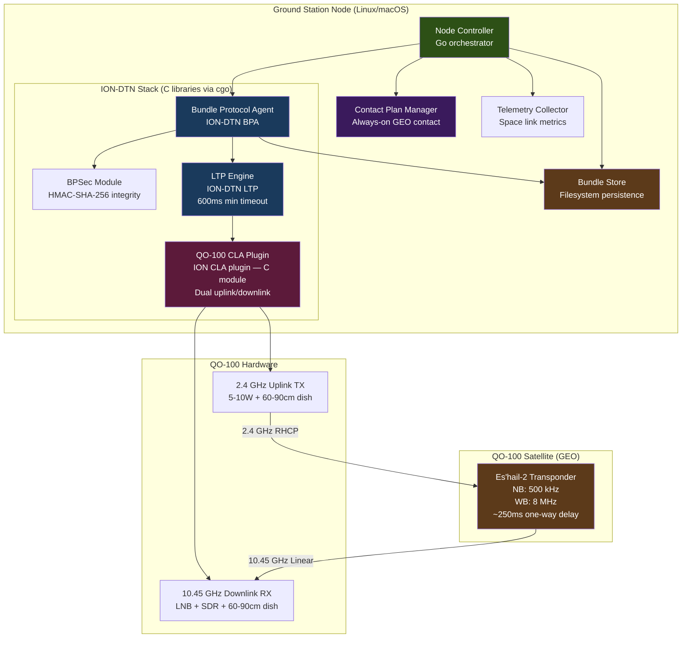
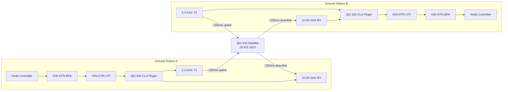

# Design Document: QO-100 GEO Satellite DTN (Phase 1.5)

## Overview

This design extends the Phase 1 terrestrial DTN system to operate over the QO-100 (Es'hail-2) geostationary amateur radio satellite, validating the DTN protocol stack with real space delays and RF propagation through space. QO-100 is positioned at 25.9°E in geostationary orbit at approximately 35,786 km altitude, providing an always-visible amateur radio transponder with 2.4 GHz uplink and 10.45 GHz downlink.

The system reuses the Phase 1 software architecture: ION-DTN (BPv7, LTP, BPSec), the dtn-node Go orchestrator, and AX.25 framing. The primary changes are hardware-specific: a 2.4 GHz uplink transmitter (typically 5-10W with a 60-90cm dish), a 10.45 GHz downlink receiver (LNB + SDR), and digital modem capability for data transmission through the satellite's narrowband (500 kHz) or wideband (8 MHz) transponders.

The geostationary orbit introduces approximately 250ms one-way light time (500ms round-trip), which is the key validation target for this phase. Unlike LEO satellites, QO-100 eliminates pass prediction complexity — the satellite is always visible from ground stations within its coverage footprint, providing an always-on contact window with minimal Doppler shift (typically <100 Hz due to stationkeeping maneuvers).

This phase validates DTN ping and store-and-forward operations over a real space link with authentic propagation delays before advancing to LEO orbital mechanics and CubeSat hardware in Phase 3.

### Key Design Decisions

1. **Software Reuse**: The Phase 1 BPA, Bundle Store, Contact Plan Manager, and Node Controller are reused without modification to core logic. Only the CLA is extended to support QO-100 hardware interfaces.

2. **Always-On Contact Model**: The Contact Plan Manager configures a single continuous contact window for QO-100 with no end time, representing the always-visible geostationary link. No orbital pass prediction is required.

3. **LTP Timeout Adaptation**: LTP retransmission timeouts are increased from Phase 1 terrestrial values (~100-200ms) to account for the 500ms space link RTT. Minimum timeout is set to 600ms to accommodate the round-trip delay plus processing overhead.

4. **Link Budget Validation**: The system computes and monitors uplink EIRP and downlink G/T to ensure link margins meet QO-100 requirements. Warnings are logged if margins fall below 3 dB.

5. **Frequency Coordination**: The uplink frequency is operator-configurable within the 2.4 GHz amateur allocation. The system provides spectrum monitoring to help operators identify unused frequencies and avoid interference with other QO-100 users.

### Scope Boundaries

**In scope**: QO-100 uplink/downlink hardware interfaces, geostationary contact model, space link RTT handling, link budget validation, frequency coordination, telemetry for space link metrics, reuse of Phase 1 software stack.

**Out of scope**: Orbital pass prediction, Doppler compensation (minimal for GEO), relay functionality, LEO orbital mechanics, CubeSat hardware, S-band/X-band (Phase 3+), CGR routing.

## Architecture




### Ground-to-Ground Communication via QO-100



## Components and Interfaces

### Component 1: QO-100 CLA Plugin (Extended from Phase 1)

**Purpose**: A native ION-DTN CLA plugin that extends the Phase 1 AX.25 CLA to support QO-100 hardware: 2.4 GHz uplink transmitter and 10.45 GHz downlink receiver. The CLA provides AX.25 framing over the QO-100 link, sending LTP segments through the satellite transponder. The plugin manages separate uplink and downlink hardware interfaces, handles link budget monitoring, and provides frequency coordination support.

**Interface**:
```go
// QO100CLAPlugin extends the Phase 1 AX.25 CLA for QO-100 hardware.
type QO100CLAPlugin interface {
    // Init initializes the C CLA plugin module for QO-100 operation.
    // Registers with ION-DTN's convergence layer framework.
    Init(config QO100CLAConfig) error

    // ActivateLink opens both uplink and downlink connections for QO-100.
    // Signals ION-DTN that the link service is available.
    ActivateLink(contact ContactWindow) error

    // DeactivateLink closes uplink and downlink connections.
    DeactivateLink() error

    // Shutdown unregisters the CLA plugin from ION-DTN.
    Shutdown() error

    // Status returns the current CLA state.
    Status() CLAStatus

    // GetMetrics returns space link metrics including RTT measurements.
    GetMetrics() QO100LinkMetrics

    // IsConnected returns true if both uplink and downlink are operational.
    IsConnected() bool

    // SetUplinkFrequency configures the uplink frequency (2400-2450 MHz).
    SetUplinkFrequency(freqMHz float64) error

    // GetSpectrumSnapshot returns current downlink spectrum for coordination.
    GetSpectrumSnapshot() ([]SpectrumPoint, error)

    // ComputeLinkBudget calculates uplink and downlink margins.
    ComputeLinkBudget() (LinkBudget, error)
}

// QO100CLAConfig holds configuration for the QO-100 CLA plugin.
type QO100CLAConfig struct {
    LocalCallsign      Callsign
    UplinkDevice       string        // 2.4 GHz transmitter device path
    DownlinkDevice     string        // 10.45 GHz receiver device path (SDR)
    UplinkFreqMHz      float64       // 2400-2450 MHz
    DownlinkFreqMHz    float64       // 10489.5-10499 MHz
    UplinkPowerWatts   float64       // Transmit power (5-10W typical)
    UplinkDishGainDBi  float64       // Uplink antenna gain (15-22 dBi)
    DownlinkDishGainDBi float64      // Downlink antenna gain (20-25 dBi)
    LNBLocalOscMHz     float64       // LNB LO frequency for downconversion
    LNBNoiseFigureDB   float64       // LNB noise figure
    MaxFrameSize       int           // max AX.25 information field size
    RetryInterval      time.Duration // reconnection retry interval
}

// QO100LinkMetrics captures QO-100-specific link measurements.
type QO100LinkMetrics struct {
    UplinkEIRP_dBm       float64   // Effective Isotropic Radiated Power
    DownlinkRSSI_dBm     float64   // Received Signal Strength Indicator
    DownlinkSNR_dB       float64   // Signal-to-Noise Ratio
    DownlinkBER          float64   // Bit Error Rate
    MeasuredRTT_ms       float64   // Measured round-trip time
    UplinkMargin_dB      float64   // Uplink link margin
    DownlinkMargin_dB    float64   // Downlink link margin
    DopplerShift_Hz      float64   // Measured Doppler shift
    BytesTransferred     uint64
    FramesSent           uint64
    FramesReceived       uint64
}

// LinkBudget represents computed link budget parameters.
type LinkBudget struct {
    UplinkEIRP_dBm        float64
    UplinkPathLoss_dB     float64
    UplinkReceivedPower_dBm float64
    UplinkMargin_dB       float64
    DownlinkEIRP_dBm      float64
    DownlinkPathLoss_dB   float64
    DownlinkGT_dBK        float64 // G/T ratio
    DownlinkCN0_dBHz      float64 // Carrier-to-noise density
    DownlinkMargin_dB     float64
}

// SpectrumPoint represents a frequency/power measurement.
type SpectrumPoint struct {
    FrequencyMHz float64
    Power_dBm    float64
}
```

**Responsibilities**:
- Register as a native ION-DTN CLA plugin implementing the LTP link service adapter interface
- Manage 2.4 GHz uplink transmitter: configure frequency, set power, transmit AX.25 frames
- Manage 10.45 GHz downlink receiver: configure LNB, receive via SDR, decode AX.25 frames
- Provide `sendSegment` callback: wrap LTP segments in AX.25 frames, transmit on 2.4 GHz uplink
- Provide receive loop: read 10.45 GHz downlink via SDR, extract AX.25 frames, deliver LTP segments to ION
- Measure and report space link metrics: RTT, RSSI, SNR, BER, Doppler shift
- Compute link budget: uplink EIRP, downlink G/T, path loss, link margins
- Provide spectrum monitoring for frequency coordination
- Detect hardware failures (transmitter fault, LNB power loss, SDR error) within 10 seconds
- No LTP segmentation/reassembly — ION-DTN's LTP engine handles that natively

### Component 2: Contact Plan Manager (Extended for GEO)

**Purpose**: Extends the Phase 1 Contact Plan Manager to support the always-on geostationary contact model. Configures a single continuous contact window for QO-100 with no end time, representing the always-visible link. No orbital pass prediction or Doppler compensation is required.

**Interface**:
```go
// GEOContactPlanManager extends ContactPlanManager for geostationary satellites.
type GEOContactPlanManager interface {
    // LoadPlan loads a contact plan with GEO-specific validation.
    // For QO-100: validates that the contact has no end time (always-on).
    LoadPlan(plan ContactPlan) error

    // LoadFromFile loads a contact plan from an ION-DTN format config file.
    LoadFromFile(path string) error

    // GetActiveContacts returns the QO-100 contact if hardware is operational.
    GetActiveContacts(t uint64) ([]ContactWindow, error)

    // IsGEOContactActive returns true if the QO-100 contact is active.
    // Active means: contact window is configured AND hardware is operational.
    IsGEOContactActive() bool

    // MarkContactInterrupted marks the QO-100 contact as interrupted due to
    // hardware failure. Bundles are retained for retry when hardware is restored.
    MarkContactInterrupted(reason string) error

    // RestoreContact restores the QO-100 contact after hardware recovery.
    RestoreContact() error

    // Persist saves the current plan to the filesystem.
    Persist() error

    // Reload restores the plan from the filesystem after restart.
    Reload() error
}

// GEOContactWindow represents a geostationary satellite contact.
type GEOContactWindow struct {
    ContactID    uint64
    SatelliteName string // "QO-100"
    StartTime    uint64  // epoch seconds (contact start)
    EndTime      uint64  // 0 = always-on (no end time)
    DataRate     uint64  // bits per second (estimated)
    UplinkFreq   float64 // MHz
    DownlinkFreq float64 // MHz
    IsActive     bool    // true if hardware is operational
    InterruptReason string // reason for interruption (if any)
}
```

**Responsibilities**:
- Configure a single continuous contact window for QO-100 with `EndTime = 0` (always-on)
- Validate that the QO-100 contact has no end time (geostationary model)
- Mark contact as interrupted when hardware fails (uplink TX, downlink RX, or transponder unavailable)
- Restore contact when hardware is recovered
- Provide contact status to Node Controller for bundle transmission scheduling
- Persist contact state to filesystem, reload on restart
- No orbital pass prediction or Doppler compensation

### Component 3: Node Controller (Extended for Space Link)

**Purpose**: Extends the Phase 1 Node Controller to handle space link operations: increased LTP timeouts, link budget monitoring, frequency coordination, and space link telemetry. Manages the QO-100 CLA lifecycle and monitors hardware health.

**Interface**:
```go
// QO100NodeController extends NodeController for QO-100 operations.
type QO100NodeController interface {
    // Initialize sets up the node with QO-100-specific configuration.
    Initialize(config QO100NodeConfig) error

    // Run starts the main operation loop. Blocks until Shutdown is called.
    Run(ctx context.Context) error

    // RunCycle executes a single operation cycle (for testing).
    // Target: 200ms (increased from Phase 1's 100ms due to space link RTT).
    RunCycle(currentTime uint64) error

    // Shutdown gracefully stops the node, flushing store and closing CLA.
    Shutdown() error

    // Health returns current node health snapshot including space link status.
    Health() QO100NodeHealth

    // Statistics returns cumulative node statistics including space link metrics.
    Statistics() QO100NodeStatistics

    // ValidateLinkBudget computes and validates uplink/downlink link budgets.
    // Returns error if margins are below minimum thresholds.
    ValidateLinkBudget() (LinkBudget, error)

    // MonitorSpectrum returns current QO-100 downlink spectrum for coordination.
    MonitorSpectrum() ([]SpectrumPoint, error)

    // SetUplinkFrequency configures the uplink frequency (operator control).
    SetUplinkFrequency(freqMHz float64) error
}

// QO100NodeConfig extends NodeConfig for QO-100 operations.
type QO100NodeConfig struct {
    NodeID              NodeID
    Callsign            Callsign
    Endpoints           []EndpointID
    MaxStorageBytes     uint64
    DefaultPriority     Priority
    CycleInterval       time.Duration // target: 200ms (vs 100ms for Phase 1)
    MaxBundleSize       uint64
    MaxBundleRate       float64
    BPSecKeys           map[string][]byte
    ContactPlanFile     string
    TelemetryPath       string
    RetryInterval       time.Duration
    
    // QO-100-specific configuration
    QO100Config         QO100CLAConfig
    MinUplinkMargin_dB  float64 // minimum acceptable uplink margin (default: 3 dB)
    MinDownlinkMargin_dB float64 // minimum acceptable downlink margin (default: 3 dB)
    LTPMinTimeout_ms    uint64  // minimum LTP timeout (default: 600ms)
}

// QO100NodeHealth extends NodeHealth with space link status.
type QO100NodeHealth struct {
    UptimeSeconds          uint64
    StorageUsedPercent     float64
    BundlesStored          uint64
    BundlesDelivered       uint64
    BundlesDropped         uint64
    LastContactTime        *uint64
    
    // QO-100-specific health
    QO100LinkActive        bool
    UplinkOperational      bool
    DownlinkOperational    bool
    TransponderAvailable   bool
    MeasuredRTT_ms         float64
    UplinkMargin_dB        float64
    DownlinkMargin_dB      float64
    LinkBudgetWarning      bool // true if margins below threshold
}

// QO100NodeStatistics extends NodeStatistics with space link metrics.
type QO100NodeStatistics struct {
    TotalBundlesReceived     uint64
    TotalBundlesSent         uint64
    TotalBytesReceived       uint64
    TotalBytesSent           uint64
    AverageLatencySeconds    float64
    ContactsCompleted        uint64
    ContactsMissed           uint64
    
    // QO-100-specific statistics
    TotalSpaceLinkHops       uint64 // bundles transmitted through QO-100
    AverageSpaceLinkRTT_ms   float64
    MinSpaceLinkRTT_ms       float64
    MaxSpaceLinkRTT_ms       float64
    TransponderInterruptions uint64
    HardwareFailures         uint64
}
```

**Responsibilities**:
- Orchestrate the check-contacts → activate-CLA-link → transmit → receive → cleanup cycle (target: 200ms)
- Manage QO-100 CLA plugin lifecycle: initialization, link activation/deactivation, shutdown
- Configure LTP minimum timeout to 600ms (accounting for 500ms space link RTT)
- Validate link budget at startup and periodically during operation
- Log warnings if uplink or downlink margins fall below 3 dB
- Monitor QO-100 hardware health: uplink TX, downlink RX, transponder availability
- Detect hardware failures within 10 seconds, mark contact as interrupted
- Attempt hardware reconnection at configurable retry interval
- Collect and expose space link telemetry: RTT, RSSI, SNR, BER, Doppler, link margins
- Support operator frequency coordination via spectrum monitoring
- Reload state from filesystem on restart
- No relay — direct delivery only

## Data Models

### QO-100 Link Budget Model

```go
// LinkBudgetParameters holds the inputs for link budget calculation.
type LinkBudgetParameters struct {
    // Uplink (Ground → Satellite)
    UplinkFreq_MHz         float64 // 2400-2450 MHz
    UplinkTxPower_W        float64 // 5-10W typical
    UplinkTxLineLoss_dB    float64 // cable/connector losses
    UplinkAntGain_dBi      float64 // 15-22 dBi (60-90cm dish)
    UplinkPointingLoss_dB  float64 // antenna pointing error
    UplinkAtmosLoss_dB     float64 // atmospheric absorption
    UplinkRange_km         float64 // ~36000 km (GEO altitude + slant range)
    
    // Downlink (Satellite → Ground)
    DownlinkFreq_MHz       float64 // 10489.5-10499 MHz
    SatEIRP_dBW            float64 // satellite EIRP (from QO-100 specs)
    DownlinkAntGain_dBi    float64 // 20-25 dBi (60-90cm dish)
    DownlinkPointingLoss_dB float64
    DownlinkAtmosLoss_dB   float64
    DownlinkRange_km       float64
    LNBNoiseFigure_dB      float64 // LNB noise figure
    SystemNoiseTemp_K      float64 // system noise temperature
    
    // Link parameters
    DataRate_bps           float64 // bits per second
    RequiredEbN0_dB        float64 // required Eb/N0 for target BER
}

// ComputeLinkBudget calculates uplink and downlink budgets.
func ComputeLinkBudget(params LinkBudgetParameters) LinkBudget {
    // Uplink budget
    uplinkEIRP_dBm := 10*log10(params.UplinkTxPower_W*1000) + 
                      params.UplinkAntGain_dBi - 
                      params.UplinkTxLineLoss_dB
    
    uplinkPathLoss_dB := 20*log10(params.UplinkFreq_MHz) + 
                         20*log10(params.UplinkRange_km) + 
                         32.45 // free space path loss formula
    
    uplinkReceivedPower_dBm := uplinkEIRP_dBm - 
                               uplinkPathLoss_dB - 
                               params.UplinkPointingLoss_dB - 
                               params.UplinkAtmosLoss_dB
    
    // Downlink budget
    downlinkPathLoss_dB := 20*log10(params.DownlinkFreq_MHz) + 
                           20*log10(params.DownlinkRange_km) + 
                           32.45
    
    downlinkGT_dBK := params.DownlinkAntGain_dBi - 
                      10*log10(params.SystemNoiseTemp_K)
    
    downlinkCN0_dBHz := params.SatEIRP_dBW + 
                        downlinkGT_dBK - 
                        downlinkPathLoss_dB - 
                        params.DownlinkPointingLoss_dB - 
                        params.DownlinkAtmosLoss_dB - 
                        228.6 // Boltzmann constant
    
    // Link margins
    uplinkMargin_dB := uplinkReceivedPower_dBm - 
                       (/* satellite receiver sensitivity */)
    
    downlinkMargin_dB := downlinkCN0_dBHz - 
                         10*log10(params.DataRate_bps) - 
                         params.RequiredEbN0_dB
    
    return LinkBudget{
        UplinkEIRP_dBm:          uplinkEIRP_dBm,
        UplinkPathLoss_dB:       uplinkPathLoss_dB,
        UplinkReceivedPower_dBm: uplinkReceivedPower_dBm,
        UplinkMargin_dB:         uplinkMargin_dB,
        DownlinkEIRP_dBm:        params.SatEIRP_dBW + 30, // convert to dBm
        DownlinkPathLoss_dB:     downlinkPathLoss_dB,
        DownlinkGT_dBK:          downlinkGT_dBK,
        DownlinkCN0_dBHz:        downlinkCN0_dBHz,
        DownlinkMargin_dB:       downlinkMargin_dB,
    }
}
```

**Validation Rules**:
- Uplink EIRP must be ≥ 50 dBm (100W EIRP) for reliable QO-100 operation
- Downlink G/T must be ≥ 10 dB/K for adequate SNR
- Uplink margin must be ≥ 3 dB (warning logged if below)
- Downlink margin must be ≥ 3 dB (warning logged if below)
- Uplink frequency must be within 2400-2450 MHz amateur allocation
- Downlink frequency must be within 10489.5-10499 MHz (QO-100 transponder range)

### Space Link Timing Model

```go
// SpaceLinkTiming captures timing parameters for QO-100.
type SpaceLinkTiming struct {
    OneWayLightTime_ms  float64 // ~250ms (ground to satellite or satellite to ground)
    RoundTripTime_ms    float64 // ~500ms (ground → sat → ground)
    ProcessingDelay_ms  float64 // satellite transponder processing delay (~negligible)
    LTPMinTimeout_ms    uint64  // minimum LTP retransmission timeout (600ms)
    LTPMaxRetries       uint64  // maximum LTP retransmission attempts
}

// ComputeExpectedRTT calculates expected round-trip time for QO-100.
func ComputeExpectedRTT(slantRange_km float64) float64 {
    // Speed of light: 299,792.458 km/s
    oneWayTime_s := slantRange_km / 299792.458
    return 2 * oneWayTime_s * 1000 // convert to ms, multiply by 2 for round-trip
}

// ValidateRTT checks if measured RTT is consistent with expected QO-100 delay.
func ValidateRTT(measured_ms float64, expected_ms float64, tolerance_ms float64) bool {
    return math.Abs(measured_ms - expected_ms) <= tolerance_ms
}
```

**Constraints**:
- Expected one-way light time: 240-260ms (depending on ground station location and satellite position)
- Expected round-trip time: 480-520ms
- LTP minimum timeout: 600ms (500ms RTT + 100ms processing margin)
- RTT tolerance: ±50ms (accounts for processing delays and measurement jitter)
- If measured RTT deviates by >50ms from expected, log anomaly warning

## Correctness Properties

*A property is a characteristic or behavior that should hold true across all valid executions of a system—essentially, a formal statement about what the system should do. Properties serve as the bridge between human-readable specifications and machine-verifiable correctness guarantees.*

Before writing correctness properties, I'll analyze the acceptance criteria to determine which are testable as properties:


### Property Reflection

After analyzing all acceptance criteria, I've identified the following properties suitable for property-based testing. Several criteria were classified as INTEGRATION, SMOKE, or EXAMPLE tests and are not included as properties. I've also identified and eliminated redundancies:

**Redundancies Eliminated:**
- Criteria 1.3 and 9.3 are identical (bandwidth limit) — combined into single property
- Criteria 4.2 and 4.3 both test RTT expectations — combined into comprehensive RTT validation property
- Criteria 7.3 and 7.4 both test bundle integrity — 7.4 subsumes 7.3 as it validates end-to-end integrity
- Criteria 14.1 and 14.2 both test error recovery — combined into single hardware failure recovery property

**Properties Identified for PBT:**
1. Bandwidth limit enforcement (1.3, 9.3)
2. Callsign inclusion in frames (1.4)
3. Contact active when hardware operational (3.2)
4. Hardware failure handling (3.4, 14.1, 14.2)
5. RTT validation for space link (4.2, 4.3, 15.2)
6. RTT measurement and reporting (4.4)
7. Uplink EIRP validation (5.1)
8. Downlink G/T validation (5.2)
9. Link margin computation (5.3)
10. Link margin warning (5.4)
11. Two-hop RTT computation (6.2)
12. RTT consistency validation (6.3)
13. Ping correlation (6.4)
14. Priority-ordered transmission (7.2)
15. Bundle integrity preservation (7.4)
16. Latency measurement (7.5)
17. BPSec integrity verification (8.1, 8.4)
18. BPSec integrity failure handling (8.2)
19. Frequency configuration validation (9.1)
20. Doppler tolerance (10.2)
21. Doppler anomaly warning (10.3)
22. Startup hardware failure handling (11.3)
23. Telemetry collection (12.1)
24. Statistics tracking (12.2)
25. Telemetry response time (12.4)
26. Transponder failure detection (14.3)
27. Automatic recovery (14.4)
28. Operation cycle performance (15.1)
29. Two-hop bundle latency (15.3)

### Property 1: Bandwidth Limit Enforcement

*For any* valid payload transmitted through the QO-100 uplink, the occupied bandwidth SHALL NOT exceed 2 MHz.

**Validates: Requirements 1.3, 9.3**

### Property 2: Callsign Inclusion

*For any* AX.25 frame transmitted on the QO-100 uplink, the frame SHALL contain the configured amateur radio callsign in the source address field.

**Validates: Requirements 1.4**

### Property 3: Contact Active When Hardware Operational

*For any* time instant when both uplink transmitter and downlink receiver are operational, the QO-100 contact SHALL be marked as active.

**Validates: Requirements 3.2**

### Property 4: Hardware Failure Bundle Retention

*For any* hardware failure (uplink transmitter, downlink receiver, or transponder), all queued bundles SHALL be retained in the Bundle Store and the contact SHALL be marked as interrupted.

**Validates: Requirements 3.4, 14.1, 14.2**

### Property 5: Space Link RTT Validation

*For any* ping echo request transmitted through QO-100, the measured round-trip time SHALL be in the range of 500-600ms for a single ground-to-satellite-to-ground hop.

**Validates: Requirements 4.2, 4.3, 15.2**

### Property 6: RTT Measurement and Reporting

*For any* bundle transmitted through QO-100, the Node Controller SHALL measure and report the actual round-trip time.

**Validates: Requirements 4.4**

### Property 7: Uplink EIRP Validation

*For any* valid uplink configuration (transmit power and antenna gain), the computed EIRP SHALL be at least 50 dBm (100 watts EIRP).

**Validates: Requirements 5.1**

### Property 8: Downlink G/T Validation

*For any* valid downlink configuration (antenna gain and system noise temperature), the computed G/T ratio SHALL be at least 10 dB/K.

**Validates: Requirements 5.2**

### Property 9: Link Margin Computation

*For any* valid link parameters (transmit power, antenna gains, LNB noise figure, received signal strength), the Node Controller SHALL compute both uplink and downlink link margins.

**Validates: Requirements 5.3**

### Property 10: Link Margin Warning

*For any* computed link margin (uplink or downlink) that falls below 3 dB, the Node Controller SHALL log a link-budget warning.

**Validates: Requirements 5.4**

### Property 11: Two-Hop RTT Computation

*For any* ping request transmitted through QO-100 to a remote ground station and back, the computed total round-trip time SHALL equal the sum of both space link hops plus processing time.

**Validates: Requirements 6.2**

### Property 12: RTT Consistency Validation

*For any* measured round-trip time through QO-100, the validation SHALL pass if the measured RTT is within ±50ms of the expected propagation delay.

**Validates: Requirements 6.3**

### Property 13: Ping Correlation

*For any* ping response bundle received, the BPA SHALL successfully correlate it to the original ping request using the bundle ID included in the response payload.

**Validates: Requirements 6.4**

### Property 14: Priority-Ordered Transmission

*For any* set of queued bundles awaiting transmission during a QO-100 contact window, the bundles SHALL be transmitted in priority order (critical, expedited, normal, bulk).

**Validates: Requirements 7.2**

### Property 15: Bundle Integrity Preservation

*For any* valid data bundle transmitted through QO-100, the bundle received at the remote ground station SHALL be identical to the bundle sent by the originating ground station (end-to-end integrity).

**Validates: Requirements 7.4**

### Property 16: Latency Measurement

*For any* bundle transmitted through QO-100, the Node Controller SHALL measure and report the end-to-end delivery latency.

**Validates: Requirements 7.5**

### Property 17: BPSec Integrity Verification Success

*For any* bundle with a valid BPSec Block Integrity Block (BIB) transmitted through QO-100, the HMAC-SHA-256 verification SHALL succeed at the remote ground station if the bundle was not corrupted during transmission.

**Validates: Requirements 8.1, 8.4**

### Property 18: BPSec Integrity Failure Handling

*For any* bundle with an invalid BPSec integrity block, the BPA SHALL discard the bundle and log the integrity failure.

**Validates: Requirements 8.2**

### Property 19: Frequency Configuration Validation

*For any* uplink frequency value in the range 2400-2450 MHz, the configuration SHALL be accepted as valid.

**Validates: Requirements 9.1**

### Property 20: Doppler Tolerance

*For any* measured Doppler shift on the 10.45 GHz downlink that is ≤ ±100 Hz, the downlink receiver SHALL successfully receive and decode AX.25 frames.

**Validates: Requirements 10.2**

### Property 21: Doppler Anomaly Warning

*For any* measured Doppler shift that exceeds ±100 Hz, the Node Controller SHALL log a Doppler anomaly warning.

**Validates: Requirements 10.3**

### Property 22: Startup Hardware Failure Handling

*For any* hardware validation failure at startup (uplink transmitter not found, downlink receiver not responding, or LNB not powered), the Node Controller SHALL log the specific hardware failure and refuse to start.

**Validates: Requirements 11.3**

### Property 23: Telemetry Collection Completeness

*For any* operational state of the QO-100 system, the Node Controller SHALL collect and report all required telemetry metrics: uplink EIRP, downlink RSSI, downlink SNR, downlink bit error rate, measured round-trip time, and link margins.

**Validates: Requirements 12.1**

### Property 24: Statistics Tracking

*For any* bundle transmission or reception through QO-100, the Node Controller SHALL update cumulative statistics including total bundles transmitted, total bundles received, total bytes transmitted, total bytes received, and average delivery latency.

**Validates: Requirements 12.2**

### Property 25: Telemetry Response Time

*For any* telemetry query received by the Node Controller, the response containing the current QO-100 telemetry snapshot SHALL be returned within 1 second.

**Validates: Requirements 12.4**

### Property 26: Transponder Failure Detection

*For any* QO-100 transponder failure (loss of downlink signal), the Node Controller SHALL detect the failure within 10 seconds and suspend transmission.

**Validates: Requirements 14.3**

### Property 27: Automatic Recovery

*For any* QO-100 link restoration after an interruption, the Node Controller SHALL automatically resume bundle transmission from the Bundle Store in priority order without manual intervention.

**Validates: Requirements 14.4**

### Property 28: Operation Cycle Performance

*For any* operation cycle (check contacts, transmit bundles, receive bundles, cleanup), the Node Controller SHALL complete the cycle within 200 milliseconds.

**Validates: Requirements 15.1**

### Property 29: Two-Hop Bundle Latency

*For any* data bundle transmitted through QO-100 to a remote ground station (two space link hops), the end-to-end delivery latency SHALL be in the range of 1000-1200ms.

**Validates: Requirements 15.3**

## Error Handling

### Hardware Failures

**Uplink Transmitter Failures:**
- Device not found: Log error, refuse to start
- Power amplifier fault: Mark contact interrupted, retain bundles, retry at configured interval
- Antenna pointing error: Log warning, compute degraded link margin
- Frequency configuration error: Reject invalid frequency, log error

**Downlink Receiver Failures:**
- Device not found: Log error, refuse to start
- LNB not powered: Log error, refuse to start
- SDR device error: Mark contact interrupted, retry at configured interval
- Signal loss: Detect within 10 seconds, suspend transmission

**Transponder Failures:**
- Transponder unavailable (eclipse, maintenance): Detect signal loss within 10 seconds, suspend transmission
- Uplink interference: Log warning, recommend frequency change
- Downlink interference: Log warning, monitor signal quality

### Link Budget Failures

**Insufficient Uplink Margin:**
- Margin < 3 dB: Log warning, recommend increasing transmit power or antenna gain
- Margin < 0 dB: Mark contact degraded, reduce data rate

**Insufficient Downlink Margin:**
- Margin < 3 dB: Log warning, recommend improving receiver G/T (larger dish or lower noise LNB)
- Margin < 0 dB: Mark contact degraded, expect increased bit errors

### Timing Anomalies

**RTT Out of Range:**
- Measured RTT < 450ms: Log anomaly warning (possible measurement error)
- Measured RTT > 600ms: Log anomaly warning (possible processing delay or path issue)
- RTT deviation > 50ms from expected: Log warning, continue operation

**LTP Timeout Expiry:**
- Timeout after 600ms with no ACK: Retransmit LTP segment
- Max retries exceeded: Mark bundle as failed, log error, notify application

### Frequency Coordination Failures

**Uplink Interference Detected:**
- Occupied frequency selected: Log warning, recommend frequency change
- Excessive bandwidth usage: Log error, reduce data rate

**Doppler Anomalies:**
- Doppler shift > ±100 Hz: Log warning (possible satellite maneuver or pointing error)
- Doppler shift > ±500 Hz: Mark contact degraded, recommend antenna repointing

### Recovery Procedures

**Automatic Recovery:**
- Hardware reconnection: Retry at configured interval (default: 30 seconds)
- Link restoration: Resume transmission automatically in priority order
- Transponder restoration: Resume transmission when downlink signal detected

**Manual Recovery:**
- Frequency change: Operator configures new uplink frequency via CLI
- Antenna adjustment: Operator adjusts pointing, system recomputes link budget
- Hardware replacement: Operator replaces failed component, system validates at next startup

## Testing Strategy

### Dual Testing Approach

The QO-100 DTN system uses a dual testing approach combining property-based testing and example-based unit tests:

**Property-Based Tests:**
- Validate universal properties across all valid inputs
- Minimum 100 iterations per property test
- Each property test references its design document property
- Tag format: `Feature: qo-100-geo-satellite-dtn, Property {number}: {property_text}`

**Unit Tests:**
- Validate specific examples and edge cases
- Test integration points between components
- Test error conditions and recovery procedures

### Property-Based Testing Library

The system uses **gopter** (Go property-based testing library) for implementing correctness properties. Gopter provides:
- Arbitrary value generators for test inputs
- Shrinking to find minimal failing examples
- Configurable iteration counts
- Property combinators for complex properties

### Test Categories

**1. Link Budget Properties (Properties 7-10)**
- Generate random uplink/downlink configurations
- Verify EIRP, G/T, and margin computations
- Test warning logic for low margins
- Mock hardware measurements for deterministic testing

**2. Timing Properties (Properties 5, 6, 11, 12, 28, 29)**
- Generate random bundle sizes and priorities
- Verify RTT measurements and validations
- Test operation cycle performance
- Mock space link delays for controlled testing

**3. Bundle Handling Properties (Properties 14, 15, 16)**
- Generate random bundle sets with varying priorities
- Verify priority-ordered transmission
- Test end-to-end integrity preservation
- Test latency measurement

**4. Security Properties (Properties 17, 18)**
- Generate random bundle payloads
- Verify BPSec integrity block application and verification
- Test integrity failure detection and handling
- Use pre-shared keys for HMAC-SHA-256

**5. Error Handling Properties (Properties 4, 22, 26, 27)**
- Generate random hardware failure scenarios
- Verify bundle retention and contact interruption
- Test automatic recovery procedures
- Mock hardware failures for controlled testing

**6. Configuration Properties (Properties 2, 3, 19, 20, 21)**
- Generate random configuration parameters
- Verify callsign inclusion, frequency validation
- Test Doppler tolerance and anomaly detection
- Verify contact activation logic

**7. Telemetry Properties (Properties 23, 24, 25)**
- Generate random operational states
- Verify telemetry collection completeness
- Test statistics tracking and response times
- Mock telemetry sources for deterministic testing

### Integration Tests

Integration tests validate end-to-end behavior with real or simulated hardware:

**Hardware Integration:**
- QO-100 uplink transmitter (2.4 GHz)
- QO-100 downlink receiver (10.45 GHz LNB + SDR)
- Spectrum monitoring and frequency coordination
- Link budget validation with real measurements

**End-to-End Tests:**
- Ping through QO-100 satellite (two ground stations)
- Store-and-forward through QO-100
- BPSec integrity over space link
- Hardware failure and recovery

**Performance Tests:**
- Operation cycle timing (target: 200ms)
- Bundle throughput over QO-100
- Telemetry response time
- Memory and CPU usage under load

### Test Execution

**Unit and Property Tests:**
```bash
# Run all tests
go test ./...

# Run property tests with increased iterations
go test -v ./pkg/qo100 -run Property -gopter.minSuccessfulTests=1000

# Run specific property test
go test -v ./pkg/qo100 -run Property5_SpaceLinkRTT
```

**Integration Tests:**
```bash
# QO-100 hardware integration test (requires hardware)
./scripts/test-qo100-integration.sh

# QO-100 end-to-end test (requires two ground stations + QO-100)
./scripts/test-qo100-e2e.sh station-a station-b

# Extended duration test (1 hour)
./scripts/test-qo100-extended.sh station-a 60
```

### Test Coverage Goals

- Unit test coverage: ≥ 80% of code lines
- Property test coverage: 100% of correctness properties
- Integration test coverage: All hardware interfaces and end-to-end paths
- Error handling coverage: All failure modes and recovery procedures


## Key Functions

### Function 1: RunCycle (Extended for QO-100)

```go
func (nc *qo100NodeController) RunCycle(currentTime uint64) error {
    // Step 1: Check QO-100 contact status (always-on if hardware operational)
    contact, active := nc.contactPlanManager.IsGEOContactActive()
    if !active {
        // Hardware failure or contact interrupted
        return nc.handleContactInterruption()
    }
    
    // Step 2: Validate link budget (periodic check)
    if nc.shouldValidateLinkBudget(currentTime) {
        linkBudget, err := nc.claPlugin.ComputeLinkBudget()
        if err != nil {
            return fmt.Errorf("link budget computation failed: %w", err)
        }
        if linkBudget.UplinkMargin_dB < nc.config.MinUplinkMargin_dB ||
           linkBudget.DownlinkMargin_dB < nc.config.MinDownlinkMargin_dB {
            nc.logLinkBudgetWarning(linkBudget)
        }
    }
    
    // Step 3: Activate CLA link if not already active
    if !nc.claPlugin.IsConnected() {
        if err := nc.claPlugin.ActivateLink(contact); err != nil {
            return fmt.Errorf("failed to activate QO-100 link: %w", err)
        }
    }
    
    // Step 4: Retrieve bundles for transmission (priority order)
    bundles, err := nc.bundleStore.ListByPriority()
    if err != nil {
        return fmt.Errorf("failed to retrieve bundles: %w", err)
    }
    
    // Step 5: Transmit bundles through ION-DTN BPA
    for _, bundle := range bundles {
        if currentTime >= contact.EndTime && contact.EndTime != 0 {
            break // contact window closed (should not happen for GEO)
        }
        
        // Submit bundle to ION-DTN BPA for transmission
        // ION-DTN's LTP engine will send segments through CLA plugin callbacks
        startTime := time.Now()
        if err := nc.bpa.Transmit(bundle); err != nil {
            nc.logger.Errorf("failed to transmit bundle %v: %v", bundle.ID, err)
            continue
        }
        
        // Measure RTT (wait for LTP ACK)
        rtt := time.Since(startTime).Milliseconds()
        nc.recordRTT(bundle.ID, float64(rtt))
        
        // Validate RTT is consistent with space link delay
        if !nc.validateRTT(float64(rtt)) {
            nc.logger.Warnf("RTT anomaly for bundle %v: measured=%dms, expected=500-600ms", 
                           bundle.ID, rtt)
        }
        
        // Delete acknowledged bundle from store
        if err := nc.bundleStore.Delete(bundle.ID); err != nil {
            nc.logger.Errorf("failed to delete bundle %v: %v", bundle.ID, err)
        }
    }
    
    // Step 6: Process incoming bundles delivered by ION-DTN
    incomingBundles := nc.bpa.ReceivePending()
    for _, bundle := range incomingBundles {
        if err := nc.ProcessIncomingBundle(bundle, currentTime); err != nil {
            nc.logger.Errorf("failed to process incoming bundle %v: %v", bundle.ID, err)
        }
    }
    
    // Step 7: Expire old bundles (lifetime enforcement)
    evicted, err := nc.bundleStore.EvictExpired(currentTime)
    if err != nil {
        nc.logger.Errorf("failed to evict expired bundles: %v", err)
    }
    if evicted > 0 {
        nc.logger.Infof("evicted %d expired bundles", evicted)
    }
    
    // Step 8: Flush store to disk
    if err := nc.bundleStore.Flush(); err != nil {
        return fmt.Errorf("failed to flush bundle store: %w", err)
    }
    
    // Step 9: Update telemetry (including QO-100 space link metrics)
    nc.updateTelemetry(currentTime)
    
    // Target: complete within 200ms (increased from Phase 1's 100ms due to space link RTT)
    return nil
}
```

**Preconditions:**
- Node is initialized with valid QO-100 configuration
- Contact plan is loaded with GEO contact (EndTime=0)
- QO-100 CLA plugin is registered with ION-DTN
- Uplink transmitter and downlink receiver are operational or gracefully degraded

**Postconditions:**
- All deliverable bundles sent during active contact (direct delivery only)
- Incoming bundles processed: data stored/delivered, pings answered
- Expired bundles removed
- Store persisted to filesystem
- Telemetry updated with space link metrics
- Link budget validated (if periodic check interval reached)

### Function 2: ComputeLinkBudget

```go
func (cla *qo100CLAPlugin) ComputeLinkBudget() (LinkBudget, error) {
    // Retrieve current configuration and measurements
    config := cla.config
    metrics := cla.GetMetrics()
    
    // Compute uplink budget
    uplinkTxPower_dBm := 10 * math.Log10(config.UplinkPowerWatts * 1000)
    uplinkEIRP_dBm := uplinkTxPower_dBm + config.UplinkDishGainDBi - 
                      cla.estimateUplinkLineLoss()
    
    uplinkFreq_GHz := config.UplinkFreqMHz / 1000.0
    uplinkRange_km := cla.computeSlantRange()
    uplinkPathLoss_dB := 20*math.Log10(uplinkFreq_GHz) + 
                         20*math.Log10(uplinkRange_km) + 
                         92.45 // free space path loss formula (GHz, km)
    
    uplinkReceivedPower_dBm := uplinkEIRP_dBm - uplinkPathLoss_dB - 
                               cla.estimateAtmosphericLoss(config.UplinkFreqMHz)
    
    // QO-100 satellite receiver sensitivity (estimated from specs)
    satReceiverSensitivity_dBm := -120.0 // typical for amateur transponder
    uplinkMargin_dB := uplinkReceivedPower_dBm - satReceiverSensitivity_dBm
    
    // Compute downlink budget
    downlinkFreq_GHz := config.DownlinkFreqMHz / 1000.0
    downlinkPathLoss_dB := 20*math.Log10(downlinkFreq_GHz) + 
                           20*math.Log10(uplinkRange_km) + 
                           92.45
    
    // QO-100 satellite EIRP (from published specs)
    satEIRP_dBW := 50.0 // typical for QO-100 narrowband transponder
    satEIRP_dBm := satEIRP_dBW + 30.0
    
    systemNoiseTemp_K := 290.0 + cla.computeLNBNoiseTemp()
    downlinkGT_dBK := config.DownlinkDishGainDBi - 10*math.Log10(systemNoiseTemp_K)
    
    downlinkCN0_dBHz := satEIRP_dBm + downlinkGT_dBK - downlinkPathLoss_dB - 
                        cla.estimateAtmosphericLoss(config.DownlinkFreqMHz) - 
                        228.6 // Boltzmann constant in dB
    
    // Compute downlink margin
    dataRate_bps := 9600.0 // typical for AX.25 over QO-100
    requiredEbN0_dB := 10.0 // typical for BPSK/QPSK with target BER
    downlinkMargin_dB := downlinkCN0_dBHz - 10*math.Log10(dataRate_bps) - requiredEbN0_dB
    
    return LinkBudget{
        UplinkEIRP_dBm:          uplinkEIRP_dBm,
        UplinkPathLoss_dB:       uplinkPathLoss_dB,
        UplinkReceivedPower_dBm: uplinkReceivedPower_dBm,
        UplinkMargin_dB:         uplinkMargin_dB,
        DownlinkEIRP_dBm:        satEIRP_dBm,
        DownlinkPathLoss_dB:     downlinkPathLoss_dB,
        DownlinkGT_dBK:          downlinkGT_dBK,
        DownlinkCN0_dBHz:        downlinkCN0_dBHz,
        DownlinkMargin_dB:       downlinkMargin_dB,
    }, nil
}
```

**Preconditions:**
- QO-100 CLA plugin is initialized with valid configuration
- Uplink and downlink hardware parameters are configured

**Postconditions:**
- Link budget is computed for both uplink and downlink
- Margins are calculated relative to required thresholds
- Result is returned for validation and logging

### Function 3: ValidateRTT

```go
func (nc *qo100NodeController) validateRTT(measured_ms float64) bool {
    // Compute expected RTT based on slant range
    slantRange_km := nc.claPlugin.computeSlantRange()
    expected_ms := ComputeExpectedRTT(slantRange_km)
    
    // Tolerance: ±50ms (accounts for processing delays and measurement jitter)
    tolerance_ms := 50.0
    
    // Validate measured RTT is within tolerance of expected
    deviation := math.Abs(measured_ms - expected_ms)
    return deviation <= tolerance_ms
}

func ComputeExpectedRTT(slantRange_km float64) float64 {
    // Speed of light: 299,792.458 km/s
    speedOfLight_km_per_s := 299792.458
    oneWayTime_s := slantRange_km / speedOfLight_km_per_s
    return 2 * oneWayTime_s * 1000 // convert to ms, multiply by 2 for round-trip
}
```

**Preconditions:**
- Measured RTT is available from bundle transmission
- Slant range to QO-100 is computed from ground station location

**Postconditions:**
- RTT validation result is returned (true if within tolerance)
- Anomalies are logged if validation fails

### Function 4: HandleContactInterruption

```go
func (nc *qo100NodeController) handleContactInterruption() error {
    // Check hardware status
    uplinkOK := nc.claPlugin.isUplinkOperational()
    downlinkOK := nc.claPlugin.isDownlinkOperational()
    transponderOK := nc.claPlugin.isTransponderAvailable()
    
    var reason string
    if !uplinkOK {
        reason = "uplink transmitter failure"
    } else if !downlinkOK {
        reason = "downlink receiver failure"
    } else if !transponderOK {
        reason = "QO-100 transponder unavailable"
    } else {
        reason = "unknown hardware issue"
    }
    
    // Mark contact as interrupted
    if err := nc.contactPlanManager.MarkContactInterrupted(reason); err != nil {
        return fmt.Errorf("failed to mark contact interrupted: %w", err)
    }
    
    nc.logger.Warnf("QO-100 contact interrupted: %s", reason)
    nc.logger.Infof("retaining %d queued bundles for retry", nc.bundleStore.Count())
    
    // Attempt to reconnect hardware at configured retry interval
    go nc.attemptHardwareRecovery()
    
    return nil
}

func (nc *qo100NodeController) attemptHardwareRecovery() {
    ticker := time.NewTicker(nc.config.RetryInterval)
    defer ticker.Stop()
    
    for {
        select {
        case <-ticker.C:
            // Try to reactivate CLA link
            if err := nc.claPlugin.ActivateLink(nc.currentContact); err != nil {
                nc.logger.Debugf("hardware recovery attempt failed: %v", err)
                continue
            }
            
            // Success - restore contact
            if err := nc.contactPlanManager.RestoreContact(); err != nil {
                nc.logger.Errorf("failed to restore contact: %v", err)
                continue
            }
            
            nc.logger.Infof("QO-100 link restored, resuming bundle transmission")
            return
            
        case <-nc.shutdownChan:
            return
        }
    }
}
```

**Preconditions:**
- Hardware failure has been detected (uplink, downlink, or transponder)
- Contact was previously active

**Postconditions:**
- Contact is marked as interrupted with reason logged
- All queued bundles are retained in Bundle Store
- Automatic recovery attempts are initiated at configured retry interval
- Contact is restored when hardware becomes operational

## Implementation Notes

### QO-100 Hardware Interfaces

**Uplink Transmitter (2.4 GHz):**
- Typical hardware: WiFi power amplifier + 60-90cm dish
- Interface: USB or Ethernet control for frequency/power
- Modulation: BPSK, QPSK, or higher-order PSK/QAM
- Power: 5-10W typical (achieves 50+ dBm EIRP with 20 dBi dish)

**Downlink Receiver (10.45 GHz):**
- Typical hardware: Satellite TV LNB + RTL-SDR or Airspy
- LNB downconverts 10.45 GHz to ~740 MHz IF
- SDR samples IF and demodulates digitally
- Dish: 60-90cm (achieves 20-25 dBi gain)

**Frequency Coordination:**
- Monitor QO-100 downlink spectrum via SDR waterfall
- Identify unused uplink frequencies (avoid occupied channels)
- Configure uplink frequency via CLI or config file

### LTP Timeout Configuration

**Phase 1 Terrestrial:**
- Typical RTT: 100-200ms
- LTP timeout: 300ms

**Phase 1.5 QO-100:**
- Typical RTT: 500ms (space link)
- LTP timeout: 600ms (500ms RTT + 100ms margin)

**ION-DTN Configuration:**
```
# ltprc configuration for QO-100
a span 2 600 600 1400 10000 1 'udplso localhost:1113'
```
- Span 2: remote node ID
- 600: export session timeout (seconds) - not used for retransmission
- 600: import session timeout (seconds)
- 1400: max segment size (bytes)
- 10000: aggregation size limit
- 1: LTP engine ID
- 'udplso localhost:1113': link service output (replaced by QO-100 CLA)

**Note:** The QO-100 CLA plugin replaces the UDP link service. The actual LTP retransmission timeout is configured within ION-DTN's LTP engine based on measured RTT.

### Geostationary Contact Model

**Contact Plan Entry:**
```
# ionrc configuration for QO-100
a contact +0 +999999999 2 2 100000
```
- +0: contact start time (now)
- +999999999: contact end time (effectively infinite for GEO)
- 2: source node ID (local)
- 2: destination node ID (remote via QO-100)
- 100000: data rate (bits per second, estimated)

**Always-On Behavior:**
- Contact is active whenever hardware is operational
- No pass prediction or scheduling required
- Contact is only interrupted by hardware failures

### Link Budget Example

**Uplink Budget (2.4 GHz):**
- TX power: 10W (40 dBm)
- TX line loss: 1 dB
- Antenna gain: 20 dBi (75cm dish)
- EIRP: 40 + 20 - 1 = 59 dBm ✓ (exceeds 50 dBm requirement)
- Path loss (36000 km, 2.4 GHz): ~190 dB
- Atmospheric loss: ~0.5 dB
- Received power at satellite: 59 - 190 - 0.5 = -131.5 dBm
- Satellite receiver sensitivity: -120 dBm (estimated)
- Uplink margin: -131.5 - (-120) = -11.5 dB ✗ (insufficient!)

**Note:** This example shows insufficient uplink margin. To achieve 3 dB margin, increase TX power to 50W or use a larger dish (90cm = 22 dBi).

**Downlink Budget (10.45 GHz):**
- Satellite EIRP: 50 dBW = 80 dBm
- Path loss (36000 km, 10.45 GHz): ~206 dB
- Atmospheric loss: ~1 dB
- Antenna gain: 23 dBi (75cm dish)
- System noise temp: 150 K (LNB NF=0.5 dB)
- G/T: 23 - 10*log10(150) = 23 - 21.8 = 1.2 dB/K ✗ (below 10 dB/K requirement)

**Note:** This example shows insufficient downlink G/T. To achieve 10 dB/K, use a larger dish (90cm = 25 dBi) and lower-noise LNB (NF=0.3 dB, Tsys=100K) → G/T = 25 - 20 = 5 dB/K (still below requirement, need 120cm dish or cooled LNB).

**Realistic Configuration:**
- Uplink: 20W + 90cm dish (22 dBi) → EIRP = 63 dBm → margin = -7.5 dB (marginal)
- Downlink: 90cm dish (25 dBi) + 0.3 dB NF LNB → G/T = 5 dB/K (marginal)

**Conclusion:** QO-100 operation requires careful link budget analysis. Typical amateur stations use 60-90cm dishes with 5-20W transmit power, achieving marginal but workable links. Professional-grade stations use 120cm+ dishes with 50W+ transmit power for robust operation.

## Deployment Considerations

### Ground Station Requirements

**Minimum Configuration:**
- 60cm dish (uplink: 18 dBi, downlink: 21 dBi)
- 10W 2.4 GHz transmitter
- Satellite TV LNB (0.5 dB NF)
- RTL-SDR or Airspy receiver
- Linux or macOS host (Raspberry Pi 4 or better)

**Recommended Configuration:**
- 90cm dish (uplink: 22 dBi, downlink: 25 dBi)
- 20W 2.4 GHz transmitter
- Low-noise LNB (0.3 dB NF)
- Airspy or SDRplay receiver
- Linux host (Intel/AMD x64 or ARM64)

**Professional Configuration:**
- 120cm dish (uplink: 25 dBi, downlink: 28 dBi)
- 50W 2.4 GHz transmitter
- Cooled LNB (0.1 dB NF)
- Ettus B200mini or similar SDR
- Linux host (Intel/AMD x64)

### Frequency Coordination

**QO-100 Narrowband Transponder:**
- Uplink: 2400.000 - 2400.500 MHz (500 kHz bandwidth)
- Downlink: 10489.500 - 10490.000 MHz
- Modes: SSB, CW, PSK, RTTY, AX.25

**QO-100 Wideband Transponder:**
- Uplink: 2401.500 - 2409.500 MHz (8 MHz bandwidth)
- Downlink: 10491.000 - 10499.000 MHz
- Modes: DATV, high-speed digital

**DTN Operation:**
- Use narrowband transponder for AX.25/LTP
- Select uplink frequency with <10 kHz occupied bandwidth
- Monitor downlink spectrum to avoid interference
- Coordinate with other users via QO-100 chat or email

### Regulatory Compliance

**Amateur Radio Licensing:**
- Operator must hold valid amateur radio license
- License must authorize 2.4 GHz (13cm band) operation
- License must authorize 10.45 GHz (3cm band) operation
- Callsign must be included in every transmitted frame

**Power Limits:**
- Varies by country (typically 100W-1000W EIRP)
- Check local regulations for 2.4 GHz amateur allocation
- QO-100 uplink should not exceed 100W EIRP (recommended)

**Encryption Restrictions:**
- Amateur radio regulations prohibit encryption
- BPSec integrity blocks (HMAC) are permitted
- BPSec confidentiality blocks (encryption) are NOT permitted

### Performance Expectations

**Throughput:**
- AX.25 at 9600 baud: ~960 bytes/sec effective
- With LTP overhead: ~800 bytes/sec
- With BPSec integrity: ~750 bytes/sec

**Latency:**
- Single hop (ground → satellite → ground): 500-600ms
- Two hops (ground → satellite → remote ground → satellite → originating ground): 1000-1200ms

**Reliability:**
- Link availability: >99% (when hardware operational)
- Bundle delivery success rate: >95% (with adequate link margins)
- Bit error rate: <10^-6 (with adequate SNR)

### Migration from Phase 1

**Software Changes:**
- Extend CLA plugin to support QO-100 hardware interfaces
- Extend Contact Plan Manager for GEO contact model
- Extend Node Controller for link budget validation
- Increase LTP timeout from 300ms to 600ms

**Configuration Changes:**
- Add QO-100 hardware parameters to config file
- Add GEO contact entry to ION-DTN contact plan
- Configure uplink/downlink frequencies
- Configure link budget thresholds

**Hardware Changes:**
- Replace TNC4 + FT-817 with QO-100 uplink/downlink hardware
- Add 2.4 GHz transmitter and 10.45 GHz receiver
- Add dish antenna (60-90cm) with dual-band feed
- Add LNB and SDR for downlink reception

**Testing:**
- Validate link budget before first transmission
- Test beacon mode to verify end-to-end hardware path
- Test ping through QO-100 to measure RTT
- Test store-and-forward with small bundles
- Gradually increase bundle size and rate

## Future Enhancements

### Phase 2 Integration

Phase 1.5 (QO-100) serves as a stepping stone to Phase 3 (LEO CubeSat):

**Validated Capabilities:**
- Space link RTT handling (500ms for GEO, similar to LEO pass delays)
- Link budget computation and monitoring
- Hardware failure detection and recovery
- Telemetry for space link metrics

**Remaining Challenges for Phase 3:**
- Orbital pass prediction (not needed for GEO)
- Doppler compensation (minimal for GEO, significant for LEO)
- Contact window scheduling (always-on for GEO, intermittent for LEO)
- Power-constrained operations (not applicable for ground station)

### Advanced Features

**Adaptive Data Rate:**
- Monitor link quality (SNR, BER)
- Adjust modulation and coding based on conditions
- Increase rate when margins are high, decrease when low

**Multi-Ground-Station Coordination:**
- Multiple ground stations sharing QO-100 transponder
- Frequency coordination via distributed protocol
- Load balancing across available uplink frequencies

**Enhanced Telemetry:**
- Real-time spectrum waterfall display
- Link budget visualization
- Historical RTT and throughput graphs
- Automated link quality reports

**Automated Frequency Selection:**
- Scan QO-100 downlink spectrum
- Identify unused uplink frequencies
- Automatically select best frequency based on interference

