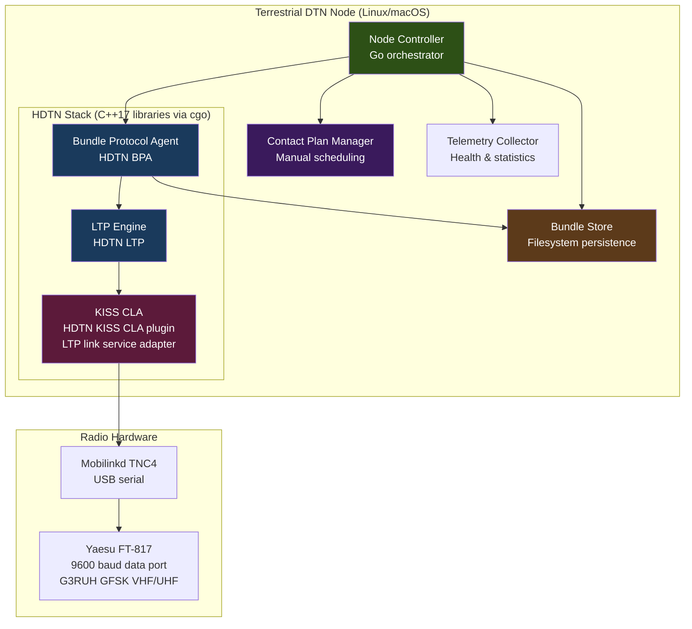
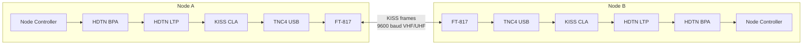
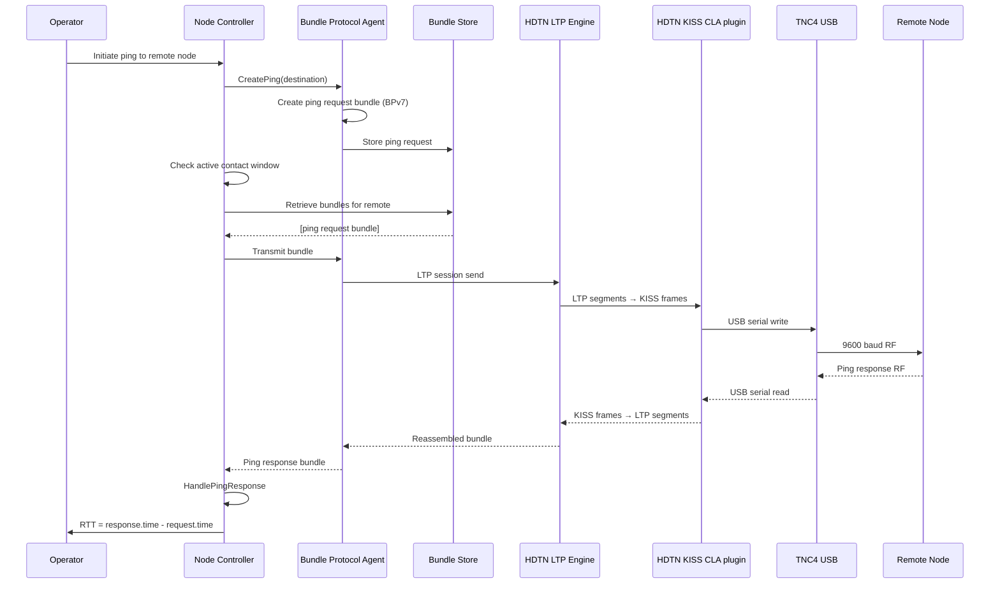
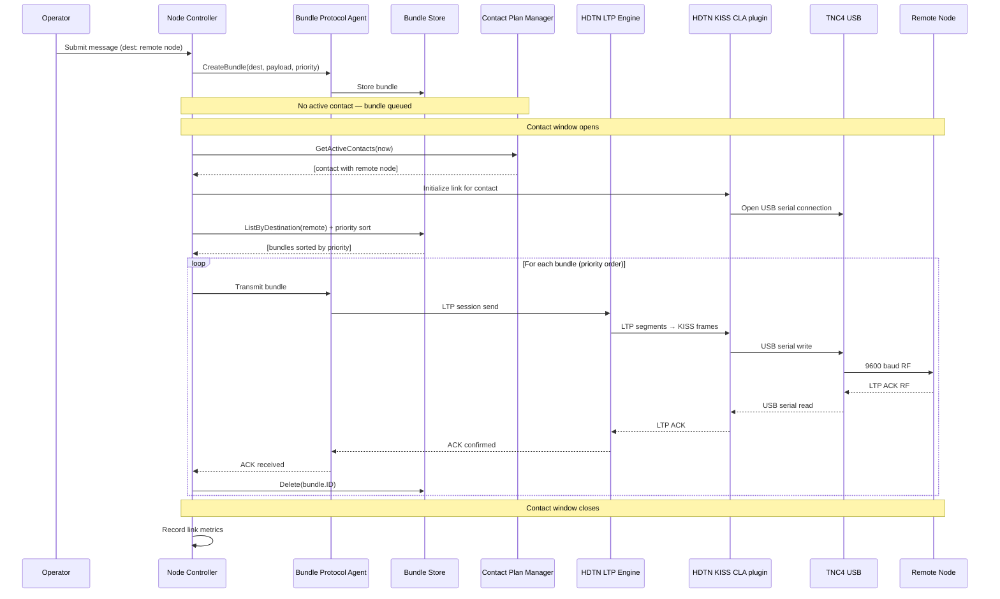

# Design Document: Terrestrial DTN Phase 1

## Overview

This design describes the Phase 1 terrestrial DTN validation system for amateur radio. The system deploys HDTN (NASA Glenn's High-rate Delay Tolerant Networking) on Linux or macOS hosts connected via USB to Mobilinkd TNC4 terminal node controllers, which drive Yaesu FT-817 radios at 9600 baud through the 9600 baud data port using G3RUH-compatible GFSK modulation on VHF/UHF amateur bands.

The system supports two core operations: **ping** (DTN reachability test — send a bundle echo request and receive an echo response) and **store-and-forward** (point-to-point bundle delivery during scheduled contact windows). There is **no relay functionality** — nodes do not forward bundles on behalf of other nodes. All bundle delivery is direct (source → destination).

The protocol stack is: BPv7 bundles over LTP sessions over KISS frames. Station identification for amateur radio regulatory compliance is achieved via callsign-embedded DTN Endpoint Identifiers (dtn://callsign-ssid) in the bundle primary block, plus periodic beacon bundles. LTP provides reliable transfer with deferred acknowledgment. No cryptographic operations are used (amateur radio regulations prohibit encryption and cryptography on transmitted signals).

All code is implemented in Go, targeting Linux and macOS (amd64/arm64). The system wraps HDTN's C++17 libraries via cgo for BPv7/LTP protocol operations, with Go managing the application-level orchestration, bundle store, contact plan, and node lifecycle. The KISS Convergence Layer Adapter (CLA) is HDTN's native KISS CLA — the HDTN KISS CLA plugin that wraps LTP segments in KISS frames for serial TNCs. This means HDTN directly handles bundle transmission and reception over KISS with no UDP intermediary. The CLA provides KISS framing as the link service layer below HDTN's LTP engine, sending and receiving LTP segments over KISS frames via the TNC4 USB serial connection. Station identification is achieved via callsign-embedded DTN Endpoint Identifiers (dtn://callsign-ssid) in every bundle's primary block. The bundle data path is: HDTN BPA → HDTN LTP → HDTN KISS CLA plugin → TNC4 USB → FT-817 radio. No UDP sockets are involved anywhere in the data path.

### Scope Boundaries

**In scope**: Linux/macOS ground nodes, Mobilinkd TNC4 (USB), Yaesu FT-817 (9600 baud), HDTN BPv7/LTP/KISS, HDTN's KISS CLA plugin for LTP-over-KISS framing, callsign-embedded DTN EIDs (dtn://callsign-ssid) for station identification, ping, store-and-forward, priority handling, bundle persistence, contact plan management, rate limiting, telemetry.

**Out of scope**: STM32U585 OBC, IQ baseband, SDR, Ettus B200mini, CGR orbital prediction, orbital mechanics, space segment (CubeSat, cislunar), S-band/X-band, flight hardware, relay functionality, UDP-based external CLA interfaces, cryptography (prohibited by amateur radio regulations).

## Architecture



### Node-to-Node Communication



## Sequence Diagrams

### Ping Operation



### Store-and-Forward Operation




## Components and Interfaces

### Component 1: Bundle Protocol Agent (BPA)

**Purpose**: Core DTN engine responsible for creating, receiving, validating, storing, and delivering BPv7 bundles. Wraps HDTN's C implementation via cgo. Supports three bundle types: data (store-and-forward), ping request, and ping response. Does not perform relay — bundles are not forwarded on behalf of other nodes.

**Interface**:
```go
// BundleID uniquely identifies a bundle.
type BundleID struct {
    SourceEID         EndpointID
    CreationTimestamp  uint64 // DTN epoch seconds
    SequenceNumber     uint64
}

// Priority levels for bundle handling.
type Priority int

const (
    PriorityBulk      Priority = 0
    PriorityNormal     Priority = 1
    PriorityExpedited  Priority = 2
    PriorityCritical   Priority = 3
)

// BundleType distinguishes operational bundle types.
type BundleType int

const (
    BundleTypeData         BundleType = 0 // store-and-forward payload
    BundleTypePingRequest  BundleType = 1 // echo request
    BundleTypePingResponse BundleType = 2 // echo response
)

// Bundle represents a BPv7 bundle.
type Bundle struct {
    ID          BundleID
    Destination EndpointID
    Payload     []byte
    Priority    Priority
    Lifetime    uint64     // seconds
    CreatedAt   uint64     // DTN epoch seconds
    Type        BundleType
    RawBytes    []byte     // serialized BPv7 wire format (CBOR)
}

// BundleProtocolAgent defines the BPA interface.
type BundleProtocolAgent interface {
    // CreateBundle creates a new data bundle for store-and-forward delivery.
    CreateBundle(dest EndpointID, payload []byte, priority Priority, lifetime uint64) (*Bundle, error)

    // CreatePing creates a ping echo request bundle.
    CreatePing(dest EndpointID) (*Bundle, error)

    // ValidateBundle checks BPv7 validity: version==7, valid EID, lifetime>0,
    // timestamp<=now, CRC correct. Returns nil if valid.
    ValidateBundle(b *Bundle) error

    // SerializeBundle encodes a Bundle to BPv7 wire format (CBOR).
    SerializeBundle(b *Bundle) ([]byte, error)

    // DeserializeBundle decodes BPv7 wire format back to a Bundle.
    DeserializeBundle(data []byte) (*Bundle, error)

    // GeneratePingResponse creates a ping response from a ping request.
    // The response destination is set to the request's source EID.
    // The request's BundleID is included in the response payload.
    GeneratePingResponse(request *Bundle) (*Bundle, error)
}
```

**Responsibilities**:
- Bundle creation with proper BPv7 headers, CBOR serialization, and endpoint addressing
- Bundle validation: version==7, valid destination EID, lifetime>0, timestamp<=now, CRC correct
- Serialization/deserialization round-trip (BPv7 CBOR wire format)
- Ping echo request/response handling
- Discard invalid bundles with logged reason and source EID

### Component 2: Bundle Store

**Purpose**: Persistent storage for bundles awaiting delivery. Persists to the local filesystem. Survives process restarts and power cycles. Provides priority-ordered retrieval and capacity-bounded eviction.

**Interface**:
```go
// StoreCapacity reports current store utilization.
type StoreCapacity struct {
    TotalBytes  uint64
    UsedBytes   uint64
    BundleCount uint64
}

// BundleStore defines the persistent bundle storage interface.
type BundleStore interface {
    // Store persists a bundle atomically to the filesystem.
    // Returns error if store is full and eviction cannot free space.
    Store(b *Bundle) error

    // Retrieve returns a bundle by its ID, or nil if not found.
    Retrieve(id BundleID) (*Bundle, error)

    // Delete removes a bundle from the store.
    Delete(id BundleID) error

    // ListByPriority returns all bundles sorted by priority (critical first).
    ListByPriority() ([]*Bundle, error)

    // ListByDestination returns bundles for a specific destination,
    // sorted by priority (critical first).
    ListByDestination(dest EndpointID) ([]*Bundle, error)

    // Capacity returns current store utilization.
    Capacity() (StoreCapacity, error)

    // EvictExpired removes all bundles whose lifetime has expired.
    // Returns the number of bundles evicted.
    EvictExpired(currentTime uint64) (int, error)

    // EvictLowestPriority removes the lowest-priority, oldest bundle.
    // Critical bundles are only evicted when no lower-priority bundles remain.
    // Returns the evicted bundle or nil if store is empty.
    EvictLowestPriority() (*Bundle, error)

    // Reload restores store state from the filesystem after a restart.
    // Validates store integrity and discards corrupted entries.
    Reload() error

    // Flush ensures all in-memory state is persisted to disk.
    Flush() error
}
```

**Responsibilities**:
- Atomic writes to prevent corruption on power loss (write-to-temp + rename)
- Priority-ordered index (critical > expedited > normal > bulk)
- Capacity enforcement: total stored bytes never exceeds configured maximum
- Eviction policy: expired bundles first, then lowest-priority with earliest timestamp
- Critical bundles preserved until all lower-priority bundles evicted
- Reload from filesystem on process restart with integrity validation

### Component 3: Contact Plan Manager

**Purpose**: Manages manually scheduled communication windows between terrestrial ground nodes. No CGR or orbital prediction — contact windows are configured by the operator in HDTN JSON contact plan format. Provides direct contact lookup for bundle delivery scheduling.

**Interface**:
```go
// LinkType identifies the radio band for a contact.
type LinkType int

const (
    LinkTypeVHF LinkType = 0 // LTP-over-KISS over VHF (9600 baud via TNC4 + FT-817)
    LinkTypeUHF LinkType = 1 // LTP-over-KISS over UHF (9600 baud via TNC4 + FT-817)
)

// ContactWindow represents a scheduled communication window.
type ContactWindow struct {
    ContactID  uint64
    RemoteNode NodeID
    StartTime  uint64 // epoch seconds
    EndTime    uint64 // epoch seconds
    DataRate   uint64 // bits per second
    Link       LinkType
}

// ContactPlan holds the full set of scheduled contacts.
type ContactPlan struct {
    PlanID    uint64
    ValidFrom uint64
    ValidTo   uint64
    Contacts  []ContactWindow
}

// ContactPlanManager defines the contact scheduling interface.
type ContactPlanManager interface {
    // LoadPlan loads a contact plan, replacing any existing plan.
    // Validates: all contacts within valid-from/valid-to, no overlaps on same link.
    LoadPlan(plan ContactPlan) error

    // LoadFromFile loads a contact plan from an HDTN JSON config file.
    LoadFromFile(path string) error

    // GetActiveContacts returns contacts active at the given time
    // (startTime <= t < endTime).
    GetActiveContacts(t uint64) ([]ContactWindow, error)

    // GetNextContact returns the earliest future contact with the given node.
    GetNextContact(node NodeID, afterTime uint64) (*ContactWindow, error)

    // FindDirectContact returns the next direct contact with the destination.
    // No multi-hop — returns a single contact or nil.
    FindDirectContact(dest EndpointID, afterTime uint64) (*ContactWindow, error)

    // UpdatePlan adds or updates a single contact window.
    // Rejects if it would create an overlap on the same link.
    UpdatePlan(contact ContactWindow) error

    // Persist saves the current plan to the filesystem.
    Persist() error

    // Reload restores the plan from the filesystem after restart.
    Reload() error
}
```

**Responsibilities**:
- Maintain time-tagged schedule of contact windows (manually configured)
- Validate contact plan: all windows within valid-from/valid-to, no overlapping contacts on same link
- Direct contact lookup for destination nodes (no multi-hop routing)
- Persist plan to filesystem, reload on restart
- Support HDTN JSON contact plan file format

### Component 4: Convergence Layer Adapter (CLA) — HDTN Native KISS CLA

**Purpose**: HDTN's native KISS CLA plugin that wraps LTP segments in KISS frames for serial TNCs. The CLA provides KISS framing as the link service layer below HDTN's LTP engine — it sends and receives LTP segments over KISS frames via the Mobilinkd TNC4 USB serial connection. Station identification is achieved via callsign-embedded DTN Endpoint Identifiers (dtn://callsign-ssid) in every bundle's primary block, not in the link-layer framing. HDTN directly handles bundle transmission and reception through the KISS CLA; there is no UDP intermediary anywhere in the data path. The Go Node Controller manages the CLA lifecycle (initialization, contact scheduling, telemetry, error recovery).

**HDTN Integration**:
- The CLA uses HDTN's KISS CLA to to transmit LTP segments as KISS frames over serial
- The CLA uses HDTN's KISS CLA to receive KISS frames (containing LTP segments) from serial and deliver them to HDTN's LTP engine
- HDTN's LTP engine handles segmentation, reassembly, retransmission, and acknowledgment natively — the KISS CLA only handles KISS framing and TNC4 serial I/O
- Station identification is in the DTN EID (dtn://callsign-ssid) in the bundle primary block, not in link-layer headers

**Interface**:
```go
// CLAStatus represents the current link state.
type CLAStatus int

const (
    CLAStatusIdle         CLAStatus = 0
    CLAStatusActive       CLAStatus = 1 // link service registered and operational
    CLAStatusError        CLAStatus = 2
)

// LinkMetrics captures link quality measurements.
type LinkMetrics struct {
    RSSI             int     // dBm
    SNR              float64 // dB
    BitErrorRate     float64
    BytesTransferred uint64
    FramesSent       uint64
    FramesReceived   uint64
}

// KISSCLAPlugin defines the Go-side management interface for HDTN's native KISS CLA.
// The actual CLA protocol logic is handled by HDTN's KISS CLA plugin.
// This interface manages the CLA lifecycle from the Go Node Controller.
type KISSCLAPlugin interface {
    // Init initializes the KISS CLA by configuring HDTN's KISS CLA plugin
    // with the TNC4 serial device path and baud rate.
    // Called once at node startup.
    Init(config CLAConfig) error

    // ActivateLink opens the TNC4 USB serial connection and signals HDTN
    // that the link service is available for the given contact window.
    // HDTN's LTP engine will begin sending segments through the KISS CLA.
    ActivateLink(contact ContactWindow) error

    // DeactivateLink signals HDTN that the link service is no longer available
    // and closes the TNC4 USB serial connection.
    DeactivateLink() error

    // Shutdown stops the KISS CLA programs and releases resources.
    Shutdown() error

    // Status returns the current CLA state.
    Status() CLAStatus

    // GetMetrics returns cumulative link metrics for the current session.
    GetMetrics() LinkMetrics

    // IsConnected returns true if the USB connection to TNC4 is active.
    IsConnected() bool
}

// CLAConfig holds configuration for the HDTN KISS CLA.
type CLAConfig struct {
    LocalEID        EndpointID    // DTN EID with callsign, e.g. dtn://g4dpz-1
    TNCDevice       string        // USB serial device path, e.g. "/dev/ttyACM0"
    TNCBaudRate     int           // 9600
    MaxFrameSize    int           // max KISS frame information field size
    RetryInterval   time.Duration // USB reconnection retry interval
}
```

**HDTN KISS CLA Plugin* (modular CLA architecture):
```
HDTN KISS CLA plugin (transmit path): wraps LTP segments in KISS frames and writes to TNC4 via USB serial.
HDTN KISS CLA plugin (receive path): reads KISS frames from TNC4 USB serial, extracts LTP segments,
             and delivers them to HDTN's LTP engine.
```

These are configured via HDTN's JSON configuration file with the TNC4 serial device path and baud rate. No custom C code is required — HDTN provides this functionality natively.

**Responsibilities**:
- Use HDTN's KISS CLA plugin for LTP-over-KISS framing
- KISS framing (FEND/CMD/DATA/FEND) wrapping LTP segments for TNC transport
- Station identification via callsign-embedded DTN EIDs (dtn://callsign-ssid) in every bundle's primary block
- USB serial interface to Mobilinkd TNC4 (not Bluetooth)
- Drive FT-817 at 9600 baud via TNC4 (G3RUH GFSK)
- Link quality monitoring (RSSI, SNR, BER, frame counts)
- Detect USB disconnection within 5 seconds, attempt reconnection at configurable interval
- No LTP segmentation/reassembly logic — HDTN's LTP engine handles that natively
- No UDP sockets — all data flows through HDTN's KISS CLA plugin

### Component 5: Node Controller

**Purpose**: Top-level orchestrator tying together BPA, Bundle Store, Contact Plan Manager, and CLA. Manages the autonomous operation cycle: check contacts, transmit queued bundles, receive incoming bundles, handle pings, expire old bundles, collect telemetry. Interfaces with HDTN's KISS CLA for link lifecycle management (activation/deactivation), while HDTN's internal stack handles the actual bundle transmission through the KISS CLA programs.

**Interface**:
```go
// NodeConfig holds the configuration for a terrestrial DTN node.
type NodeConfig struct {
    NodeID           NodeID
    Callsign         string    // Amateur radio callsign for DTN EID (e.g., "G4DPZ")
    SSID             uint8     // SSID for DTN EID (e.g., 1 → dtn://g4dpz-1)
    Endpoints        []EndpointID
    MaxStorageBytes  uint64   // bundle store capacity
    DefaultPriority  Priority
    CycleInterval    time.Duration // target: 100ms
    MaxBundleSize    uint64   // max accepted bundle size in bytes
    MaxBundleRate    float64  // max bundles/sec per source EID
    TNCDevice        string   // USB serial device path, e.g. "/dev/ttyACM0"
    TNCBaudRate      int      // 9600
    ContactPlanFile  string   // path to HDTN JSON contact plan file
    TelemetryPath    string   // path for telemetry output (file/socket)
    RetryInterval    time.Duration // USB reconnection retry interval
}

// NodeHealth reports current node health.
type NodeHealth struct {
    UptimeSeconds       uint64
    StorageUsedPercent  float64
    BundlesStored       uint64
    BundlesDelivered    uint64
    BundlesDropped      uint64 // expired + evicted
    LastContactTime     *uint64
}

// NodeStatistics reports cumulative statistics.
type NodeStatistics struct {
    TotalBundlesReceived uint64
    TotalBundlesSent     uint64
    TotalBytesReceived   uint64
    TotalBytesSent       uint64
    AverageLatencySeconds float64
    ContactsCompleted    uint64
    ContactsMissed       uint64
}

// NodeController defines the node orchestrator interface.
type NodeController interface {
    // Initialize sets up the node with the given configuration.
    Initialize(config NodeConfig) error

    // Run starts the main operation loop. Blocks until Shutdown is called.
    Run(ctx context.Context) error

    // RunCycle executes a single operation cycle (for testing).
    RunCycle(currentTime uint64) error

    // Shutdown gracefully stops the node, flushing store and closing CLA.
    Shutdown() error

    // Health returns current node health snapshot.
    Health() NodeHealth

    // Statistics returns cumulative node statistics.
    Statistics() NodeStatistics
}
```

**Responsibilities**:
- Orchestrate the check-contacts → activate-CLA-link → transmit → receive → cleanup cycle (target: 100ms)
- Manage CLA lifecycle: initialization, link activation/deactivation per contact window, shutdown
- Submit queued bundles to HDTN BPA in priority order during active contact windows
- Process incoming bundles delivered by HDTN: validate, store data bundles, handle ping requests
- Generate ping echo responses and queue for delivery
- Enforce rate limiting per source EID
- Enforce maximum bundle size
- Run bundle lifetime expiry cleanup
- Collect telemetry (including KISS CLA link metrics) and expose via local interface
- Handle USB disconnection detection and reconnection via KISS CLA
- Reload state from filesystem on restart
- No relay — direct delivery only


## Data Models

### EndpointID

```go
// EndpointID is a DTN endpoint identifier (dtn:// or ipn: scheme).
type EndpointID struct {
    Scheme string // "dtn" or "ipn"
    SSP    string // scheme-specific part, e.g. "//gs-alpha/mail"
}

// NodeID identifies a DTN node.
type NodeID string
```

### BPv7 Bundle Wire Format

```go
// PrimaryBlock is the BPv7 primary block (CBOR-encoded on the wire).
type PrimaryBlock struct {
    Version           uint8      // always 7
    BundleFlags       uint64
    CRCType           uint8      // 0=none, 1=CRC-16, 2=CRC-32
    Destination       EndpointID
    Source            EndpointID
    ReportTo          EndpointID
    CreationTimestamp  uint64     // DTN epoch seconds
    SequenceNumber     uint64
    Lifetime          uint64     // seconds
    CRC               []byte     // computed CRC value
}

// CanonicalBlock is a BPv7 extension or payload block.
type CanonicalBlock struct {
    BlockType   uint64
    BlockNumber uint64
    BlockFlags  uint64
    CRCType     uint8
    Data        []byte
    CRC         []byte
}

// BPv7Bundle is the full on-wire bundle structure.
type BPv7Bundle struct {
    Primary    PrimaryBlock
    Extensions []CanonicalBlock
    Payload    CanonicalBlock
}
```

**Validation Rules**:
- `Primary.Version` must equal 7
- `Primary.Destination` must be a well-formed EndpointID (non-empty scheme and SSP)
- `Primary.Lifetime` must be > 0
- `Primary.CreationTimestamp` must be ≤ current time
- CRC must validate if `CRCType` ≠ 0
- Total serialized bundle size must not exceed `NodeConfig.MaxBundleSize`

### Contact Plan Data Model

```go
// ContactPlan validation rules:
// - ValidFrom < ValidTo
// - All contacts fall within [ValidFrom, ValidTo]
// - No overlapping contacts on the same link for a given node
```

### Rate Limiter State

```go
// RateLimiter tracks bundle acceptance rates per source EID.
type RateLimiter struct {
    MaxRate     float64                    // bundles per second
    WindowSize  time.Duration              // sliding window
    Counts      map[EndpointID][]uint64    // timestamps of accepted bundles per source
}
```

## Key Functions

### Function 1: RunCycle (Main Operation Loop)

```go
func (nc *nodeController) RunCycle(currentTime uint64) error {
    // Step 1: Check for active contact windows
    // Step 2: For each active contact, activate CLA link and submit queued bundles
    //         to HDTN BPA in priority order (direct delivery only — no relay).
    //         HDTN's LTP engine transmits segments through the KISS CLA.
    // Step 3: Process incoming bundles delivered by HDTN (received via KISS CLA)
    //         - Data bundles: validate, store, deliver if local
    //         - Ping requests: generate echo response, queue for delivery
    // Step 4: Expire old bundles (lifetime enforcement)
    // Step 5: Flush store to disk
    // Step 6: Update telemetry (including CLA plugin link metrics)
    // Target: complete within 100ms
}
```

**Preconditions**:
- Node is initialized with valid config
- Contact plan is loaded
- CLA plugin is registered with HDTN's convergence layer framework
- TNC4/FT-817 hardware is operational or gracefully degraded

**Postconditions**:
- All deliverable bundles sent during active contacts (direct delivery only)
- Incoming bundles processed: data stored/delivered, pings answered
- Expired bundles removed
- Store persisted to filesystem
- Telemetry updated

### Function 2: ProcessIncomingBundle

```go
func (nc *nodeController) ProcessIncomingBundle(b *Bundle, currentTime uint64) error {
    // 1. Validate bundle (version, EID, lifetime, timestamp, CRC)
    //    (bundle received from HDTN BPA, which received it via LTP → KISS CLA)
    // 2. Check rate limit for source EID
    // 3. Check bundle size limit
    // 4. Check if expired (createdAt + lifetime <= currentTime)
    // 6. If ping request → generate echo response, store for delivery
    // 7. If destination is local → deliver to application agent
    // 8. If destination is remote → store for direct delivery during next contact
    // 9. No relay — never forward on behalf of other nodes
}
```

**Preconditions**:
- `b` is a received bundle delivered by HDTN (received via LTP → KISS CLA → TNC4)
- `currentTime` is the current epoch time

**Postconditions**:
- Valid bundles are stored or delivered
- Invalid/expired bundles are discarded with logged reason
- Rate-limited bundles are rejected with logged event
- Ping requests produce exactly one echo response queued for delivery
- Store consistency maintained

### Function 3: ExecuteContactWindow

```go
func (nc *nodeController) ExecuteContactWindow(contact ContactWindow, currentTime uint64) (sent int, bytesSent uint64, err error) {
    // 1. Activate CLA link for the contact (signals HDTN link service is available)
    // 2. Retrieve bundles destined for contact.RemoteNode, sorted by priority
    // 3. Submit each bundle to HDTN BPA for transmission while currentTime < contact.EndTime
    //    (HDTN's LTP engine sends segments through the KISS CLA)
    // 4. On ACK (reported by HDTN LTP): delete bundle from store
    // 5. On failure: stop sending, retain remaining bundles
    // 6. Deactivate CLA link (signals HDTN link service is no longer available)
    // 7. Record link metrics from KISS CLA
}
```

**Preconditions**:
- `contact.StartTime <= currentTime < contact.EndTime`
- CLA is initialized and registered with HDTN
- TNC4 USB connection is available (or gracefully degraded)

**Postconditions**:
- ACKed bundles deleted from store
- Unacknowledged bundles retained for retry
- `sent <= initial bundle count for destination`
- `bytesSent <= contact.DataRate * (contact.EndTime - contact.StartTime) / 8`
- Link metrics recorded from KISS CLA
- CLA link deactivated (HDTN notified link service is unavailable)

### Function 4: EvictBundles

```go
func (bs *bundleStore) EvictForSpace(requiredBytes uint64, currentTime uint64) (uint64, error) {
    // 1. Evict expired bundles first
    // 2. If still insufficient: evict bulk, then normal, then expedited
    // 3. Critical bundles evicted only when no lower-priority bundles remain
    // 4. Within same priority: evict oldest (earliest creation timestamp) first
    // Returns bytes freed
}
```

**Preconditions**:
- `requiredBytes > 0`
- Store is at or near capacity

**Postconditions**:
- `bytesFreed >= requiredBytes` if sufficient evictable bundles exist
- No critical bundles evicted unless all lower priorities exhausted
- Eviction order: expired → bulk → normal → expedited → critical
- Store consistency maintained

### Function 5: FindDirectContact

```go
func (cpm *contactPlanManager) FindDirectContact(dest EndpointID, afterTime uint64) (*ContactWindow, error) {
    // Linear scan of contacts sorted by start time.
    // Return earliest contact where RemoteNode matches dest and StartTime >= afterTime.
    // No multi-hop routing — single direct contact or nil.
}
```

**Preconditions**:
- Contact plan is loaded and valid
- `dest` is a valid endpoint ID

**Postconditions**:
- Returns the earliest future direct contact with destination, or nil
- Result is a single contact window (no multi-hop path)


## Correctness Properties

*A property is a characteristic or behavior that should hold true across all valid executions of a system — essentially, a formal statement about what the system should do. Properties serve as the bridge between human-readable specifications and machine-verifiable correctness guarantees.*

### Property 1: Bundle Serialization Round-Trip

*For any* valid BPv7 Bundle, serializing it to the CBOR wire format and then deserializing the wire format back SHALL produce a Bundle equivalent to the original.

**Validates: Requirements 1.5**

### Property 2: Bundle Store/Retrieve Round-Trip

*For any* valid Bundle, storing it in the Bundle Store and then retrieving it by its BundleID (source EID, creation timestamp, sequence number) SHALL produce a Bundle identical to the original.

**Validates: Requirements 2.2**

### Property 3: LTP-over-KISS Encapsulation Round-Trip

*For any* valid Bundle, encapsulating it into LTP segments over KISS frames (with LTP segmentation if the bundle exceeds a single KISS frame) and then reassembling the frames back into a bundle SHALL produce a Bundle equivalent to the original.

**Validates: Requirements 9.6**

### Property 4: Bundle Validation Correctness

*For any* Bundle, the BPA validation function SHALL accept the bundle if and only if its version equals 7, its destination is a well-formed EndpointID, its lifetime is greater than zero, its creation timestamp does not exceed the current time, and its CRC is correct. All other bundles SHALL be rejected.

**Validates: Requirements 1.2, 1.3**

### Property 5: Priority Ordering Invariant

*For any* set of bundles in the Bundle Store, listing them by priority or transmitting them during a contact window SHALL produce a sequence where each bundle's priority is greater than or equal to the next bundle's priority (critical > expedited > normal > bulk).

**Validates: Requirements 2.3, 5.3, 11.2**

### Property 6: Eviction Policy Ordering

*For any* Bundle Store at capacity, when eviction is triggered, expired bundles SHALL be evicted first, then bundles in ascending priority order (bulk before normal before expedited), and critical-priority bundles SHALL be preserved until all lower-priority bundles have been evicted. Within the same priority level, bundles with the earliest creation timestamp SHALL be evicted first.

**Validates: Requirements 2.4, 2.5, 11.3**

### Property 7: Store Capacity Bound

*For any* sequence of store and delete operations on the Bundle Store, the total stored bytes SHALL never exceed the configured maximum storage capacity.

**Validates: Requirements 2.6**

### Property 8: Bundle Lifetime Enforcement

*For any* set of bundles in the Bundle Store after a cleanup cycle completes, zero bundles SHALL have a creation timestamp plus lifetime less than or equal to the current time.

**Validates: Requirements 3.1, 3.2**

### Property 9: Ping Echo Correctness

*For any* ping request bundle received by the BPA addressed to a local endpoint, exactly one ping response bundle SHALL be generated with its destination set to the original sender's EndpointID, the original request's BundleID included in the response payload, and the response queued in the Bundle Store for delivery.

**Validates: Requirements 4.1, 4.2, 4.4**

### Property 10: Local vs Remote Delivery Routing

*For any* received data bundle, if the bundle's destination matches a local EndpointID, the BPA SHALL deliver it to the local application agent. If the destination is a remote EndpointID, the BPA SHALL store it in the Bundle Store for direct delivery during the next contact window with the destination node.

**Validates: Requirements 5.1, 5.2**

### Property 11: ACK Deletes, No-ACK Retains

*For any* bundle transmitted during a contact window, if the remote node acknowledges receipt via LTP, the bundle SHALL be deleted from the Bundle Store. If the transmission is not acknowledged within the LTP retransmission timeout, the bundle SHALL remain in the Bundle Store for retry during the next contact window.

**Validates: Requirements 5.4, 5.5**

### Property 12: No Relay — Direct Delivery Only

*For any* bundle transmitted during any contact window, the contact's remote node SHALL match the bundle's final destination EndpointID. No bundle SHALL be forwarded on behalf of other nodes, and all contact lookups SHALL return single-hop direct contacts only.

**Validates: Requirements 6.1, 6.2**

### Property 13: Active Contacts Query Correctness

*For any* contact plan and query time t, the active contacts query SHALL return exactly those contact windows whose start time is at or before t and whose end time is after t — no more, no fewer.

**Validates: Requirements 7.2**

### Property 14: Next Contact Lookup Correctness

*For any* contact plan, destination node, and current time, the next-contact lookup SHALL return the earliest future contact window matching that destination, or nil if no such contact exists.

**Validates: Requirements 7.3**

### Property 15: Contact Plan Validity Invariants

*For any* valid contact plan, all contact windows SHALL fall within the plan's valid-from and valid-to time range, and no two contacts on the same link for a given node SHALL overlap in time.

**Validates: Requirements 7.4, 7.5**

### Property 16: No Transmission After Window End

*For any* contact window and transmission sequence, no bundle transmission SHALL occur after the contact window's end time has been reached.

**Validates: Requirements 8.2**

### Property 17: Missed Contact Retains Bundles

*For any* scheduled contact window where the CLA fails to establish a link, all bundles queued for that contact's destination SHALL remain in the Bundle Store, and the contacts-missed counter SHALL be incremented by exactly one.

**Validates: Requirements 8.4**

### Property 18: DTN EID Callsign Validation

*For any* bundle transmitted through the CLA, the bundle's primary block SHALL carry a valid DTN Endpoint Identifier (dtn://callsign-ssid) containing a valid amateur radio callsign as the source EID.

**Validates: Requirements 9.1**

### Property 19: Rate Limiting

*For any* sequence of bundle submissions from a single source EndpointID, if the submission rate exceeds the configured maximum bundles per second, the BPA SHALL reject bundles beyond the rate limit while accepting bundles within the limit.

**Validates: Requirements 12.1, 12.2**

### Property 22: Bundle Size Limit

*For any* bundle whose total serialized size exceeds the configured maximum bundle size, the BPA SHALL reject the bundle.

**Validates: Requirements 12.3**

### Property 23: Statistics Monotonicity and Consistency

*For any* sequence of node operations, the cumulative statistics (total bundles received, total bundles sent, total bytes received, total bytes sent, contacts completed, contacts missed) SHALL be monotonically non-decreasing.

**Validates: Requirements 13.1, 13.2**

### Property 24: Bundle Retention When No Contact Available

*For any* bundle whose destination has no direct contact window in the current contact plan, the Bundle Store SHALL retain the bundle until a contact window with that destination is added to the plan or the bundle's lifetime expires.

**Validates: Requirements 14.5**


## Error Handling

### Error Scenario 1: Store Full

**Condition**: Bundle Store reaches configured maximum capacity when a new bundle arrives.
**Response**: Invoke eviction policy — remove expired bundles first, then lowest-priority bundles (bulk → normal → expedited). Critical bundles evicted only as last resort.
**Recovery**: If eviction frees sufficient space, store the new bundle. If not (e.g., store is full of critical bundles), reject the incoming bundle and return a storage-full error. If the LTP session is still active, signal the error to the sender. Log the event for telemetry.

### Error Scenario 2: Contact Window Missed

**Condition**: KISS CLA fails to establish LTP link service during a scheduled contact window (TNC4 not responding, radio not keyed, no KISS connection established via TNC4 USB serial).
**Response**: Mark the contact as missed in statistics. Retain all queued bundles for the next available contact window with the same destination. Increment `ContactsMissed` counter.
**Recovery**: Bundles remain in store for delivery during the next contact. If consecutive misses exceed a configurable threshold, log a health alert.

### Error Scenario 3: Bundle Corruption (CRC Failure)

**Condition**: CRC validation fails on a received bundle.
**Response**: Discard the corrupted bundle. Log the corruption event with the source EndpointID and link metrics (RSSI, SNR, BER).
**Recovery**: The sender retains the bundle (LTP will not receive an ACK) and retransmits during the next contact window. No store state change on the receiving node.

### Error Scenario 4: USB Disconnection (TNC4)

**Condition**: USB connection to the Mobilinkd TNC4 is lost during operation.
**Response**: KISS CLA detects disconnection within 5 seconds. Mark the current contact as interrupted. Retain all queued bundles. HDTN's LTP engine is notified that the link service is unavailable.
**Recovery**: KISS CLA attempts to re-establish the USB connection at the configured retry interval. Once reconnected, the CLA re-registers the link service with HDTN and normal operation resumes. Bundles queued during disconnection are delivered during the next available contact window.

### Error Scenario 6: Process Crash and Restart

**Condition**: The Node Controller process crashes or is killed.
**Response**: On restart, the Node Controller reloads the Bundle Store and Contact Plan Manager state from the local filesystem.
**Recovery**: Bundle Store validates integrity of persisted bundles (discards any corrupted entries from partial writes). Contact plan is reloaded from the persisted file. Normal operation resumes without manual intervention. Any bundle that was partially transmitted is retransmitted in full during the next contact.

### Error Scenario 7: No Direct Contact Available

**Condition**: No direct contact window exists in the current contact plan for a bundle's destination.
**Response**: Bundle remains in the store, marked as undeliverable in the queue.
**Recovery**: Re-evaluate when the contact plan is updated (operator adds new contacts). If the bundle's lifetime expires before a contact becomes available, the bundle is evicted during the next cleanup cycle.

### Error Scenario 8: Rate Limit Exceeded

**Condition**: A source EndpointID submits bundles faster than the configured maximum rate.
**Response**: Reject additional bundles from that source. Log the rate-limit event with the source EID and current rate.
**Recovery**: Bundles within the rate limit continue to be accepted. The rate limiter resets as the sliding window advances.

### Error Scenario 9: Oversized Bundle

**Condition**: A received bundle's total serialized size exceeds the configured maximum.
**Response**: Reject the bundle before storing. Log the rejection with the source EID and bundle size.
**Recovery**: No state change. The sender may re-send with a smaller payload.

## Testing Strategy

### Unit Testing

Test each component in isolation with example-based tests:

- **BPA**: Bundle creation with all three types (data, ping request, ping response). Validation with valid and invalid bundles (wrong version, empty EID, zero lifetime, future timestamp, bad CRC). Default priority assignment.
- **Bundle Store**: Store/retrieve/delete operations. Priority-ordered listing. Capacity enforcement. Eviction with mixed priorities. Reload after simulated restart.
- **Contact Plan Manager**: Load plan with valid/invalid contacts. Active contact queries at boundary times. Next contact lookup. Overlap rejection. HDTN format file parsing.
- **CLA**: KISS frame construction via HDTN's KISS CLA plugin. HDTN KISS CLA configuration and operation. LTP link service adapter interface compliance. TNC4 USB serial I/O. Link metrics collection. No UDP socket tests — all data flows through HDTN's KISS CLA plugin.
- **Node Controller**: Single cycle execution. Ping request/response flow. Rate limiting. Bundle size rejection.
- **Rate Limiter**: Acceptance within limit. Rejection beyond limit. Sliding window reset.

### Property-Based Testing

**Library**: [rapid](https://github.com/flyingmutant/rapid) — a Go property-based testing library inspired by Hypothesis.

**Configuration**: Minimum 100 iterations per property test.

**Tag format**: Each test is tagged with a comment referencing the design property:
```go
// Feature: terrestrial-dtn-phase1, Property 1: Bundle Serialization Round-Trip
```

Key property tests:

1. **Bundle serialization round-trip** (Property 1): Generate random valid Bundles, serialize to CBOR, deserialize, assert equality.
2. **Bundle store/retrieve round-trip** (Property 2): Generate random Bundles, store, retrieve by ID, assert equality.
3. **LTP-over-KISS encapsulation round-trip** (Property 3): Generate random Bundles of varying sizes, pass through HDTN's LTP engine and the HDTN KISS CLA plugin, reassemble via HDTN's LTP, assert equality.
4. **Validation correctness** (Property 4): Generate random Bundles with random field mutations, verify validator accepts iff all fields are valid.
5. **Priority ordering** (Property 5): Generate random bundle sets with random priorities, store, list by priority, verify non-increasing priority sequence.
6. **Eviction ordering** (Property 6): Generate random stores at capacity with mixed priorities, trigger eviction, verify expired first then ascending priority order, critical last.
7. **Capacity bound** (Property 7): Generate random store/delete operation sequences, verify total bytes never exceeds max after each operation.
8. **Lifetime enforcement** (Property 8): Generate random bundles with random lifetimes, advance time, run cleanup, verify zero expired bundles remain.
9. **Ping echo correctness** (Property 9): Generate random ping requests with random source EIDs, process, verify exactly one response with correct dest and request ID in payload.
10. **Local vs remote routing** (Property 10): Generate random bundles with destinations matching and not matching local EIDs, verify correct routing.
11. **ACK/no-ACK behavior** (Property 11): Generate random transmission scenarios with random ACK outcomes, verify ACKed bundles deleted and unACKed retained.
12. **No relay** (Property 12): Generate random bundles and contacts, verify bundles only transmitted to contacts matching their destination.
13. **Active contacts query** (Property 13): Generate random contact plans and query times, verify returned set is exactly the active contacts.
14. **Next contact lookup** (Property 14): Generate random plans, destinations, times, verify result is earliest future matching contact.
15. **Contact plan validity** (Property 15): Generate random contact plans, verify all contacts within valid range and no overlaps on same link.
16. **No transmission after window end** (Property 16): Generate random contact windows and time sequences, verify no transmission after end time.
17. **Missed contact retains bundles** (Property 17): Generate random failed contacts, verify bundles retained and missed counter incremented.
18. **DTN EID callsign validation** (Property 18): Generate random bundles, transmit through the HDTN KISS CLA, verify output bundles carry valid DTN EIDs (dtn://callsign-ssid) with valid source callsigns.
19. **Rate limiting** (Property 19): Generate random submission sequences at various rates, verify correct acceptance/rejection.
22. **Bundle size limit** (Property 22): Generate random bundles of varying sizes, verify oversized rejected.
23. **Statistics monotonicity** (Property 23): Generate random operation sequences, verify cumulative stats are non-decreasing.
24. **Bundle retention without contact** (Property 24): Generate bundles with no matching contacts, verify retention until contact added or lifetime expires.

### Integration Testing

- **End-to-end store-and-forward**: Two nodes exchange data bundles over the HDTN stack (BPA → LTP → KISS CLA) using simulated TNC4 serial I/O during a contact window.
- **End-to-end ping**: Node A pings Node B through the full HDTN stack, receives echo response, measures RTT.
- **Contact window lifecycle**: Schedule a contact, verify KISS CLA link activation, HDTN LTP session establishment, bundle transmission through KISS CLA, link deactivation, and metrics recording.
- **HDTN KISS CLA operation: Verify the KISS CLA plugin correctly interfaces with HDTN's convergence layer framework and handle LTP segment transmission/reception.
- **Crash recovery**: Populate store and contact plan, kill process, restart, verify state recovered and operation resumes.
- **USB disconnection**: Simulate TNC4 USB disconnect, verify KISS CLA detection within 5 seconds, bundle retention, and reconnection.
- **HDTN format parsing**: Load a real HDTN JSON contact plan file, verify correct interpretation.

### Performance Benchmarks

- Node Controller cycle time: target ≤ 100ms
- Bundle Store single store/retrieve: target ≤ 10ms
- BPA validation per bundle: target ≤ 5ms
- Telemetry query response: target ≤ 1 second

