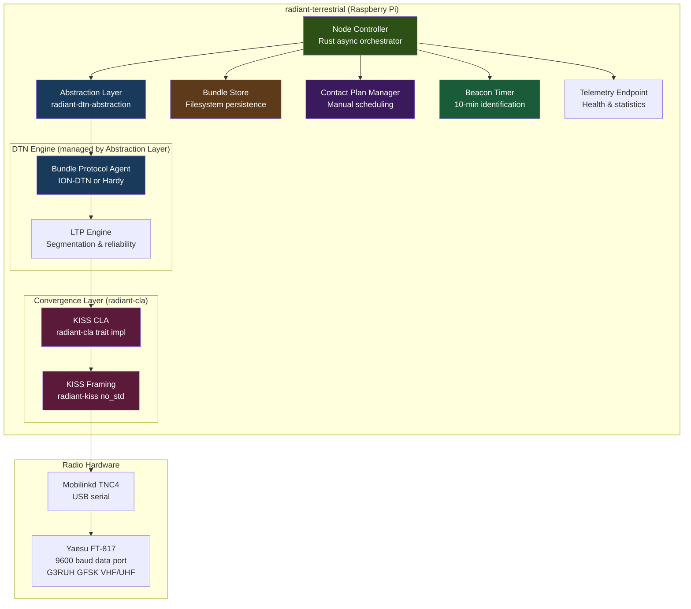
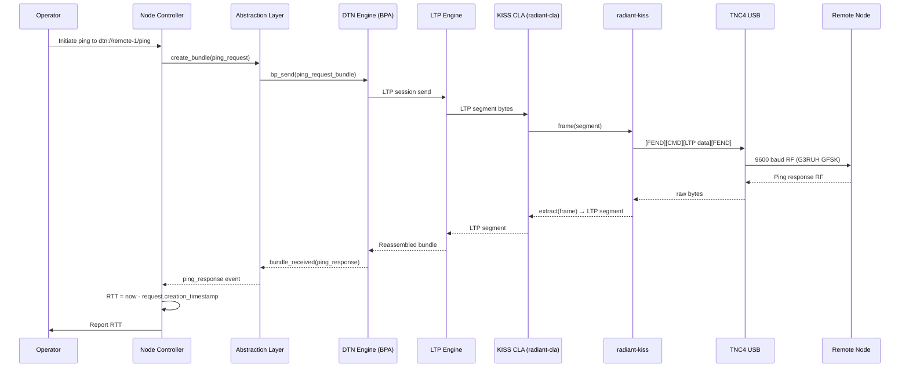
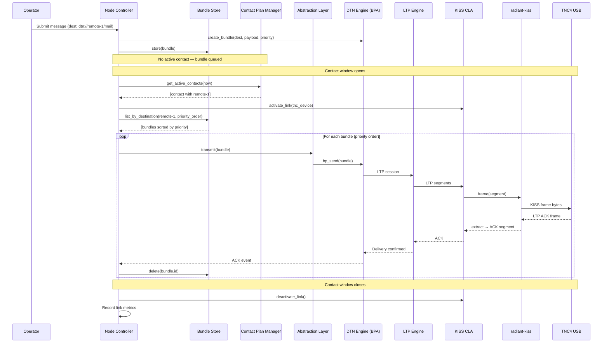
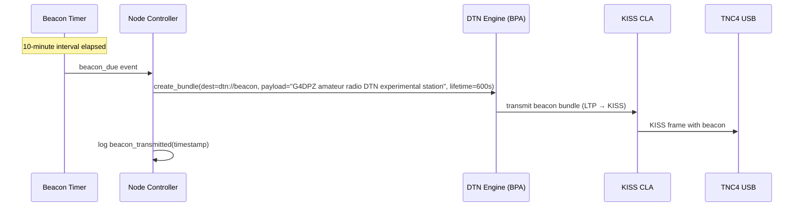

# Design Document: Terrestrial DTN Phase 1

## Overview

This design describes the Phase 1 terrestrial DTN validation system for amateur radio. The system is a configured instance of the RADIANT DTN abstraction layer (`radiant-dtn-abstraction`) running on Raspberry Pi hosts connected via USB to Mobilinkd TNC4 terminal node controllers, which drive Yaesu FT-817 radios at 9600 baud through the 9600 baud data port using G3RUH-compatible GFSK modulation on VHF/UHF amateur bands.

The system supports two core operations: **ping** (DTN reachability test) and **store-and-forward** (point-to-point bundle delivery during scheduled contact windows). There is **no relay functionality** — nodes do not forward bundles on behalf of other nodes. All bundle delivery is direct (source → destination).

The protocol stack is:

```
┌─────────────────────────────────────┐
│   Application (ping, store-and-fwd) │
├─────────────────────────────────────┤
│   BPv7 (Bundle Protocol v7)         │
│   EID: dtn://callsign-ssid/service  │
│   CRC integrity check               │
├─────────────────────────────────────┤
│   LTP (Licklider Transmission)      │
│   LTP checksum                      │
├─────────────────────────────────────┤
│   KISS (radiant-kiss, no_std)       │
├─────────────────────────────────────┤
│   USB Serial (TNC4)                 │
├─────────────────────────────────────┤
│   G3RUH GFSK (9600 baud)           │
└─────────────────────────────────────┘
```

**No cryptographic operations are permitted over amateur radio links.** Per amateur radio regulations (ITU Article 25, FCC Part 97.113) and project steering constraints, there is no BPSec, no HMAC, no digital signatures, and no encryption of any kind. Protection against accidental corruption relies solely on CRC validation: BPv7 bundle CRC (RFC 9171 §5.2) and LTP checksums (RFC 5326). All transmitted data is fully inspectable by any third party with knowledge of the published protocol specifications.

**Key design decisions:**

1. **Rust** — All components implemented in Rust using the RADIANT crate ecosystem (`radiant-dtn-abstraction`, `radiant-kiss`, `radiant-cla`)
2. **KISS framing (NO AX.25)** — LTP segments wrapped directly in KISS frames via `radiant-kiss` (a `no_std` crate designed for eventual STM32U585 flight hardware)
3. **DTN Abstraction Layer** — The binary is a configured instance of `radiant-dtn-abstraction` with a KISS CLA backend adapter, canonical YAML/JSON config, and backend adapters for ION-DTN or Hardy
4. **Callsign-EID station identification** — `dtn://callsign-ssid/service` format in every bundle primary block; no AX.25 addressing required
5. **Manual contact plans** — No CGR orbital prediction; operator-configured contact windows in the canonical config format
6. **CRC-only corruption protection** — BPv7 bundle CRC and LTP checksums provide error detection; no cryptographic integrity mechanisms
7. **Periodic beacon** — Beacon bundle every 10 minutes for regulatory station identification compliance

### Scope Boundaries

**In scope**: Raspberry Pi ground nodes, Mobilinkd TNC4 (USB), Yaesu FT-817 (9600 baud G3RUH), DTN abstraction layer with ION-DTN/Hardy backend, KISS CLA (`radiant-cla` + `radiant-kiss`), ping, store-and-forward, priority handling, bundle persistence, contact plan management, rate limiting, telemetry, CRC validation, beacon timer.

**Out of scope**: STM32U585 OBC, IQ baseband, SDR, Ettus B200mini, CGR orbital prediction, orbital mechanics, space segment (CubeSat, cislunar), S-band/X-band, flight hardware, relay/forwarding, AX.25, any cryptography (BPSec, HMAC, encryption, digital signatures).

## Architecture

The terrestrial Phase 1 binary (`radiant-terrestrial`) is a configured instance of the DTN abstraction layer. It composes the following subsystems:



### Node-to-Node Communication

```mermaid
graph LR
    subgraph "Node A (Raspberry Pi)"
        A_NC[Node Controller] --> A_AL[Abstraction Layer]
        A_AL --> A_BPA[DTN Engine BPA]
        A_BPA --> A_LTP[LTP Engine]
        A_LTP --> A_CLA[KISS CLA]
        A_CLA --> A_KISS[radiant-kiss]
        A_KISS --> A_TNC[TNC4 USB]
        A_TNC --> A_FT[FT-817]
    end

    A_FT <-->|"KISS/LTP frames<br/>9600 baud VHF/UHF<br/>NO AX.25"| B_FT

    subgraph "Node B (Raspberry Pi)"
        B_FT[FT-817] --> B_TNC[TNC4 USB]
        B_TNC --> B_KISS[radiant-kiss]
        B_KISS --> B_CLA[KISS CLA]
        B_CLA --> B_LTP[LTP Engine]
        B_LTP --> B_BPA[DTN Engine BPA]
        B_BPA --> B_AL[Abstraction Layer]
        B_AL --> B_NC[Node Controller]
    end
```



### Relationship to DTN Abstraction Layer

The terrestrial Phase 1 binary does not reimplement DTN engine management — it instantiates the abstraction layer with specific configuration:

| Abstraction Layer Feature | Phase 1 Configuration |
|---|---|
| Backend adapter | ION-DTN adapter (primary) or Hardy adapter (alternative) |
| Convergence layer | `ConvergenceLayerLink::Kiss` — TNC4 USB serial |
| Routing strategy | `RoutingStrategy::Static` — manual contact plan |
| Contact plan | Operator-configured YAML, loaded via `ContactPlan` model |
| Security policy | None — no BPSec, no cryptography; CRC-only corruption detection |
| Endpoint ID | `EndpointId::Dtn { authority: "callsign-ssid", path: "service" }` |
| Event bus | Subscribed for link state changes, engine state changes |
| Telemetry | `collect_stats()` + `link_states()` merged with local metrics |

## Sequence Diagrams

### Ping Operation



### Store-and-Forward Operation



### Beacon Transmission



## Components and Interfaces

### Component 1: Node Controller (`radiant-terrestrial` binary)

**Purpose**: Top-level async Rust orchestrator binary. Instantiates the DTN abstraction layer, bundle store, contact plan manager, beacon timer, and KISS CLA. Runs the autonomous operation cycle: check contacts, transmit queued bundles, process received bundles, handle pings, expire old bundles, fire beacons, collect telemetry.

```rust
use radiant_dtn_abstraction::{
    NetworkConfiguration, BackendAdapter, AdapterRegistry,
    BundleStatistics, LinkState, EngineState, EventBus, DtnEvent,
};
use radiant_cla::ConvergenceLayerAdapter;
use radiant_kiss::KissFramer;
use tokio::time::{interval, Duration};

/// Top-level node configuration loaded from canonical YAML/JSON.
#[derive(Debug, Clone, serde::Serialize, serde::Deserialize)]
pub struct TerrestrialNodeConfig {
    /// Canonical DTN abstraction layer config
    pub network: NetworkConfiguration,
    /// Local node operational parameters
    pub node: NodeOperationalConfig,
}

#[derive(Debug, Clone, serde::Serialize, serde::Deserialize)]
pub struct NodeOperationalConfig {
    /// Callsign EID: dtn://callsign-ssid/service
    pub callsign_eid: String,
    /// Bundle store filesystem path
    pub store_path: std::path::PathBuf,
    /// Maximum bundle store capacity in bytes
    pub max_storage_bytes: u64,
    /// Maximum accepted bundle size in bytes
    pub max_bundle_size: u64,
    /// Maximum bundle acceptance rate per source EID (bundles/sec)
    pub max_bundle_rate: f64,
    /// Default bundle priority
    pub default_priority: Priority,
    /// Operation cycle interval (target: 100ms)
    pub cycle_interval_ms: u64,
    /// Beacon interval in seconds (default: 600 = 10 minutes)
    pub beacon_interval_secs: u64,
    /// Beacon payload text
    pub beacon_text: String,
    /// TNC4 USB device path
    pub tnc_device: String,
    /// TNC4 baud rate (9600)
    pub tnc_baud_rate: u32,
    /// USB reconnection retry interval in seconds
    pub usb_retry_interval_secs: u64,
    /// Telemetry output path (file or unix socket)
    pub telemetry_path: String,
    /// DTN engine restart backoff interval in seconds
    pub engine_restart_backoff_secs: u64,
}

/// Bundle priority levels.
#[derive(Debug, Clone, Copy, PartialEq, Eq, PartialOrd, Ord, serde::Serialize, serde::Deserialize)]
pub enum Priority {
    Bulk = 0,
    Normal = 1,
    Expedited = 2,
    Critical = 3,
}

/// Node Controller — the main orchestrator.
pub struct NodeController {
    config: TerrestrialNodeConfig,
    adapter: Arc<dyn BackendAdapter>,
    store: BundleStore,
    contact_plan: ContactPlanManager,
    beacon_timer: BeaconTimer,
    cla: KissCla,
    telemetry: TelemetryCollector,
    event_bus: EventBus,
}

impl NodeController {
    /// Initialize the node from canonical config.
    pub async fn new(config: TerrestrialNodeConfig) -> Result<Self, NodeError>;

    /// Run the main async event loop. Blocks until shutdown signal.
    pub async fn run(&mut self, shutdown: tokio::sync::watch::Receiver<bool>) -> Result<(), NodeError>;

    /// Execute a single operation cycle (for testing).
    pub async fn run_cycle(&mut self, current_time: u64) -> Result<CycleMetrics, NodeError>;

    /// Graceful shutdown: flush store, deactivate CLA, stop engine.
    pub async fn shutdown(&mut self) -> Result<(), NodeError>;

    /// Current health snapshot.
    pub fn health(&self) -> NodeHealth;

    /// Cumulative statistics.
    pub fn statistics(&self) -> NodeStatistics;
}
```

**Responsibilities**:
- Orchestrate check-contacts → activate-CLA → transmit → receive → cleanup cycle (target: 100ms)
- Configure and manage DTN engine through abstraction layer lifecycle operations
- Submit queued bundles in priority order during active contact windows (direct delivery only)
- Process incoming bundles: validate CRC, store data bundles, handle ping requests
- Generate ping echo responses and queue for delivery
- Fire beacon bundles every 10 minutes
- Enforce rate limiting per source EID and maximum bundle size
- Run bundle lifetime expiry cleanup
- Validate bundle CRC on reception (no cryptographic verification)
- Collect telemetry (engine stats + CLA link metrics) and expose via local interface
- Handle USB disconnection detection and reconnection
- Reload state from filesystem on restart
- No relay — direct delivery only

### Component 2: KISS Convergence Layer Adapter (`KissCla`)

**Purpose**: Implements the `radiant-cla` convergence layer trait for KISS-framed LTP over USB serial. Uses `radiant-kiss` (a `no_std` crate) for KISS frame encoding/decoding. LTP segments are wrapped directly in KISS frames — no AX.25 layer.

```rust
use radiant_cla::ConvergenceLayerAdapter;
use radiant_kiss::{KissFrame, KissEncoder, KissDecoder, FEND, FESC, TFEND, TFESC};

/// KISS CLA configuration.
#[derive(Debug, Clone, serde::Serialize, serde::Deserialize)]
pub struct KissClaConfig {
    /// USB serial device path (e.g., "/dev/ttyACM0")
    pub tnc_device: String,
    /// Baud rate (9600 for TNC4 + FT-817)
    pub baud_rate: u32,
    /// Local LTP engine ID
    pub local_engine_id: u64,
    /// Remote LTP engine ID
    pub remote_engine_id: u64,
    /// Maximum KISS frame payload size in bytes
    pub max_frame_size: u32,
    /// USB reconnection retry interval
    pub retry_interval: Duration,
}

/// Link status for the KISS CLA.
#[derive(Debug, Clone, Copy, PartialEq, Eq)]
pub enum ClaStatus {
    Idle,
    Active,
    Error,
    Disconnected,
}

/// Cumulative link metrics.
#[derive(Debug, Clone, Default, serde::Serialize, serde::Deserialize)]
pub struct LinkMetrics {
    pub bytes_sent: u64,
    pub bytes_received: u64,
    pub frames_sent: u64,
    pub frames_received: u64,
    pub framing_errors: u64,
}

/// KISS CLA implementing the radiant-cla trait.
pub struct KissCla {
    config: KissClaConfig,
    status: ClaStatus,
    metrics: LinkMetrics,
    serial: Option<SerialPort>,
    encoder: KissEncoder,
    decoder: KissDecoder,
}

impl ConvergenceLayerAdapter for KissCla {
    /// Send an LTP segment wrapped in a KISS frame.
    async fn send_segment(&mut self, segment: &[u8]) -> Result<(), ClaError>;

    /// Receive the next LTP segment from a KISS frame.
    async fn recv_segment(&mut self) -> Result<Vec<u8>, ClaError>;

    /// Activate the link (open USB serial connection).
    async fn activate(&mut self) -> Result<(), ClaError>;

    /// Deactivate the link (close USB serial connection).
    async fn deactivate(&mut self) -> Result<(), ClaError>;

    /// Check if the link is currently active.
    fn is_active(&self) -> bool;
}

impl KissCla {
    pub fn new(config: KissClaConfig) -> Self;
    pub fn status(&self) -> ClaStatus;
    pub fn metrics(&self) -> &LinkMetrics;
    pub fn reset_metrics(&mut self);
}
```

**KISS Frame Format** (from `radiant-kiss`):

```
[FEND] [CMD] [LTP segment data...] [FEND]

FEND = 0xC0 (frame boundary)
CMD  = 0x00 (data frame, port 0)
Byte stuffing:
  0xC0 in data → 0xDB 0xDC (FESC + TFEND)
  0xDB in data → 0xDB 0xDD (FESC + TFESC)
```

**Responsibilities**:
- Wrap outbound LTP segments in KISS frames (FEND + CMD + data + FEND with byte stuffing)
- Extract inbound LTP segments from KISS frames (detect FEND boundaries, reverse byte stuffing)
- Interface with TNC4 via USB serial (`/dev/ttyACM0` at 9600 baud)
- Detect USB disconnection within 5 seconds
- Attempt USB reconnection at configurable retry interval
- Track link metrics (bytes, frames, framing errors)
- NO AX.25 framing, headers, or addressing

### Component 3: Bundle Store

**Purpose**: Persistent priority-ordered storage for bundles awaiting delivery. Uses the local filesystem with atomic writes (write-to-temp + rename). Survives process restarts and power cycles.

```rust
/// Unique bundle identifier.
#[derive(Debug, Clone, PartialEq, Eq, Hash, serde::Serialize, serde::Deserialize)]
pub struct BundleId {
    pub source_eid: String,
    pub creation_timestamp: u64,
    pub sequence_number: u64,
}

/// Bundle metadata stored alongside the raw bundle bytes.
#[derive(Debug, Clone, serde::Serialize, serde::Deserialize)]
pub struct BundleRecord {
    pub id: BundleId,
    pub destination_eid: String,
    pub priority: Priority,
    pub lifetime_secs: u64,
    pub creation_timestamp: u64,
    pub size_bytes: u64,
    pub bundle_type: BundleType,
}

#[derive(Debug, Clone, Copy, PartialEq, Eq, serde::Serialize, serde::Deserialize)]
pub enum BundleType {
    Data,
    PingRequest,
    PingResponse,
}

/// Store capacity report.
#[derive(Debug, Clone)]
pub struct StoreCapacity {
    pub total_bytes: u64,
    pub used_bytes: u64,
    pub bundle_count: u64,
}

/// Bundle Store trait.
pub trait BundleStoreOps {
    /// Persist a bundle atomically (write-to-temp + rename).
    fn store(&mut self, record: &BundleRecord, raw_bytes: &[u8]) -> Result<(), StoreError>;

    /// Retrieve a bundle by ID.
    fn retrieve(&self, id: &BundleId) -> Result<Option<(BundleRecord, Vec<u8>)>, StoreError>;

    /// Delete a bundle.
    fn delete(&mut self, id: &BundleId) -> Result<(), StoreError>;

    /// List bundles for a destination, sorted by priority (critical first).
    fn list_by_destination(&self, dest_eid: &str) -> Result<Vec<BundleRecord>, StoreError>;

    /// List all bundles sorted by priority.
    fn list_by_priority(&self) -> Result<Vec<BundleRecord>, StoreError>;

    /// Current capacity utilization.
    fn capacity(&self) -> StoreCapacity;

    /// Evict all expired bundles. Returns count evicted.
    fn evict_expired(&mut self, current_time: u64) -> Result<u64, StoreError>;

    /// Evict lowest-priority, oldest bundles to free `required_bytes`.
    /// Critical bundles only evicted when no lower-priority remain.
    fn evict_for_space(&mut self, required_bytes: u64) -> Result<u64, StoreError>;

    /// Reload store state from filesystem (after restart).
    fn reload(&mut self) -> Result<(), StoreError>;
}
```

**Responsibilities**:
- Atomic writes: write to temp file, fsync, rename — prevents corruption on power loss
- Priority-ordered index: critical > expedited > normal > bulk
- Capacity enforcement: total bytes ≤ configured max
- Eviction policy: expired first, then lowest-priority with earliest creation timestamp
- Critical bundles preserved until all lower-priority evicted
- Reload from filesystem on process restart with integrity validation

### Component 4: Contact Plan Manager

**Purpose**: Manages manually scheduled communication windows between terrestrial nodes. No CGR or orbital prediction. Contact plans are loaded from the canonical YAML/JSON config format (compatible with `radiant-dtn-abstraction` `ContactPlan` model).

```rust
use radiant_dtn_abstraction::model::{Contact, ContactPlan};

/// Link type for terrestrial contacts.
#[derive(Debug, Clone, Copy, PartialEq, Eq, serde::Serialize, serde::Deserialize)]
pub enum LinkType {
    Vhf,
    Uhf,
}

/// Extended contact window with terrestrial-specific metadata.
#[derive(Debug, Clone, serde::Serialize, serde::Deserialize)]
pub struct ContactWindow {
    pub remote_node_eid: String,
    pub remote_node_number: u64,
    pub start_time: u64,
    pub end_time: u64,
    pub rate_bps: u64,
    pub link_type: LinkType,
}

/// Contact Plan Manager trait.
pub trait ContactPlanOps {
    /// Load a contact plan from canonical config.
    fn load(&mut self, plan: &ContactPlan) -> Result<(), PlanError>;

    /// Load from a YAML/JSON file path.
    fn load_from_file(&mut self, path: &std::path::Path) -> Result<(), PlanError>;

    /// Get all contacts active at the given time.
    fn active_contacts(&self, time: u64) -> Vec<&ContactWindow>;

    /// Get the next contact with a specific destination node.
    fn next_contact(&self, dest_node: u64, after: u64) -> Option<&ContactWindow>;

    /// Add or update a contact window. Rejects overlaps on the same link.
    fn update(&mut self, window: ContactWindow) -> Result<(), PlanError>;

    /// Persist current plan to filesystem.
    fn persist(&self) -> Result<(), PlanError>;

    /// Reload from filesystem.
    fn reload(&mut self) -> Result<(), PlanError>;
}
```

**Responsibilities**:
- Maintain time-tagged schedule of contact windows
- Validate: all windows within valid-from/valid-to, no overlapping contacts on same link
- Direct contact lookup (no multi-hop routing)
- Compatible with `radiant-dtn-abstraction` `ContactPlan` data model
- Persist to filesystem, reload on restart

### Component 5: Beacon Timer

**Purpose**: Fires periodic beacon bundles for amateur radio station identification compliance. Beacons are transmitted every 10 minutes regardless of whether a contact window is active. An initial beacon is transmitted within 30 seconds of startup.

```rust
/// Beacon timer state.
pub struct BeaconTimer {
    interval: Duration,
    last_beacon: Option<u64>,
    beacon_count: u64,
}

impl BeaconTimer {
    pub fn new(interval_secs: u64) -> Self;

    /// Check if a beacon is due.
    pub fn is_due(&self, current_time: u64) -> bool;

    /// Record a beacon transmission.
    pub fn record_beacon(&mut self, timestamp: u64);

    /// Number of beacons transmitted since startup.
    pub fn count(&self) -> u64;
}
```

**Beacon Bundle Format**:
- Source EID: `dtn://callsign-ssid` (node's callsign EID)
- Destination EID: `dtn://beacon` (well-known broadcast-style endpoint)
- Lifetime: 600 seconds (one beacon interval)
- Payload: Human-readable identification string, e.g., "G4DPZ amateur radio DTN experimental station"
- CRC: BPv7 bundle CRC for error detection (no cryptographic integrity block)

### Component 6: Telemetry Collector

**Purpose**: Collects and exposes node health and performance metrics. Merges DTN engine telemetry (via abstraction layer) with local node metrics (store utilization, beacon count, contact statistics).

```rust
/// Real-time node health snapshot.
#[derive(Debug, Clone, serde::Serialize, serde::Deserialize)]
pub struct NodeHealth {
    pub uptime_secs: u64,
    pub storage_used_percent: f64,
    pub bundles_stored: u64,
    pub bundles_delivered: u64,
    pub bundles_dropped: u64,
    pub last_contact_time: Option<u64>,
}

/// Cumulative node statistics.
#[derive(Debug, Clone, serde::Serialize, serde::Deserialize)]
pub struct NodeStatistics {
    pub total_bundles_received: u64,
    pub total_bundles_sent: u64,
    pub total_bytes_received: u64,
    pub total_bytes_sent: u64,
    pub avg_delivery_latency_secs: f64,
    pub contacts_completed: u64,
    pub contacts_missed: u64,
    pub beacons_transmitted: u64,
}

/// Telemetry collector merging engine + local metrics.
pub struct TelemetryCollector {
    start_time: u64,
    health: NodeHealth,
    stats: NodeStatistics,
}

impl TelemetryCollector {
    pub fn new() -> Self;
    pub fn update_from_engine(&mut self, engine_stats: &BundleStatistics, link_states: &[LinkState]);
    pub fn record_contact_completed(&mut self, metrics: &LinkMetrics);
    pub fn record_contact_missed(&mut self);
    pub fn record_beacon(&mut self);
    pub fn snapshot_health(&self) -> NodeHealth;
    pub fn snapshot_stats(&self) -> NodeStatistics;
}
```

## Data Models

### Callsign EID Format

```
dtn://callsign-ssid/service

Examples:
  dtn://g4dpz-1           # Primary station (node identity)
  dtn://g4dpz-1/mail      # Mail service endpoint
  dtn://g4dpz-1/ping      # Ping service endpoint
  dtn://w1abc-2/file      # File transfer endpoint
  dtn://beacon            # Well-known beacon destination

Callsign rules:
  - One or two letter prefix
  - One or more digits
  - One to three letter suffix
  - All lowercase
  - SSID: 0-15 (following AX.25 convention)
```

### Canonical Configuration (YAML)

The terrestrial node uses the same canonical config format as `radiant-dtn-abstraction`:

```yaml
version: "1.0"
backend: ion-dtn

local_node:
  node_number: 1
  callsign_eid: { authority: "g4dpz-1", path: "" }
  name: "G4DPZ Terrestrial Node A"
  services:
    - { service_number: 1, description: "Bundle delivery" }
    - { service_number: 2047, description: "Ping echo" }
    - { service_number: 2048, description: "Beacon" }

neighbors:
  - node_number: 2
    name: "W1ABC Terrestrial Node B"
    links:
      - type: kiss
        id: "kiss-tnc4"
        tnc_device: "/dev/ttyACM0"
        baud_rate: 9600
        local_engine_id: 1
        remote_engine_id: 2
        frame_size: 1400

contact_plan:
  contacts:
    - source_node: 1
      dest_node: 2
      start_time: 0
      end_time: 2147483647
      rate_bps: 9600
      confidence: 1.0
    - source_node: 2
      dest_node: 1
      start_time: 0
      end_time: 2147483647
      rate_bps: 9600
      confidence: 1.0
  ranges:
    - source_node: 1
      dest_node: 2
      owlt_secs: 0.001

routing:
  strategy: static
  static_routes:
    - destination_node: 2
      next_hop_node: 2
```

### Node Operational Configuration (YAML extension)

```yaml
# Appended to the canonical config as a terrestrial-specific section
node:
  callsign_eid: "dtn://g4dpz-1"
  store_path: "/var/radiant/bundles"
  max_storage_bytes: 1073741824  # 1 GiB
  max_bundle_size: 65536         # 64 KiB
  max_bundle_rate: 10.0          # bundles/sec per source
  default_priority: normal
  cycle_interval_ms: 100
  beacon_interval_secs: 600
  beacon_text: "G4DPZ amateur radio DTN experimental station"
  tnc_device: "/dev/ttyACM0"
  tnc_baud_rate: 9600
  usb_retry_interval_secs: 5
  telemetry_path: "/var/radiant/telemetry.sock"
  engine_restart_backoff_secs: 10
```

### Rate Limiter

```rust
/// Sliding-window rate limiter per source EID.
pub struct RateLimiter {
    max_rate: f64,
    window: Duration,
    counts: HashMap<String, VecDeque<u64>>,  // source_eid → timestamps
}

impl RateLimiter {
    pub fn new(max_rate: f64, window: Duration) -> Self;

    /// Check if a bundle from this source is allowed.
    /// Returns Ok(()) if allowed, Err(RateLimited) if over limit.
    pub fn check(&mut self, source_eid: &str, current_time: u64) -> Result<(), RateLimitError>;
}
```

### Callsign Validation

```rust
/// Validate a callsign-SSID string against amateur radio format.
/// Returns Ok(()) for valid callsigns, Err with reason for invalid.
///
/// Valid format: 1-2 letter prefix + 1+ digits + 1-3 letter suffix + hyphen + SSID(0-15)
/// Examples: "g4dpz-1", "w1abc-0", "vk2abc-15"
pub fn validate_callsign_eid(eid: &str) -> Result<(), CallsignError>;
```

## Correctness Properties

*A property is a characteristic or behavior that should hold true across all valid executions of a system — essentially, a formal statement about what the system should do. Properties serve as the bridge between human-readable specifications and machine-verifiable correctness guarantees.*

### Property 1: Bundle Serialization Round-Trip

*For any* valid BPv7 Bundle object (with version 7, valid Callsign_EIDs, positive lifetime, valid CRC, and any of the three bundle types), serializing to BPv7 wire format and then parsing the wire format back SHALL produce a Bundle equivalent to the original.

**Validates: Requirements 1.5**

### Property 2: Bundle Validation Correctness

*For any* bundle field combination, the validator SHALL accept bundles where version==7, destination is a well-formed Callsign_EID, lifetime>0, creation timestamp ≤ current time, and CRC is correct; and SHALL reject bundles where any one of these conditions is violated, identifying the specific failure.

**Validates: Requirements 1.2, 1.3**

### Property 3: Bundle Store Round-Trip

*For any* valid BundleRecord and raw byte payload, storing the bundle and then retrieving it by its BundleId SHALL return a record and payload identical to the original.

**Validates: Requirements 2.2**

### Property 4: Priority Ordering Invariant

*For any* set of bundles stored with different priority levels, listing bundles by priority (or by destination with priority sort) SHALL return them in strict order: all critical bundles first, then all expedited, then all normal, then all bulk.

**Validates: Requirements 2.3, 5.3, 14.2**

### Property 5: Store Capacity Invariant

*For any* sequence of store and delete operations on the Bundle Store, the total stored bytes SHALL never exceed the configured maximum storage capacity.

**Validates: Requirements 2.6**

### Property 6: Eviction Preserves Critical Bundles

*For any* Bundle Store containing bundles of mixed priorities, when eviction is triggered to free space, the store SHALL evict expired bundles first, then bulk, then normal, then expedited — and critical bundles SHALL only be evicted when no lower-priority bundles remain.

**Validates: Requirements 2.4, 2.5, 14.3**

### Property 7: Store Reload Preserves All Bundles

*For any* set of bundles persisted to the Bundle Store, dropping in-memory state and calling reload SHALL restore all non-expired bundles with their original records and payloads intact.

**Validates: Requirements 2.7, 17.3**

### Property 8: Expiry Cleanup Completeness

*For any* Bundle Store and current time value, after running evict_expired(current_time), the store SHALL contain zero bundles whose creation_timestamp + lifetime_secs ≤ current_time.

**Validates: Requirements 3.1, 3.2**

### Property 9: Ping Response Correctness

*For any* valid ping request bundle addressed to a local endpoint, processing the request SHALL produce exactly one ping response bundle whose destination equals the original sender's Callsign_EID and whose payload contains the original request's BundleId.

**Validates: Requirements 4.1, 4.4**

### Property 10: Routing Correctness (Local vs Remote)

*For any* received data bundle, if the destination Callsign_EID matches the local node's configured EID then the bundle SHALL be delivered locally, otherwise it SHALL be stored in the Bundle Store for direct delivery — and in no case SHALL a bundle be forwarded to a node that is not its final destination.

**Validates: Requirements 5.1, 5.2, 6.1**

### Property 11: ACK-Driven Store Management

*For any* bundle in the store that is transmitted and acknowledged via LTP, the bundle SHALL be deleted from the store; for any bundle that is not acknowledged within the LTP timeout, the bundle SHALL be retained in the store for retry.

**Validates: Requirements 5.4, 5.5**

### Property 12: KISS Frame Round-Trip

*For any* valid byte sequence representing an LTP segment, wrapping the segment in a KISS frame (FEND + CMD 0x00 + byte-stuffed data + FEND) and then extracting the segment by detecting FEND boundaries and reversing byte stuffing SHALL produce a byte sequence identical to the original.

**Validates: Requirements 9.1, 9.2, 9.6**

### Property 13: LTP Segmentation Correctness

*For any* bundle whose serialized size exceeds the configured maximum KISS frame payload size, LTP segmentation SHALL produce segments where each segment's size is ≤ the maximum frame payload size, and reassembling all segments SHALL produce the original bundle bytes.

**Validates: Requirements 9.3**

### Property 14: Contact Plan Active Query Correctness

*For any* contact plan and query time T, the set of active contacts returned SHALL include all and only those contact windows where start_time ≤ T < end_time.

**Validates: Requirements 7.2**

### Property 15: Contact Plan Overlap Rejection

*For any* pair of contact windows that share the same link and have overlapping time ranges (start_A < end_B AND start_B < end_A), attempting to add both to the contact plan SHALL result in the second being rejected.

**Validates: Requirements 7.4**

### Property 16: Contact Plan Serialization Round-Trip

*For any* valid contact plan, serializing to YAML (or JSON) and then deserializing SHALL produce a contact plan equivalent to the original, compatible with the Abstraction Layer Canonical_Config format.

**Validates: Requirements 7.6, 7.7**

### Property 17: Callsign EID Validation

*For any* string, the callsign validator SHALL accept strings matching the pattern (1-2 letter prefix)(1+ digits)(1-3 letter suffix)-(SSID 0-15) and SHALL reject all other strings.

**Validates: Requirements 10.3**

### Property 18: Source Callsign EID Presence

*For any* outbound bundle created by the BPA, the bundle's primary block source EID SHALL be non-empty and SHALL match the node's configured Callsign_EID in `dtn://callsign-ssid` format.

**Validates: Requirements 10.1, 10.2**

### Property 19: Rate Limiter Enforcement

*For any* configured maximum rate and sequence of bundle arrivals from the same source EID, the rate limiter SHALL accept bundles arriving at or below the configured rate and SHALL reject bundles that would cause the rate from that source to exceed the limit within the sliding window.

**Validates: Requirements 15.1, 15.2**

### Property 20: Maximum Bundle Size Enforcement

*For any* bundle whose total serialized size exceeds the configured maximum bundle size, the BPA SHALL reject the bundle; for any bundle whose size is ≤ the configured maximum, the BPA SHALL accept it (assuming all other validation passes).

**Validates: Requirements 15.3**

### Property 21: Direct Contact Lookup (No Relay)

*For any* destination node query against the Contact Plan Manager, all returned contact windows SHALL have their remote_node field matching the queried destination — no intermediate or multi-hop contacts SHALL be returned.

**Validates: Requirements 6.2**

### Property 22: Beacon Timing Regularity

*For any* operational duration D seconds, the number of beacon bundles transmitted SHALL equal ⌊D / beacon_interval⌋ + 1 (the +1 accounts for the initial startup beacon), with tolerance of ±1 for timing edge cases.

**Validates: Requirements 11.1**

## Error Handling

### Error Categories

```rust
/// Top-level error type for the terrestrial node.
#[derive(Debug, thiserror::Error)]
pub enum NodeError {
    #[error("Store error: {0}")]
    Store(#[from] StoreError),

    #[error("CLA error: {0}")]
    Cla(#[from] ClaError),

    #[error("Contact plan error: {0}")]
    Plan(#[from] PlanError),

    #[error("Validation error: {0}")]
    Validation(String),

    #[error("Engine error: {0}")]
    Engine(#[from] radiant_dtn_abstraction::AbstractionError),

    #[error("Configuration error: {0}")]
    Config(String),

    #[error("Rate limited: {source_eid}")]
    RateLimited { source_eid: String },
}

#[derive(Debug, thiserror::Error)]
pub enum StoreError {
    #[error("Storage full: cannot free {required} bytes")]
    Full { required: u64 },
    #[error("IO error: {0}")]
    Io(#[from] std::io::Error),
    #[error("Corruption detected: {0}")]
    Corruption(String),
    #[error("Bundle not found: {0:?}")]
    NotFound(BundleId),
}

#[derive(Debug, thiserror::Error)]
pub enum ClaError {
    #[error("USB disconnected: {device}")]
    Disconnected { device: String },
    #[error("Framing error: {0}")]
    FramingError(String),
    #[error("Serial IO error: {0}")]
    SerialIo(String),
    #[error("Link not active")]
    LinkNotActive,
}

#[derive(Debug, thiserror::Error)]
pub enum PlanError {
    #[error("Overlapping contacts on link {link}: {a} and {b}")]
    Overlap { link: String, a: String, b: String },
    #[error("Contact outside valid range: {0}")]
    OutOfRange(String),
    #[error("IO error: {0}")]
    Io(#[from] std::io::Error),
    #[error("Parse error: {0}")]
    Parse(String),
}
```

### Error Recovery Strategies

| Failure | Detection | Recovery |
|---|---|---|
| USB disconnection (TNC4) | Serial read/write error or 5s timeout | Mark contact interrupted, retain bundles, retry at configurable interval |
| DTN engine crash | Abstraction Layer `health()` returns unhealthy | Log reason, restart with exponential backoff |
| Store corruption | Integrity check on reload | Discard corrupted entries, log, continue with remaining bundles |
| Bundle CRC failure | CRC check on received bundle | Discard bundle, log corruption event + source EID |
| Store full (all critical) | `evict_for_space()` cannot free enough | Reject incoming bundle with `StoreError::Full` |
| Rate limit exceeded | Rate limiter rejects | Reject bundle, log rate-limit event with source EID |
| Contact window missed | CLA fails to activate | Mark contact missed, increment counter, retain all queued bundles |
| Process restart | Startup detection | Reload store + contact plan from filesystem, resume autonomous operation |

### Logging Strategy

All error events are logged with structured fields:
- `timestamp`: ISO 8601 UTC
- `level`: ERROR, WARN, INFO
- `component`: node_controller, bundle_store, cla, contact_plan
- `event`: specific event name (e.g., `bundle_crc_failed`, `usb_disconnected`)
- `source_eid`: when applicable, the source callsign EID
- `details`: human-readable description

Beacon transmissions are logged at INFO level with timestamp for regulatory record-keeping.

## Testing Strategy

### Property-Based Testing (proptest)

The crate uses [proptest](https://crates.io/crates/proptest) for property-based testing. Each correctness property maps to one or more proptest test functions.

**Configuration:**
- Minimum 100 iterations per property test (proptest default: 256 cases)
- Custom `Arbitrary` implementations for all domain types (Bundle, BundleRecord, ContactWindow, etc.)
- Generators constrained to produce valid amateur radio callsign formats
- Generators for byte sequences include 0xC0 and 0xDB values to exercise KISS byte stuffing

**Test tag format:**
```rust
// Feature: terrestrial-dtn-phase1, Property 12: KISS Frame Round-Trip
```

**Key generator strategies:**

```rust
use proptest::prelude::*;

/// Generate valid amateur radio callsigns.
fn arb_callsign() -> impl Strategy<Value = String> {
    // 1-2 letter prefix + 1+ digits + 1-3 letter suffix
    ("[a-z]{1,2}[0-9]{1,2}[a-z]{1,3}", 0..=15u8)
        .prop_map(|(call, ssid)| format!("{}-{}", call, ssid))
}

/// Generate valid Callsign EIDs.
fn arb_callsign_eid() -> impl Strategy<Value = String> {
    arb_callsign().prop_map(|cs| format!("dtn://{}", cs))
}

/// Generate valid bundle records with realistic field ranges.
fn arb_bundle_record() -> impl Strategy<Value = BundleRecord> {
    (
        arb_callsign_eid(),  // source
        arb_callsign_eid(),  // destination
        0..=3u8,             // priority
        1..=86400u64,        // lifetime
        1000000000..=2000000000u64, // creation timestamp
        1..=65536u64,        // size
        0..=2u8,             // bundle type
    ).prop_map(|(src, dst, pri, life, ts, size, btype)| {
        BundleRecord {
            id: BundleId { source_eid: src, creation_timestamp: ts, sequence_number: 0 },
            destination_eid: dst,
            priority: Priority::from(pri),
            lifetime_secs: life,
            creation_timestamp: ts,
            size_bytes: size,
            bundle_type: BundleType::from(btype),
        }
    })
}

/// Generate arbitrary byte sequences for KISS round-trip testing.
/// Ensures coverage of bytes requiring stuffing (0xC0, 0xDB).
fn arb_ltp_segment() -> impl Strategy<Value = Vec<u8>> {
    prop::collection::vec(any::<u8>(), 1..2048)
}
```

### Unit Tests (Example-Based)

Unit tests cover specific scenarios and edge cases not suited to property testing:

- Bundle creation with each of the three types (data, ping request, ping response)
- Beacon bundle format (destination = `dtn://beacon`, lifetime = 600s)
- Initial beacon fires within 30 seconds of startup
- Default priority applied from config when bundle has no explicit priority
- Startup rejection when callsign EID is missing or invalid
- Contact window execution: start/stop timing, metrics recording
- CLA link failure: contact marked missed, bundles retained
- USB disconnection detection timing (< 5 seconds)
- Telemetry snapshot format and field population
- Engine restart via abstraction layer on unexpected exit
- No BPSec blocks present in serialized bundle wire format
- No cryptographic operations invoked during bundle creation or validation
- CRC field present and correct in all created bundles

### Integration Tests

Integration tests require hardware or mocked serial ports:

- **Loopback test**: KISS frame encode → serial write → serial read → KISS frame decode (with loopback serial adapter)
- **TNC4 test**: Verify USB serial connection to real TNC4 hardware (feature-gated: `#[cfg(feature = "integration-tnc4")]`)
- **Engine lifecycle test**: Start/stop ION-DTN or Hardy via abstraction layer (feature-gated: `#[cfg(feature = "integration-ion")]` / `#[cfg(feature = "integration-hardy")]`)
- **Two-node test**: End-to-end ping and store-and-forward between two nodes over VHF/UHF (manual test procedure)

### Performance Tests

Performance tests verify the timing requirements from Requirement 18:

- `run_cycle()` completes within 100ms (with mocked CLA)
- Bundle store/retrieve within 10ms
- Bundle validation within 5ms per bundle
- `radiant-kiss` encode/decode within 1ms per frame

### Test Organization

```
radiant-terrestrial/
├── src/
│   └── ...
└── tests/
    ├── property_tests/
    │   ├── bundle_roundtrip.rs      # Property 1
    │   ├── bundle_validation.rs     # Property 2
    │   ├── store_roundtrip.rs       # Property 3
    │   ├── store_priority.rs        # Property 4
    │   ├── store_capacity.rs        # Property 5
    │   ├── store_eviction.rs        # Property 6
    │   ├── store_reload.rs          # Property 7
    │   ├── expiry_cleanup.rs        # Property 8
    │   ├── ping_response.rs         # Property 9
    │   ├── routing.rs               # Property 10
    │   ├── ack_management.rs        # Property 11
    │   ├── kiss_roundtrip.rs        # Property 12
    │   ├── ltp_segmentation.rs      # Property 13
    │   ├── contact_active.rs        # Property 14
    │   ├── contact_overlap.rs       # Property 15
    │   ├── contact_roundtrip.rs     # Property 16
    │   ├── callsign_validation.rs   # Property 17
    │   ├── callsign_presence.rs     # Property 18
    │   ├── rate_limiter.rs          # Property 19
    │   ├── bundle_size.rs           # Property 20
    │   ├── contact_direct.rs        # Property 21
    │   └── beacon_timing.rs         # Property 22
    ├── unit/
    │   ├── beacon_test.rs
    │   ├── node_controller_test.rs
    │   └── cla_test.rs
    ├── integration/
    │   ├── loopback_test.rs
    │   ├── tnc4_test.rs
    │   └── engine_lifecycle_test.rs
    └── bench/
        ├── cycle_bench.rs
        ├── store_bench.rs
        └── kiss_bench.rs
```

### CI Configuration

```yaml
# Property-based tests run on every PR
- cargo test --package radiant-terrestrial -- property_tests

# Unit tests run on every PR
- cargo test --package radiant-terrestrial -- unit

# Performance benchmarks run on every PR (non-blocking, report only)
- cargo bench --package radiant-terrestrial

# Integration tests run nightly (require engine binaries)
- cargo test --package radiant-terrestrial --features integration-ion -- integration
- cargo test --package radiant-terrestrial --features integration-hardy -- integration
```

### Amateur Radio Compliance Verification

Tests verify:
- All outbound bundles contain source Callsign_EID in primary block
- Callsign EID format validation rejects malformed callsigns
- Beacon bundles contain callsign and identification text
- No BPSec blocks (BIB or BCB) are present in any bundle wire format
- No cryptographic operations (HMAC, digital signatures, encryption) are invoked anywhere in the codebase
- CRC is the sole corruption detection mechanism on bundles
- Generated engine configurations use `dtn://callsign-ssid/service` format
- No AX.25 framing bytes appear in KISS frame output
- All transmitted data conforms to published protocol specifications (BPv7 RFC 9171, LTP RFC 5326, KISS)

### Crate Dependencies

| Crate | Purpose |
|---|---|
| `radiant-dtn-abstraction` | DTN engine management, canonical config model |
| `radiant-kiss` | KISS frame encoding/decoding (`no_std`) |
| `radiant-cla` | Convergence layer adapter trait |
| `tokio` | Async runtime for orchestration loop |
| `serde` + `serde_yaml` + `serde_json` | Config serialization |
| `serialport` | USB serial communication with TNC4 |
| `proptest` | Property-based testing framework |
| `tracing` | Structured logging |
| `thiserror` | Error type derivation |
| `chrono` | Timestamp handling |
| `crc` | BPv7 bundle CRC computation and validation |
