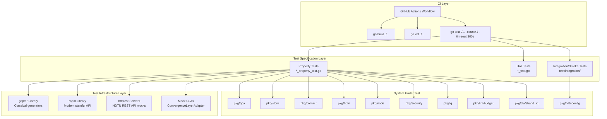
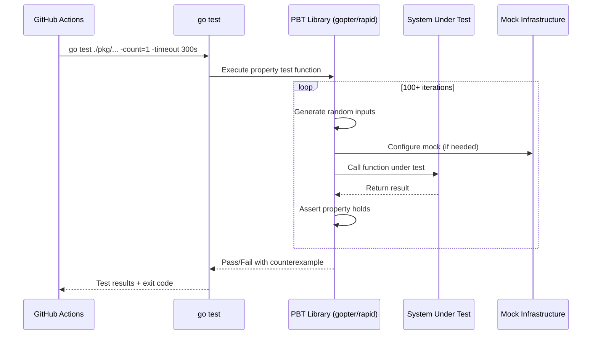

# RADIANT Test Framework Software Requirements Specification and Software Design Description

**Document Number:** RADIANT-TF-SRS-SDD-001

**Title:** Software Requirements Specification and Software Design Description for the RADIANT Test Framework

**Project:** Radio Amateur Delay-tolerant Interplanetary Networking Testbed (RADIANT)

**Prepared by:** RADIANT Development Team

**Organization:** AMSAT / Amateur Radio Community

---

## Document Control

### Revision History

| Revision | Date       | Author              | Description                          |
|----------|------------|---------------------|--------------------------------------|
| 1.0      | 2025-01-15 | RADIANT Dev Team    | Initial release — document structure |
| —        | —          | —                   | —                                    |

### Distribution

| Role                        | Name / Organization       |
|-----------------------------|---------------------------|
| Project Lead                | RADIANT Development Team  |
| Mission Assurance           | —                         |
| Software Engineering        | —                         |
| RF / Communications         | —                         |

### Document Status

| Field              | Value                                      |
|--------------------|--------------------------------------------|
| Classification     | Unclassified / Public                      |
| Status             | Draft                                      |
| Applicable To      | RADIANT Test Framework v1.0                |
| Baseline           | Terrestrial Phase 1                        |

---

## Table of Contents

1. [Introduction](#1-introduction)
2. [Scope](#2-scope)
3. [Referenced Documents](#3-referenced-documents)
4. [Glossary](#4-glossary)
5. [Software Requirements Specification](#5-software-requirements-specification)
6. [Software Design Description](#6-software-design-description)
7. [Verification Approach](#7-verification-approach)
8. [Appendices](#8-appendices)

---

## 1. Introduction

### 1.1 Purpose

This document provides the combined Software Requirements Specification (SRS) and Software Design Description (SDD) for the RADIANT Test Framework — a requirements-based verification system for the Radio Amateur Delay-tolerant Interplanetary Networking Testbed. The document serves as the authoritative reference for:

- Formal specification of all test framework requirements in EARS notation
- Architectural design of the verification infrastructure
- Traceability between system requirements, correctness properties, and implementing test code
- Evidence of verification methodology for flight readiness reviews and regulatory submissions

This document is modeled after NASA Glenn Research Center's HDTN Test Framework (NASA/TM-20240014467, LEW-20818-1) and follows NASA Technical Memorandum formatting conventions.

### 1.2 System Overview

The RADIANT Test Framework provides automated, repeatable verification of the RADIANT DTN software stack. The protocol stack implements:

- **BPv7** (Bundle Protocol version 7, RFC 9171) — delay-tolerant bundle creation, validation, and forwarding
- **LTP** (Licklider Transmission Protocol, CCSDS 734.2-B-1) — reliable link-layer transport over lossy links
- **KISS** (Keep It Simple, Stupid) — TNC framing for serial radio interfaces
- **G3RUH** — scrambling/descrambling for amateur radio modems

The test framework uses **property-based testing (PBT)** as its primary verification methodology, executing ~35 correctness properties across 10 Go packages. Each property traces to one or more system requirements via explicit source code annotations. The framework is implemented in Go using the gopter (v0.2.9) and rapid (v1.2.0) PBT libraries, integrated with GitHub Actions CI for continuous verification.

The system under test is built on NASA Glenn Research Center's High-rate Delay Tolerant Networking (HDTN) software, adapted for amateur radio operations across terrestrial, GEO, LEO, and cislunar mission phases.

### 1.3 Document Conventions

This document uses the following conventions:

- **SHALL** — indicates a mandatory requirement
- **SHOULD** — indicates a recommended practice
- **MAY** — indicates an optional feature
- **EARS Notation** — requirements are expressed using the Easy Approach to Requirements Syntax (EARS) patterns: WHEN/IF/FOR ALL triggers followed by SHALL-statements
- **Requirement IDs** — formal identifiers follow the pattern SRS-TF-NNN (e.g., SRS-TF-001)
- **Property IDs** — correctness properties are numbered sequentially (Property 1 through Property 24)
- **Verification Methods** — Property Test (PT), Unit Test (UT), Integration Test (IT), Inspection (IN)

---

## 2. Scope

### 2.1 System Boundaries

The RADIANT Test Framework verifies the following software components:

| Package            | Component                    | Scope                                      |
|--------------------|------------------------------|--------------------------------------------|
| `pkg/bpa`          | Bundle Protocol Agent        | Bundle validation, ping echo generation    |
| `pkg/store`        | Bundle Store                 | Persistence, capacity, priority, eviction  |
| `pkg/hdtn`         | HDTN Interface               | Telemetry parsing, contact plan management |
| `pkg/contact`      | Contact Graph Routing        | CGR prediction, active contact filtering   |
| `pkg/node`         | Node Controller              | Relay enforcement, error handling, stats   |
| `pkg/security`     | Security                     | Rate limiting                              |
| `pkg/linkbudget`   | Link Budget Calculator       | RF margin computation                      |
| `pkg/iq`           | IQ Processing                | Modulation/demodulation round-trip         |
| `pkg/cla/sband_iq` | S-Band CLA                   | Bundle serialization, AX.25 framing        |
| `pkg/hdtnconfig`   | HDTN Configuration           | Config file validation                     |

The framework boundary encompasses:
- All property-based test files (`*_property_test.go`)
- All unit test files (`*_test.go`)
- Integration/smoke tests (`test/integration/`)
- CI pipeline configuration (`.github/workflows/ci.yml`)
- Mock infrastructure (httptest servers, mock CLAs)

### 2.2 Mission Phases

The test framework supports verification across all RADIANT mission phases:

| Phase   | Name                  | Link Type       | Distance        | Status       |
|---------|-----------------------|-----------------|-----------------|--------------|
| Phase 1 | Terrestrial DTN       | UHF 437 MHz     | 1–50 km         | Active       |
| Phase 1.5 | QO-100 GEO         | S-Band 2.4 GHz  | 35,786 km       | Planned      |
| Phase 2 | CubeSat EM           | UHF 437 MHz     | Ground test     | Planned      |
| Phase 3 | LEO Flight           | UHF 437 MHz     | 400–600 km      | Planned      |
| Phase 4 | Cislunar              | S-Band 2.2 GHz  | 384,400 km      | Planned      |

### 2.3 Exclusions

The following are explicitly outside the scope of this test framework:

- **Hardware-in-the-loop testing** — deferred to Phase 2+ when flight hardware is available
- **RF channel simulation** — deferred to Phase 3+ for LEO link characterization
- **Multi-hop routing verification** — RADIANT Phase 1 enforces single-hop (no relay) architecture
- **Real-time performance testing** — the framework verifies correctness, not real-time deadlines
- **HDTN internal verification** — NASA Glenn's HDTN is treated as a validated dependency; only the RADIANT interface layer is tested
- **Orbital mechanics validation with real ephemeris** — CGR tests use parametric models, not JPL ephemeris data

---

## 3. Referenced Documents

| ID   | Document                                                                                          | Relevance                                      |
|------|---------------------------------------------------------------------------------------------------|------------------------------------------------|
| RD-1 | NASA/TM-20240014467 (LEW-20818-1), "HDTN Test Framework," NASA Glenn Research Center, 2024       | Methodological basis for this test framework   |
| RD-2 | RFC 9171, "Bundle Protocol Version 7," IETF, January 2022                                        | BPv7 protocol specification under test         |
| RD-3 | RFC 5050, "Bundle Protocol Specification," IETF, November 2007                                   | Legacy BP reference (BPv6 compatibility)       |
| RD-4 | CCSDS 734.2-B-1, "Licklider Transmission Protocol (LTP) for CCSDS," June 2015                   | LTP specification for reliable DTN transport   |
| RD-5 | RFC 5326, "Licklider Transmission Protocol — Specification," IETF, September 2008                | LTP protocol specification                     |
| RD-6 | CCSDS 734.1-B-1, "Schedule-Aware Bundle Routing (SABR)," January 2019                           | Contact Graph Routing reference                |
| RD-7 | IEEE 830-1998, "Recommended Practice for Software Requirements Specifications"                   | SRS formatting guidance                        |
| RD-8 | IEEE 1016-2009, "Standard for Information Technology — Software Design Descriptions"             | SDD formatting guidance                        |

---

## 4. Glossary

| Term                        | Definition                                                                                                                                     |
|-----------------------------|------------------------------------------------------------------------------------------------------------------------------------------------|
| Test_Framework              | The complete verification system comprising property-based tests, integration tests, CI pipeline, and traceability infrastructure              |
| Property_Test               | A test that verifies a correctness property holds for all inputs within a defined domain, using randomized input generation (gopter or rapid)  |
| Integration_Test            | A test that verifies system-level behavior using representative examples rather than randomized inputs                                         |
| Smoke_Test                  | A lightweight integration test that verifies basic system health (file existence, config parsing, permissions)                                 |
| BPA                         | Bundle Protocol Agent — the component responsible for BPv7 bundle creation, validation, and processing                                        |
| Bundle_Store                | The persistent storage component for BPv7 bundles awaiting transmission                                                                       |
| Contact_Plan_Manager        | The component managing scheduled contact windows and CGR predictions                                                                          |
| Telemetry_Collector         | The component that retrieves and parses HDTN REST API telemetry data                                                                          |
| Node_Controller             | The orchestration component managing bundle transmission during contact windows                                                                |
| Rate_Limiter                | The security component enforcing bundle acceptance rate limits                                                                                 |
| Link_Budget_Calculator      | The component computing RF link margins for various orbital scenarios                                                                          |
| CLA                         | Convergence Layer Adapter — the interface between BPv7/LTP and physical radio links                                                           |
| CGR                         | Contact Graph Routing — the algorithm computing optimal routes through scheduled contacts                                                      |
| Requirement_Traceability    | The mapping between each property test and the system requirement(s) it validates                                                             |
| CI_Pipeline                 | The GitHub Actions continuous integration workflow executing all tests on every commit                                                         |
| PBT_Library                 | Property-based testing library (gopter for classical generators, rapid for modern stateful API)                                                |
| HDTN                        | High-rate Delay Tolerant Networking — NASA Glenn's DTN implementation used as the protocol engine                                              |
| HDTN_REST_API               | The HTTP REST interface exposed by HDTN for telemetry and management                                                                          |
| HDTN_Process                | A running instance of the HDTN binary (hdtn-one-process)                                                                                      |
| EARS                        | Easy Approach to Requirements Syntax — the structured pattern language used for requirement statements                                         |
| ConvergenceLayerAdapter     | The Go interface defining CLA operations (Open, Close, SendBundle, RecvBundle)                                                                |
| BPv7                        | Bundle Protocol version 7 (RFC 9171) — the current-generation delay-tolerant networking protocol                                              |
| LTP                         | Licklider Transmission Protocol — reliable transport for DTN over lossy links                                                                 |
| KISS                        | Keep It Simple, Stupid — TNC framing protocol for serial radio interfaces                                                                     |
| G3RUH                       | A scrambling/descrambling algorithm used in amateur radio modems for spectral shaping                                                         |
| DTN                         | Delay-Tolerant Networking — networking architecture for environments with intermittent connectivity                                            |
| EID                         | Endpoint Identifier — the addressing scheme for DTN nodes (dtn:// or ipn://)                                                                  |

---

## 5. Software Requirements Specification

### 5.1 Requirements Overview

This section specifies 26 software requirements for the RADIANT Test Framework. Each requirement is expressed in EARS (Easy Approach to Requirements Syntax) notation with formal SHALL-statements. Requirements are classified by priority and include verification method assignments.

**Priority Definitions:**
- **Critical** — Failure compromises mission safety or data integrity; must be verified before any flight phase
- **High** — Failure degrades mission capability; must be verified before operational deployment
- **Medium** — Failure reduces efficiency or maintainability; verified as part of standard CI

**Verification Method Key:**
- **PT** — Property Test (randomized, ≥100 iterations)
- **UT** — Unit Test (specific examples and edge cases)
- **IT** — Integration Test (system-level, representative scenarios)
- **IN** — Inspection (manual review or static analysis)

---

### 5.2 Bundle Protocol Agent Requirements

#### SRS-TF-001: Bundle Protocol Agent Validation

| Field | Value |
|-------|-------|
| **Priority** | Critical |
| **Parent** | System-level BPv7 compliance (RFC 9171) |
| **Package** | pkg/bpa |

**Acceptance Criteria:**

| ID | Criterion | Verification |
|----|-----------|--------------|
| 1.1 | WHEN a bundle with a valid destination (non-empty scheme and non-empty SSP), a lifetime greater than 0 seconds, a creation timestamp not exceeding the current time by more than 5 seconds, and a remaining lifetime greater than 0 seconds is submitted, THE Test_Framework SHALL verify that the BPA accepts the bundle by confirming it is stored or forwarded without error. | PT |
| 1.2 | WHEN a bundle with an empty destination scheme or empty destination SSP is submitted, THE Test_Framework SHALL verify that the BPA rejects the bundle with a validation error identifying the failing destination field. | PT |
| 1.3 | WHEN a bundle with a lifetime of zero seconds or a negative lifetime value is submitted, THE Test_Framework SHALL verify that the BPA rejects the bundle with a validation error indicating invalid lifetime. | PT |
| 1.4 | WHEN a bundle with a creation timestamp exceeding the current time by more than 5 seconds is submitted, THE Test_Framework SHALL verify that the BPA rejects the bundle with a validation error indicating a future timestamp. | PT |
| 1.5 | WHEN a bundle whose creation timestamp plus lifetime results in an expiration time at or before the current time is submitted, THE Test_Framework SHALL verify that the BPA rejects the bundle with a validation error indicating expiration. | PT |
| 1.6 | THE Test_Framework SHALL execute a minimum of 100 randomized input combinations per BPA validation property test, covering destination, lifetime, and timestamp fields with values spanning valid ranges and boundary conditions. | PT |
| 1.7 | THE Test_Framework SHALL annotate each BPA validation property test with a "Validates: Requirement X.Y" comment tracing to the system-level requirement. | IN |

---

#### SRS-TF-002: Ping Echo Verification

| Field | Value |
|-------|-------|
| **Priority** | Critical |
| **Parent** | System-level end-to-end reachability verification |
| **Package** | pkg/bpa |

**Acceptance Criteria:**

| ID | Criterion | Verification |
|----|-----------|--------------|
| 2.1 | WHEN a valid ping request bundle is received by the BPA, THE Test_Framework SHALL verify that exactly one ping response bundle is generated and no additional responses are produced for the same request. | PT |
| 2.2 | WHEN a ping response is generated, THE Test_Framework SHALL verify that the response destination matches the source EID from the original ping request bundle's primary block. | PT |
| 2.3 | WHEN a ping response is generated, THE Test_Framework SHALL verify that the response bundle type is set to BundleTypePingResponse. | PT |
| 2.4 | THE Test_Framework SHALL generate randomized source and destination EIDs using valid dtn:// or ipn:// scheme formats with SSP strings between 1 and 255 characters, running a minimum of 100 iterations per property. | PT |
| 2.5 | IF a ping request bundle fails BPA validation, THEN THE Test_Framework SHALL verify that no ping response bundle is generated. | PT |

---

### 5.3 Bundle Store Requirements

#### SRS-TF-003: Bundle Store Round-Trip Integrity

| Field | Value |
|-------|-------|
| **Priority** | Critical |
| **Parent** | System-level data integrity (store-and-forward) |
| **Package** | pkg/store |

**Acceptance Criteria:**

| ID | Criterion | Verification |
|----|-----------|--------------|
| 3.1 | FOR ALL valid BPv7 bundles with payload sizes between 1 and 255 bytes, priorities between 0 and 3, and lifetimes between 1 and 3600 seconds, THE Test_Framework SHALL verify that storing then retrieving by bundle ID produces a bundle identical to the original across all compared fields. | PT |
| 3.2 | THE Test_Framework SHALL verify identity by comparing all bundle fields: source EID scheme, source EID SSP, creation timestamp, sequence number, destination scheme, destination SSP, payload content (byte-for-byte), payload length, priority, lifetime, creation time, and bundle type. | PT |
| 3.3 | THE Test_Framework SHALL execute a minimum of 100 randomized bundle configurations per store round-trip property test, randomizing payload size, content, priority, and lifetime within specified ranges. | PT |
| 3.4 | IF the Test_Framework attempts to retrieve a bundle ID that was not previously stored, THEN the Bundle_Store SHALL return an error indicating bundle not found without modifying existing stored bundles. | UT |
| 3.5 | THE Test_Framework SHALL allocate a Bundle_Store with a capacity of at least 1,048,576 bytes for each property test execution to ensure store-full errors do not interfere with round-trip verification. | PT |

---

#### SRS-TF-004: Bundle Store Capacity Enforcement

| Field | Value |
|-------|-------|
| **Priority** | Critical |
| **Parent** | System-level memory safety (flight hardware constraints) |
| **Package** | pkg/store |

**Acceptance Criteria:**

| ID | Criterion | Verification |
|----|-----------|--------------|
| 4.1 | THE Test_Framework SHALL execute a property-based test with a minimum of 100 successful randomized sequences of interleaved store and delete operations, using payload sizes between 1 and 255 bytes, and verify that used bytes never exceed configured total bytes after any operation. | PT |
| 4.2 | WHEN a store operation would exceed capacity, THE Test_Framework SHALL verify that the Bundle_Store rejects the operation and all previously stored bundles remain retrievable with unchanged payload length, priority, and bundle ID. | PT |
| 4.3 | THE Test_Framework SHALL generate randomized operation sequences where cumulative store payload reaches at least 90% of configured capacity before any delete occurs, ensuring capacity boundary conditions are exercised. | PT |
| 4.4 | IF a store operation is rejected due to insufficient capacity, THEN THE Test_Framework SHALL verify that used bytes and bundle count remain unchanged from their values immediately before the rejected operation. | PT |

---

#### SRS-TF-005: Priority Ordering Invariant

| Field | Value |
|-------|-------|
| **Priority** | High |
| **Parent** | System-level QoS (critical telemetry prioritization) |
| **Package** | pkg/store |

**Acceptance Criteria:**

| ID | Criterion | Verification |
|----|-----------|--------------|
| 5.1 | FOR ALL generated sets of 1 to 200 bundles with arbitrary priority values (0–3), THE Test_Framework SHALL verify that listing bundles by priority produces a sequence where each bundle's priority is ≥ the next bundle's priority. | PT |
| 5.2 | FOR ALL generated sets containing bundles with equal priority, THE Test_Framework SHALL verify that bundles within the same priority level are ordered by creation timestamp ascending (oldest first). | PT |
| 5.3 | THE Test_Framework SHALL execute a minimum of 100 randomized test iterations per priority distribution type. | PT |
| 5.4 | THE Test_Framework SHALL generate randomized priority distributions including: uniform, skewed (≥70% single priority), and single-priority (all same value). | PT |
| 5.5 | THE Test_Framework SHALL include edge cases of an empty bundle set (empty sequence) and a single-bundle set (trivially satisfies ordering). | UT |

---

#### SRS-TF-006: Eviction Policy Correctness

| Field | Value |
|-------|-------|
| **Priority** | High |
| **Parent** | System-level storage management (flight hardware) |
| **Package** | pkg/store |

**Acceptance Criteria:**

| ID | Criterion | Verification |
|----|-----------|--------------|
| 6.1 | FOR ALL sets of 1 to 100 bundles containing both expired and valid bundles, THE Test_Framework SHALL verify that EvictExpired removes all expired bundles and retains all valid bundles. | PT |
| 6.2 | FOR ALL sets of 2 to 100 bundles with mixed priorities (0–255), THE Test_Framework SHALL verify that EvictLowestPriority removes exactly one bundle whose priority is ≤ all remaining bundles. | PT |
| 6.3 | THE Test_Framework SHALL verify that the count of evicted expired bundles equals the number of expired bundles in the original set. | PT |
| 6.4 | IF multiple bundles share the lowest priority value, THEN THE Test_Framework SHALL verify that EvictLowestPriority removes exactly one of those bundles and retains the others. | PT |

---

#### SRS-TF-007: Bundle Lifetime Enforcement

| Field | Value |
|-------|-------|
| **Priority** | High |
| **Parent** | System-level storage hygiene (no stale data persistence) |
| **Package** | pkg/store |

**Acceptance Criteria:**

| ID | Criterion | Verification |
|----|-----------|--------------|
| 7.1 | FOR ALL sets of 1 to 100 bundles with arbitrary lifetimes (1–2000 seconds) and arbitrary current times (1000–3000 seconds), THE Test_Framework SHALL verify that after EvictExpired, zero remaining bundles have creation timestamp plus lifetime ≤ current time. | PT |
| 7.2 | THE Test_Framework SHALL generate bundles with lifetimes placing expiration within 1 second of the query time (both above and below) to exercise the boundary between expired and valid. | PT |

---

### 5.4 Telemetry Requirements

#### SRS-TF-008: Telemetry Parsing Fidelity

| Field | Value |
|-------|-------|
| **Priority** | High |
| **Parent** | System-level telemetry accuracy (mission operations) |
| **Package** | pkg/hdtn |

**Acceptance Criteria:**

| ID | Criterion | Verification |
|----|-----------|--------------|
| 8.1 | FOR ALL valid HDTN REST API JSON responses with arbitrary non-negative integer field values (0 to 2^63−1), THE Test_Framework SHALL verify that every field maps correctly to the corresponding Telemetry structure field. | PT |
| 8.2 | THE Test_Framework SHALL verify field mappings: bundleCountStorage→BundlesStored, bundleCountEgress→BundlesSent, bundleCountIngress→BundlesReceived, bundleByteCountEgress→BytesSent, bundleByteCountIngress→BytesReceived, usedSpaceBytes→StorageUsedBytes, totalSpaceBytes→StorageQuotaBytes. | PT |
| 8.3 | THE Test_Framework SHALL verify that LTP SessionsActive equals the sum of numActiveSendSessions and numActiveRecvSessions. | PT |
| 8.4 | WHEN a successful HTTP response is received from the HDTN_REST_API, THE Test_Framework SHALL verify that Health.Running is set to true. | PT |
| 8.5 | THE Test_Framework SHALL verify that NodeID equals the configured node_id string and NodeNumber equals the configured node_number integer from the Telemetry_Collector configuration. | PT |

---

#### SRS-TF-009: Telemetry Partial Response Resilience

| Field | Value |
|-------|-------|
| **Priority** | High |
| **Parent** | System-level fault tolerance (graceful degradation) |
| **Package** | pkg/hdtn |

**Acceptance Criteria:**

| ID | Criterion | Verification |
|----|-----------|--------------|
| 9.1 | FOR ALL HDTN REST API JSON responses with randomly omitted fields, THE Test_Framework SHALL verify that present fields retain correct values and absent fields default to zero (0 for integers, 0.0 for floats, false for booleans). | PT |
| 9.2 | THE Test_Framework SHALL verify that NodeID is populated from configured node_id, NodeNumber from configured node_number, and Timestamp from the system clock at collection time, regardless of which API fields are present. | PT |
| 9.3 | THE Test_Framework SHALL verify that Timestamp formats as RFC 3339 with UTC timezone designator. | PT |

---

### 5.5 Contact Plan Requirements

#### SRS-TF-010: Contact Plan Validation

| Field | Value |
|-------|-------|
| **Priority** | Critical |
| **Parent** | System-level contact scheduling safety |
| **Package** | pkg/hdtn |

**Acceptance Criteria:**

| ID | Criterion | Verification |
|----|-----------|--------------|
| 10.1 | FOR ALL collections of contact entries, THE Test_Framework SHALL verify that validation accepts the collection if and only if every contact has RateBitsPerSec > 0, every contact has StartTime < EndTime, and total entries ≤ 1000. | PT |
| 10.2 | WHEN validation fails, THE Test_Framework SHALL verify that the error message identifies the zero-based index of the first invalid entry and the reason for rejection (zero rate, invalid time range, or count exceeded). | PT |
| 10.3 | THE Test_Framework SHALL generate contact collections at sizes 0, 999, 1000, 1001, and 1050 to exercise the count limit boundary. | UT |

---

#### SRS-TF-011: Active Contacts Filtering

| Field | Value |
|-------|-------|
| **Priority** | Critical |
| **Parent** | System-level transmission window correctness |
| **Package** | pkg/hdtn |

**Acceptance Criteria:**

| ID | Criterion | Verification |
|----|-----------|--------------|
| 11.1 | FOR ALL sets of contacts and any query time T, THE Test_Framework SHALL verify that GetActiveContacts(T) returns exactly those contacts where StartTime ≤ T < EndTime. | PT |
| 11.2 | THE Test_Framework SHALL verify that no contacts outside the active window are included and the returned collection size equals the count of contacts satisfying the predicate. | PT |
| 11.3 | THE Test_Framework SHALL generate at least 5 query times per contact window: before StartTime, equal to StartTime, between Start and End, equal to EndTime−1ms, and at or after EndTime. | PT |
| 11.4 | WHEN the contact plan is empty, THE Test_Framework SHALL verify that GetActiveContacts returns an empty collection for any query time. | UT |

---

#### SRS-TF-012: Contact Removal Correctness

| Field | Value |
|-------|-------|
| **Priority** | High |
| **Parent** | System-level contact plan modification safety |
| **Package** | pkg/hdtn |

**Acceptance Criteria:**

| ID | Criterion | Verification |
|----|-----------|--------------|
| 12.1 | FOR ALL contact plans containing at least one contact, THE Test_Framework SHALL verify that removing a contact by its (source, dest, startTime) key results in a plan no longer containing that contact. | PT |
| 12.2 | THE Test_Framework SHALL verify that all contacts not matching the removal key remain unchanged in value and order after removal. | PT |
| 12.3 | THE Test_Framework SHALL verify that the remaining contact count equals the original count minus one. | PT |
| 12.4 | IF a removal is attempted with a key that does not match any contact, THEN THE Test_Framework SHALL verify that the operation returns an error and the plan remains unchanged. | PT |

---

#### SRS-TF-013: API Error State Preservation

| Field | Value |
|-------|-------|
| **Priority** | High |
| **Parent** | System-level fault tolerance (transient network errors) |
| **Package** | pkg/hdtn |

**Acceptance Criteria:**

| ID | Criterion | Verification |
|----|-----------|--------------|
| 13.1 | FOR ALL contact plan managers with existing local state, IF an API operation fails due to HTTP error (400–599) or timeout (>5s), THEN THE Test_Framework SHALL verify that local plan state is identical to the state before the operation. | PT |
| 13.2 | THE Test_Framework SHALL test state preservation across add, remove, and apply operations independently, with at least one failure scenario per operation type. | PT |
| 13.3 | THE Test_Framework SHALL use mock HTTP servers returning 500 status codes and connection timeouts to simulate failures. | PT |

---

### 5.6 Contact Graph Routing Requirements

#### SRS-TF-014: CGR Prediction Time Horizon Compliance

| Field | Value |
|-------|-------|
| **Priority** | Critical |
| **Parent** | System-level orbital mechanics correctness |
| **Package** | pkg/contact |

**Acceptance Criteria:**

| ID | Criterion | Verification |
|----|-----------|--------------|
| 14.1 | FOR ALL valid LEO orbital parameters and time horizons (1–24 hours), THE Test_Framework SHALL verify that all predicted contact windows have StartTime ≥ horizon start and EndTime ≤ horizon end. | PT |
| 14.2 | FOR ALL valid cislunar orbital parameters and time horizons (1–168 hours), THE Test_Framework SHALL verify that all predicted contact windows have StartTime ≥ horizon start and EndTime ≤ horizon end. | PT |
| 14.3 | THE Test_Framework SHALL verify that no two predicted windows for the same ground station overlap in time. | PT |
| 14.4 | THE Test_Framework SHALL verify that all predicted contacts have StartTime < EndTime. | PT |
| 14.5 | THE Test_Framework SHALL verify that LEO predicted contacts have durations between 60 and 900 seconds. | PT |
| 14.6 | WHEN orbital parameters with eccentricity ≥ 1.0 are provided, THE Test_Framework SHALL verify that the prediction function returns a validation error. | UT |
| 14.7 | WHEN a time horizon with fromTime ≥ toTime is provided, THE Test_Framework SHALL verify that the prediction function returns a validation error. | UT |

---

#### SRS-TF-015: Next Contact Lookup Correctness

| Field | Value |
|-------|-------|
| **Priority** | High |
| **Parent** | System-level CGR routing optimality |
| **Package** | pkg/contact |

**Acceptance Criteria:**

| ID | Criterion | Verification |
|----|-----------|--------------|
| 15.1 | FOR ALL contact plans, destination nodes, and query times, THE Test_Framework SHALL verify that GetNextContact returns the contact with the earliest StartTime ≥ query time matching the destination node. | PT |
| 15.2 | WHEN multiple future contacts exist for the same destination, THE Test_Framework SHALL verify that the contact with the earliest StartTime is returned. | PT |
| 15.3 | IF no future contacts exist for the specified destination at the given query time, THEN THE Test_Framework SHALL verify that an error is returned indicating no future contact available. | PT |
| 15.4 | IF the destination node does not exist in the contact plan, THEN THE Test_Framework SHALL verify that an error is returned indicating the destination is unknown. | UT |
| 15.5 | THE Test_Framework SHALL verify the boundary condition: a contact with StartTime exactly equal to the query time is included as a valid result. | PT |
| 15.6 | THE Test_Framework SHALL verify that a contact with EndTime ≤ query time is not returned as a next contact. | PT |
| 15.7 | THE Test_Framework SHALL verify that when multiple destination nodes exist, the correct contact for each specific destination is returned independently. | PT |

---

### 5.7 Node Controller Requirements

#### SRS-TF-016: No-Relay Direct Delivery Enforcement

| Field | Value |
|-------|-------|
| **Priority** | Critical |
| **Parent** | System-level single-hop architecture constraint |
| **Package** | pkg/node |

**Acceptance Criteria:**

| ID | Criterion | Verification |
|----|-----------|--------------|
| 16.1 | FOR ALL bundles transmitted during any contact window, THE Test_Framework SHALL verify that the contact's remote node EID matches the bundle's destination EID exactly. | PT |
| 16.2 | WHEN FindDirectContact is called with a destination EID, THE Test_Framework SHALL verify that the returned contact's remote node EID matches the queried destination EID, confirming single-hop routing. | PT |
| 16.3 | FOR ALL bundles in a node's Bundle_Store, THE Test_Framework SHALL verify that every bundle's source EID matches the local node's EID (no relay bundles accepted from other originators). | PT |
| 16.4 | IF FindDirectContact is called with a destination EID that has no matching contact, THEN THE Test_Framework SHALL verify that an error is returned rather than a multi-hop path through an intermediate node. | PT |

---

#### SRS-TF-017: Contact Window Temporal Enforcement

| Field | Value |
|-------|-------|
| **Priority** | Critical |
| **Parent** | System-level transmission safety (no void transmission) |
| **Package** | pkg/node |

**Acceptance Criteria:**

| ID | Criterion | Verification |
|----|-----------|--------------|
| 17.1 | FOR ALL contact windows where current time exceeds window end time, THE Test_Framework SHALL verify that zero bundles are transmitted and all queued bundles remain in the Bundle_Store with count unchanged. | PT |
| 17.2 | THE Test_Framework SHALL generate randomized contact window durations between 60 and 600 seconds and bundle counts between 5 and 20 per test iteration. | PT |
| 17.3 | WHEN current time is within 1 second before contact window end and a transmission is in progress, THE Test_Framework SHALL verify that no new transmissions are initiated after window end. | PT |

---

#### SRS-TF-018: Missed Contact Bundle Retention

| Field | Value |
|-------|-------|
| **Priority** | High |
| **Parent** | System-level data preservation (link failure resilience) |
| **Package** | pkg/node |

**Acceptance Criteria:**

| ID | Criterion | Verification |
|----|-----------|--------------|
| 18.1 | WHEN the CLA fails to establish a link during a scheduled contact window, THE Test_Framework SHALL verify that all bundles queued for that contact's destination remain in the Bundle_Store with count and content unchanged. | PT |
| 18.2 | WHEN a contact is missed due to CLA link establishment failure, THE Test_Framework SHALL verify that the ContactsMissed counter is incremented by exactly one. | PT |
| 18.3 | THE Test_Framework SHALL use mock CLAs configured to return link establishment errors to simulate missed contacts. | PT |
| 18.4 | IF multiple contacts are missed in sequence, THEN THE Test_Framework SHALL verify that ContactsMissed equals the total number of missed contacts and no bundles are lost across all missed windows. | PT |

---

#### SRS-TF-019: Bundle Retention Without Contact

| Field | Value |
|-------|-------|
| **Priority** | High |
| **Parent** | System-level store-and-forward guarantee |
| **Package** | pkg/node |

**Acceptance Criteria:**

| ID | Criterion | Verification |
|----|-----------|--------------|
| 19.1 | FOR ALL bundles whose destination EID has no matching contact window in the current contact plan, THE Test_Framework SHALL verify that the Bundle_Store retains the bundle with content unchanged after processing. | PT |
| 19.2 | THE Test_Framework SHALL verify that retained bundles persist through at least 3 subsequent processing cycles until lifetime expires, confirming no premature deletion. | PT |
| 19.3 | THE Test_Framework SHALL use an empty contact plan (zero entries) to exercise the no-contact-available scenario. | PT |
| 19.4 | IF a bundle's lifetime expires while retained without a contact, THEN THE Test_Framework SHALL verify that the bundle is evicted and not transmitted. | PT |

---

### 5.8 Security Requirements

#### SRS-TF-020: Rate Limiting Enforcement

| Field | Value |
|-------|-------|
| **Priority** | High |
| **Parent** | System-level DoS mitigation |
| **Package** | pkg/security |

**Acceptance Criteria:**

| ID | Criterion | Verification |
|----|-----------|--------------|
| 20.1 | FOR ALL configured rate limits between 1 and 100 bundles per second, THE Test_Framework SHALL verify that accepted bundles within any 1-second window do not exceed the configured maximum rate. | PT |
| 20.2 | FOR ALL submission sequences exceeding the configured rate limit within a 1-second window, THE Test_Framework SHALL verify that at least one bundle is rejected with a rate-limit-exceeded error. | PT |
| 20.3 | THE Test_Framework SHALL verify the accounting invariant: accepted count plus rejected count equals total submission attempts for every test iteration. | PT |
| 20.4 | FOR ALL configured rate limits, THE Test_Framework SHALL verify that a submission count ≤ the configured rate within a 1-second window results in all bundles being accepted. | PT |
| 20.5 | WHEN 1 second has elapsed since the last rate window started, THE Test_Framework SHALL verify that the rate limiter resets and accepts new bundles up to the configured maximum. | PT |
| 20.6 | THE Test_Framework SHALL verify the monotonicity property: GetCurrentRate never exceeds the configured maximum rate at any point during a submission sequence. | PT |

---

### 5.9 Link Budget Requirements

#### SRS-TF-021: Link Budget Monotonicity

| Field | Value |
|-------|-------|
| **Priority** | Critical |
| **Parent** | System-level RF link closure verification |
| **Package** | pkg/linkbudget |

**Acceptance Criteria:**

| ID | Criterion | Verification |
|----|-----------|--------------|
| 21.1 | FOR ALL sequences of 2 to 10 increasing distances (1,000 m to 500,000,000 m) with identical transmit parameters, THE Test_Framework SHALL verify that computed link margin strictly decreases with each distance increment, using ≥100 randomized iterations. | PT |
| 21.2 | THE Test_Framework SHALL verify that the LEO UHF link budget (2W TX, omni TX, 12 dBi Yagi RX, 437 MHz, 9600 bps, 10 dB Eb/N0) closes with positive margin >20 dB at 500 km. | UT |
| 21.3 | THE Test_Framework SHALL verify that the cislunar S-band link budget (5W TX, 10 dBi patch TX, 35 dBi dish RX, 2.2 GHz, 500 bps, 2 dB Eb/N0) closes with margin between 5.0 and 7.0 dB at 384,000 km. | UT |
| 21.4 | WHEN zero or negative distance is provided, THE Test_Framework SHALL verify that the Link_Budget_Calculator returns a validation error indicating distance must be positive. | UT |
| 21.5 | WHEN zero frequency or zero data rate is provided, THE Test_Framework SHALL verify that the Link_Budget_Calculator returns a validation error indicating the invalid parameter. | UT |
| 21.6 | FOR ALL distances d (10,000 m to 500,000 m), THE Test_Framework SHALL verify that doubling the distance reduces link margin by 6.02 dB (±0.1 dB tolerance), confirming correct free-space path loss computation. | PT |

---

### 5.10 Convergence Layer Adapter Requirements

#### SRS-TF-022: S-Band CLA Bundle Serialization Round-Trip

| Field | Value |
|-------|-------|
| **Priority** | Critical |
| **Parent** | System-level data integrity (radio transmission) |
| **Package** | pkg/cla/sband_iq |

**Acceptance Criteria:**

| ID | Criterion | Verification |
|----|-----------|--------------|
| 22.1 | FOR ALL valid bundles with payload sizes from 1 to 1500 bytes, THE Test_Framework SHALL verify that serializing then deserializing produces a bundle with identical bundle type, priority, lifetime, destination endpoint, and payload content, using ≥100 randomized iterations. | PT |
| 22.2 | FOR ALL valid payloads with sizes from 1 to 1500 bytes, THE Test_Framework SHALL verify that AX.25 framing (createAX25Frame) then extraction (extractAX25Frame) produces a byte sequence identical to the original payload, using ≥100 randomized iterations. | PT |
| 22.3 | IF the CLA link is not open, THEN THE Test_Framework SHALL verify that SendBundle returns an error indicating the link is not open without transmitting data. | UT |
| 22.4 | IF the CLA link is not open, THEN THE Test_Framework SHALL verify that RecvBundle returns an error indicating the link is not open without attempting to receive data. | UT |

---

### 5.11 Configuration Requirements

#### SRS-TF-023: HDTN Configuration Validation

| Field | Value |
|-------|-------|
| **Priority** | Medium |
| **Parent** | System-level deployment correctness |
| **Package** | pkg/hdtnconfig |

**Acceptance Criteria:**

| ID | Criterion | Verification |
|----|-----------|--------------|
| 23.1 | THE Test_Framework SHALL verify that all JSON files in configs/ and configs/simulation/ directories parse as valid JSON without errors using Go's encoding/json decoder. | IT |
| 23.2 | THE Test_Framework SHALL verify that parsed HDTN configurations pass the HDTNConfig validation function, confirming required fields (node EID, storage path, at least one induct, at least one outduct, at least one contact plan entry) are present and valid. | IT |
| 23.3 | THE Test_Framework SHALL verify that the following packages exist and contain at least one _test.go file: hdtn, hdtnconfig, kiss, bpa, node, contact, store, security, linkbudget, and sband_iq. | IT |

---

### 5.12 Infrastructure Requirements

#### SRS-TF-024: Continuous Integration Pipeline

| Field | Value |
|-------|-------|
| **Priority** | High |
| **Parent** | System-level regression detection |
| **Package** | .github/workflows |

**Acceptance Criteria:**

| ID | Criterion | Verification |
|----|-----------|--------------|
| 24.1 | WHEN a push to main or a pull request targeting main occurs, THE CI_Pipeline SHALL execute all property-based and unit tests across all packages. | IN |
| 24.2 | WHEN a push to main or a pull request targeting main occurs, THE CI_Pipeline SHALL execute go vet static analysis on all packages. | IN |
| 24.3 | THE CI_Pipeline SHALL execute the full build (go build ./...) before running any tests, and abort if the build fails. | IN |
| 24.4 | THE CI_Pipeline SHALL enforce a test timeout of 300 seconds per test run to prevent hanging tests from blocking the pipeline. | IN |
| 24.5 | IF any test or static analysis step fails, THEN THE CI_Pipeline SHALL report the failure with the failing test name and block the pull request from merging. | IN |

---

#### SRS-TF-025: Requirement Traceability

| Field | Value |
|-------|-------|
| **Priority** | High |
| **Parent** | System-level verification coverage (flight readiness) |
| **Package** | All test packages |

**Acceptance Criteria:**

| ID | Criterion | Verification |
|----|-----------|--------------|
| 25.1 | THE Test_Framework SHALL include a "Validates: Requirement X.Y" annotation in the documentation comment of every property test function. | IN |
| 25.2 | THE Test_Framework SHALL maintain traceability from property tests to system-level requirements across all test packages: bpa, store, contact, hdtn, hdtnconfig, node, security, linkbudget, and sband_iq. | IN |
| 25.3 | THE Test_Framework SHALL use a minimum of 50 successful randomized iterations for computationally expensive property tests (CGR, link budget) and 100 iterations for all other property tests. | PT |

---

#### SRS-TF-026: Test Framework Extensibility

| Field | Value |
|-------|-------|
| **Priority** | Medium |
| **Parent** | System-level multi-phase mission support |
| **Package** | Framework architecture |

**Acceptance Criteria:**

| ID | Criterion | Verification |
|----|-----------|--------------|
| 26.1 | THE Test_Framework SHALL organize property tests by package, with property tests in files named *_property_test.go and other tests in *_test.go, following Go testing conventions. | IN |
| 26.2 | THE Test_Framework SHALL support both gopter and rapid property-based testing libraries for property test implementation. | IN |
| 26.3 | THE Test_Framework SHALL support mock HTTP servers (net/http/httptest) for testing components that interact with HDTN REST APIs without requiring a running HDTN_Process. | IN |
| 26.4 | THE Test_Framework SHALL support mock CLAs (implementing ConvergenceLayerAdapter interface) for testing Node_Controller behavior without hardware dependencies. | IN |

---

### 5.13 Requirements Summary

| Req ID | Title | Priority | Criteria | Primary Verification |
|--------|-------|----------|----------|---------------------|
| SRS-TF-001 | BPA Validation | Critical | 7 | PT |
| SRS-TF-002 | Ping Echo Verification | Critical | 5 | PT |
| SRS-TF-003 | Store Round-Trip Integrity | Critical | 5 | PT |
| SRS-TF-004 | Store Capacity Enforcement | Critical | 4 | PT |
| SRS-TF-005 | Priority Ordering Invariant | High | 5 | PT |
| SRS-TF-006 | Eviction Policy Correctness | High | 4 | PT |
| SRS-TF-007 | Bundle Lifetime Enforcement | High | 2 | PT |
| SRS-TF-008 | Telemetry Parsing Fidelity | High | 5 | PT |
| SRS-TF-009 | Telemetry Partial Response Resilience | High | 3 | PT |
| SRS-TF-010 | Contact Plan Validation | Critical | 3 | PT |
| SRS-TF-011 | Active Contacts Filtering | Critical | 4 | PT |
| SRS-TF-012 | Contact Removal Correctness | High | 4 | PT |
| SRS-TF-013 | API Error State Preservation | High | 3 | PT |
| SRS-TF-014 | CGR Prediction Time Horizon | Critical | 7 | PT |
| SRS-TF-015 | Next Contact Lookup | High | 7 | PT |
| SRS-TF-016 | No-Relay Direct Delivery | Critical | 4 | PT |
| SRS-TF-017 | Contact Window Temporal Enforcement | Critical | 3 | PT |
| SRS-TF-018 | Missed Contact Bundle Retention | High | 4 | PT |
| SRS-TF-019 | Bundle Retention Without Contact | High | 4 | PT |
| SRS-TF-020 | Rate Limiting Enforcement | High | 6 | PT |
| SRS-TF-021 | Link Budget Monotonicity | Critical | 6 | PT/UT |
| SRS-TF-022 | S-Band CLA Serialization Round-Trip | Critical | 4 | PT/UT |
| SRS-TF-023 | HDTN Configuration Validation | Medium | 3 | IT |
| SRS-TF-024 | CI Pipeline | High | 5 | IN |
| SRS-TF-025 | Requirement Traceability | High | 3 | IN/PT |
| SRS-TF-026 | Test Framework Extensibility | Medium | 4 | IN |

**Totals:** 26 requirements, 114 acceptance criteria
- Critical: 11 requirements
- High: 13 requirements
- Medium: 2 requirements

---

## 6. Software Design Description

### 6.1 Design Rationale

**Why Property-Based Testing?** The RADIANT protocol stack processes arbitrary bundle payloads across variable contact windows, orbital parameters, and network conditions. Traditional example-based testing cannot adequately cover the input space. PBT generates hundreds of randomized inputs per property, exposing edge cases that hand-crafted examples miss — critical for flight software verification.

**Why Go-Native (gopter + rapid)?** The system under test is written in Go. Using Go-native PBT libraries eliminates cross-language serialization overhead, enables direct access to internal data structures, and integrates seamlessly with `go test` and the CI pipeline. Two libraries are used because gopter provides classical QuickCheck-style generators while rapid offers a more modern, stateful testing API.

**Why Not Python/Hypothesis?** A Python test harness would require IPC or REST API boundaries between tests and the system under test, adding latency and complexity. Go's `testing` package provides built-in benchmarking, race detection, and coverage analysis that integrate directly with the code under test.

### 6.2 Layered Architecture

The Test Framework follows a layered architecture with clear separation between test specification, test execution, and test infrastructure. The layers are:

1. **CI Layer** — GitHub Actions workflow orchestrating build, test, and static analysis
2. **Test Specification Layer** — Property tests, unit tests, and integration/smoke tests
3. **Test Infrastructure Layer** — PBT libraries (gopter/rapid), mock HTTP servers, mock CLAs
4. **System Under Test (SUT)** — The 10 RADIANT packages being verified



### 6.3 Execution Flow

The following sequence diagram illustrates the runtime execution flow when the CI pipeline invokes property-based tests:



### 6.4 Components

#### 6.4.1 Property Test Files (`*_property_test.go`)

Each package contains property tests in dedicated files following the naming convention `{domain}_property_test.go`. Each test function:

- Documents the property being tested in a comment block
- Includes a `Validates: Requirement X.Y` annotation for traceability
- Configures the PBT library with `MinSuccessfulTests >= 100` (or >= 50 for expensive tests)
- Defines generators for the input domain
- Asserts the property holds for all generated inputs

**Property test file inventory:**

| Package | File | Properties | Library |
|---------|------|-----------|---------|
| `pkg/bpa` | `bpa_property_test.go` | Bundle validation, ping echo | gopter |
| `pkg/store` | `store_property_test.go` | Round-trip, capacity, priority, eviction, lifetime | gopter |
| `pkg/store` | `ack_property_test.go` | ACK handling | gopter |
| `pkg/hdtn` | `telemetry_property_test.go` | Telemetry parsing, partial response | rapid |
| `pkg/hdtn` | `contactplan_property_test.go` | Contact validation, active filtering, removal, API error | rapid |
| `pkg/node` | `relay_property_test.go` | No-relay enforcement | gopter |
| `pkg/node` | `error_handling_property_test.go` | Error handling | gopter |
| `pkg/node` | `statistics_consistency_property_test.go` | Statistics invariants | gopter |
| `pkg/security` | `ratelimit_property_test.go` | Rate limiting | rapid |
| `pkg/iq` | `modulation_demodulation_property_test.go` | IQ round-trip | rapid |
| `pkg/linkbudget` | `link_margin_monotonicity_property_test.go` | Monotonicity, inverse-square | gopter |
| `pkg/cla/sband_iq` | `sband_property_test.go` | Bundle serialization, AX.25 framing | gopter |

#### 6.4.2 PBT Library Interface (gopter/rapid)

The framework uses two complementary PBT libraries:

**gopter** (`github.com/leanovate/gopter` v0.2.9) — Classical QuickCheck-style generators with shrinking support:

```go
// Configuration
parameters := gopter.DefaultTestParameters()
parameters.MinSuccessfulTests = 100

// Property definition
properties := gopter.NewProperties(parameters)
properties.Property("description", prop.ForAll(
    func(inputs...) bool { /* assert property */ },
    gen.Int64Range(min, max),  // generators
))
properties.TestingRun(t)
```

**rapid** (`pgregory.net/rapid` v1.2.0) — Modern stateful API with integrated labeling:

```go
rapid.Check(t, func(t *rapid.T) {
    // Generate inputs
    value := rapid.IntRange(min, max).Draw(t, "label")
    // Assert property
    if !property(value) {
        t.Fatalf("property violated: %v", value)
    }
})
```

**Library selection criteria:**

| Criterion | gopter | rapid |
|-----------|--------|-------|
| Generator style | Explicit combinators | Draw-based inline |
| Shrinking | Automatic via generator structure | Automatic via replay |
| Stateful testing | Limited | First-class support |
| Used for | BPA, store, node, linkbudget | HDTN, security, IQ |

#### 6.4.3 Mock Infrastructure

**Mock HTTP Servers** (`net/http/httptest`):

- Simulate HDTN REST API responses for telemetry and contact plan tests
- Configurable to return success (200), server error (500), or timeout
- Used by: `pkg/hdtn/telemetry_property_test.go`, `pkg/hdtn/contactplan_property_test.go`

**Mock CLAs** (implementing `ConvergenceLayerAdapter` interface):

- Configurable to simulate link establishment failures
- Used by: `pkg/node/relay_property_test.go`, `pkg/node/error_handling_property_test.go`

**Error simulation matrix:**

| Error Type | Mock Behavior | Purpose |
|-----------|--------------|---------|
| HTTP 500 | httptest server returns 500 | API error state preservation (Property 13) |
| HTTP 408 / timeout | httptest server delays > 5s | Network failure resilience (Property 13) |
| CLA link failure | Mock CLA returns error from `Open()` | Missed contact handling (Property 18) |
| CLA send failure | Mock CLA returns error from `SendBundle()` | Transmission error handling (Property 17) |

#### 6.4.4 Integration/Smoke Test Suite (`test/integration/`)

Smoke tests verify system-level health without randomized inputs:

- Config file JSON parsing and validation
- Script execute permissions
- Package directory existence
- Obsolete code removal verification
- KISS CLA plugin file existence

These tests are deterministic (no randomized inputs) and provide fast-feedback system health checks.

#### 6.4.5 CI Pipeline (`.github/workflows/ci.yml`)

Single-job pipeline triggered on push to `main` and PRs targeting `main`:

1. **Checkout** — Clone repository
2. **Setup Go** — Install Go 1.26
3. **Build** — `go build ./...` (fail-fast on compile errors)
4. **Test** — `go test ./pkg/... ./test/integration/... -count=1 -timeout 300s`
5. **Static Analysis** — `go vet ./...`

The `-count=1` flag disables test caching to ensure every CI run executes all property tests with fresh random seeds. The 300-second timeout prevents runaway tests from blocking the pipeline.

#### 6.4.6 Requirement Traceability Infrastructure

Every property test includes a structured annotation:

```go
// Feature: {feature_name}, Property {N}: {property_title}
// **Validates: Requirements X.Y, X.Z**
```

This enables:

- Automated traceability matrix generation via `grep`/static analysis
- Flight readiness review evidence
- Coverage gap identification
- Bidirectional mapping between requirements and implementing tests

### 6.5 Interface Definitions

#### 6.5.1 ConvergenceLayerAdapter Interface

The `ConvergenceLayerAdapter` interface defines the contract between the node controller and physical radio links. Mock implementations of this interface are used in property tests to simulate link failures and verify error handling behavior.

```go
type ConvergenceLayerAdapter interface {
    // Open establishes the radio link for the contact window.
    // Returns an error if link establishment fails (e.g., no signal, hardware fault).
    Open() error

    // Close terminates the radio link at the end of a contact window.
    Close() error

    // SendBundle transmits a single bundle over the established link.
    // Returns an error if transmission fails (e.g., link dropped, timeout).
    SendBundle(bundle *bpa.Bundle) error

    // RecvBundle receives a single bundle from the established link.
    // Returns an error if no bundle is available or the link is closed.
    RecvBundle() (*bpa.Bundle, error)
}
```

#### 6.5.2 PBT Library APIs

**gopter API surface used by the framework:**

```go
// Test parameter configuration
gopter.DefaultTestParameters() *TestParameters
parameters.MinSuccessfulTests int
parameters.MaxShrinkCount     int

// Property construction
gopter.NewProperties(parameters) *Properties
properties.Property(name string, prop gopter.Prop)
properties.TestingRun(t *testing.T)

// Generator combinators (gen package)
gen.Int64Range(min, max int64) gopter.Gen
gen.SliceOfN(size int, elementGen gopter.Gen) gopter.Gen
gen.AlphaString() gopter.Gen
gen.Struct(reflect.TypeOf(T{}), map[string]gopter.Gen{...}) gopter.Gen

// Property assertion (prop package)
prop.ForAll(condition interface{}, gens ...gopter.Gen) gopter.Prop
```

**rapid API surface used by the framework:**

```go
// Test execution
rapid.Check(t *testing.T, prop func(t *rapid.T))

// Generators (draw-based)
rapid.IntRange(min, max int).Draw(t *rapid.T, label string) int
rapid.Int64Range(min, max int64).Draw(t *rapid.T, label string) int64
rapid.SliceOfN(minLen, maxLen int, elem *rapid.Generator[T]).Draw(t, label) []T
rapid.StringMatching(pattern string).Draw(t, label) string
rapid.Bool().Draw(t, label) bool

// Failure reporting
t.Fatalf(format string, args ...interface{})
```

### 6.6 Data Models

#### 6.6.1 Bundle (System Under Test)

The `Bundle` structure represents a BPv7 bundle — the fundamental unit of data in the DTN network:

```go
type Bundle struct {
    ID          BundleID
    Destination EndpointID
    Payload     []byte
    Priority    Priority      // 0=bulk, 1=normal, 2=expedited, 3=critical
    Lifetime    int64         // seconds
    CreatedAt   int64         // unix timestamp
    BundleType  BundleType    // Data, PingRequest, PingResponse
}

type BundleID struct {
    SourceEID         EndpointID
    CreationTimestamp int64
    SequenceNumber    uint64
}

type EndpointID struct {
    Scheme string  // "dtn" or "ipn"
    SSP    string  // scheme-specific part
}
```

**Property test generators for Bundle:**
- Payload: random bytes, size 1–1500 (serialization tests) or 1–255 (store tests)
- Priority: uniform random 0–3
- Lifetime: random 1–3600 seconds
- BundleType: uniform random from {Data, PingRequest, PingResponse}
- EndpointID: random scheme from {"dtn", "ipn"}, random SSP 1–255 alphanumeric characters

#### 6.6.2 Contact (System Under Test)

The `Contact` and `ContactWindow` structures represent scheduled communication opportunities:

```go
type Contact struct {
    Source         int
    Dest           int
    StartTime      int64
    EndTime        int64
    RateBitsPerSec int64
}

type ContactWindow struct {
    ContactID  uint64
    RemoteNode NodeID
    StartTime  int64
    EndTime    int64
    DataRate   int64
    LinkType   LinkType
}
```

**Property test generators for Contact:**
- StartTime: random unix timestamp
- EndTime: StartTime + random duration (60–900 seconds for LEO, up to 86400 for GEO)
- RateBitsPerSec: random 1–10,000,000
- Source/Dest: random node IDs 1–100

#### 6.6.3 Telemetry (System Under Test)

The `Telemetry` structure holds parsed HDTN REST API statistics:

```go
type Telemetry struct {
    BundleProtocol BundleProtocolStats
    LTP            LTPStats
    Health         HealthStatus
    NodeID         string
    NodeNumber     int
    Timestamp      time.Time
}
```

**Property test generators for Telemetry:**
- All integer fields: random non-negative int64 (0 to 2^63-1)
- Field presence: each field independently present or absent (for partial response tests)
- NodeID/NodeNumber: populated from test configuration constants

#### 6.6.4 TestParameters (Framework)

The `TestParameters` structure configures PBT execution:

```go
// gopter configuration
type TestParameters struct {
    MinSuccessfulTests int  // >= 100 (standard) or >= 50 (expensive)
    MaxShrinkCount     int  // counterexample minimization attempts (default: 1000)
}

// rapid uses t *rapid.T with default 100 iterations
// Override via: -rapid.checks=N flag
```

**Standard configurations:**

| Test Category | MinSuccessfulTests | Timeout | Rationale |
|--------------|-------------------|---------|-----------|
| Standard property tests | 100 | 300s (shared) | Adequate coverage for fast operations |
| Expensive tests (CGR, link budget) | 50 | 300s (shared) | Computationally intensive per iteration |
| Integration/smoke tests | N/A (deterministic) | 300s (shared) | No randomized inputs |

### 6.7 Test Organization

The test framework follows Go conventions for test file placement, co-locating tests with the packages they verify:

```
pkg/
├── bpa/
│   ├── bpa.go                    # Implementation
│   └── bpa_property_test.go      # Properties 1, 2
├── store/
│   ├── store.go                  # Implementation
│   ├── store_property_test.go    # Properties 3, 4, 5, 6, 7
│   └── ack_property_test.go      # ACK handling properties
├── hdtn/
│   ├── telemetry.go              # Implementation
│   ├── contactplan.go            # Implementation
│   ├── telemetry_property_test.go    # Properties 8, 9
│   └── contactplan_property_test.go  # Properties 10, 11, 12, 13
├── contact/
│   └── contact.go                # CGR, active contacts (Properties 14, 15)
├── node/
│   ├── relay_property_test.go                    # Property 16
│   ├── error_handling_property_test.go           # Properties 17, 18, 19
│   └── statistics_consistency_property_test.go   # Statistics invariants
├── security/
│   └── ratelimit_property_test.go    # Property 20
├── linkbudget/
│   └── link_margin_monotonicity_property_test.go  # Properties 21, 22
├── iq/
│   └── modulation_demodulation_property_test.go   # IQ round-trip
└── cla/sband_iq/
    └── sband_property_test.go    # Properties 23, 24
test/
└── integration/
    └── smoke_test.go             # Smoke tests
```

### 6.8 Extensibility

The framework supports adding new property tests for future mission phases:

1. **New package**: Create `pkg/{domain}/{domain}_property_test.go`
2. **New property**: Add test function with `Validates: Requirement X.Y` annotation
3. **New mock**: Implement `ConvergenceLayerAdapter` interface for new CLA types
4. **CI coverage**: Add package path to `go test` command in CI workflow

Future phases (QO-100, CubeSat EM, LEO, Cislunar) will add:

- Hardware-in-the-loop tests (Phase 2+)
- RF channel simulation tests (Phase 3+)
- Multi-hop routing tests if architecture evolves beyond single-hop
- Orbital mechanics validation with real ephemeris data

---

## 7. Verification Approach

### 7.1 Verification Methodology

The RADIANT Test Framework employs **property-based testing (PBT)** as its primary verification methodology, complemented by unit/example-based tests and integration/smoke tests. This approach is modeled after NASA Glenn Research Center's HDTN Test Framework (NASA/TM-20240014467).

**Why Property-Based Testing?**

Traditional example-based testing verifies that specific inputs produce expected outputs. While valuable, this approach can only cover a finite number of hand-selected scenarios. Property-based testing inverts this model: instead of specifying individual input-output pairs, the tester specifies *universal properties* — invariants that must hold across the entire valid input domain. The PBT library then generates hundreds of randomized inputs per property, systematically exploring the input space to find counterexamples.

For the RADIANT protocol stack, PBT is particularly effective because:

1. **Large input spaces** — Bundle payloads range from 1 to 1500 bytes with arbitrary content; contact plans contain up to 1000 entries with independent time ranges; telemetry fields span 0 to 2^63−1.
2. **Combinatorial interactions** — Bundle validation depends on the conjunction of destination, lifetime, timestamp, and expiration conditions. PBT exercises combinations that hand-crafted tests would miss.
3. **Boundary sensitivity** — Contact window filtering, rate limiting, and lifetime enforcement all have temporal boundaries where off-by-one errors are common. PBT's randomized timestamps naturally probe these boundaries.
4. **Shrinking** — When a property violation is found, the PBT library automatically minimizes the counterexample to the simplest failing input, accelerating root-cause analysis.

**Strength Comparison:**

| Aspect | Example-Based Testing | Property-Based Testing |
|--------|----------------------|----------------------|
| Input coverage | Finite (hand-selected) | Unbounded (randomized) |
| Edge case discovery | Manual identification | Automatic exploration |
| Regression confidence | Covers known cases | Covers unknown cases |
| Counterexample quality | N/A | Minimized via shrinking |
| Specification clarity | Implicit in examples | Explicit as properties |
| Flight readiness evidence | Weak (limited scenarios) | Strong (statistical coverage) |

---

### 7.2 Correctness Properties

A correctness property is a formal statement about system behavior that must hold for all valid inputs. The RADIANT Test Framework defines 24 correctness properties spanning 10 packages. Each property traces to one or more system requirements via explicit source code annotations.

> **Cross-Reference:** The complete mapping of each property to its implementing test file, function, and verification status is maintained in the [Requirements Verification Traceability Matrix (RADIANT-TF-RTM-001)](./test-framework-traceability-matrix.md).

#### 7.2.1 Property Definitions

**Property 1: BPA Validation Correctness**

*For any* bundle, the BPA SHALL accept the bundle if and only if: (a) the destination scheme and SSP are both non-empty, (b) the lifetime is greater than zero, (c) the creation timestamp does not exceed the current time by more than 5 seconds, and (d) the bundle is not expired. Bundles failing any condition SHALL be rejected with an error identifying the failing condition.

**Validates: Requirements 1.1, 1.2, 1.3, 1.4, 1.5**

---

**Property 2: Ping Echo Response Correctness**

*For any* valid ping request bundle with non-empty source and destination EIDs, the BPA SHALL generate exactly one ping response whose destination equals the original request's source EID and whose bundle type is BundleTypePingResponse. For any invalid ping request, no response SHALL be generated.

**Validates: Requirements 2.1, 2.2, 2.3, 2.5**

---

**Property 3: Bundle Store Round-Trip Integrity**

*For any* valid BPv7 bundle with payload sizes between 1 and 255 bytes, priorities between 0 and 3, and lifetimes between 1 and 3600 seconds, storing then retrieving by bundle ID SHALL produce a bundle identical to the original across all fields: source EID, creation timestamp, sequence number, destination, payload content (byte-for-byte), payload length, priority, lifetime, creation time, and bundle type.

**Validates: Requirements 3.1, 3.2**

---

**Property 4: Store Capacity Invariant**

*For any* sequence of interleaved store and delete operations against a Bundle_Store with fixed capacity, used bytes SHALL never exceed configured total bytes after any operation. When a store operation would exceed capacity, it SHALL be rejected and used bytes and bundle count SHALL remain unchanged.

**Validates: Requirements 4.1, 4.2, 4.4**

---

**Property 5: Priority Ordering Invariant**

*For any* set of 0 to 200 bundles with arbitrary priority values (0–3), listing bundles by priority SHALL produce a sequence where each bundle's priority is ≥ the next bundle's priority (descending), and within the same priority level, bundles SHALL be ordered by creation timestamp ascending (oldest first).

**Validates: Requirements 5.1, 5.2**

---

**Property 6: Eviction Policy Correctness**

*For any* set of bundles containing both expired and valid bundles, EvictExpired SHALL remove all and only expired bundles, and the eviction count SHALL equal the number of expired bundles. For EvictLowestPriority on any set of 2+ bundles, exactly one bundle SHALL be removed whose priority is ≤ all remaining bundles.

**Validates: Requirements 6.1, 6.2, 6.3, 6.4**

---

**Property 7: Bundle Lifetime Enforcement**

*For any* set of bundles with arbitrary lifetimes (1–2000 seconds) and any current time (1000–3000 seconds), after EvictExpired executes, zero remaining bundles SHALL have creation timestamp plus lifetime ≤ current time.

**Validates: Requirements 7.1**

---

**Property 8: Telemetry Parsing Fidelity**

*For any* valid HDTN REST API JSON response with arbitrary non-negative integer field values, parsing SHALL map every field correctly to the corresponding Telemetry structure field, LTP SessionsActive SHALL equal the sum of send and receive sessions, Health.Running SHALL be true, and NodeID/NodeNumber SHALL match collector configuration.

**Validates: Requirements 8.1, 8.2, 8.3, 8.4, 8.5**

---

**Property 9: Telemetry Partial Response Zero-Filling**

*For any* HDTN REST API JSON response with randomly omitted fields, present fields SHALL retain correct values, absent fields SHALL default to zero, NodeID/NodeNumber SHALL be populated from configuration, and Timestamp SHALL be RFC 3339 UTC regardless of which API fields are present.

**Validates: Requirements 9.1, 9.2, 9.3**

---

**Property 10: Contact Plan Validation Correctness**

*For any* collection of contact entries, validation SHALL accept the collection if and only if every contact has RateBitsPerSec > 0, every contact has StartTime < EndTime, and total entries ≤ 1000. When validation fails, the error SHALL identify the zero-based index of the first invalid entry and the reason for rejection.

**Validates: Requirements 10.1, 10.2**

---

**Property 11: Active Contacts Filtering Correctness**

*For any* set of contacts and any query time T, GetActiveContacts(T) SHALL return exactly those contacts where StartTime ≤ T < EndTime, with no contacts outside the active window included and the returned collection size equaling the count of contacts satisfying the predicate.

**Validates: Requirements 11.1, 11.2**

---

**Property 12: Contact Removal Correctness**

*For any* contact plan containing at least one contact, removing a contact by its (source, dest, startTime) key SHALL result in a plan no longer containing that contact, all non-matching contacts SHALL remain unchanged in value and order, and remaining count SHALL equal original count minus one. If the key does not match, the operation SHALL return an error and the plan SHALL remain unchanged.

**Validates: Requirements 12.1, 12.2, 12.3, 12.4**

---

**Property 13: API Error State Preservation**

*For any* contact plan manager with existing local state, if an API operation fails due to HTTP error (status 400–599) or timeout, the local plan state SHALL be identical to the state before the operation was attempted.

**Validates: Requirements 13.1, 13.2**

---

**Property 14: CGR Prediction Time Horizon Compliance**

*For any* valid orbital parameters and time horizon, all predicted contact windows SHALL have StartTime ≥ horizon start and EndTime ≤ horizon end, no two predicted windows for the same ground station SHALL overlap, all contacts SHALL have StartTime < EndTime, and LEO contacts SHALL have durations between 60 and 900 seconds.

**Validates: Requirements 14.1, 14.2, 14.3, 14.4, 14.5**

---

**Property 15: Next Contact Lookup Correctness**

*For any* contact plan, destination node, and query time, GetNextContact SHALL return the contact with the earliest StartTime ≥ query time matching the destination node. If no future contact exists, an error SHALL be returned. A contact with StartTime equal to query time SHALL be valid; a contact with EndTime ≤ query time SHALL not be returned.

**Validates: Requirements 15.1, 15.2, 15.3, 15.4, 15.5, 15.6, 15.7**

---

**Property 16: No-Relay Direct Delivery Enforcement**

*For any* bundle transmitted during any contact window, the contact's remote node EID SHALL match the bundle's destination EID. For any bundle in a node's Bundle_Store, the bundle's source EID SHALL match the local node's EID. FindDirectContact SHALL return only single-hop contacts matching the queried destination, and SHALL return an error when no direct contact exists.

**Validates: Requirements 16.1, 16.2, 16.3, 16.4**

---

**Property 17: Contact Window Temporal Enforcement**

*For any* contact window where the current time exceeds the window end time, zero bundles SHALL be transmitted and all queued bundles SHALL remain in the Bundle_Store with their count unchanged.

**Validates: Requirements 17.1**

---

**Property 18: Missed Contact Bundle Retention**

*For any* set of bundles queued for a contact's destination, when the CLA fails to establish a link, all bundles SHALL remain in the Bundle_Store with count and content unchanged, and the ContactsMissed counter SHALL increment by exactly one per missed contact.

**Validates: Requirements 18.1, 18.2, 18.4**

---

**Property 19: Bundle Retention Without Contact**

*For any* bundle whose destination EID has no matching contact window in the current contact plan, the Bundle_Store SHALL retain the bundle unchanged through subsequent processing cycles until its lifetime expires, at which point it SHALL be evicted and not transmitted.

**Validates: Requirements 19.1, 19.2, 19.4**

---

**Property 20: Rate Limiting Enforcement**

*For any* configured rate limit (1–100 bundles/second), the number of accepted bundles within any 1-second window SHALL not exceed the configured maximum, submissions within the limit SHALL all be accepted, the accounting invariant (accepted + rejected = total attempts) SHALL hold, GetCurrentRate SHALL never exceed the configured maximum, and after 1 second the limiter SHALL reset.

**Validates: Requirements 20.1, 20.2, 20.3, 20.4, 20.5, 20.6**

---

**Property 21: Link Margin Monotonicity**

*For any* sequence of 2 to 10 increasing distances with identical transmit parameters, the computed link margin SHALL strictly decrease with each distance increment.

**Validates: Requirements 21.1**

---

**Property 22: Link Budget Inverse-Square Law**

*For any* distance d in the range 10,000 m to 500,000 m, doubling the distance SHALL reduce the link margin by 6.02 dB (±0.1 dB tolerance), confirming correct free-space path loss computation.

**Validates: Requirements 21.6**

---

**Property 23: Bundle Serialization Round-Trip**

*For any* valid bundle with payload sizes from 1 to 1500 bytes, serializing then deserializing SHALL produce a bundle with identical bundle type, priority, lifetime, destination endpoint, and payload content.

**Validates: Requirements 22.1**

---

**Property 24: AX.25 Framing Round-Trip**

*For any* valid payload with sizes from 1 to 1500 bytes, AX.25 framing (createAX25Frame) then extraction (extractAX25Frame) SHALL produce a byte sequence identical to the original payload.

**Validates: Requirements 22.2**

---

#### 7.2.2 Property-to-Test-File Mapping

| Property | Title | Package | Test File | Library |
|----------|-------|---------|-----------|---------|
| 1 | BPA Validation Correctness | pkg/bpa | bpa_property_test.go | gopter |
| 2 | Ping Echo Response Correctness | pkg/bpa | bpa_property_test.go | gopter |
| 3 | Bundle Store Round-Trip Integrity | pkg/store | store_property_test.go | gopter |
| 4 | Store Capacity Invariant | pkg/store | store_property_test.go | gopter |
| 5 | Priority Ordering Invariant | pkg/store | store_property_test.go | gopter |
| 6 | Eviction Policy Correctness | pkg/store | store_property_test.go | gopter |
| 7 | Bundle Lifetime Enforcement | pkg/store | store_property_test.go | gopter |
| 8 | Telemetry Parsing Fidelity | pkg/hdtn | telemetry_property_test.go | rapid |
| 9 | Telemetry Partial Response Zero-Filling | pkg/hdtn | telemetry_property_test.go | rapid |
| 10 | Contact Plan Validation Correctness | pkg/hdtn | contactplan_property_test.go | rapid |
| 11 | Active Contacts Filtering Correctness | pkg/hdtn | contactplan_property_test.go | rapid |
| 12 | Contact Removal Correctness | pkg/hdtn | contactplan_property_test.go | rapid |
| 13 | API Error State Preservation | pkg/hdtn | contactplan_property_test.go | rapid |
| 14 | CGR Prediction Time Horizon Compliance | pkg/contact | contact_property_test.go | gopter |
| 15 | Next Contact Lookup Correctness | pkg/contact | contact_property_test.go | gopter |
| 16 | No-Relay Direct Delivery Enforcement | pkg/node | relay_property_test.go | gopter |
| 17 | Contact Window Temporal Enforcement | pkg/node | error_handling_property_test.go | gopter |
| 18 | Missed Contact Bundle Retention | pkg/node | error_handling_property_test.go | gopter |
| 19 | Bundle Retention Without Contact | pkg/node | error_handling_property_test.go | gopter |
| 20 | Rate Limiting Enforcement | pkg/security | ratelimit_property_test.go | rapid |
| 21 | Link Margin Monotonicity | pkg/linkbudget | link_margin_monotonicity_property_test.go | gopter |
| 22 | Link Budget Inverse-Square Law | pkg/linkbudget | link_margin_monotonicity_property_test.go | gopter |
| 23 | Bundle Serialization Round-Trip | pkg/cla/sband_iq | sband_property_test.go | gopter |
| 24 | AX.25 Framing Round-Trip | pkg/cla/sband_iq | sband_property_test.go | gopter |

---

### 7.3 Test Execution Parameters

#### 7.3.1 PBT Configuration

| Parameter | Standard Value | Expensive Tests | Rationale |
|-----------|---------------|-----------------|-----------|
| MinSuccessfulTests | 100 | 50 | 100 iterations provides high confidence for fast properties; 50 for CGR/link budget tests with expensive orbital computations |
| MaxShrinkCount | 100 (gopter default) | 100 | Sufficient shrinking iterations to minimize counterexamples |
| Timeout (per test) | 300 seconds | 300 seconds | Accommodates full PBT iteration count plus shrinking on CI runners |
| Count flag | -count=1 | -count=1 | Disables Go test caching to ensure fresh randomized inputs on every run |

**gopter configuration pattern:**
```go
parameters := gopter.DefaultTestParameters()
parameters.MinSuccessfulTests = 100  // or 50 for expensive tests
properties := gopter.NewProperties(parameters)
```

**rapid configuration pattern:**
```go
rapid.Check(t, func(t *rapid.T) {
    // rapid defaults to 100 iterations
    // Shrinking is automatic on failure
})
```

#### 7.3.2 Shrinking Behavior

When a property violation is detected, the PBT library automatically attempts to minimize the counterexample:

- **gopter**: Uses `MaxShrinkCount` (default 100) attempts to reduce the failing input to a simpler form while preserving the failure. Reports both the original and shrunk counterexample.
- **rapid**: Uses an internal binary-search-based shrinking algorithm. Reports the minimal failing input with labeled draws for traceability.

Shrinking is critical for flight software verification because it transforms opaque random failures into minimal, human-readable counterexamples suitable for root-cause analysis and defect reports.

#### 7.3.3 CI Integration

The CI pipeline executes all property tests on every push to `main` and every pull request targeting `main`:

```yaml
# .github/workflows/ci.yml
on:
  push: { branches: [main] }
  pull_request: { branches: [main] }

jobs:
  test:
    runs-on: ubuntu-latest
    steps:
      - uses: actions/checkout@v4
      - uses: actions/setup-go@v5
        with:
          go-version: '1.26'
      - run: go build ./...                                          # Fail-fast on compile errors
      - run: go test ./pkg/... ./test/integration/... -count=1 -timeout 300s  # All PBT + unit + integration
      - run: go vet ./...                                            # Static analysis
```

**Pipeline behavior on failure:**
- Build failure → pipeline aborts immediately, no tests run
- Test failure → full output with failing test name, counterexample, and stack trace
- Timeout (300s) → test killed, reported as failure
- Static analysis warning → non-zero exit blocks merge

---

### 7.4 Dual Testing Approach

The RADIANT Test Framework uses three complementary testing layers, each serving a distinct verification purpose:

#### 7.4.1 Property-Based Tests (Primary Verification)

**Purpose:** Verify universal correctness properties across randomized inputs.

| Characteristic | Value |
|---------------|-------|
| File naming | `*_property_test.go` |
| Properties | 24 across 10 packages |
| Iterations | ≥100 per property (≥50 for expensive tests) |
| Libraries | gopter v0.2.9 (classical generators), rapid v1.2.0 (modern stateful API) |
| Annotation format | `// Feature: {feature}, Property {N}: {title}` + `// **Validates: Requirements X.Y**` |
| Failure output | Counterexample + shrunk minimal input |

**Coverage by package:**

| Package | Properties | Library | Domain |
|---------|-----------|---------|--------|
| pkg/bpa | 1, 2 | gopter | Bundle validation, ping echo |
| pkg/store | 3, 4, 5, 6, 7 | gopter | Round-trip, capacity, priority, eviction, lifetime |
| pkg/hdtn | 8, 9, 10, 11, 12, 13 | rapid | Telemetry, contact plan management |
| pkg/contact | 14, 15 | gopter | CGR prediction, next contact lookup |
| pkg/node | 16, 17, 18, 19 | gopter | Relay enforcement, temporal enforcement, retention |
| pkg/security | 20 | rapid | Rate limiting |
| pkg/linkbudget | 21, 22 | gopter | Link margin monotonicity, inverse-square law |
| pkg/cla/sband_iq | 23, 24 | gopter | Bundle serialization, AX.25 framing |

#### 7.4.2 Unit/Example-Based Tests (Complementary Verification)

**Purpose:** Verify specific scenarios, error conditions, and concrete configuration values that are better expressed as individual examples than universal properties.

| Characteristic | Value |
|---------------|-------|
| File naming | `*_test.go` (standard Go test files) |
| Scope | Specific input-output pairs, error paths, boundary values |
| Examples | LEO UHF link closes at 500 km; cislunar S-band closes at lunar distance; zero distance returns error |
| Deterministic | Yes — same inputs produce same results on every run |

**When to use unit tests instead of PBT:**
- Verifying specific numeric values (e.g., link margin = 23.4 dB at 500 km)
- Testing error messages contain expected text
- Validating concrete configuration files parse correctly
- Exercising named boundary conditions (empty set, single element, maximum size)

#### 7.4.3 Integration/Smoke Tests (System-Level Verification)

**Purpose:** Verify system health and cross-component integration without randomized inputs.

| Characteristic | Value |
|---------------|-------|
| Location | `test/integration/` |
| File | `smoke_test.go` |
| Scope | Config file parsing, package existence, script permissions, obsolete code removal |
| Deterministic | Yes — pass/fail based on file system and build state |

**Smoke test coverage:**
- JSON configuration files parse without error
- All expected package directories exist
- Deploy scripts have execute permissions
- Obsolete code has been removed
- KISS CLA plugin file exists

#### 7.4.4 Verification Flow

The complete verification flow from code change to merge approval:

```
Developer pushes code
        │
        ▼
┌─────────────────────┐
│  go build ./...     │  ← Compile check (fail-fast)
└─────────┬───────────┘
          │ pass
          ▼
┌─────────────────────────────────────────────────┐
│  go test ./pkg/... ./test/integration/...       │
│  -count=1 -timeout 300s                         │
│                                                 │
│  ┌─────────────────┐  ┌──────────────────────┐ │
│  │ Property Tests  │  │ Unit/Example Tests   │ │
│  │ (24 properties) │  │ (specific scenarios) │ │
│  │ 100+ iterations │  │ deterministic        │ │
│  └─────────────────┘  └──────────────────────┘ │
│  ┌─────────────────────────────────────────┐   │
│  │ Integration/Smoke Tests                 │   │
│  │ (system health, config, permissions)    │   │
│  └─────────────────────────────────────────┘   │
└─────────────────────┬───────────────────────────┘
                      │ pass
                      ▼
┌─────────────────────┐
│  go vet ./...       │  ← Static analysis
└─────────┬───────────┘
          │ pass
          ▼
┌─────────────────────┐
│  Merge approved     │
└─────────────────────┘
```

#### 7.4.5 Requirement Traceability

Every property test includes a structured annotation enabling automated traceability:

```go
// Feature: test-framework-srs-sdd, Property 1: BPA Validation Correctness
// **Validates: Requirements 1.1, 1.2, 1.3, 1.4, 1.5**
func TestBPAValidationProperty(t *testing.T) {
    // ...
}
```

This annotation format enables:
- Automated traceability matrix generation via `grep -r "Validates: Requirements" pkg/`
- Flight readiness review evidence (property → requirement → test result)
- Coverage gap identification (requirements without corresponding properties)
- Cross-reference to the formal SRS requirement IDs (SRS-TF-001 through SRS-TF-026)

For the complete requirements verification traceability matrix, see [RADIANT-TF-RTM-001](./test-framework-traceability-matrix.md).

---

## 8. Appendices

### Appendix A: Test Execution Evidence Template

This appendix provides a template for generating test execution evidence suitable for flight readiness reviews (FRR), design reviews, and regulatory submissions. The evidence package demonstrates that all correctness properties have been verified against the current software baseline.

#### A.1 Test Execution Command Reference

**Full test suite execution (all property + unit + integration tests):**

```bash
# Execute all tests with verbose output and no caching
go test ./pkg/... ./test/integration/... -v -count=1 -timeout 300s
```

**Coverage report generation:**

```bash
# Generate coverage profile
go test ./pkg/... -coverprofile=coverage.out -count=1 -timeout 300s

# Display coverage summary by package
go tool cover -func=coverage.out

# Generate HTML coverage report for visual inspection
go tool cover -html=coverage.out -o coverage.html
```

**Individual package execution (for targeted verification):**

```bash
# Run only property tests in a specific package
go test ./pkg/bpa/... -v -run "TestProperty_" -count=1

# Run all store property tests
go test ./pkg/store/... -v -run "TestProperty_" -count=1

# Run integration/smoke tests only
go test ./test/integration/... -v -count=1
```

#### A.2 Expected Verbose Output Format

The `go test -v` output provides per-test pass/fail evidence. The expected format for a passing property test:

```
=== RUN   TestProperty_BundleValidationCorrectness
--- PASS: TestProperty_BundleValidationCorrectness (0.45s)
=== RUN   TestProperty_PingEchoCorrectness
--- PASS: TestProperty_PingEchoCorrectness (0.38s)
=== RUN   TestProperty_BundleStoreRetrieveRoundTrip
--- PASS: TestProperty_BundleStoreRetrieveRoundTrip (0.52s)
...
PASS
ok      github.com/radiant/pkg/bpa      1.234s
```

For a failing property test (counterexample provided by PBT library):

```
=== RUN   TestProperty_BundleValidationCorrectness
--- FAIL: TestProperty_BundleValidationCorrectness (0.12s)
    bpa_property_test.go:45: Property failed after 67 tests:
        ARG_0: Bundle{Dest: EndpointID{Scheme: "", SSP: "node1"}, Lifetime: 300, ...}
        Shrunk: Bundle{Dest: EndpointID{Scheme: "", SSP: "a"}, Lifetime: 1, ...}
FAIL
```

#### A.3 Coverage Report Format

The `go tool cover -func` output provides per-function coverage evidence:

```
github.com/radiant/pkg/bpa/bpa.go:25:          ValidateBundle          100.0%
github.com/radiant/pkg/bpa/bpa.go:58:          HandlePingRequest       95.2%
github.com/radiant/pkg/store/store.go:30:       Store                   98.7%
github.com/radiant/pkg/store/store.go:65:       Retrieve                100.0%
github.com/radiant/pkg/store/store.go:89:       Delete                  100.0%
github.com/radiant/pkg/store/store.go:112:      ListByPriority          97.3%
...
total:                                          (statements)            94.8%
```

#### A.4 CI Badge Status

The CI pipeline status badge provides at-a-glance verification evidence:

```markdown
[](https://github.com/{org}/{repo}/actions/workflows/ci.yml)
```

Badge states:
- **passing** (green) — All property tests, unit tests, integration tests, and static analysis passed on the latest commit
- **failing** (red) — One or more tests or checks failed; merge is blocked

#### A.5 Traceability Matrix Regeneration

To regenerate the requirements verification traceability matrix from source code annotations:

```bash
# Extract all Validates annotations from property test files
grep -rn "Validates.*Requirement" --include="*_property_test.go" pkg/ test/

# List all property test functions with their file locations
grep -rn "func TestProperty_" --include="*_property_test.go" pkg/

# List all smoke/integration test functions
grep -rn "func TestSmoke_" test/integration/

# Count total property tests per package
for pkg in bpa store hdtn contact node security iq linkbudget cla; do
  echo "$pkg: $(grep -r 'func TestProperty_' --include='*_property_test.go' pkg/$pkg/ 2>/dev/null | wc -l)"
done
```

The generated output should be compared against the formal traceability matrix ([RADIANT-TF-RTM-001](./test-framework-traceability-matrix.md)) to identify any discrepancies between source annotations and documented coverage.

#### A.6 Flight Readiness Review Evidence Package

For FRR submission, assemble the following evidence package:

| Artifact | Source | Purpose |
|----------|--------|---------|
| Test execution log | `go test -v` output (full) | Per-test pass/fail evidence |
| Coverage report | `go tool cover -func` output | Statement coverage metrics |
| Coverage HTML | `go tool cover -html` output | Visual coverage inspection |
| CI run URL | GitHub Actions run permalink | Independent execution evidence |
| Traceability matrix | [RADIANT-TF-RTM-001](./test-framework-traceability-matrix.md) | Requirement-to-test mapping |
| This document | [RADIANT-TF-SRS-SDD-001](./test-framework-srs-sdd.md) | Formal requirements and design |
| Counterexample log | (if any failures) | Root-cause analysis evidence |

---

### Appendix B: Future Phase Extension Guide

This appendix documents how to extend the RADIANT Test Framework with new property tests for future mission phases. The framework is designed for incremental extension — each phase adds new packages, properties, and CI coverage without modifying existing verified tests.

#### B.1 Mission Phase Extension Roadmap

| Phase | Name | New Packages | New Properties | Key Verification Domains |
|-------|------|-------------|----------------|--------------------------|
| Phase 1.5 | QO-100 GEO | `pkg/cla/qo100/` | ~4–6 | GEO link budget, S-band uplink/downlink, 2.4 GHz propagation |
| Phase 2 | CubeSat EM | `pkg/cubesat/`, `pkg/cla/uhf_cubesat/` | ~6–8 | Hardware-in-the-loop, power budget, thermal constraints |
| Phase 3 | LEO Flight | `pkg/leo/`, `pkg/cla/uhf_leo/` | ~8–10 | Orbital pass prediction, Doppler compensation, link margin at altitude |
| Phase 4 | Cislunar | `pkg/cislunar/`, `pkg/cla/sband_cislunar/` | ~10–12 | Deep-space link budget, multi-day store-and-forward, lunar orbit CGR |

#### B.2 Naming Convention

All new test files MUST follow the established naming convention:

```
pkg/{package}/{domain}_property_test.go     # Property-based tests
pkg/{package}/{domain}_test.go              # Unit/example-based tests
```

**Examples for future phases:**

```
pkg/cla/qo100/qo100_property_test.go           # QO-100 CLA property tests
pkg/cla/qo100/qo100_test.go                    # QO-100 CLA unit tests
pkg/cubesat/power_budget_property_test.go       # CubeSat power budget properties
pkg/leo/doppler_property_test.go                # LEO Doppler compensation properties
pkg/cislunar/deep_space_property_test.go        # Cislunar deep-space properties
```

**Property numbering:** Continue sequentially from Property 24. Phase 1.5 properties begin at Property 25, Phase 2 at approximately Property 31, etc. Exact numbering is assigned when properties are formally specified.

#### B.3 Annotation Format

Every new property test MUST include the standard annotation header:

```go
// Feature: {feature-name}, Property {N}: {Property Title}
// **Validates: Requirements {X.Y}, {X.Z}**
func TestProperty_{PropertyName}(t *testing.T) {
    // PBT configuration
    parameters := gopter.DefaultTestParameters()
    parameters.MinSuccessfulTests = 100  // or 50 for expensive tests

    properties := gopter.NewProperties(parameters)
    properties.Property("{property description}", prop.ForAll(
        func(/* generated inputs */) bool {
            // Assert property holds
            return /* property condition */
        },
        // Generators for input domain
    ))
    properties.TestingRun(t)
}
```

**For rapid-based tests:**

```go
// Feature: {feature-name}, Property {N}: {Property Title}
// **Validates: Requirements {X.Y}, {X.Z}**
func TestProperty_{PropertyName}(t *testing.T) {
    rapid.Check(t, func(t *rapid.T) {
        // Generate inputs using rapid.Draw
        value := rapid.IntRange(min, max).Draw(t, "label")

        // Execute system under test
        result := systemFunction(value)

        // Assert property
        if !propertyHolds(result) {
            t.Fatalf("property violated: input=%v, result=%v", value, result)
        }
    })
}
```

**Annotation rules:**
- `{feature-name}` uses kebab-case matching the Kiro spec folder name (e.g., `qo-100-geo-satellite-dtn`, `cubesat-em-phase2`, `leo-cubesat-phase3`, `cislunar-phase4`)
- `{N}` is the globally unique property number (sequential from 25+)
- `{X.Y}` references the requirement IDs from the phase's requirements document
- The `**` markers around `Validates` are required for automated extraction

#### B.4 Adding a New Phase — Step-by-Step

**Step 1: Create the package structure**

```bash
mkdir -p pkg/{domain}
touch pkg/{domain}/{domain}.go
touch pkg/{domain}/{domain}_property_test.go
touch pkg/{domain}/{domain}_test.go
```

**Step 2: Define correctness properties in the spec**

Create or update the phase's design document (e.g., `.kiro/specs/{phase}/design.md`) with formal property definitions following the pattern established in this document's Section 7.2.

**Step 3: Implement property tests**

Write property tests using gopter or rapid, following the annotation format in Section B.3. Choose the library based on the testing pattern:
- **gopter** — Best for classical input generation with explicit generator combinators
- **rapid** — Best for stateful testing, complex data structures, and labeled draws

**Step 4: Configure MinSuccessfulTests**

| Test Type | MinSuccessfulTests | Rationale |
|-----------|-------------------|-----------|
| Standard (fast) | 100 | Bundle validation, store operations, parsing |
| Expensive (slow) | 50 | Orbital mechanics, link budget with complex models |
| Hardware-in-the-loop | 20 | Physical hardware constraints on iteration speed |

**Step 5: Update CI pipeline**

The existing CI configuration (`go test ./pkg/... -count=1 -timeout 300s`) automatically discovers new test files in `pkg/` subdirectories. No CI modification is required unless:
- The new package is outside `pkg/` (add its path to the `go test` command)
- The tests require additional infrastructure (add setup steps)
- The tests exceed the 300s timeout (increase timeout or split into separate jobs)

**Step 6: Update the traceability matrix**

Add new rows to [RADIANT-TF-RTM-001](./test-framework-traceability-matrix.md) mapping each new requirement to its implementing property test. Follow the format established in Section 3 of that document.

**Step 7: Update this document**

Add new property definitions to Section 7.2 and update the Property-to-Test-File Mapping table (Section 7.2.2) with the new entries.

#### B.5 Phase-Specific Considerations

**QO-100 GEO (Phase 1.5):**
- Link budget tests must account for fixed GEO distance (35,786 km)
- S-band 2.4 GHz propagation model differs from UHF 437 MHz
- Rain fade attenuation property (margin reduction under rain conditions)
- Transponder bandwidth constraints (250 kHz narrowband)

**CubeSat EM (Phase 2):**
- Hardware-in-the-loop tests require serial port access (KISS TNC)
- Power budget properties (transmission energy vs. battery capacity)
- Thermal constraint properties (operating temperature range)
- Consider `MinSuccessfulTests = 20` for hardware-dependent tests

**LEO Flight (Phase 3):**
- Doppler shift compensation properties (±10 kHz at UHF for LEO)
- Pass duration properties (validated against TLE-based predictions)
- Link margin at altitude (400–600 km slant range)
- RF channel simulation integration (if available)

**Cislunar (Phase 4):**
- Deep-space link budget (384,400 km, S-band 2.2 GHz)
- Multi-day store-and-forward properties (bundle retention across lunar orbit periods)
- Lunar orbit CGR with real ephemeris data (JPL Horizons)
- Light-time delay properties (1.28 second one-way)

#### B.6 Extensibility Architecture Reference

The test framework's extensibility is built on three architectural principles from the [design document](../.kiro/specs/test-framework-srs-sdd/design.md):

1. **Interface-based mocking** — New CLA types implement the `ConvergenceLayerAdapter` interface, enabling property tests to inject mock link behaviors without modifying the node controller:
   ```go
   type ConvergenceLayerAdapter interface {
       Open() error
       Close() error
       SendBundle(bundle *bpa.Bundle) error
       RecvBundle() (*bpa.Bundle, error)
   }
   ```

2. **Package-level isolation** — Each mission phase adds new packages under `pkg/` without modifying existing verified packages. The `go test ./pkg/...` command automatically discovers new packages.

3. **Dual PBT library support** — Both gopter (classical generators) and rapid (modern stateful API) are available. Choose based on the testing pattern:
   - gopter for numerical properties (link budget, orbital mechanics)
   - rapid for stateful/structural properties (protocol parsing, state machines)

---

*End of Document*
