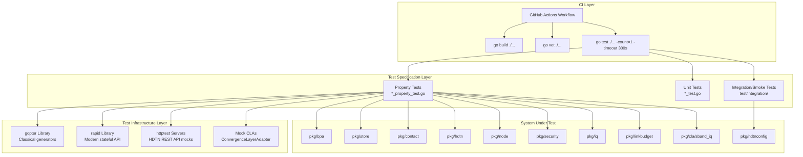
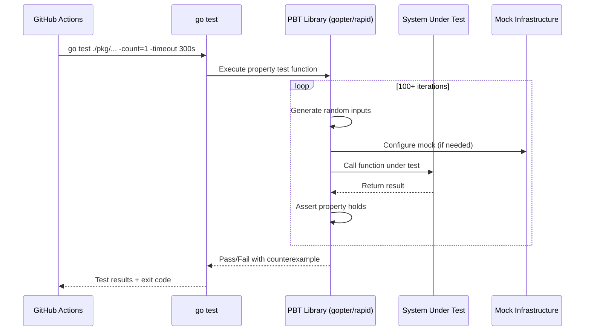

# Design Document: RADIANT Test Framework SRS/SDD

## Overview

This document describes the Software Design of the RADIANT Test Framework — a requirements-based verification system for the Radio Amateur Delay-tolerant Interplanetary Networking Testbed. The framework architecture is modeled after NASA Glenn Research Center's HDTN Test Framework (TM-20240014467 / LEW-20818-1), adapted for the RADIANT project's Go-native implementation.

The Test Framework provides automated, repeatable verification of the RADIANT DTN software stack (BPv7 → LTP → KISS → G3RUH) using property-based testing (PBT) as the primary verification methodology. The framework validates ~35 correctness properties across 10 packages, with each property tracing to one or more system requirements via explicit annotations.

### Design Rationale

**Why Property-Based Testing?** The RADIANT protocol stack processes arbitrary bundle payloads across variable contact windows, orbital parameters, and network conditions. Traditional example-based testing cannot adequately cover the input space. PBT generates hundreds of randomized inputs per property, exposing edge cases that hand-crafted examples miss — critical for flight software verification.

**Why Go-Native (gopter + rapid)?** The system under test is written in Go. Using Go-native PBT libraries eliminates cross-language serialization overhead, enables direct access to internal data structures, and integrates seamlessly with `go test` and the CI pipeline. Two libraries are used because gopter provides classical QuickCheck-style generators while rapid offers a more modern, stateful testing API.

**Why Not Python/Hypothesis?** A Python test harness would require IPC or REST API boundaries between tests and the system under test, adding latency and complexity. Go's `testing` package provides built-in benchmarking, race detection, and coverage analysis that integrate directly with the code under test.

## Architecture

The Test Framework follows a layered architecture with clear separation between test specification, test execution, and test infrastructure.



### Execution Flow



## Components and Interfaces

### 1. Property Test Files (`*_property_test.go`)

Each package contains property tests in dedicated files following the naming convention `{domain}_property_test.go`. Each test function:
- Documents the property being tested in a comment block
- Includes a `Validates: Requirement X.Y` annotation
- Configures the PBT library with `MinSuccessfulTests >= 100` (or >= 50 for expensive tests)
- Defines generators for the input domain
- Asserts the property holds for all generated inputs

**Packages with property tests:**

| Package | File | Properties | Library |
|---------|------|-----------|---------|
| pkg/bpa | bpa_property_test.go | Bundle validation, ping echo | gopter |
| pkg/store | store_property_test.go | Round-trip, capacity, priority, eviction, lifetime | gopter |
| pkg/store | ack_property_test.go | ACK handling | gopter |
| pkg/hdtn | telemetry_property_test.go | Telemetry parsing, partial response | rapid |
| pkg/hdtn | contactplan_property_test.go | Contact validation, active filtering, removal, API error | rapid |
| pkg/node | relay_property_test.go | No-relay enforcement | gopter |
| pkg/node | error_handling_property_test.go | Error handling | gopter |
| pkg/node | statistics_consistency_property_test.go | Statistics invariants | gopter |
| pkg/security | ratelimit_property_test.go | Rate limiting | rapid |
| pkg/iq | modulation_demodulation_property_test.go | IQ round-trip | rapid |
| pkg/linkbudget | link_margin_monotonicity_property_test.go | Monotonicity, inverse-square | gopter |

### 2. PBT Library Interface

**gopter** (github.com/leanovate/gopter v0.2.9):
```go
// Configuration
parameters := gopter.DefaultTestParameters()
parameters.MinSuccessfulTests = 100

// Property definition
properties := gopter.NewProperties(parameters)
properties.Property("description", prop.ForAll(
    func(inputs...) bool { /* assert property */ },
    gen.Int64Range(min, max),  // generators
))
properties.TestingRun(t)
```

**rapid** (pgregory.net/rapid v1.2.0):
```go
rapid.Check(t, func(t *rapid.T) {
    // Generate inputs
    value := rapid.IntRange(min, max).Draw(t, "label")
    // Assert property
    if !property(value) {
        t.Fatalf("property violated: %v", value)
    }
})
```

### 3. Mock Infrastructure

**Mock HTTP Servers** (`net/http/httptest`):
- Simulate HDTN REST API responses for telemetry and contact plan tests
- Configurable to return success (200), server error (500), or timeout
- Used by: `pkg/hdtn/telemetry_property_test.go`, `pkg/hdtn/contactplan_property_test.go`

**Mock CLAs** (implementing `ConvergenceLayerAdapter` interface):
```go
type ConvergenceLayerAdapter interface {
    Open() error
    Close() error
    SendBundle(bundle *bpa.Bundle) error
    RecvBundle() (*bpa.Bundle, error)
}
```
- Configurable to simulate link establishment failures
- Used by: `pkg/node/relay_property_test.go`, `pkg/node/error_handling_property_test.go`

### 4. Integration/Smoke Test Suite (`test/integration/`)

Smoke tests verify system-level health without randomized inputs:
- Config file JSON parsing and validation
- Script execute permissions
- Package directory existence
- Obsolete code removal verification
- KISS CLA plugin file existence

### 5. CI Pipeline (`github/workflows/ci.yml`)

Single-job pipeline triggered on push to `main` and PRs targeting `main`:
1. Checkout code
2. Set up Go 1.26
3. Build all packages (`go build ./...`)
4. Run all tests with 300s timeout (`go test ./pkg/... ./test/integration/... -count=1 -timeout 300s`)
5. Static analysis (`go vet ./...`)

### 6. Requirement Traceability Infrastructure

Every property test includes a structured annotation:
```go
// Feature: {feature_name}, Property {N}: {property_title}
// **Validates: Requirements X.Y, X.Z**
```

This enables:
- Automated traceability matrix generation via grep/static analysis
- Flight readiness review evidence
- Coverage gap identification

## Data Models

### Bundle (System Under Test)

```go
type Bundle struct {
    ID          BundleID
    Destination EndpointID
    Payload     []byte
    Priority    Priority      // 0=bulk, 1=normal, 2=expedited, 3=critical
    Lifetime    int64         // seconds
    CreatedAt   int64         // unix timestamp
    BundleType  BundleType    // Data, PingRequest, PingResponse
}

type BundleID struct {
    SourceEID         EndpointID
    CreationTimestamp int64
    SequenceNumber    uint64
}

type EndpointID struct {
    Scheme string  // "dtn" or "ipn"
    SSP    string  // scheme-specific part
}
```

### Contact Plan (System Under Test)

```go
type Contact struct {
    Source         int
    Dest           int
    StartTime      int64
    EndTime        int64
    RateBitsPerSec int64
}

type ContactWindow struct {
    ContactID  uint64
    RemoteNode NodeID
    StartTime  int64
    EndTime    int64
    DataRate   int64
    LinkType   LinkType
}
```

### Telemetry (System Under Test)

```go
type Telemetry struct {
    BundleProtocol BundleProtocolStats
    LTP            LTPStats
    Health         HealthStatus
    NodeID         string
    NodeNumber     int
    Timestamp      time.Time
}
```

### Test Configuration (Framework)

```go
// gopter configuration
type TestParameters struct {
    MinSuccessfulTests int  // >= 100 (standard) or >= 50 (expensive)
    MaxShrinkCount     int  // counterexample minimization attempts
}

// rapid uses t *rapid.T with default 100 iterations
```

### Traceability Record (Framework)

```
Property Test Function → "Validates: Requirement X.Y" → System Requirement
```

Traceability is maintained as source code annotations rather than a separate database, ensuring the mapping stays synchronized with the test code.

## Correctness Properties

*A property is a characteristic or behavior that should hold true across all valid executions of a system — essentially, a formal statement about what the system should do. Properties serve as the bridge between human-readable specifications and machine-verifiable correctness guarantees.*

### Property 1: BPA Validation Correctness

*For any* bundle, the BPA SHALL accept the bundle if and only if: (a) the destination scheme and SSP are both non-empty, (b) the lifetime is greater than zero, (c) the creation timestamp does not exceed the current time by more than 5 seconds, and (d) the bundle is not expired (creation timestamp + lifetime > current time). Bundles failing any condition SHALL be rejected with an error identifying the failing condition.

**Validates: Requirements 1.1, 1.2, 1.3, 1.4, 1.5**

### Property 2: Ping Echo Response Correctness

*For any* valid ping request bundle with non-empty source and destination EIDs, the BPA SHALL generate exactly one ping response bundle whose destination equals the original request's source EID and whose bundle type is BundleTypePingResponse. For any invalid ping request (failing BPA validation), no response SHALL be generated.

**Validates: Requirements 2.1, 2.2, 2.3, 2.5**

### Property 3: Bundle Store Round-Trip Integrity

*For any* valid BPv7 bundle with payload sizes between 1 and 255 bytes, priorities between 0 and 3, and lifetimes between 1 and 3600 seconds, storing the bundle and then retrieving it by bundle ID SHALL produce a bundle identical to the original across all fields: source EID scheme, source EID SSP, creation timestamp, sequence number, destination scheme, destination SSP, payload content (byte-for-byte), payload length, priority, lifetime, creation time, and bundle type.

**Validates: Requirements 3.1, 3.2**

### Property 4: Store Capacity Invariant

*For any* sequence of interleaved store and delete operations against a Bundle_Store with a fixed capacity, the used bytes SHALL never exceed the configured total bytes after any operation. When a store operation would exceed capacity, it SHALL be rejected and the used bytes and bundle count SHALL remain unchanged from their values before the rejected operation.

**Validates: Requirements 4.1, 4.2, 4.4**

### Property 5: Priority Ordering Invariant

*For any* set of 0 to 200 bundles with arbitrary priority values (0-3), listing bundles by priority SHALL produce a sequence where each bundle's priority is greater than or equal to the next bundle's priority (descending order), and within the same priority level, bundles SHALL be ordered by creation timestamp ascending (oldest first).

**Validates: Requirements 5.1, 5.2**

### Property 6: Eviction Policy Correctness

*For any* set of bundles containing both expired and valid bundles, EvictExpired SHALL remove all and only expired bundles (where expired means creation_timestamp + lifetime ≤ current_time), and the count of evicted bundles SHALL equal the number of expired bundles in the original set. For EvictLowestPriority on any set of 2+ bundles, exactly one bundle SHALL be removed whose priority is less than or equal to all remaining bundles.

**Validates: Requirements 6.1, 6.2, 6.3, 6.4**

### Property 7: Bundle Lifetime Enforcement

*For any* set of bundles with arbitrary lifetimes (1-2000 seconds) and any current time (1000-3000 seconds), after EvictExpired executes, zero remaining bundles SHALL have creation timestamp plus lifetime less than or equal to the current time.

**Validates: Requirements 7.1**

### Property 8: Telemetry Parsing Fidelity

*For any* valid HDTN REST API JSON response with arbitrary non-negative integer field values, parsing SHALL map every field correctly to the corresponding Telemetry structure field (bundleCountStorage→BundlesStored, bundleCountEgress→BundlesSent, bundleCountIngress→BundlesReceived, bundleByteCountEgress→BytesSent, bundleByteCountIngress→BytesReceived, usedSpaceBytes→StorageUsedBytes, totalSpaceBytes→StorageQuotaBytes), LTP SessionsActive SHALL equal the sum of numActiveSendSessions and numActiveRecvSessions, Health.Running SHALL be true, and NodeID/NodeNumber SHALL match the collector configuration.

**Validates: Requirements 8.1, 8.2, 8.3, 8.4, 8.5**

### Property 9: Telemetry Partial Response Zero-Filling

*For any* HDTN REST API JSON response with randomly omitted fields, present fields SHALL retain their correct values, absent fields SHALL default to zero (0 for integers, false for booleans), NodeID/NodeNumber SHALL be populated from configuration, and Timestamp SHALL be populated from the system clock in RFC 3339 UTC format regardless of which API fields are present.

**Validates: Requirements 9.1, 9.2, 9.3**

### Property 10: Contact Plan Validation Correctness

*For any* collection of contact entries, validation SHALL accept the collection if and only if every contact has RateBitsPerSec > 0, every contact has StartTime < EndTime, and the total number of entries is ≤ 1000. When validation fails, the error SHALL identify the zero-based index of the first invalid entry and the reason for rejection.

**Validates: Requirements 10.1, 10.2**

### Property 11: Active Contacts Filtering Correctness

*For any* set of contacts and any query time T, GetActiveContacts(T) SHALL return exactly those contacts where StartTime ≤ T < EndTime, with no contacts outside the active window included and the returned collection size equaling the count of contacts satisfying the predicate.

**Validates: Requirements 11.1, 11.2**

### Property 12: Contact Removal Correctness

*For any* contact plan containing at least one contact, removing a contact by its (source, dest, startTime) key SHALL result in a plan that no longer contains that contact, all non-matching contacts SHALL remain unchanged in value and order, and the remaining count SHALL equal the original count minus one. If the key does not match any contact, the operation SHALL return an error and the plan SHALL remain unchanged.

**Validates: Requirements 12.1, 12.2, 12.3, 12.4**

### Property 13: API Error State Preservation

*For any* contact plan manager with existing local state, if an API operation (add, remove, or apply) fails due to an HTTP error (status 400-599) or timeout, the local plan state SHALL be identical to the state before the operation was attempted.

**Validates: Requirements 13.1, 13.2**

### Property 14: CGR Prediction Time Horizon Compliance

*For any* valid orbital parameters and time horizon, all predicted contact windows SHALL have StartTime ≥ horizon start and EndTime ≤ horizon end, no two predicted windows for the same ground station SHALL overlap, all contacts SHALL have StartTime < EndTime, and LEO contacts SHALL have durations between 60 and 900 seconds.

**Validates: Requirements 14.1, 14.2, 14.3, 14.4, 14.5**

### Property 15: Next Contact Lookup Correctness

*For any* contact plan, destination node, and query time, GetNextContact SHALL return the contact with the earliest StartTime that is ≥ the query time and matches the destination node. If no future contact exists for the destination, an error SHALL be returned. A contact with StartTime exactly equal to the query time SHALL be a valid result, and a contact with EndTime ≤ query time SHALL not be returned.

**Validates: Requirements 15.1, 15.2, 15.3, 15.4, 15.5, 15.6, 15.7**

### Property 16: No-Relay Direct Delivery Enforcement

*For any* bundle transmitted during any contact window, the contact's remote node EID SHALL match the bundle's destination EID. For any bundle in a node's Bundle_Store, the bundle's source EID SHALL match the local node's EID. FindDirectContact SHALL return only single-hop contacts matching the queried destination, and SHALL return an error (not a multi-hop path) when no direct contact exists.

**Validates: Requirements 16.1, 16.2, 16.3, 16.4**

### Property 17: Contact Window Temporal Enforcement

*For any* contact window where the current time exceeds the window end time, zero bundles SHALL be transmitted and all queued bundles SHALL remain in the Bundle_Store with their count unchanged.

**Validates: Requirements 17.1**

### Property 18: Missed Contact Bundle Retention

*For any* set of bundles queued for a contact's destination, when the CLA fails to establish a link, all bundles SHALL remain in the Bundle_Store with count and content unchanged, and the ContactsMissed counter SHALL increment by exactly one per missed contact.

**Validates: Requirements 18.1, 18.2, 18.4**

### Property 19: Bundle Retention Without Contact

*For any* bundle whose destination EID has no matching contact window in the current contact plan, the Bundle_Store SHALL retain the bundle unchanged through subsequent processing cycles until its lifetime expires, at which point it SHALL be evicted and not transmitted.

**Validates: Requirements 19.1, 19.2, 19.4**

### Property 20: Rate Limiting Enforcement

*For any* configured rate limit (1-100 bundles/second), the number of accepted bundles within any 1-second window SHALL not exceed the configured maximum, submissions within the limit SHALL all be accepted, the accounting invariant (accepted + rejected = total attempts) SHALL hold, GetCurrentRate SHALL never exceed the configured maximum, and after 1 second elapses the limiter SHALL reset.

**Validates: Requirements 20.1, 20.2, 20.3, 20.4, 20.5, 20.6**

### Property 21: Link Margin Monotonicity

*For any* sequence of 2 to 10 increasing distances with identical transmit parameters, the computed link margin SHALL strictly decrease with each distance increment.

**Validates: Requirements 21.1**

### Property 22: Link Budget Inverse-Square Law

*For any* distance d in the range 10,000 m to 500,000 m, doubling the distance SHALL reduce the link margin by 6.02 dB (±0.1 dB tolerance), confirming correct free-space path loss computation.

**Validates: Requirements 21.6**

### Property 23: Bundle Serialization Round-Trip

*For any* valid bundle with payload sizes from 1 to 1500 bytes, serializing then deserializing SHALL produce a bundle with identical bundle type, priority, lifetime, destination endpoint, and payload content.

**Validates: Requirements 22.1**

### Property 24: AX.25 Framing Round-Trip

*For any* valid payload with sizes from 1 to 1500 bytes, AX.25 framing (createAX25Frame) then extraction (extractAX25Frame) SHALL produce a byte sequence identical to the original payload.

**Validates: Requirements 22.2**

## Error Handling

### Test Failure Reporting

When a property test fails, the PBT library provides:
1. **Counterexample**: The specific input that violated the property
2. **Shrinking** (gopter): Minimized counterexample for easier debugging
3. **Labels** (rapid): Named draws identifying which generated value caused failure

### CI Pipeline Error Handling

- **Build failure**: Pipeline aborts immediately, no tests run
- **Test failure**: Full test output with failing test name, counterexample, and stack trace
- **Timeout (300s)**: Test killed, reported as failure
- **Static analysis (go vet)**: Warnings reported, non-zero exit blocks merge

### Mock Infrastructure Error Simulation

| Error Type | Mock Behavior | Purpose |
|-----------|--------------|---------|
| HTTP 500 | httptest server returns 500 | API error state preservation |
| HTTP 408 / timeout | httptest server delays > 5s | Network failure resilience |
| CLA link failure | Mock CLA returns error from Open() | Missed contact handling |
| CLA send failure | Mock CLA returns error from SendBundle() | Transmission error handling |

### Error Propagation Design

The test framework validates that errors propagate correctly through the system:
- Validation errors include the specific field/condition that failed
- Store errors distinguish capacity-exceeded from not-found
- Contact plan errors identify the index of the invalid entry
- API errors preserve local state (no partial mutations)

## Testing Strategy

### Dual Testing Approach

The RADIANT Test Framework uses complementary testing methodologies:

**Property-Based Tests** (~35 properties across 10 packages):
- Verify universal correctness properties across randomized inputs
- Minimum 100 iterations per property (50 for computationally expensive CGR/link budget tests)
- Each property traces to specific system requirements
- Libraries: gopter (v0.2.9) for classical generators, rapid (v1.2.0) for modern stateful API
- Tag format: `Feature: {feature_name}, Property {N}: {property_text}` + `Validates: Requirements X.Y`

**Unit/Example-Based Tests**:
- Verify specific scenarios (LEO UHF link closes at 500 km, cislunar S-band closes at lunar distance)
- Test error conditions (zero distance, closed CLA link)
- Validate concrete configuration files

**Integration/Smoke Tests**:
- Verify system health (config parsing, package existence, script permissions)
- No randomized inputs — deterministic pass/fail
- Located in `test/integration/`

### Test Organization

```
pkg/
├── bpa/
│   ├── bpa.go                    # Implementation
│   └── bpa_property_test.go      # Properties 1, 2
├── store/
│   ├── store.go                  # Implementation
│   ├── store_property_test.go    # Properties 3, 4, 5, 6, 7
│   └── ack_property_test.go      # ACK handling properties
├── hdtn/
│   ├── telemetry.go              # Implementation
│   ├── contactplan.go            # Implementation
│   ├── telemetry_property_test.go    # Properties 8, 9
│   └── contactplan_property_test.go  # Properties 10, 11, 12, 13
├── contact/
│   └── contact.go                # CGR, active contacts (Properties 14, 15)
├── node/
│   ├── relay_property_test.go                    # Property 16
│   ├── error_handling_property_test.go           # Properties 17, 18, 19
│   └── statistics_consistency_property_test.go   # Statistics invariants
├── security/
│   └── ratelimit_property_test.go    # Property 20
├── linkbudget/
│   └── link_margin_monotonicity_property_test.go  # Properties 21, 22
├── iq/
│   └── modulation_demodulation_property_test.go   # IQ round-trip
└── cla/sband_iq/
    └── sband_property_test.go    # Properties 23, 24
test/
└── integration/
    └── smoke_test.go             # Smoke tests (Req 23, 24)
```

### CI Pipeline Configuration

```yaml
# .github/workflows/ci.yml
on:
  push: { branches: [main] }
  pull_request: { branches: [main] }

jobs:
  test:
    steps:
      - go build ./...           # Fail-fast on compile errors
      - go test ./pkg/... ./test/integration/... -count=1 -timeout 300s
      - go vet ./...             # Static analysis
```

### Extensibility for Future Phases

The framework supports adding new property tests for future mission phases:

1. **New package**: Create `pkg/{domain}/{domain}_property_test.go`
2. **New property**: Add test function with `Validates: Requirement X.Y` annotation
3. **New mock**: Implement `ConvergenceLayerAdapter` interface for new CLA types
4. **CI coverage**: Add package path to `go test` command in CI workflow

Future phases (QO-100, CubeSat EM, LEO, Cislunar) will add:
- Hardware-in-the-loop tests (Phase 2+)
- RF channel simulation tests (Phase 3+)
- Multi-hop routing tests if architecture evolves beyond single-hop
- Orbital mechanics validation with real ephemeris data
